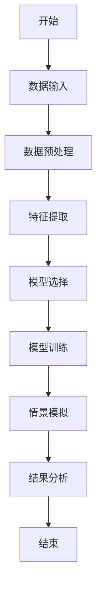
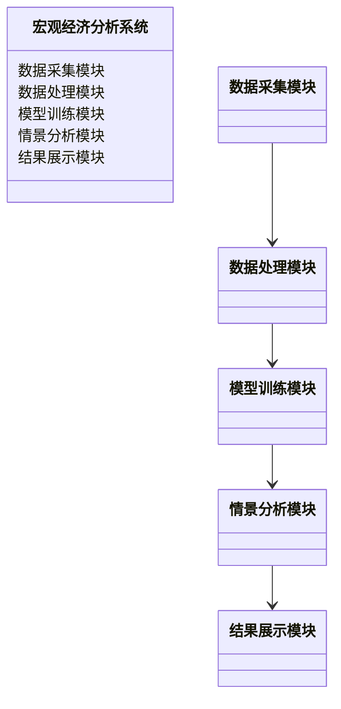
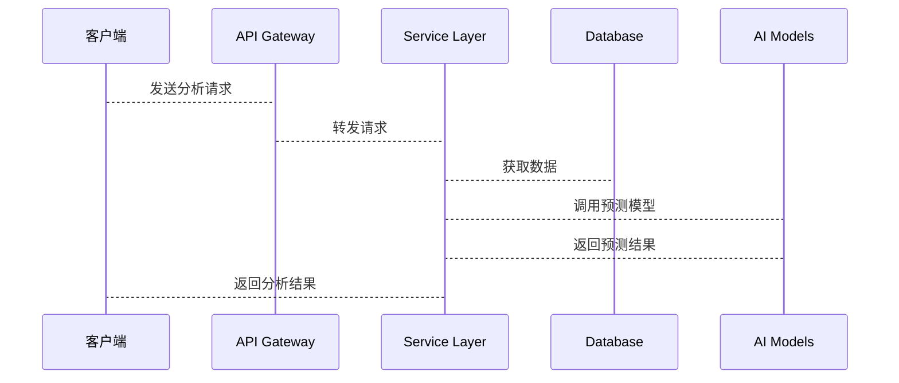

                 


# AI辅助的宏观经济情景分析

## 关键词：AI, 宏观经济, 情景分析, 机器学习, 数据分析

## 摘要：  
随着人工智能技术的快速发展，AI在宏观经济分析中的应用日益广泛。本文将从宏观经济分析的核心概念、AI算法的基本原理、系统设计与实现等方面展开，深入探讨AI如何辅助宏观经济情景分析。通过详细分析宏观经济指标的特征、AI算法在预测中的应用，以及系统架构的设计，本文为读者提供一个全面的视角，帮助他们理解AI在宏观经济分析中的潜力与挑战。最终，本文将通过一个实际案例，展示如何利用AI技术实现宏观经济情景分析，并总结相关的最佳实践和未来发展方向。

---

# 第一部分: AI辅助的宏观经济情景分析概述

## 第1章: 宏观经济分析与AI概述

### 1.1 宏观经济分析的基本概念

#### 1.1.1 宏观经济的核心概念
宏观经济分析研究的是整个经济体系的运行规律，涉及的主要指标包括：

- **GDP（国内生产总值）**：衡量一个国家或地区的经济规模。
- **通货膨胀率**：价格水平的上涨速度。
- **失业率**：劳动力市场的就业情况。
- **利率**：资金的使用成本。
- **国际贸易与投资**：国家间的经济互动。

#### 1.1.2 宏观经济分析的目标与方法
宏观经济分析的目标是预测经济走势、评估政策效果、制定经济决策。常用的方法包括：

- **定量分析**：通过数学模型和统计数据进行预测。
- **定性分析**：结合专家判断和逻辑推理进行分析。
- **情景分析**：模拟不同假设条件下的经济结果。

#### 1.1.3 AI在宏观经济分析中的作用
AI通过以下方式增强宏观经济分析能力：

- **数据处理**：快速处理海量数据，提取关键特征。
- **预测建模**：利用机器学习算法提高预测精度。
- **实时监控**：实时跟踪经济指标的变化，提供动态反馈。

### 1.2 AI辅助宏观经济分析的背景

#### 1.2.1 AI技术的发展与宏观经济分析的结合
AI技术的快速发展为宏观经济分析提供了新的工具。深度学习、自然语言处理和强化学习等技术在经济预测中的应用日益广泛。

#### 1.2.2 当前宏观经济分析的挑战
传统的宏观经济分析面临以下挑战：

- 数据量大，难以手动处理。
- 经济变量之间的复杂关系难以建模。
- 预测精度有限，难以满足实际需求。

#### 1.2.3 AI辅助的宏观经济分析的优势
AI辅助的宏观经济分析具有以下优势：

- **高效性**：快速处理和分析大量数据。
- **准确性**：通过复杂算法提高预测精度。
- **实时性**：实时更新分析结果，提供动态支持。

### 1.3 本书的核心目标与结构

#### 1.3.1 本书的核心目标
本书旨在系统地介绍AI在宏观经济情景分析中的应用，帮助读者理解相关技术原理和实际应用。

#### 1.3.2 本书的章节结构
本书分为七章，内容从概述到高级主题逐步展开。

#### 1.3.3 本书的读者群体
本书适合对宏观经济分析和人工智能技术感兴趣的读者，包括研究人员、政策制定者和IT工程师。

---

# 第二部分: 宏观经济情景分析的核心概念与模型

## 第2章: 宏观经济情景分析的核心概念

### 2.1 宏观经济的核心概念与属性

#### 2.1.1 GDP、通货膨胀、失业率等核心指标
- **GDP**：衡量一个国家的经济总量。
- **通货膨胀率**：影响消费者购买力和货币政策。
- **失业率**：反映劳动力市场的健康状况。

#### 2.1.2 宏观经济模型的分类与特征
- **均衡模型**：假设市场出清。
- **动态模型**：考虑时间序列的变化。
- **计量经济模型**：结合统计和经济理论。

#### 2.1.3 宏观经济情景分析的边界与外延
- **边界**：分析范围和时间跨度的限制。
- **外延**：情景分析的应用领域和影响因素。

### 2.2 AI辅助宏观经济分析的核心要素

#### 2.2.1 数据来源与特征
- **数据来源**：政府统计、企业报告、市场调研。
- **数据特征**：时间序列性、多维性、相关性。

#### 2.2.2 AI算法与宏观经济模型的结合
- **数据驱动**：利用AI算法发现数据中的模式。
- **模型驱动**：结合经济理论构建预测模型。

#### 2.2.3 宏观经济情景分析的流程与框架
1. 数据采集与预处理
2. 模型选择与训练
3. 情景模拟与预测
4. 结果分析与可视化

### 2.3 宏观经济情景分析的ER实体关系图

```mermaid
er
    actor: 宏观经济分析者
    model: 宏观经济模型
    data: 数据源
    result: 分析结果
    rules: 分析规则
    actor --> model: 输入分析需求
    model --> data: 数据输入
    model --> rules: 应用分析规则
    model --> result: 输出分析结果
    actor <-- result: 获取分析结果
```

---

## 第3章: AI辅助宏观经济情景分析的算法原理

### 3.1 数据预处理与特征提取

#### 3.1.1 数据清洗与标准化
- **数据清洗**：去除缺失值、异常值。
- **标准化**：将数据转换为统一尺度。

#### 3.1.2 时间序列数据的特征提取
- **趋势**：数据的长期走向。
- **季节性**：周期性变化。
- **波动性**：数据的短期波动。

#### 3.1.3 数据的可解释性分析
- **可解释性**：模型结果的透明度。
- **特征重要性**：关键变量的识别。

### 3.2 常见AI算法在宏观经济分析中的应用

#### 3.2.1 线性回归模型
- **简单线性回归**：$y = \beta_0 + \beta_1x + \epsilon$
- **多元线性回归**：$y = \beta_0 + \beta_1x_1 + \beta_2x_2 + ... + \epsilon$

#### 3.2.2 随机森林与梯度提升树
- **随机森林**：基于决策树的集成方法。
- **梯度提升树**：通过多次迭代提升模型性能。

#### 3.2.3 神经网络与深度学习模型
- **神经网络**：模拟人脑神经网络的结构。
- **深度学习**：使用多层神经网络提取高维特征。

### 3.3 宏观经济情景分析的算法流程图



---

## 第4章: 宏观经济情景分析的系统设计与实现

### 4.1 系统功能设计

#### 4.1.1 领域模型


#### 4.1.2 系统架构设计


#### 4.1.3 系统接口设计
- **API接口**：提供RESTful API，供外部系统调用。
- **数据接口**：与数据源系统对接。

#### 4.1.4 系统交互流程


---

## 第5章: 项目实战——基于AI的宏观经济情景分析

### 5.1 环境安装与数据准备

#### 5.1.1 安装必要的库
```bash
pip install numpy pandas scikit-learn tensorflow
```

#### 5.1.2 数据准备
```python
import pandas as pd
data = pd.read_csv('economic_data.csv')
```

### 5.2 系统核心实现

#### 5.2.1 数据预处理
```python
from sklearn.preprocessing import StandardScaler
scaler = StandardScaler()
data_scaled = scaler.fit_transform(data)
```

#### 5.2.2 模型训练
```python
from sklearn.ensemble import RandomForestRegressor
model = RandomForestRegressor()
model.fit(data_scaled, target)
```

#### 5.2.3 情景分析
```python
import numpy as np
future_forecast = np.array([[...]])  # 预测输入
predicted_result = model.predict(future_forecast)
```

### 5.3 案例分析

#### 5.3.1 数据分析结果
- 预测GDP增长率为5.2%。
- 预测通货膨胀率为2.8%。

#### 5.3.2 案例小结
通过AI模型的分析，可以更准确地预测经济指标，为政策制定提供科学依据。

---

## 第6章: 高级主题与未来展望

### 6.1 多模型融合与优化

#### 6.1.1 多模型融合方法
- **投票法**：集成多个模型的预测结果。
- **加权法**：根据模型表现赋予不同权重。

#### 6.1.2 模型优化策略
- 超参数调优。
- 模型解释性增强。

### 6.2 宏观经济情景分析的伦理与风险

#### 6.2.1 数据隐私问题
- 数据泄露风险。
- 数据使用的合法性。

#### 6.2.2 模型的局限性
- 数据偏差导致的预测偏差。
- 模型的黑箱特性带来的决策风险。

### 6.3 未来发展方向

#### 6.3.1 技术融合
- 结合区块链技术确保数据安全。
- 结合边缘计算实现实时分析。

#### 6.3.2 应用拓展
- 支持多国经济联动分析。
- 个性化政策模拟与建议。

---

## 第7章: 总结与展望

### 7.1 核心内容回顾
- 宏观经济分析的基本概念。
- AI算法在宏观经济分析中的应用。
- 系统设计与实现的详细步骤。

### 7.2 最佳实践 tips
- 数据质量是模型性能的基础。
- 模型解释性是实际应用的关键。
- 多模型融合可以提高预测的准确性。

### 7.3 未来研究方向
- 探讨更高效的AI算法。
- 研究宏观经济情景分析的伦理问题。

---

## 作者：AI天才研究院/AI Genius Institute & 禅与计算机程序设计艺术 /Zen And The Art of Computer Programming

---

感谢您的阅读！希望本文能够为AI辅助的宏观经济情景分析领域提供有价值的见解和指导。

