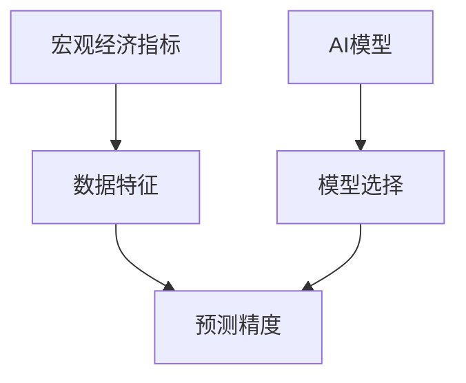
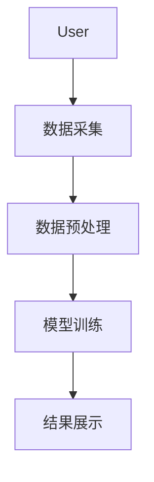

                 


# AI辅助的宏观经济指标预测

## 关键词：宏观经济预测，AI技术，时间序列分析，机器学习模型，深度学习模型

## 摘要：本文将介绍如何利用AI技术辅助宏观经济指标预测。通过分析宏观经济指标的基本概念、AI技术在预测中的优势，以及具体算法（如ARIMA、LSTM）的应用，结合系统设计和项目实战，全面阐述AI在宏观经济预测中的重要作用和实现方法。

---

## 第一部分：AI辅助的宏观经济指标预测概述

### 第1章：宏观经济指标与AI预测的背景介绍

#### 1.1 宏观经济指标的基本概念
- **定义**：宏观经济指标是衡量一个国家或地区经济运行状况的关键数据，如GDP、通货膨胀率、失业率等。
- **分类**：主要分为总量指标、结构指标和价格指标。
- **作用**：帮助政府和企业制定经济政策和投资决策。

#### 1.2 AI技术在宏观经济预测中的应用背景
- **AI技术的基本概念**：人工智能通过机器学习、深度学习等技术模拟人类学习和决策过程。
- **AI技术在经济预测中的优势**：能够处理海量数据，发现复杂模式，提高预测准确性。
- **挑战**：数据复杂性、模型解释性、计算资源需求等。

#### 1.3 宏观经济指标预测的核心问题
- **数据特征**：时间依赖性、周期性、趋势性。
- **模型选择**：适合的时间序列算法和深度学习模型。
- **预测精度**：模型的泛化能力与实际需求的匹配度。

---

### 第2章：AI辅助宏观经济指标预测的核心概念与联系

#### 2.1 宏观经济指标预测的核心概念
- **数据特征**：时间序列数据的特性，如平稳性、趋势性。
- **模型选择**：选择适合的时间序列模型，如ARIMA、LSTM。
- **预测精度**：模型的预测误差和置信区间。

#### 2.2 AI模型与宏观经济指标的关系
- **数据特征与模型选择的关联**：平稳数据适合ARIMA，非平稳数据适合LSTM。
- **模型选择与预测精度的关联**：复杂模型可能过拟合，简单模型可能欠拟合。
- **数据特征对预测精度的影响**：数据质量直接影响模型性能。

#### 2.3 核心概念的ER实体关系图


---

## 第二部分：AI辅助宏观经济指标预测的算法原理

### 第3章：时间序列分析的基本原理

#### 3.1 时间序列的定义
- 时间序列是按时间顺序排列的数据，常用于预测未来的趋势。

#### 3.2 时间序列分析的方法
- **传统方法**：移动平均法、指数平滑法。
- **现代方法**：ARIMA、LSTM、Prophet。

#### 3.3 时间序列预测的数学模型
- **ARIMA模型**：适用于平稳数据。
  $$ ARIMA(p, d, q) $$

### 第4章：常见的宏观经济预测算法

#### 4.1 ARIMA模型
- **原理**：通过差分将数据变为平稳，建立自回归和移动平均模型。
- **优点**：简单易用，适合线性趋势。
- **缺点**：难以处理非线性数据。

#### 4.2 LSTM模型
- **原理**：长短期记忆网络，擅长捕捉时间依赖性。
- **优点**：适合复杂非线性数据。
- **缺点**：训练时间较长。

#### 4.3 Prophet模型
- **原理**：基于时间序列分解和贝叶斯回归。
- **优点**：易于使用，适合有噪声的数据。
- **缺点**：对异常值敏感。

---

## 第三部分：系统分析与架构设计方案

### 第5章：宏观经济指标预测系统的项目介绍

#### 5.1 项目目标
- 实现一个高效的宏观经济指标预测系统，提供准确的预测结果。

#### 5.2 项目范围
- 针对GDP、通货膨胀率等关键指标。

#### 5.3 项目需求
- 数据采集、预处理、模型训练、结果展示。

### 第6章：系统功能设计

#### 6.1 数据采集模块
- 从数据库或API获取宏观经济数据。

#### 6.2 数据预处理模块
- 数据清洗、标准化、特征工程。

#### 6.3 模型训练模块
- 选择合适的模型，训练并优化参数。

#### 6.4 结果展示模块
- 可视化预测结果，生成报告。

### 第7章：系统架构设计

#### 7.1 系统架构图


---

## 第四部分：项目实战

### 第8章：环境安装与核心代码实现

#### 8.1 环境安装
- 安装Python、NumPy、Pandas、Scikit-learn、Keras、Prophet。

#### 8.2 核心代码实现
```python
from statsmodels.tsa.arima.model import ARIMA
import numpy as np
import pandas as pd

# 示例数据
data = pd.read_csv('macroeconomic_data.csv')
# 训练ARIMA模型
model = ARIMA(data['GDP'], order=(5, 1, 0))
model_fit = model.fit()
# 预测未来值
forecast = model_fit.forecast(steps=10)
print(forecast)
```

### 第9章：代码解读与案例分析

#### 9.1 代码解读
- 数据读取、模型训练、预测输出。

#### 9.2 案例分析
- 使用真实数据训练模型，验证预测精度。

### 第10章：项目总结

#### 10.1 总结
- AI技术显著提高了宏观经济预测的准确性。
- 不同模型适用于不同场景，需根据需求选择。

---

## 第五部分：最佳实践与拓展阅读

### 第11章：最佳实践 tips
- 数据预处理至关重要。
- 选择合适的模型，避免过拟合。
- 结合领域知识优化模型。

### 第12章：小结
- AI辅助宏观经济预测是未来趋势。
- 需要结合理论与实践，持续优化模型。

### 第13章：注意事项
- 数据隐私和安全问题。
- 模型的解释性与可信赖性。

### 第14章：拓展阅读
- 推荐相关书籍和论文，深入学习时间序列分析和深度学习模型。

---

## 作者：AI天才研究院（AI Genius Institute） & 禅与计算机程序设计艺术（Zen And The Art of Computer Programming）

---

本文通过详细讲解宏观经济指标预测的背景、算法原理、系统设计和项目实战，展示了AI技术在宏观经济预测中的巨大潜力和应用价值。希望读者能通过本文，深入了解如何利用AI技术提升经济预测的准确性，并在实际应用中取得更好的效果。

