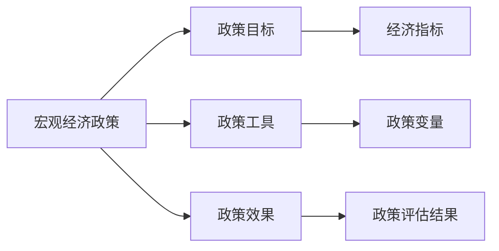
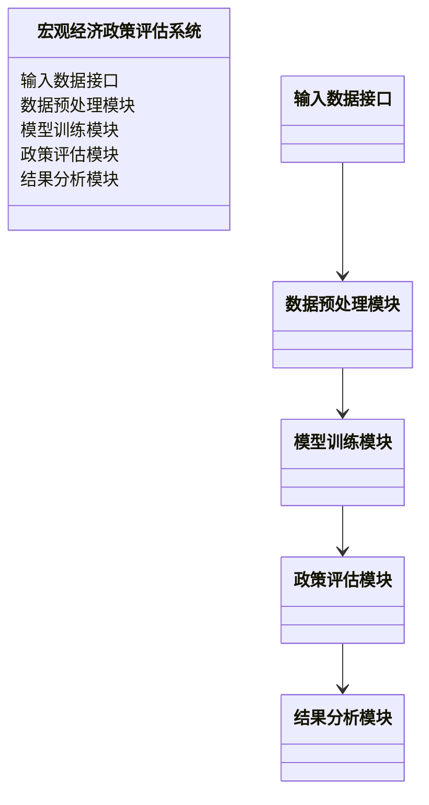
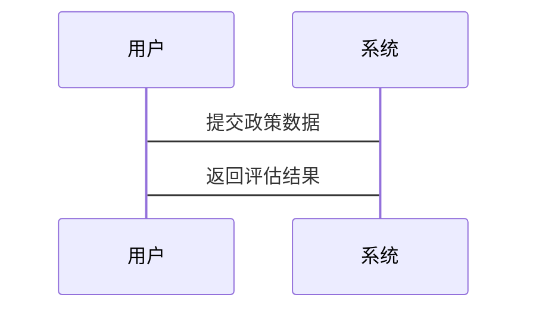

                 


# AI辅助的宏观经济政策效果评估

> 关键词：宏观经济政策、人工智能、政策评估、机器学习、经济预测

> 摘要：本文系统地探讨了如何利用人工智能技术辅助宏观经济政策的效果评估。通过分析宏观经济政策的核心概念、AI技术的基本原理及其在政策评估中的应用，本文提出了基于机器学习的政策效果评估模型，并结合实际案例进行了详细分析。文章还讨论了系统设计与实现、项目实战以及最佳实践，为读者提供了一个全面的视角来理解AI在宏观经济政策评估中的潜力和应用。

---

## 第1章: 宏观经济政策与AI辅助评估的背景介绍

### 1.1 宏观经济政策的基本概念

#### 1.1.1 宏观经济政策的定义
宏观经济政策是指政府或中央银行为了实现特定经济目标（如充分就业、价格稳定、经济增长和国际收支平衡）而采取的政策措施。这些政策通常包括货币政策、财政政策以及其他调节经济活动的手段。

#### 1.1.2 宏观经济政策的主要类型
1. **货币政策**：通过调整货币供应量、利率等手段影响整体经济活动。
2. **财政政策**：通过政府支出和税收调整来影响经济。
3. **产业政策**：通过政府干预引导特定产业的发展。
4. **汇率政策**：通过外汇市场干预影响汇率水平。

#### 1.1.3 宏观经济政策的目标与作用
宏观经济政策的主要目标是实现经济稳定和可持续增长。政策的作用体现在调节经济波动、促进资源合理配置、防止经济危机等方面。

### 1.2 AI辅助宏观经济政策评估的背景

#### 1.2.1 AI技术在宏观经济分析中的应用背景
随着大数据和人工智能技术的发展，宏观经济分析从传统的统计方法逐渐转向数据驱动的智能分析。AI技术能够处理海量数据，发现复杂经济现象之间的关联。

#### 1.2.2 宏观经济政策评估的复杂性与挑战
1. **数据多样性**：宏观经济数据涉及多个领域，数据来源复杂。
2. **政策效果的滞后性**：政策实施后，效果往往需要较长时间才能显现。
3. **不确定性**：经济系统受多种随机因素影响，政策效果难以预测。

#### 1.2.3 AI技术如何解决政策评估的难点
AI技术通过构建复杂模型，能够捕捉数据中的非线性关系，提高预测精度。同时，AI可以实时分析海量数据，提供动态反馈，帮助政策制定者优化决策。

### 1.3 宏观经济政策效果评估的现状与问题

#### 1.3.1 现有政策评估方法的局限性
1. **传统方法的低效性**：基于回归分析的传统方法在处理复杂经济关系时效率较低。
2. **数据局限性**：传统方法依赖于有限的数据来源，难以捕捉全貌。
3. **模型的静态性**：传统模型难以动态调整，难以应对快速变化的经济环境。

#### 1.3.2 AI技术在政策评估中的潜在优势
1. **数据处理能力**：AI能够处理海量数据，提取有价值的信息。
2. **动态预测能力**：AI模型可以实时更新，适应经济变化。
3. **非线性关系捕捉**：深度学习模型能够发现传统方法难以捕捉的复杂关系。

#### 1.3.3 当前研究中的空白与未来方向
当前研究主要集中在如何构建有效的AI模型，未来需要更多关注模型的可解释性、鲁棒性和实际应用效果。

---

## 第2章: 宏观经济政策效果评估的核心概念与联系

### 2.1 宏观经济政策效果评估的核心概念

#### 2.1.1 宏观经济政策的实施机制
政策的实施过程包括目标设定、工具选择、执行和反馈调整。每一步都涉及复杂的经济变量和相互作用。

#### 2.1.2 政策效果的衡量指标
常用的指标包括GDP增长率、失业率、通货膨胀率、国际贸易平衡等。

#### 2.1.3 宏观经济政策评估的理论框架
评估框架通常包括政策工具、实施路径、效果衡量和反馈机制四个部分。

### 2.2 AI技术在政策评估中的核心作用

#### 2.2.1 数据驱动的政策分析
AI通过分析大数据，发现经济变量之间的关联，为政策制定提供依据。

#### 2.2.2 智能模型的预测能力
机器学习模型能够预测政策实施后的经济效果，帮助政策制定者提前评估风险。

#### 2.2.3 AI辅助决策的优势
AI能够快速处理数据，提供实时反馈，帮助政策制定者优化决策。

### 2.3 宏观经济政策与AI技术的实体关系图



---

## 第3章: AI辅助宏观经济政策效果评估的算法原理

### 3.1 常见的宏观经济政策评估算法

#### 3.1.1 回归分析
回归分析是一种统计方法，用于研究变量之间的关系。在政策评估中，通常用于分析政策变量对经济指标的影响。

#### 3.1.2 时间序列分析
时间序列分析用于研究经济指标随时间的变化趋势，常用于预测政策实施后的经济走势。

#### 3.1.3 非参数估计方法
非参数估计方法不依赖于特定的模型假设，适用于复杂经济关系的分析。

### 3.2 基于机器学习的政策评估模型

#### 3.2.1 监督学习模型
监督学习模型通过训练数据，学习政策变量与经济指标之间的映射关系。常用的模型包括线性回归、支持向量机和随机森林。

#### 3.2.2 深度学习模型
深度学习模型通过多层神经网络，捕捉复杂非线性关系。常用于处理高维数据和复杂经济现象。

#### 3.2.3 强化学习模型
强化学习模型通过与环境交互，学习最优策略。适用于动态环境下的政策优化。

### 3.3 算法原理的数学模型和公式

#### 3.3.1 线性回归模型
线性回归模型用于分析政策变量与经济指标之间的线性关系，模型形式为：
$$ y = \beta_0 + \beta_1 x_1 + \beta_2 x_2 + \dots + \beta_k x_k + \epsilon $$
其中，$y$ 是经济指标，$x_i$ 是政策变量，$\beta_i$ 是回归系数，$\epsilon$ 是误差项。

#### 3.3.2 深度学习模型
深度学习模型通常由多个神经网络层组成，每一层通过非线性变换提取数据特征。模型的训练过程涉及前向传播和反向传播，使用梯度下降优化参数。

---

## 第4章: 基于机器学习的宏观经济政策评估系统设计

### 4.1 问题场景介绍
本文设计了一个基于机器学习的宏观经济政策评估系统，旨在通过AI技术辅助政策制定者评估政策效果。

### 4.2 系统功能设计



### 4.3 系统架构设计


### 4.4 系统接口设计
系统接口包括数据输入接口、模型训练接口和结果输出接口。

### 4.5 系统交互设计



---

## 第5章: 项目实战——基于机器学习的宏观经济政策评估

### 5.1 环境安装
需要安装Python、NumPy、Pandas、Scikit-learn和TensorFlow等库。

### 5.2 核心代码实现

```python
import numpy as np
import pandas as pd
from sklearn.linear_model import LinearRegression
from sklearn.metrics import mean_squared_error

# 数据加载
data = pd.read_csv('macro_policy.csv')

# 数据预处理
X = data[['GDP', '失业率', '通胀率']]
y = data['政策效果']

# 模型训练
model = LinearRegression()
model.fit(X, y)

# 模型预测
y_pred = model.predict(X)
print('均方误差:', mean_squared_error(y, y_pred))
```

### 5.3 代码应用解读与分析
上述代码展示了如何使用线性回归模型进行宏观经济政策评估。通过加载数据、预处理、训练模型和预测，可以评估政策实施后的效果。

### 5.4 实际案例分析
以某国实施的财政刺激政策为例，通过模型预测政策实施后的GDP增长率和失业率变化。

### 5.5 项目小结
通过项目实战，展示了如何将机器学习模型应用于宏观经济政策评估，验证了AI技术的有效性。

---

## 第6章: 最佳实践与未来展望

### 6.1 最佳实践 tips
1. 数据清洗和特征工程是关键。
2. 模型选择应基于实际需求。
3. 结果解释性需重点关注。

### 6.2 小结
本文系统地探讨了AI技术在宏观经济政策评估中的应用，提出了基于机器学习的解决方案，并通过实际案例进行了验证。

### 6.3 注意事项
1. 模型的可解释性需要加强。
2. 数据隐私和安全问题需重视。
3. 模型的实时性和动态性需优化。

### 6.4 拓展阅读
推荐阅读相关领域的最新研究论文和技术报告。

---

## 作者：AI天才研究院/AI Genius Institute & 禅与计算机程序设计艺术 /Zen And The Art of Computer Programming

