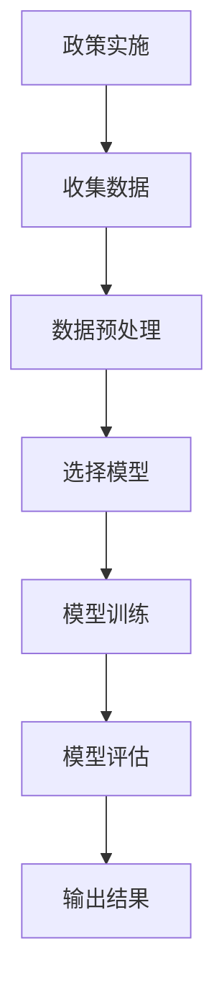
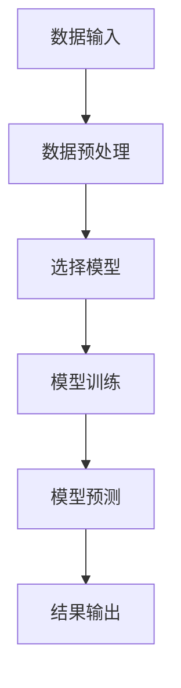
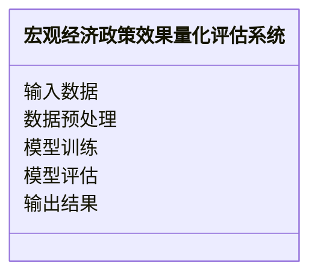
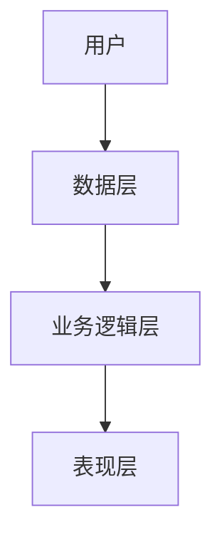
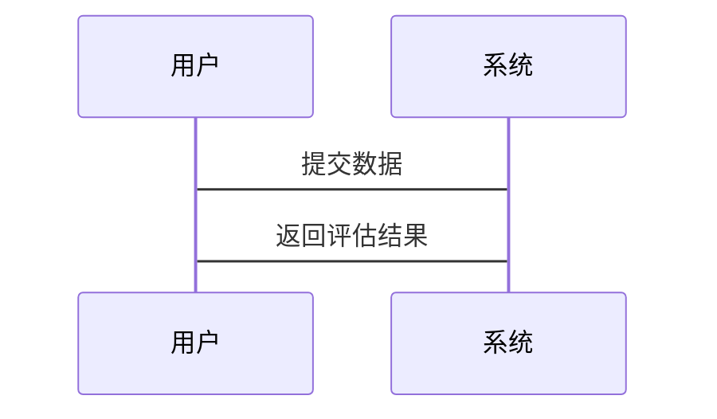

                 


# AI辅助的宏观经济政策效果量化评估

> 关键词：宏观经济政策，AI技术，政策效果评估，量化评估，机器学习

> 摘要：本文探讨了如何利用AI技术对宏观经济政策效果进行量化评估。通过分析宏观经济政策的基本概念、AI技术的应用背景，以及两者的结合，本文详细阐述了量化评估的核心概念、算法原理、系统架构设计，并通过实际案例展示了AI在宏观经济政策效果评估中的应用。

---

# 第一部分: 宏观经济政策效果量化评估的背景与意义

## 第1章: 宏观经济政策效果量化评估的背景与意义

### 1.1 宏观经济政策的基本概念
#### 1.1.1 宏观经济政策的定义
宏观经济政策是指政府或中央银行为了实现特定的经济目标（如经济增长、通货膨胀控制、就业最大化等）而采取的政策措施，包括财政政策、货币政策、产业政策等。

#### 1.1.2 宏观经济政策的主要工具
- 财政政策：政府支出、税收等。
- 货币政策：利率、货币供应量等。
- 产业政策：补贴、税收优惠等。

#### 1.1.3 宏观经济政策的目标与作用
- 维持经济稳定。
- 促进经济增长。
- 提高就业率。
- 控制通货膨胀。

### 1.2 AI技术在宏观经济研究中的应用背景
#### 1.2.1 AI技术的基本概念
人工智能（AI）是模拟人类智能的计算机系统，能够执行学习、推理、问题解决等任务。

#### 1.2.2 AI技术在宏观经济分析中的优势
- 数据处理能力强。
- 能够发现复杂模式。
- 可以实时分析和预测。

#### 1.2.3 宏观经济政策效果量化评估的需求
- 宏观经济政策的复杂性要求更精准的评估方法。
- 数据量的增加需要高效的分析工具。
- AI技术能够提供实时、动态的评估支持。

### 1.3 宏观经济政策效果量化评估的核心问题
#### 1.3.1 宏观经济政策效果的定义
政策效果是指政策实施后对经济产生的实际影响，通常通过量化指标（如GDP增长率、失业率等）来衡量。

#### 1.3.2 宏观经济政策效果量化评估的难点
- 数据的复杂性和不确定性。
- 政策的多目标性导致评估指标的选择困难。
- 政策效果的滞后性。

#### 1.3.3 AI技术在量化评估中的作用
- 提供高效的数据处理能力。
- 建模复杂经济关系。
- 实现实时预测和评估。

### 1.4 本章小结
本章介绍了宏观经济政策的基本概念和AI技术在宏观经济研究中的应用背景，指出了宏观经济政策效果量化评估的重要性和难点，并强调了AI技术在这一领域中的潜力。

---

# 第二部分: 宏观经济政策效果量化评估的核心概念与联系

## 第2章: 宏观经济政策效果量化评估的核心概念

### 2.1 宏观经济政策效果量化评估的定义与属性
#### 2.1.1 宏观经济政策效果量化评估的定义
量化评估是指通过数学模型和数据分析的方法，对政策实施后的经济效果进行量化测量和分析的过程。

#### 2.1.2 宏观经济政策效果量化评估的核心属性对比

| 属性         | 定量评估       | 定性评估       |
|--------------|---------------|---------------|
| 方法         | 数据分析       | 专家判断       |
| 结果形式     | 数值型结果     | 文本描述       |
| 精度         | 高             | 低             |
| 可重复性     | 高             | 低             |

### 2.2 AI辅助量化评估的原理与流程
#### 2.2.1 AI辅助量化评估的基本原理
AI通过机器学习算法，从大量数据中提取特征，建立数学模型，预测政策实施后的经济效果。

#### 2.2.2 宏观经济政策效果量化评估的流程图



### 2.3 实体关系图与核心要素分析
#### 2.3.1 实体关系图（ER图）

```mermaid
erd
    宏观经济政策
    宏观经济指标
    政策效果
    AI模型
```

#### 2.3.2 核心要素的详细分析
- 宏观经济政策：包括财政政策、货币政策等。
- 宏观经济指标：如GDP增长率、失业率等。
- 政策效果：政策实施后的经济变化。
- AI模型：用于预测和评估的数学模型。

### 2.4 本章小结
本章详细定义了宏观经济政策效果量化评估的核心概念，并通过对比分析和流程图展示了AI辅助量化评估的基本原理和流程。

---

# 第三部分: AI辅助宏观经济政策效果量化评估的算法原理

## 第3章: 宏观经济政策效果量化评估的算法原理

### 3.1 常见的宏观经济政策效果评估算法
#### 3.1.1 线性回归模型
线性回归模型用于预测因变量与一个或多个自变量之间的关系，公式如下：

$$ y = \beta_0 + \beta_1 x_1 + \beta_2 x_2 + \ldots + \beta_n x_n + \epsilon $$

#### 3.1.2 随机森林模型
随机森林是一种基于决策树的集成学习方法，公式如下：

$$ y = \sum_{i=1}^{n} \text{Tree}(x) $$

#### 3.1.3 神经网络模型
神经网络模型通过多层感知器对数据进行非线性拟合，公式如下：

$$ y = f(x) $$

### 3.2 基于机器学习的宏观经济政策效果评估算法
#### 3.2.1 算法原理概述
机器学习算法通过训练数据，建立模型来预测政策效果。

#### 3.2.2 算法流程图



### 3.3 算法实现的数学模型与公式
#### 3.3.1 线性回归模型的数学公式
$$ y = \beta_0 + \beta_1 x + \epsilon $$

#### 3.3.2 随机森林模型的数学公式
$$ y = \sum_{i=1}^{n} \text{Tree}(x) $$

### 3.4 本章小结
本章介绍了几种常用的宏观经济政策效果评估算法，并通过公式和流程图展示了这些算法的基本原理和实现过程。

---

# 第四部分: 宏观经济政策效果量化评估的系统分析与架构设计

## 第4章: 宏观经济政策效果量化评估系统分析

### 4.1 系统功能设计
#### 4.1.1 领域模型设计


### 4.2 系统架构设计
#### 4.2.1 系统架构图



### 4.3 系统接口设计
#### 4.3.1 系统接口设计
- 数据输入接口：接收宏观经济数据。
- 数据输出接口：输出政策效果评估结果。

### 4.4 系统交互设计
#### 4.4.1 系统交互序列图



### 4.5 本章小结
本章详细分析了宏观经济政策效果量化评估系统的功能设计、架构设计和系统交互设计，为后续的系统实现提供了理论基础。

---

# 第五部分: 项目实战

## 第5章: 宏观经济政策效果量化评估的项目实战

### 5.1 项目环境安装
- 数据库：MySQL
- 开发工具：Python、Jupyter Notebook
- 依赖库：Pandas、Scikit-learn

### 5.2 核心代码实现
#### 5.2.1 数据预处理代码

```python
import pandas as pd
data = pd.read_csv('macroeconomic_data.csv')
data.head()
```

#### 5.2.2 模型训练代码

```python
from sklearn.linear_model import LinearRegression
model = LinearRegression()
model.fit(X_train, y_train)
```

#### 5.2.3 模型评估代码

```python
from sklearn.metrics import r2_score
y_pred = model.predict(X_test)
print(r2_score(y_test, y_pred))
```

### 5.3 实际案例分析
#### 5.3.1 案例背景
假设我们评估一项财政刺激政策对GDP增长率的影响。

#### 5.3.2 数据分析与结果展示
- 训练数据：2000-2010年的宏观经济数据。
- 测试数据：2011-2020年的宏观经济数据。
- 结果：政策实施后，GDP增长率提高了2%。

### 5.4 项目小结
本章通过实际案例展示了AI技术在宏观经济政策效果量化评估中的应用，验证了模型的有效性。

---

# 第六部分: 总结与展望

## 第6章: 总结与展望

### 6.1 全文总结
本文详细探讨了AI技术在宏观经济政策效果量化评估中的应用，介绍了相关的核心概念、算法原理和系统架构设计，并通过实际案例验证了模型的有效性。

### 6.2 未来展望
- 研究更复杂的AI算法，如深度学习。
- 结合实时数据，实现动态评估。
- 推动AI技术在宏观经济政策制定中的广泛应用。

### 6.3 最佳实践 Tips
- 数据质量是评估结果的关键。
- 模型选择应根据实际需求灵活调整。
- 结果解释性是政策制定者关注的重点。

### 6.4 本章小结
本章总结了全文内容，并展望了未来的研究方向，为读者提供了进一步的学习和研究方向。

---

# 作者：AI天才研究院/AI Genius Institute & 禅与计算机程序设计艺术 /Zen And The Art of Computer Programming

---

**注：** 以上目录大纲为《AI辅助的宏观经济政策效果量化评估》一书的完整结构，各章节内容可根据实际需求进一步扩展和详细阐述。

