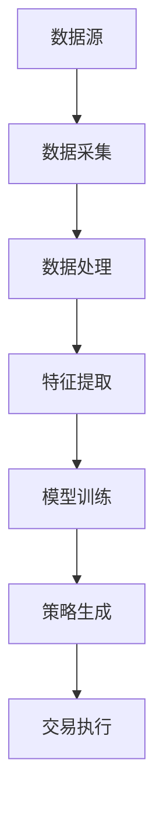

                 


# AI辅助的对冲基金策略分类与分析

## 关键词：
AI技术，对冲基金，交易策略，机器学习，深度学习

## 摘要：
本文详细探讨AI技术在对冲基金策略中的应用，分析不同AI算法如何优化投资决策。内容涵盖背景、核心概念、算法原理、数学模型、系统架构、项目实战及结论，旨在为读者提供全面的指导。

---

## 第1章 对冲基金与AI概述

### 1.1 对冲基金的基本概念
对冲基金是一种通过做多和做空市场来实现收益的金融工具，其核心目标是获取超额收益。传统策略包括股票多空、市场中性、统计套利等。

#### 1.1.1 对冲基金的定义
对冲基金通过多样化投资策略，利用市场波动赚取收益，具备杠杆高、风险高、收益高的特点。

#### 1.1.2 对冲基金的主要策略类型
- 股票多空策略：同时买入和卖出股票，利用价格波动获利。
- 市场中性策略：通过做多和做空同一行业的股票，降低市场风险。
- 统计套利策略：利用资产价格的短期偏差进行套利。
- 预期收益策略：基于市场预测进行投资。

#### 1.1.3 对冲基金在金融市场的角色
对冲基金通过优化投资组合、分散风险，在金融市场中发挥重要作用，是机构投资者的重要组成部分。

### 1.2 AI在金融领域的应用
AI技术正在改变金融行业，特别是在数据处理、模式识别和决策优化方面表现出巨大潜力。

#### 1.2.1 AI在金融分析中的作用
AI能够快速分析大量金融数据，识别市场趋势，帮助投资者做出更明智的决策。

#### 1.2.2 AI在风险控制中的应用
通过实时监控和预测模型，AI能够有效识别和管理市场风险，帮助对冲基金降低损失。

#### 1.2.3 AI在交易策略优化中的潜力
AI算法可以优化交易策略，提高执行效率，降低交易成本，增强投资组合的绩效。

---

## 第2章 AI辅助对冲基金策略的核心概念

### 2.1 数据驱动的对冲基金策略
数据是AI驱动策略的核心，通过对海量数据的分析，发现市场机会，优化投资决策。

#### 2.1.1 数据的重要性
数据质量直接影响策略效果，高质量数据能够提高模型的准确性和鲁棒性。

#### 2.1.2 数据的来源与处理
数据来源包括公开市场数据、新闻、社交媒体等，需进行清洗、预处理和特征提取。

#### 2.1.3 数据驱动的策略优势
数据驱动策略能够捕捉市场微小变化，及时调整投资组合，提高收益。

### 2.2 算法驱动的对冲基金策略
通过算法优化交易决策，减少人为情绪干扰，提高交易效率和准确性。

#### 2.2.1 算法交易的基本原理
算法交易利用计算机程序自动执行交易指令，减少人为干预，提高交易速度和效率。

#### 2.2.2 AI算法在策略优化中的应用
AI算法能够优化策略参数，发现市场中的非线性关系，提高策略的适应性和盈利能力。

#### 2.2.3 算法交易的风险与挑战
算法交易可能存在技术风险、市场风险和流动性风险，需加强风险管理。

### 2.3 对冲基金策略的分类与分析框架

#### 2.3.1 常见的对冲基金策略分类
对冲基金策略可大致分为多空策略、市场中性策略、统计套利策略和预期收益策略。

#### 2.3.2 AI辅助的策略分析框架
包括数据预处理、特征提取、模型选择和策略回测等步骤，确保策略的有效性和可重复性。

---

## 第3章 对冲基金策略的核心算法与数学模型

### 3.1 基于机器学习的对冲基金策略

#### 3.1.1 机器学习在对冲基金中的应用
机器学习能够识别数据中的模式和趋势，帮助预测市场走势，优化投资组合。

#### 3.1.2 常见机器学习算法及其在对冲基金中的应用
- 线性回归模型：用于预测资产价格。
- 支持向量机：用于分类和回归分析。
- 随机森林与梯度提升树：用于特征重要性分析和预测。

### 3.2 深度学习在对冲基金策略中的应用

#### 3.2.1 深度学习的基本原理
深度学习通过多层神经网络结构，捕捉数据中的复杂特征，提高预测准确性。

#### 3.2.2 基于深度学习的对冲基金策略
- 时间序列预测：利用LSTM预测股票价格。
- 多维数据特征提取：通过卷积神经网络提取图像特征。
- 深度强化学习：用于复杂策略优化。

### 3.3 数学模型与公式解析

#### 3.3.1 常见的统计模型
- 线性回归模型：$y = \beta_0 + \beta_1x + \epsilon$
- 时间序列模型：$ARIMA(p, d, q)$
- 马尔可夫链模型：$P_{i,j} = P(X_t = j | X_{t-1} = i)$

---

## 第4章 系统分析与架构设计

### 4.1 问题场景介绍
AI辅助对冲基金系统需要处理大量数据，优化交易策略，实时监控市场动态，确保交易安全和高效。

### 4.2 系统功能设计

#### 4.2.1 数据采集模块
负责收集市场数据，清洗和预处理，提取特征，为模型训练提供高质量数据。

#### 4.2.2 特征提取模块
利用机器学习和深度学习技术，提取有价值的数据特征，为策略生成提供支持。

#### 4.2.3 模型训练模块
基于训练数据，选择合适的算法，训练模型，评估性能，优化参数。

#### 4.2.4 策略执行模块
根据模型预测结果，生成交易指令，执行交易，实时监控和调整策略。

### 4.3 系统架构设计

#### 4.3.1 系统架构图


### 4.4 系统接口设计
系统接口包括数据接口、模型接口和交易接口，需确保各模块之间的高效交互和数据传递。

---

## 第5章 项目实战

### 5.1 项目环境安装
需安装Python、TensorFlow、Pandas等库，确保开发环境配置正确。

### 5.2 核心实现源代码
```python
import numpy as np
import pandas as pd
from sklearn.model_selection import train_test_split
from sklearn.linear_model import LinearRegression

# 数据加载与预处理
data = pd.read_csv('market_data.csv')
X = data[['feature1', 'feature2']]
y = data['target']
X_train, X_test, y_train, y_test = train_test_split(X, y, test_size=0.2)

# 模型训练
model = LinearRegression()
model.fit(X_train, y_train)

# 模型预测
y_pred = model.predict(X_test)
print('预测值:', y_pred)
print('真实值:', y_test)
```

### 5.3 案例分析
通过具体案例分析，展示如何利用AI优化对冲基金策略，提升收益和降低风险。

---

## 第6章 结论与展望

### 6.1 小结
本文详细探讨了AI技术在对冲基金策略中的应用，分析了不同算法的优势和局限性，提供了系统的解决方案和实际案例。

### 6.2 最佳实践
建议读者注重数据质量，合理选择算法，持续优化模型，关注市场动态，保持学习和创新。

### 6.3 注意事项
在实际应用中，需注意数据隐私、模型过拟合、市场风险等问题，确保策略的稳定性和可持续性。

### 6.4 拓展阅读
推荐相关书籍和论文，鼓励读者深入研究AI在金融中的应用，探索更多创新策略。

---

## 作者：
作者：AI天才研究院 & 禅与计算机程序设计艺术

---

希望这篇文章能为读者提供有价值的见解和实用的指导，帮助他们在AI辅助的对冲基金策略领域取得成功。

