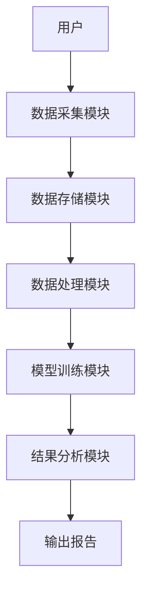
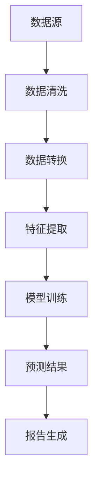

                 


# AI辅助的并购交易分析

## 关键词：AI, 并购交易分析, 机器学习, 自然语言处理, 数据挖掘, 并购风险评估, 系统架构

## 摘要：  
本文详细探讨了AI技术在并购交易分析中的应用，从机器学习、自然语言处理和数据挖掘等核心技术入手，分析了AI如何提升并购交易的效率和准确性。文章通过实际案例分析，展示了AI在并购风险评估、目标企业筛选和交易策略优化中的潜力，并提出了构建AI辅助并购分析系统的架构设计方案。本文旨在为并购交易专业人士和AI技术从业者提供有价值的参考，助力他们在复杂多变的市场环境中做出更明智的决策。

---

# 第一部分: AI辅助的并购交易分析基础

## 第1章: AI辅助的并购交易分析概述

### 1.1 并购交易的基本概念

#### 1.1.1 并购交易的定义与类型
并购（Mergers and Acquisitions，简称 M&A）是指一家企业与其他企业合并或收购其资产、股权等行为。并购可以分为以下几种类型：
- **横向并购**：同一行业内的企业并购。
- **纵向并购**：产业链上下游的企业并购。
- **混合并购**：与企业主营业务无直接关系的并购。

#### 1.1.2 并购交易的核心流程
1. **战略规划**：确定并购目标和战略意图。
2. **目标筛选**：寻找符合战略目标的企业。
3. **尽职调查**：对目标企业进行财务、法律和业务的全面调查。
4. **估值与谈判**：评估目标企业价值，进行价格谈判。
5. **整合与实施**：完成并购后的业务整合和运营优化。

#### 1.1.3 并购交易的市场现状与趋势
近年来，全球并购交易规模持续增长，AI技术的引入为并购分析带来了新的可能性。通过AI技术，企业可以更高效地筛选目标、评估风险、制定策略，从而提高并购的成功率。

---

### 1.2 AI在并购交易分析中的应用背景

#### 1.2.1 并购交易分析的痛点与挑战
1. **数据量大**：并购涉及海量数据，包括财务数据、市场数据、法律文件等。
2. **信息不对称**：目标企业可能存在隐藏的问题，如财务造假、法律纠纷等。
3. **分析效率低**：传统分析方法依赖人工经验，耗时且容易出错。
4. **风险评估难**：并购后的整合风险难以量化和预测。

#### 1.2.2 AI技术如何解决并购分析的问题
1. **自动化数据处理**：AI可以快速处理和分析大量数据，提高效率。
2. **智能化预测**：通过机器学习模型预测并购风险和估值。
3. **深度文本分析**：NLP技术可以提取文本中的关键信息，辅助尽职调查。

#### 1.2.3 AI辅助并购交易的潜在价值
1. **提高决策效率**：AI可以在短时间内处理大量数据，辅助制定并购策略。
2. **降低风险**：通过AI模型预测潜在风险，减少并购失败的可能性。
3. **优化整合**：AI可以帮助企业更好地整合被并购企业，提升协同效应。

---

## 第2章: 机器学习在并购分析中的应用

### 2.1 机器学习的基本原理

#### 2.1.1 机器学习的定义与分类
机器学习是一种人工智能技术，通过数据训练模型，使其能够从数据中学习并做出预测或决策。常见的机器学习类型包括：
- **监督学习**：基于标记数据进行训练。
- **无监督学习**：在无标记数据中发现模式。
- **强化学习**：通过与环境交互学习最优策略。

#### 2.1.2 机器学习在并购分析中的适用场景
1. **目标企业筛选**：通过监督学习模型对目标企业进行分类。
2. **并购风险评估**：使用无监督学习发现潜在风险。
3. **估值预测**：基于历史数据训练回归模型预测企业价值。

### 2.2 并购交易分析的机器学习模型

#### 2.2.1 监督学习模型
- **回归模型**：用于预测企业价值，如线性回归、随机森林回归。
- **分类模型**：用于分类并购类型，如逻辑回归、支持向量机（SVM）。

#### 2.2.2 无监督学习模型
- **聚类分析**：用于将目标企业分为不同类别，如K-means聚类。
- **异常检测**：用于发现潜在风险，如孤立森林算法。

#### 2.2.3 深度学习模型
- **神经网络**：用于复杂模式识别，如卷积神经网络（CNN）和长短期记忆网络（LSTM）。

### 2.3 机器学习在并购风险评估中的应用

#### 2.3.1 并购风险的定义与分类
并购风险包括财务风险、法律风险、整合风险等。

#### 2.3.2 基于机器学习的并购风险预测模型
1. **数据准备**：收集目标企业的财务数据、市场数据和新闻数据。
2. **特征提取**：提取关键特征，如财务指标、市场情绪等。
3. **模型训练**：使用监督学习模型进行风险分类。

#### 2.3.3 案例分析：某公司并购风险评估
假设某公司计划并购一家科技企业，通过机器学习模型预测并购后的整合风险，结果发现目标企业存在较高的财务风险，最终放弃并购。

---

## 第3章: 自然语言处理在并购分析中的应用

### 3.1 自然语言处理的基本原理

#### 3.1.1 NLP的核心技术
- **分词**：将文本分割成词语或短语。
- **句法分析**：分析句子的语法结构。
- **语义理解**：理解文本的含义。

#### 3.1.2 NLP在文本数据处理中的应用
- **文本清洗**：去除噪音数据，如停用词、标点符号。
- **文本表示**：将文本转换为向量表示，如词袋模型、词嵌入。

### 3.2 并购交易中的文本数据处理

#### 3.2.1 财务报告与新闻数据的文本分析
- **财务报告分析**：提取关键财务指标，如收入、利润、负债等。
- **新闻数据分析**：分析市场情绪，识别潜在风险。

#### 3.2.2 基于NLP的公司基本面分析
- **财务数据挖掘**：通过NLP提取财务数据，进行公司基本面分析。
- **市场情绪分析**：通过NLP分析新闻和社交媒体，评估市场情绪。

#### 3.2.3 基于NLP的市场情绪分析
- **情感分析**：识别文本中的情感倾向，如正面、负面、中性。
- **主题分析**：识别文本中的主要主题和关键词。

### 3.3 NLP在并购交易中的实际应用案例

#### 3.3.1 某公司并购案例中的NLP应用
假设某公司计划并购一家互联网企业，通过NLP分析目标企业的财务报告和新闻数据，发现其存在较大的财务风险，最终决定暂缓并购。

#### 3.3.2 NLP在并购尽职调查中的应用
- **合同审查**：通过NLP自动审查合同条款，识别潜在法律风险。
- **新闻监控**：实时监控目标企业的新闻，识别潜在风险。

---

## 第4章: 数据挖掘与特征工程在并购分析中的应用

### 4.1 数据挖掘的基本原理

#### 4.1.1 数据挖掘的核心技术
- **关联规则挖掘**：发现数据中的关联关系。
- **聚类分析**：将数据分为不同的类别。
- **分类分析**：根据特征对数据进行分类。

### 4.2 并购交易分析的数据挖掘技术

#### 4.2.1 数据预处理
- **数据清洗**：去除重复数据、处理缺失值。
- **数据转换**：将数据转换为适合模型输入的形式。

#### 4.2.2 数据挖掘在并购分析中的应用
- **目标企业筛选**：通过关联规则挖掘发现潜在并购目标。
- **市场趋势分析**：通过聚类分析发现市场趋势。

### 4.3 特征工程在并购分析中的应用

#### 4.3.1 特征选择
- **特征重要性分析**：通过特征重要性分析选择关键特征。
- **特征降维**：使用主成分分析（PCA）等技术降维。

#### 4.3.2 特征构建
- **组合特征**：将多个特征组合成新的特征。
- **数值化特征**：将非数值特征转换为数值特征。

---

## 第5章: AI辅助并购交易分析的系统架构与实现

### 5.1 系统架构设计

#### 5.1.1 系统功能设计
- **数据采集**：从多种数据源采集数据。
- **数据处理**：对数据进行清洗、转换和预处理。
- **模型训练**：基于处理后的数据训练机器学习模型。
- **结果分析**：输出模型预测结果和分析报告。

#### 5.1.2 系统架构图


### 5.2 数据流分析

#### 5.2.1 数据流图


### 5.3 系统实现

#### 5.3.1 环境配置
- **编程语言**：Python
- **框架**：TensorFlow、PyTorch
- **工具库**：Pandas、Scikit-learn、NLTK

#### 5.3.2 核心代码实现
```python
import pandas as pd
from sklearn.model_selection import train_test_split
from sklearn.ensemble import RandomForestClassifier
from sklearn.metrics import accuracy_score

# 数据加载
data = pd.read_csv('merger_data.csv')
X = data.drop('target', axis=1)
y = data['target']

# 数据分割
X_train, X_test, y_train, y_test = train_test_split(X, y, test_size=0.2)

# 模型训练
model = RandomForestClassifier()
model.fit(X_train, y_train)

# 模型预测
y_pred = model.predict(X_test)
print("Accuracy:", accuracy_score(y_test, y_pred))
```

---

## 第6章: 并购交易分析的实际案例

### 6.1 案例背景
假设某公司计划并购一家科技企业，希望通过AI技术辅助分析并购风险和估值。

### 6.2 数据准备
- **财务数据**：目标企业的财务报表。
- **市场数据**：行业市场数据。
- **新闻数据**：目标企业的相关新闻。

### 6.3 数据分析与结果解读
- **机器学习模型**：训练一个分类模型，预测并购风险。
- **NLP分析**：分析新闻数据，评估市场情绪。
- **数据挖掘**：发现目标企业的潜在风险。

### 6.4 案例总结
通过AI技术，该公司成功识别了目标企业的潜在风险，最终决定暂缓并购。

---

## 第7章: 总结与展望

### 7.1 本章总结
本文详细探讨了AI技术在并购交易分析中的应用，包括机器学习、自然语言处理和数据挖掘等技术。通过实际案例分析，展示了AI如何提升并购交易的效率和准确性。

### 7.2 未来展望
随着AI技术的不断发展，未来并购交易分析将更加智能化和自动化。以下是未来可能的发展方向：
1. **更复杂的模型**：如图神经网络（Graph Neural Network）在并购分析中的应用。
2. **多模态数据融合**：将文本、图像等多种数据源融合，提升分析效果。
3. **实时分析**：通过流数据处理技术实现并购分析的实时性。

---

## 作者：AI天才研究院/AI Genius Institute & 禅与计算机程序设计艺术 /Zen And The Art of Computer Programming

