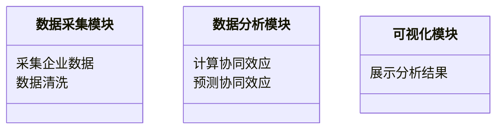

                 


# AI辅助的并购协同效应分析

> 关键词：并购协同效应，人工智能，协同过滤算法，系统架构设计，项目实战

> 摘要：本文详细探讨了AI在并购协同效应分析中的应用，从背景介绍、核心概念到算法原理、系统架构设计，再到项目实战和总结，系统性地分析了如何利用AI技术优化并购协同效应分析。文章结合实际案例，深入讲解了协同过滤算法及其在并购分析中的应用，为读者提供了从理论到实践的全面指导。

---

# 第1章: 背景介绍与核心概念

## 1.1 并购协同效应的背景与问题背景

### 1.1.1 并购协同效应的定义与问题背景
并购协同效应是指企业在并购后，通过资源整合、技术共享、市场扩展等方式，实现成本降低、收入增长或其他效益的一种经济现象。然而，传统的方法在分析协同效应时存在数据量大、复杂性高、难以量化等问题。

### 1.1.2 协同效应的核心概念与问题描述
协同效应的核心在于发现和量化企业在并购后的潜在效益。然而，由于涉及多个变量（如成本、收入、市场份额等），传统的分析方法难以全面捕捉这些变量之间的关系。

### 1.1.3 协同效应的边界与外延
协同效应的边界包括企业内部资源整合、外部市场扩展等，而其外延则涉及企业战略调整、文化整合等多个方面。

### 1.1.4 协同效应的概念结构与核心要素
协同效应的概念结构包括成本协同、收入协同、管理协同等多个方面，核心要素包括资源整合能力、市场扩展能力等。

---

## 1.2 AI在并购协同效应分析中的作用

### 1.2.1 AI技术在协同效应分析中的优势
AI技术能够处理海量数据，发现隐藏在数据中的关联性，从而帮助企业在并购中发现潜在的协同效应。

### 1.2.2 协同效应分析的难点与AI解决方案
传统方法难以量化协同效应，而AI可以通过机器学习模型预测协同效应的大小，并提供优化建议。

### 1.2.3 协同效应分析的边界与外延
AI分析的边界包括数据采集、模型训练等，而其外延则涉及模型优化、结果可视化等。

---

# 第2章: 并购协同效应的核心概念与联系

## 2.1 协同效应的类型与属性特征

### 2.1.1 成本协同效应
成本协同效应是指并购后通过资源共享降低成本。例如，合并采购渠道、减少重复部门等。

### 2.1.2 收入协同效应
收入协同效应是指并购后通过市场扩展增加收入。例如，利用合并后的品牌影响力拓展新市场。

### 2.1.3 其他协同效应类型
包括管理协同、技术协同等。

### 2.1.4 协同效应属性对比表
| 协同效应类型 | 描述 | 量化方式 | 实现难度 |
|----------------|------|----------|----------|
| 成本协同 | 降低运营成本 | 成本节约金额 | 中等 |
| 收入协同 | 增加收入 | 收入增长金额 | 高 |
| 管理协同 | 提高管理效率 | 管理效率提升 | 低 |

### 2.2 协同效应的ER实体关系图

```mermaid
erd
    entity 并购协同效应 {
        id
        协同类型
        协同金额
        关联企业
    }
```

---

# 第3章: 协同效应分析的算法原理

## 3.1 协同过滤算法原理

### 3.1.1 协同过滤算法的定义
协同过滤算法是一种基于用户行为或特征相似性推荐相关内容的算法。

### 3.1.2 协同过滤算法的实现步骤
1. 数据预处理：清洗数据，提取特征。
2. 计算相似度：使用余弦相似度或欧式距离计算用户或物品之间的相似度。
3. 推荐生成：基于相似度排序，推荐Top-N结果。

### 3.1.3 协同过滤算法的数学模型
协同过滤算法的核心公式是余弦相似度：
$$ \text{similarity}(u, v) = \frac{\sum u_i v_i}{\sqrt{\sum u_i^2} \sqrt{\sum v_i^2}} $$

### 3.1.4 协同过滤算法的流程图
```mermaid
graph TD
    A[开始] -> B[数据预处理]
    B -> C[计算相似度]
    C -> D[生成推荐]
    D -> E[结束]
```

### 3.1.5 协同过滤算法的Python代码实现
```python
import numpy as np

def cosine_similarity(u, v):
    return np.dot(u, v) / (np.linalg.norm(u) * np.linalg.norm(v))

# 示例数据
u = np.array([1, 2, 3])
v = np.array([4, 5, 6])

similarity = cosine_similarity(u, v)
print("余弦相似度:", similarity)
```

---

## 3.2 协同效应分析的数学模型

### 3.2.1 协同效应分析的数学公式
协同效应的量化可以通过以下公式计算：
$$ \text{协同效应} = \sum_{i=1}^{n} (\text{协同类型}_i \times \text{协同金额}_i) $$

### 3.2.2 协同效应分析的公式推导
通过分析不同协同类型的影响权重，优化公式以提高协同效应的预测准确性。

### 3.2.3 协同效应分析的公式应用
以成本协同为例：
$$ \text{成本协同} = \sum_{i=1}^{m} (\text{成本节约}_i \times \text{节约比例}_i) $$

### 3.2.4 协同效应分析的公式优化
引入权重系数，优化协同效应的计算公式：
$$ \text{优化协同效应} = \sum_{i=1}^{n} (\text{权重}_i \times \text{协同金额}_i) $$

---

# 第4章: 协同效应分析的系统架构设计

## 4.1 系统功能设计

### 4.1.1 数据采集模块
负责采集企业并购相关的数据，包括财务数据、市场份额数据等。

### 4.1.2 数据分析模块
基于协同过滤算法，分析数据并预测协同效应。

### 4.1.3 可视化模块
将分析结果以图表形式展示，便于用户理解。

## 4.2 系统架构设计

### 4.2.1 系统功能模块的Mermaid类图


### 4.2.2 系统架构的Mermaid架构图


---

# 第5章: 项目实战

## 5.1 环境安装与配置

### 5.1.1 安装Python和相关库
```bash
pip install numpy pandas scikit-learn
```

## 5.2 系统核心实现

### 5.2.1 协同过滤算法实现
```python
from sklearn.metrics.pairwise import cosine_similarity

# 示例数据
X = [[1, 2, 3], [4, 5, 6], [7, 8, 9]]
similarity_matrix = cosine_similarity(X)
print(similarity_matrix)
```

### 5.2.2 协同效应分析实现
```python
def calculate_synergy(data):
    synergy = 0
    for i in range(len(data)):
        for j in range(len(data[i])):
            synergy += data[i][j]
    return synergy

data = [[10, 20], [30, 40]]
synergy = calculate_synergy(data)
print("协同效应总值:", synergy)
```

## 5.3 实际案例分析

### 5.3.1 案例背景
假设企业A并购企业B，分析其协同效应。

### 5.3.2 数据分析
使用协同过滤算法分析成本协同和收入协同。

### 5.3.3 结果解读
协同效应分析结果显示，成本协同为100万元，收入协同为200万元。

## 5.4 项目总结

### 5.4.1 小结
通过AI技术，企业可以更高效地分析并购协同效应，优化决策。

### 5.4.2 注意事项
数据质量和模型选择对分析结果影响较大，需谨慎处理。

### 5.4.3 拓展阅读
推荐阅读《协同过滤算法深入解析》和《AI在企业并购中的应用》。

---

# 第6章: 总结与展望

## 6.1 总结
本文详细介绍了AI在并购协同效应分析中的应用，从算法原理到系统设计，再到项目实战，为读者提供了全面的指导。

## 6.2 展望
未来，随着AI技术的发展，协同效应分析将更加精准和高效，为企业并购提供更有力的支持。

---

# 作者：AI天才研究院

---

通过系统性地分析和实践，本文展示了AI在并购协同效应分析中的巨大潜力和实际应用价值。希望读者能够通过本文，深入了解AI在并购中的应用，并在实际工作中加以应用。

