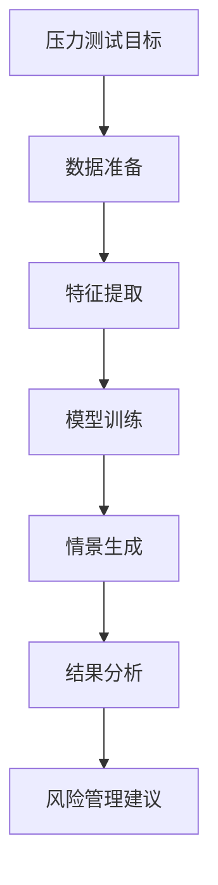
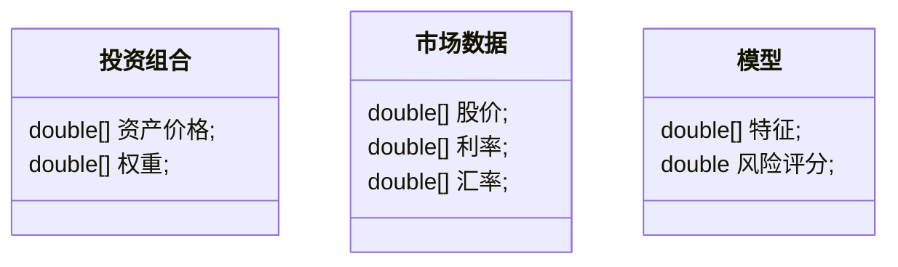
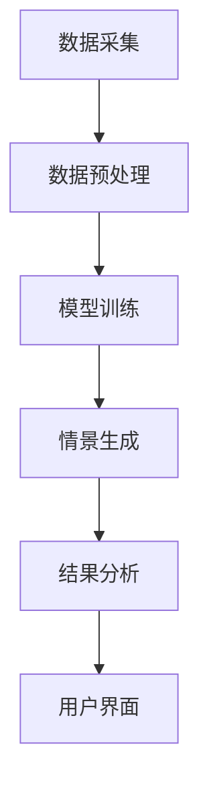

                 


# AI辅助的投资组合压力测试

> 关键词：AI，投资组合，压力测试，风险管理，金融，蒙特卡洛模拟

> 摘要：本文详细探讨了如何利用人工智能技术辅助投资组合压力测试。通过分析传统压力测试方法的局限性，结合AI算法和数学模型，提出了一种基于AI的新型压力测试框架。文章从背景介绍、核心概念、算法原理、系统架构到项目实战，全面阐述了AI在投资组合压力测试中的应用，最后给出了实际案例分析和最佳实践建议。

---

## 第一部分: AI辅助的投资组合压力测试背景介绍

### 第1章: 投资组合压力测试概述

#### 1.1 投资组合压力测试的定义与背景
投资组合压力测试是一种用于评估投资组合在极端市场条件下的表现和风险的分析方法。其核心目标是帮助投资者和机构了解在极端情况下投资组合可能面临的损失，并制定相应的风险管理策略。

传统的压力测试方法通常依赖于历史数据和假设情景，但这种方法存在以下问题：
- 无法捕捉到新的市场风险。
- 对极端事件的预测能力有限。
- 需要大量人工干预和假设调整。

随着人工智能（AI）技术的快速发展，AI在金融领域的应用越来越广泛。AI能够通过机器学习算法从海量数据中提取模式和特征，帮助投资者更准确地预测市场变化和评估风险。

#### 1.2 AI技术在金融中的应用
AI技术在金融领域的应用主要体现在以下几个方面：
1. **风险管理**：通过机器学习模型预测市场波动和极端事件。
2. **投资组合优化**：利用算法优化投资组合的收益与风险比。
3. **市场预测**：基于历史数据和新闻 sentiment，预测市场走势。
4. **欺诈检测**：通过异常检测算法识别金融交易中的欺诈行为。

在投资组合压力测试中，AI技术可以帮助我们更准确地模拟极端市场情景，并评估投资组合在这些情景下的表现。

---

### 第2章: AI辅助投资组合压力测试的核心概念

#### 2.1 投资组合风险的多维度分析
投资组合的风险可以通过多种指标来衡量，包括：
- **波动性**：投资组合收益的波动程度。
- **VaR（Value at Risk）**：在一定置信水平下，投资组合可能遭受的最大损失。
- **CVaR（Conditional Value at Risk）**：VaR的延伸，衡量在VaR水平下的平均损失。

AI技术可以通过聚类分析和因子分析等方法，识别投资组合中的主要风险来源，并量化这些风险对整体组合的影响。

#### 2.2 压力测试的主要方法与挑战
传统的压力测试方法通常基于情景分析（Scenario Analysis），即假设某些极端市场情景（如市场崩盘、利率上升等），然后评估投资组合在这些情景下的表现。

然而，传统方法存在以下挑战：
- 情景假设的主观性：需要人工定义极端情景，可能导致遗漏某些潜在风险。
- 计算复杂性：复杂的投资组合需要大量计算资源。

AI技术可以通过无监督学习算法，从历史数据中自动识别潜在的极端情景，并生成新的测试情景。

#### 2.3 AI模型在压力测试中的应用潜力
AI模型在压力测试中的应用潜力主要体现在以下几个方面：
1. **自动情景生成**：通过聚类分析和生成对抗网络（GANs），AI可以生成多样化的极端市场情景。
2. **实时更新**：AI模型可以根据最新的市场数据实时更新压力测试结果。
3. **个性化测试**：根据投资者的风险偏好和投资目标，定制化压力测试情景。

---

## 第二部分: 核心概念与理论基础

### 第3章: 投资组合风险与压力测试方法

#### 3.1 投资组合风险的量化指标
投资组合风险的量化指标包括：
- **标准差**：衡量投资组合收益的波动性。
- **VaR**：在给定置信水平下，投资组合可能遭受的最大损失。
- **CVaR**：VaR的延伸，衡量在VaR水平下的平均损失。

#### 3.2 压力测试的主要方法对比
以下是几种常见的压力测试方法对比：

| 方法                | 描述                                                                 | 优点                           | 缺点                           |
|---------------------|----------------------------------------------------------------------|--------------------------------|--------------------------------|
| 情景分析法          | 假设极端市场情景（如市场崩盘、利率上升）并评估投资组合表现       | 情景假设灵活                   | 情景假设主观性较高             |
| 历史模拟法          | 使用历史市场数据模拟极端情景                                     | 基于实际市场数据               | 依赖历史数据的完整性           |
| 蒙特卡洛模拟法      | 通过随机抽样生成大量市场情景，评估投资组合表现                   | 模拟情景多样性                 | 计算复杂性较高                 |
| AI驱动的压力测试法  | 使用机器学习算法生成和分析极端情景                               | 自动生成多样化情景             | 需要大量数据和计算资源         |

#### 3.3 AI技术在压力测试中的应用
AI技术可以通过以下方式提升压力测试的效果：
1. **自动情景生成**：通过聚类分析和GANs，AI可以生成多样化的极端市场情景。
2. **实时更新**：AI模型可以根据最新的市场数据实时更新压力测试结果。
3. **个性化测试**：根据投资者的风险偏好和投资目标，定制化压力测试情景。

---

### 第4章: AI模型与压力测试的结合

#### 4.1 传统压力测试方法的局限性
传统压力测试方法的主要局限性包括：
- **情景假设的主观性**：需要人工定义极端情景，可能导致遗漏某些潜在风险。
- **计算复杂性**：复杂的投资组合需要大量计算资源。
- **更新滞后**：传统方法通常基于历史数据，难以实时更新。

#### 4.2 AI模型在压力测试中的优势
AI模型在压力测试中的优势包括：
- **自动学习**：AI可以通过机器学习算法从历史数据中自动识别潜在的极端情景。
- **实时更新**：AI模型可以根据最新的市场数据实时更新压力测试结果。
- **多样化情景生成**：AI可以通过生成对抗网络（GANs）生成多样化的极端市场情景。

#### 4.3 压力测试与AI模型的结合框架
以下是压力测试与AI模型结合的框架：



---

## 第三部分: 算法原理与数学模型

### 第5章: 基于AI的压力测试算法原理

#### 5.1 蒙特卡洛模拟的原理与实现
蒙特卡洛模拟是一种基于随机抽样的方法，用于评估投资组合在大量随机市场情景下的表现。

步骤如下：
1. **定义市场参数**：如资产价格、波动率等。
2. **生成随机市场情景**：通过随机数生成器生成大量市场情景。
3. **计算投资组合收益**：在每个情景下计算投资组合的收益。
4. **统计分析**：计算投资组合在不同情景下的VaR、CVaR等风险指标。

#### 5.2 基于随机森林的特征重要性分析
随机森林是一种基于树的集成学习算法，可以通过特征重要性分析识别影响投资组合风险的主要因素。

步骤如下：
1. **数据准备**：收集历史市场数据和投资组合数据。
2. **特征工程**：提取可能影响投资组合风险的特征（如波动率、市场趋势等）。
3. **模型训练**：训练随机森林模型。
4. **特征重要性分析**：识别对投资组合风险影响最大的特征。

#### 5.3 基于神经网络的风险预测模型
神经网络可以通过深度学习算法从非结构化数据（如新闻、社交媒体数据）中提取潜在的市场信号，并预测投资组合的风险。

步骤如下：
1. **数据准备**：收集结构化和非结构化数据。
2. **数据预处理**：清洗和转换数据。
3. **模型训练**：训练深度神经网络模型。
4. **风险预测**：利用模型预测投资组合在不同情景下的风险。

---

## 第四部分: 系统分析与架构设计

### 第6章: 系统分析与架构方案

#### 6.1 系统需求分析
系统需求包括：
- **数据采集**：从多种数据源获取市场数据。
- **模型训练**：训练机器学习模型。
- **情景生成**：生成极端市场情景。
- **结果分析**：输出压力测试结果。

#### 6.2 领域模型设计
以下是领域模型设计：



#### 6.3 系统架构设计
以下是系统架构设计：



---

## 第五部分: 项目实战与实现

### 第7章: 项目实战与代码实现

#### 7.1 环境搭建与数据准备
- **环境搭建**：安装Python、TensorFlow、Pandas等依赖库。
- **数据准备**：收集历史市场数据和投资组合数据。

#### 7.2 核心功能实现
以下是核心功能实现的代码示例：

```python
import numpy as np
import pandas as pd
from sklearn.ensemble import RandomForestRegressor

# 数据准备
data = pd.read_csv('market_data.csv')
X = data.drop('target', axis=1)
y = data['target']

# 模型训练
model = RandomForestRegressor()
model.fit(X, y)

# 特征重要性分析
importances = model.feature_importances_
print(importances)
```

#### 7.3 实际案例分析
通过实际案例分析，验证AI辅助压力测试的效果。例如，假设我们有一个包含10只股票的投资组合，我们可以利用随机森林模型分析哪些因素对投资组合的风险影响最大。

---

## 第六部分: 最佳实践与小结

### 第8章: 最佳实践与注意事项

#### 8.1 最佳实践
- **数据质量**：确保数据的完整性和准确性。
- **模型选择**：根据具体需求选择合适的机器学习算法。
- **结果解释**：压力测试结果需要结合市场背景进行解释。

#### 8.2 小结
AI辅助的投资组合压力测试是一种创新的方法，能够帮助投资者更准确地评估投资组合在极端市场情景下的表现。通过机器学习算法和数学模型，我们可以更高效地进行压力测试，并制定相应的风险管理策略。

---

## 作者信息

作者：AI天才研究院/AI Genius Institute & 禅与计算机程序设计艺术 /Zen And The Art of Computer Programming

---

以上是《AI辅助的投资组合压力测试》的完整目录和文章内容框架。每一章都详细展开了核心概念和算法原理，并结合实际案例进行了分析。希望本文能够为读者提供有价值的技术指导和启发。

