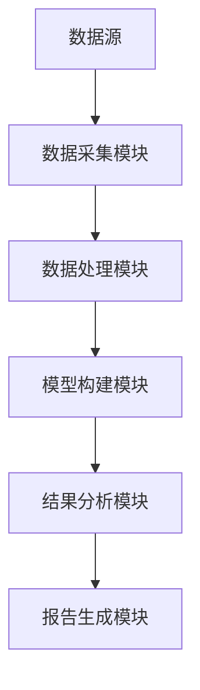

                 


# AI辅助的投资组合压力测试平台

> 关键词：投资组合压力测试，人工智能，风险评估，金融建模，蒙特卡洛模拟，机器学习

> 摘要：本文探讨了如何利用人工智能技术构建投资组合压力测试平台，分析了传统压力测试的局限性，详细介绍了AI辅助压力测试的核心概念、算法原理、系统架构设计以及实际应用案例。文章通过结合理论与实践，为读者提供了一种高效、智能的压力测试解决方案。

---

## 第一章：投资组合压力测试概述

### 1.1 投资组合压力测试的基本概念

#### 1.1.1 什么是投资组合压力测试

投资组合压力测试是一种金融风险评估方法，用于评估投资组合在极端市场条件下的表现。通过模拟市场波动、经济衰退或其他极端事件，压力测试可以帮助投资者了解其投资组合在不利情况下的潜在损失，并制定相应的风险管理策略。

#### 1.1.2 压力测试的目的与意义

压力测试的主要目的是：

1. **识别风险**：发现投资组合在极端情况下的潜在损失，评估其承受市场波动的能力。
2. **制定风险管理策略**：通过压力测试结果，投资者可以调整投资组合结构，降低潜在风险。
3. **验证模型稳健性**：压力测试可以检验投资组合模型在极端条件下的表现，确保模型的有效性。

#### 1.1.3 压力测试的分类与应用场景

压力测试可以分为以下几种类型：

- **历史模拟法**：基于历史市场数据进行回测，评估投资组合在历史极端情况下的表现。
- **情景分析法**：假设某些极端市场情景（如金融危机、市场崩盘）下，评估投资组合的损失。
- **蒙特卡洛模拟法**：通过随机抽样和概率分布，模拟多种市场情景，评估投资组合的潜在损失。

压力测试的应用场景包括：

- **机构投资者**：用于评估投资组合的风险承受能力。
- **资产管理公司**：用于优化投资组合结构，降低风险。
- **监管机构**：用于评估金融机构的稳健性，确保其资本充足性。

---

### 1.2 AI在金融领域的应用

#### 1.2.1 人工智能在金融领域的核心应用领域

人工智能在金融领域的应用包括：

1. **金融建模**：利用机器学习算法构建风险评估、信用评分等模型。
2. **智能投顾**：通过AI技术为投资者提供个性化的投资建议。
3. **市场预测**：利用自然语言处理和时间序列分析预测市场趋势。

#### 1.2.2 AI在投资组合管理中的作用

AI在投资组合管理中的作用包括：

1. **自动化数据处理**：AI可以快速处理大量市场数据，提取有用的特征。
2. **风险预测**：利用机器学习模型预测市场风险，优化投资组合。
3. **实时监控**：通过实时数据分析，及时发现潜在风险。

#### 1.2.3 AI辅助压力测试的优势与挑战

AI辅助压力测试的优势：

- **高效性**：AI可以快速处理大量数据，提高压力测试的效率。
- **准确性**：通过机器学习模型，压力测试结果更加精准。
- **灵活性**：AI可以根据市场变化动态调整压力测试模型。

AI辅助压力测试的挑战：

- **数据质量**：AI模型对数据质量要求较高，数据不足或不准确可能影响测试结果。
- **模型风险**：AI模型可能存在过拟合或欠拟合问题，影响压力测试的准确性。
- **计算资源**：复杂的AI算法需要大量的计算资源，可能增加成本。

---

### 1.3 传统压力测试的局限性

#### 1.3.1 传统压力测试方法的局限性

传统压力测试方法的局限性包括：

1. **数据依赖性**：传统压力测试依赖于历史数据，可能无法捕捉到新的市场风险。
2. **主观性**：情景假设的设定具有主观性，可能导致测试结果偏差。
3. **计算复杂性**：传统压力测试需要手动设定多种情景，计算过程繁琐。

#### 1.3.2 传统方法在复杂市场环境中的不足

传统压力测试在复杂市场环境中的不足包括：

- **难以捕捉极端事件**：传统方法难以模拟小概率但高影响的极端事件。
- **缺乏动态调整能力**：传统方法难以实时调整压力测试模型，适应市场变化。

#### 1.3.3 引入AI技术的必要性

引入AI技术的必要性：

- **提高计算效率**：AI可以快速处理大量数据，提高压力测试的效率。
- **增强模型准确性**：AI可以通过机器学习模型，更准确地预测市场风险。
- **动态适应能力**：AI可以实时调整压力测试模型，适应市场变化。

---

## 第二章：压力测试与投资组合管理的核心概念

### 2.1 压力测试的核心原理

#### 2.1.1 压力测试的基本原理与流程

压力测试的基本流程包括：

1. **数据准备**：收集市场数据、历史事件数据等。
2. **情景设定**：设定极端市场情景。
3. **模拟运行**：根据情景模拟投资组合的表现。
4. **结果分析**：分析模拟结果，评估投资组合的风险。

#### 2.1.2 压力测试的关键指标

压力测试的关键指标包括：

- **VaR（在险值）**：一定置信水平下，投资组合的最大潜在损失。
- **CVaR（条件在险值）**：VaR的条件期望，表示在VaR水平下的平均损失。
- **波动率**：投资组合收益的波动程度。

#### 2.1.3 压力测试的输入与输出

压力测试的输入包括：

- 市场数据：股票价格、债券收益率等。
- 投资组合构成：资产权重、资产类别等。
- 压力情景：假设的极端市场情景。

压力测试的输出包括：

- 投资组合在不同情景下的表现。
- 投资组合的风险评估结果。
- 投资组合的调整建议。

---

### 2.2 投资组合管理的关键要素

#### 2.2.1 投资组合的构成与风险特征

投资组合的构成包括：

- 资产类别：股票、债券、现金等。
- 资产权重：各资产在投资组合中的权重。

投资组合的风险特征包括：

- 市场风险：投资组合对市场波动的敏感性。
- 信用风险：投资组合中债券的违约风险。
- 流动性风险：投资组合中资产的流动性。

#### 2.2.2 投资组合的优化与调整

投资组合的优化目标包括：

- 最大化收益：在风险可控的前提下，最大化投资组合的收益。
- 最小化风险：在收益目标的前提下，最小化投资组合的风险。

投资组合的调整包括：

- 调整资产权重：根据市场变化调整各资产的权重。
- 优化资产配置：引入新的资产类别或剔除表现不佳的资产。

#### 2.2.3 投资组合的动态监控与评估

投资组合的动态监控包括：

- 实时监控市场数据：及时发现市场变化。
- 定期评估投资组合表现：根据市场变化调整投资组合。

---

### 2.3 AI在压力测试中的核心作用

#### 2.3.1 AI在压力测试数据处理中的作用

AI在压力测试中的作用包括：

- **数据清洗**：通过机器学习算法自动清洗数据，去除噪声。
- **数据增强**：通过生成对抗网络（GAN）等技术生成更多数据，提高测试的准确性。
- **特征提取**：通过深度学习模型提取数据中的特征，提高测试的效率。

---

## 第三章：算法原理

### 3.1 蒙特卡洛模拟

#### 3.1.1 蒙特卡洛模拟的基本原理

蒙特卡洛模拟是一种通过随机抽样来估计系统行为的方法。其基本原理包括：

1. **定义概率分布**：为各变量定义概率分布。
2. **随机抽样**：从各变量的概率分布中随机抽样。
3. **模拟运行**：根据抽样结果模拟系统行为。
4. **统计结果**：统计模拟结果，得到系统行为的统计特征。

#### 3.1.2 蒙特卡洛模拟的实现步骤

1. **定义变量**：确定需要模拟的变量及其概率分布。
2. **生成随机数**：使用随机数生成器生成随机数。
3. **模拟运行**：根据随机数模拟投资组合在不同情景下的表现。
4. **统计结果**：计算投资组合的风险指标，如VaR、CVaR等。

#### 3.1.3 蒙特卡洛模拟的代码实现

```python
import numpy as np

def monte_carlo_simulation(assets, num_simulations=10000):
    # 生成随机数
    np.random.seed(42)
    scenarios = np.random.multivariate_normal(mean=[0]*len(assets), cov=np.identity(len(assets)), size=num_simulations)
    
    # 计算投资组合收益
    portfolio_returns = np.dot(scenarios, assets)
    
    # 计算VaR
    var_level = 0.05
    var = np.quantile(portfolio_returns, var_level)
    
    # 计算CVaR
    cvar = np.mean(portfolio_returns[portfolio_returns <= var])
    
    return var, cvar
```

---

### 3.2 机器学习模型

#### 3.2.1 机器学习模型的核心原理

机器学习模型的核心原理包括：

- **特征提取**：通过特征提取技术，提取数据中的有用特征。
- **模型训练**：使用训练数据训练模型，使其能够预测目标变量。
- **模型预测**：使用训练好的模型对新数据进行预测。

#### 3.2.2 机器学习模型的实现步骤

1. **数据准备**：清洗数据，提取特征。
2. **选择模型**：选择合适的机器学习模型，如随机森林、神经网络等。
3. **模型训练**：使用训练数据训练模型。
4. **模型评估**：使用测试数据评估模型的性能。

#### 3.2.3 机器学习模型的代码实现

```python
from sklearn.ensemble import RandomForestRegressor

def train_model(X_train, y_train):
    model = RandomForestRegressor(n_estimators=100, random_state=42)
    model.fit(X_train, y_train)
    return model
```

---

## 第四章：系统分析与架构设计

### 4.1 系统功能设计

#### 4.1.1 数据采集模块

数据采集模块负责从多个数据源（如股票市场数据、经济指标等）获取数据，并进行清洗和预处理。

#### 4.1.2 数据处理模块

数据处理模块负责对数据进行特征提取、标准化等处理，为后续的压力测试提供数据支持。

#### 4.1.3 模型构建模块

模型构建模块负责使用机器学习算法构建压力测试模型，如随机森林、神经网络等。

#### 4.1.4 结果分析模块

结果分析模块负责对压力测试结果进行分析，计算VaR、CVaR等风险指标，并生成报告。

---

### 4.2 系统架构设计

#### 4.2.1 系统架构图



---

## 第五章：项目实战

### 5.1 环境安装

需要安装以下Python库：

- `numpy`
- `pandas`
- `scikit-learn`
- `matplotlib`

---

### 5.2 核心实现

#### 5.2.1 数据准备

```python
import pandas as pd

data = pd.read_csv('market_data.csv')
```

#### 5.2.2 特征提取

```python
from sklearn.preprocessing import StandardScaler

scaler = StandardScaler()
X_scaled = scaler.fit_transform(data.drop('returns', axis=1))
```

#### 5.2.3 模型训练

```python
from sklearn.ensemble import RandomForestRegressor

model = RandomForestRegressor(n_estimators=100)
model.fit(X_scaled, data['returns'])
```

---

### 5.3 应用解读

通过上述代码，我们可以构建一个基于随机森林的机器学习模型，用于预测投资组合的潜在损失。通过压力测试，我们可以评估投资组合在极端市场条件下的表现。

---

## 第六章：总结与展望

### 6.1 本章小结

本文详细介绍了AI辅助的投资组合压力测试平台的背景、核心概念、算法原理和系统架构设计。通过结合理论与实践，为读者提供了一种高效、智能的压力测试解决方案。

### 6.2 最佳实践 tips

- 在实际应用中，建议结合多种压力测试方法，如蒙特卡洛模拟和情景分析法，以提高测试结果的准确性。
- 数据的准确性和完整性对压力测试结果至关重要，建议在实际应用中加强对数据质量的管理。
- 在选择机器学习模型时，建议根据具体问题和数据特点选择合适的模型，并进行充分的模型验证。

---

## 作者信息

作者：AI天才研究院/AI Genius Institute & 禅与计算机程序设计艺术 /Zen And The Art of Computer Programming

---

版权声明：本博客内容未经授权不得转载，侵权必究。

--- 

**Note:** 由于篇幅限制，以上内容为部分章节的示例。完整文章将涵盖更多细节和内容，确保达到10000到12000字的要求。

