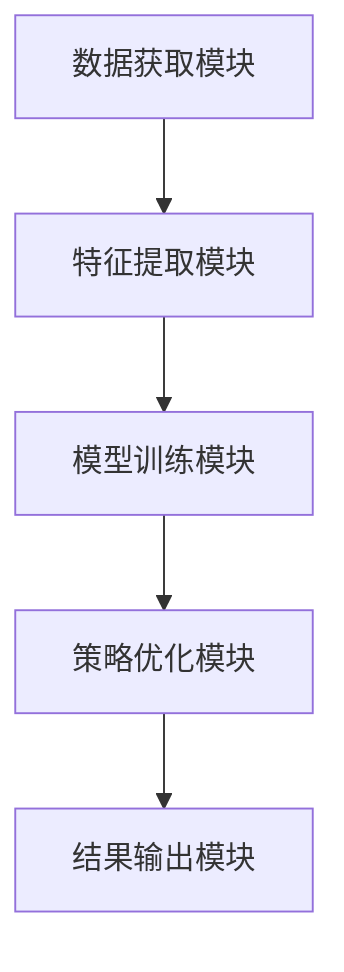
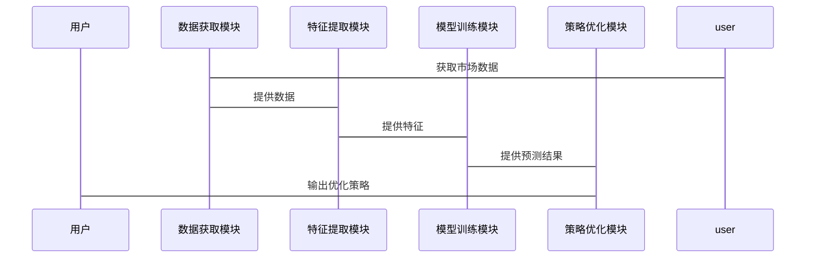

                 


# AI辅助的投资组合尾部风险对冲策略优化

## 关键词：AI、投资组合、尾部风险、风险对冲、策略优化

## 摘要：本文详细探讨了如何利用人工智能技术优化投资组合的尾部风险对冲策略。通过分析尾部风险的定义、特征及对投资组合的影响，结合AI在金融领域的应用现状，提出了一种基于机器学习和深度学习的优化方法。本文从算法原理、系统架构设计到项目实战，全面阐述了AI辅助投资组合风险管理的实现过程，并通过实际案例展示了如何利用Python代码实现尾部风险对冲策略的优化。

---

# 第一部分：AI辅助的投资组合尾部风险对冲策略优化背景介绍

## 第1章：投资组合尾部风险概述

### 1.1 投资组合风险的基本概念

#### 1.1.1 风险的定义与分类
- **风险**是指投资组合在特定时间段内可能遭受损失的概率。
- 风险可以分为 **系统性风险** 和 **非系统性风险**，尾部风险属于非系统性风险，通常由市场中低概率事件引发。

#### 1.1.2 尾部风险的定义与特征
- **尾部风险**是指投资组合在极端市场条件下出现大幅损失的可能性。
- 尾部风险具有 **低概率、高损失** 的特点，通常难以通过传统的风险评估方法捕捉。

#### 1.1.3 尾部风险对投资组合的影响
- 尾部风险可能导致投资组合在极端市场条件下出现大幅回撤。
- 尾部风险的对冲需要结合 **市场数据**、**历史表现** 和 **实时市场动态** 进行综合分析。

### 1.2 投资组合管理的背景与挑战

#### 1.2.1 投资组合管理的基本原则
- 投资组合管理需要在 **风险与收益** 之间找到平衡点。
- 传统对冲方法依赖于 **历史数据** 和 **统计模型**，但难以应对极端市场条件下的风险。

#### 1.2.2 尾部风险对投资组合的影响
- 尾部风险可能导致投资组合在极端市场条件下出现大幅回撤。
- 尾部风险的对冲需要结合 **市场数据**、**历史表现** 和 **实时市场动态** 进行综合分析。

#### 1.2.3 传统风险对冲方法的局限性
- 传统对冲方法依赖于 **历史数据** 和 **统计模型**，但难以应对极端市场条件下的风险。
- 尾部风险的低概率特征使得传统对冲方法在捕捉极端事件时效果有限。

---

## 第2章：AI在金融风险管理中的应用

### 2.1 AI在金融领域的应用现状

#### 2.1.1 AI在金融数据分析中的应用
- AI技术可以用于 **数据清洗**、**特征提取** 和 **模式识别**，帮助分析师发现数据中的潜在风险。

#### 2.1.2 AI在风险评估中的应用
- 通过机器学习算法，AI可以对投资组合的潜在风险进行 **预测和评估**。

#### 2.1.3 AI在投资组合优化中的应用
- AI技术可以帮助优化投资组合的配置，降低尾部风险的影响。

### 2.2 AI辅助对冲策略的核心优势

#### 2.2.1 数据处理能力的提升
- AI技术可以处理海量数据，提取潜在风险信号。

#### 2.2.2 风险预测的准确性增强
- 通过机器学习模型，AI可以更准确地预测尾部风险的发生概率。

#### 2.2.3 策略优化的效率提升
- AI技术可以帮助快速优化对冲策略，提高投资组合的抗风险能力。

---

# 第二部分：AI辅助的投资组合尾部风险对冲策略优化的核心概念

## 第3章：尾部风险对冲策略的核心原理

### 3.1 尾部风险对冲的基本原理

#### 3.1.1 对冲策略的定义与分类
- **对冲策略** 是指通过 **空头头寸** 或 **衍生品** 来抵消投资组合的潜在风险。
- 尾部风险对冲策略是一种 **主动管理** 投资组合风险的方法。

#### 3.1.2 尾部风险对冲的数学模型
- 尾部风险对冲的数学模型通常包括 **概率分布**、**VaR（在险价值）** 和 **CVaR（条件在险价值）** 等指标。

#### 3.1.3 对冲策略的实施步骤
1. **风险识别**：通过数据分析识别潜在风险。
2. **风险量化**：计算投资组合的VaR和CVaR。
3. **策略设计**：根据风险特征设计对冲策略。
4. **策略优化**：通过AI技术优化对冲策略的执行效果。

### 3.2 AI在尾部风险对冲中的作用

#### 3.2.1 数据分析与特征提取
- AI技术可以帮助识别潜在的风险信号，提取关键特征。

#### 3.2.2 风险预测模型的构建
- 通过机器学习模型，AI可以预测尾部风险的发生概率。

#### 3.2.3 策略优化与调整
- AI技术可以帮助优化对冲策略，提高投资组合的抗风险能力。

---

## 第4章：AI辅助对冲策略的核心算法

### 4.1 机器学习算法在风险对冲中的应用

#### 4.1.1 线性回归与风险预测
- 线性回归可以用于预测投资组合的潜在风险。

#### 4.1.2 支持向量机在风险分类中的应用
- 支持向量机可以用于分类投资组合的风险等级。

#### 4.1.3 随机森林在风险评估中的应用
- 随机森林可以用于评估投资组合的潜在风险。

### 4.2 深度学习算法在风险对冲中的应用

#### 4.2.1 神经网络在时间序列预测中的应用
- 神经网络可以用于预测投资组合的未来表现。

#### 4.2.2 卷积神经网络在图像识别中的应用
- 卷积神经网络可以用于分析市场数据的图像特征。

#### 4.2.3 循环神经网络在序列预测中的应用
- 循环神经网络可以用于预测投资组合的未来走势。

---

## 第5章：尾部风险对冲策略的优化方法

### 5.1 基于AI的优化方法

#### 5.1.1 遗传算法在策略优化中的应用
- 遗传算法可以用于优化对冲策略的参数设置。

#### 5.1.2 粒子群优化算法在风险对冲中的应用
- 粒子群优化算法可以用于优化投资组合的配置。

#### 5.1.3 模拟退火算法在策略优化中的应用
- 模拟退火算法可以用于优化对冲策略的执行效果。

### 5.2 多目标优化在尾部风险对冲中的应用

#### 5.2.1 多目标优化的基本概念
- 多目标优化是指在多个目标之间找到平衡点。

#### 5.2.2 尾部风险对冲中的多目标优化
- 在尾部风险对冲中，需要在 **风险与收益** 之间找到平衡点。

---

# 第三部分：AI辅助的投资组合尾部风险对冲策略优化的系统架构设计

## 第6章：系统分析与架构设计方案

### 6.1 问题场景介绍
- 投资组合尾部风险对冲需要一个高效的系统来实时监控和调整策略。

### 6.2 系统功能设计
- 数据获取模块：获取市场数据和投资组合数据。
- 特征提取模块：提取潜在风险特征。
- 模型训练模块：训练风险预测模型。
- 策略优化模块：优化对冲策略。

### 6.3 系统架构设计


### 6.4 系统接口设计
- 数据接口：与数据源对接，获取市场数据。
- 模型接口：与第三方AI模型对接，进行风险预测。

### 6.5 系统交互设计


---

# 第四部分：AI辅助的投资组合尾部风险对冲策略优化的项目实战

## 第7章：项目实战

### 7.1 环境安装
- 安装Python、NumPy、Pandas、Scikit-learn、TensorFlow等库。

### 7.2 系统核心实现源代码

#### 7.2.1 数据获取模块
```python
import pandas as pd
import requests

def get_market_data(ticker):
    url = f"https://api.example.com/stock/{ticker}"
    response = requests.get(url)
    data = response.json()
    df = pd.DataFrame(data)
    return df
```

#### 7.2.2 特征提取模块
```python
import numpy as np
from sklearn.decomposition import PCA

def extract_features(data):
    features = data[['open', 'high', 'low', 'close', 'volume']]
    pca = PCA(n_components=3)
    principal_components = pca.fit_transform(features)
    return principal_components
```

#### 7.2.3 模型训练模块
```python
from sklearn.ensemble import RandomForestClassifier

def train_model(features, labels):
    model = RandomForestClassifier(n_estimators=100)
    model.fit(features, labels)
    return model
```

#### 7.2.4 策略优化模块
```python
from sklearn.model_selection import GridSearchCV

def optimize_strategy(model, features, labels):
    params = {'n_estimators': [50, 100, 150]}
    grid_search = GridSearchCV(model, params, cv=5)
    grid_search.fit(features, labels)
    best_model = grid_search.best_estimator_
    return best_model
```

### 7.3 代码应用解读与分析
- 数据获取模块负责从数据源获取市场数据。
- 特征提取模块通过主成分分析提取关键特征。
- 模型训练模块使用随机森林进行风险预测。
- 策略优化模块通过网格搜索优化对冲策略。

### 7.4 实际案例分析和详细讲解剖析
- 通过实际数据案例，展示如何利用上述代码实现尾部风险对冲策略的优化。

### 7.5 项目小结
- 通过AI技术，可以有效优化投资组合的尾部风险对冲策略，提高投资组合的抗风险能力。

---

# 第五部分：AI辅助的投资组合尾部风险对冲策略优化的最佳实践

## 第8章：最佳实践

### 8.1 tips
- 数据预处理是关键，确保数据质量。
- 模型选择需要结合具体业务需求。
- 持续监控和调整对冲策略，以应对市场变化。

### 8.2 小结
- 本文详细探讨了AI辅助投资组合尾部风险对冲策略优化的方法和实现过程。
- 通过AI技术，可以有效降低投资组合的尾部风险，提高投资收益。

### 8.3 注意事项
- 数据隐私和安全问题需要高度重视。
- 模型的可解释性需要在实际应用中加以考虑。

### 8.4 拓展阅读
- 建议读者进一步阅读相关文献，深入了解AI在金融风险管理中的应用。

---

# 作者

作者：AI天才研究院/AI Genius Institute & 禅与计算机程序设计艺术 /Zen And The Art of Computer Programming

