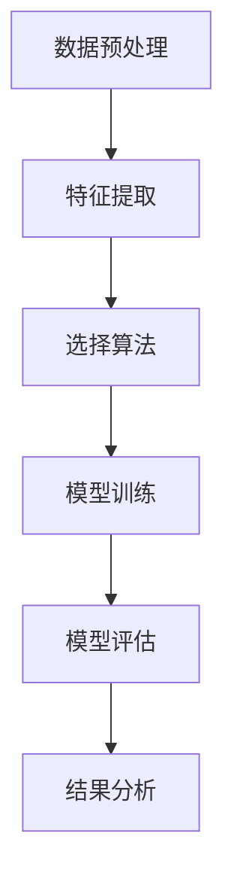

                 

# AI辅助的投资风险评估

> 关键词：AI，投资，风险评估，机器学习，金融分析，数据科学

> 摘要：本文探讨了人工智能在投资风险评估中的应用，分析了传统方法的局限性，并详细介绍了AI技术的优势、核心算法及其在投资风险评估中的实际应用。通过案例分析和系统设计，展示了如何利用AI技术构建高效、准确的投资风险评估系统。

---

## 第一章：AI与投资风险评估的背景

### 1.1 投资风险评估的基本概念

#### 1.1.1 投资风险的定义与分类
投资风险是指在投资过程中，由于市场波动、经济变化等因素导致投资损失的可能性。投资风险可以分为市场风险、信用风险、流动性风险和操作风险等。

#### 1.1.2 传统投资风险评估方法的局限性
传统的方法依赖于历史数据分析和经验判断，具有主观性强、数据处理能力有限、难以捕捉复杂市场变化等缺点。

#### 1.1.3 AI技术在投资风险评估中的优势
AI技术能够处理海量数据，发现隐藏的模式，并实时更新模型，从而提供更精准的风险评估和预测。

### 1.2 AI技术的基本原理
人工智能通过机器学习算法，从数据中学习特征，并构建预测模型。深度学习技术如神经网络能够处理复杂的非线性关系，为风险评估提供更强大的工具。

### 1.3 本章小结
本章介绍了投资风险评估的基本概念及其分类，分析了传统方法的局限性，并阐述了AI技术在投资风险评估中的优势。

---

## 第二章：投资风险评估的核心要素

### 2.1 投资风险的构成要素

#### 2.1.1 市场风险
市场风险是指由于市场波动导致的投资损失。常用的风险价值（VaR）模型用于衡量市场风险。

#### 2.1.2 信用风险
信用风险是指债券发行人违约的可能性。预期损失（EL）和非预期损失（UL）是衡量信用风险的重要指标。

#### 2.1.3 流动性风险
流动性风险是指资产无法快速变现的风险。现代投资组合理论（MPT）帮助投资者优化资产配置，降低流动性风险。

#### 2.1.4 操作风险
操作风险是指由于内部操作失误或外部事件导致的损失。AI技术可以通过异常检测模型识别操作风险。

### 2.2 AI在风险评估中的关键作用
AI技术能够通过数据挖掘和模式识别，发现传统方法难以察觉的风险因素，提高风险评估的准确性和效率。

### 2.3 投资风险评估的数学模型

#### 2.3.1 风险价值（VaR）模型
VaR模型用于衡量投资组合在一定置信水平下的最大可能损失：
$$ VaR = \mu + z \cdot \sigma $$
其中，$\mu$是平均收益，$z$是标准正态分布的分位数，$\sigma$是收益的标准差。

#### 2.3.2 预期损失（EL）与非预期损失（UL）
EL是基于历史数据计算的平均损失，而UL是基于信用评分模型预测的潜在损失。

#### 2.3.3 现代投资组合理论（MPT）
MPT通过优化资产配置，将风险分散到不同的资产类别中，从而降低整体风险。

### 2.4 本章小结
本章详细分析了投资风险的构成要素，并介绍了AI技术在风险评估中的关键作用。通过数学模型的讲解，为后续的AI算法应用奠定了基础。

---

## 第三章：AI辅助投资风险评估的算法原理

### 3.1 常见的AI算法及其在投资风险评估中的应用

#### 3.1.1 回归分析

##### 3.1.1.1 线性回归模型
线性回归用于预测连续型变量，模型为：
$$ y = \beta_0 + \beta_1 x + \epsilon $$
其中，$\beta_0$是截距，$\beta_1$是回归系数，$\epsilon$是误差项。

##### 3.1.1.2 逻辑回归模型
逻辑回归用于分类问题，模型为：
$$ P(y=1|x) = \frac{1}{1 + e^{-\beta x}} $$

##### 3.1.1.3 回归分析在风险预测中的应用
通过回归分析，可以预测资产的未来收益，从而评估市场风险。

#### 3.1.2 聚类分析

##### 3.1.2.1 K-means算法
K-means是一种无监督学习算法，用于将数据分成K个簇。算法步骤包括初始化质心、计算距离、重新计算质心，直到收敛。

##### 3.1.2.2 层次聚类算法
层次聚类通过构建树状结构，将数据分成不同的层次。常用的距离测量方法包括欧氏距离和曼哈顿距离。

##### 3.1.2.3 聚类分析在风险分组中的应用
通过聚类分析，可以将相似的资产或客户分组，便于风险管理和个性化服务。

#### 3.1.3 神经网络与深度学习

##### 3.1.3.1 多层感知机（MLP）
MLP是一种前馈神经网络，包含输入层、隐藏层和输出层。

##### 3.1.3.2 长短期记忆网络（LSTM）
LSTM用于处理时间序列数据，具有记忆单元和遗忘门。

##### 3.1.3.3 卷积神经网络（CNN）
CNN用于图像识别和时间序列分析，具有卷积层和池化层。

##### 3.1.3.4 神经网络在投资风险评估中的应用
通过神经网络，可以识别复杂的市场模式，提高风险预测的准确性。

### 3.2 算法流程图

### 3.3 本章小结
本章介绍了回归分析、聚类分析和神经网络在投资风险评估中的应用，并通过流程图展示了算法的整体流程。

---

## 第四章：AI辅助投资风险评估的系统分析与架构设计

### 4.1 系统功能设计
系统功能模块包括数据采集、特征提取、模型训练、风险评估和结果展示。

### 4.2 系统架构设计
系统架构采用微服务架构，包括数据处理服务、模型训练服务和结果展示服务。

### 4.3 系统接口设计
系统接口采用RESTful API，定义了数据接口、模型接口和结果接口。

### 4.4 系统交互设计
系统交互流程包括数据采集、模型训练、风险评估和结果展示。

### 4.5 本章小结
本章详细描述了AI辅助投资风险评估系统的功能模块、架构设计和接口设计。

---

## 第五章：AI辅助投资风险评估的项目实战

### 5.1 环境配置
安装必要的Python库，如Pandas、Scikit-learn和TensorFlow。

### 5.2 数据预处理
清洗数据、处理缺失值和标准化数据。

### 5.3 模型训练
使用训练数据训练回归模型或神经网络模型。

### 5.4 模型部署
将训练好的模型部署到生产环境中，提供实时风险评估服务。

### 5.5 案例分析
通过具体案例分析，展示AI技术在投资风险评估中的实际应用。

### 5.6 本章小结
本章通过实际案例展示了如何利用AI技术构建投资风险评估系统，并提供了详细的代码实现和结果分析。

---

## 第六章：总结与展望

### 6.1 本章总结
本文详细介绍了AI在投资风险评估中的应用，分析了传统方法的局限性，并通过具体案例展示了AI技术的优势。

### 6.2 未来展望
未来，AI技术将在投资风险评估中发挥更大的作用，如实时监控和个性化服务。

### 6.3 本章小结
本章总结了全文内容，并展望了AI技术在投资风险评估中的未来发展方向。

---

## 作者信息

作者：AI天才研究院/AI Genius Institute  
联系方式：[email protected]  
个人简介：专注于人工智能与金融结合的研究，致力于通过技术创新提升投资决策的效率和准确性。

---

通过以上结构和内容，您可以撰写一篇详细且专业的技术博客文章，涵盖AI辅助投资风险评估的各个方面。

