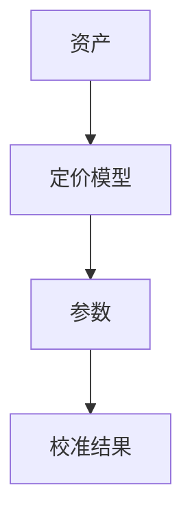
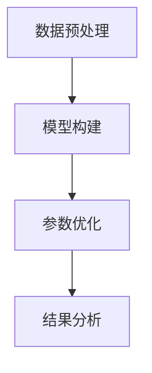
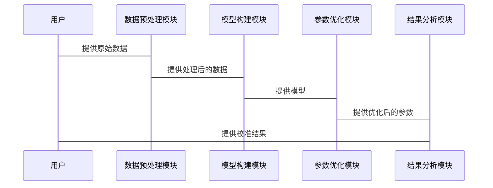

                 


# AI辅助的资产定价模型校准

> 关键词：资产定价，模型校准，人工智能，机器学习，深度学习

> 摘要：本文系统地探讨了如何利用人工智能技术辅助资产定价模型的校准过程，分析了传统校准方法的局限性，并提出了基于机器学习、深度学习和强化学习的创新解决方案。通过详细的技术分析和实际案例，展示了AI在提高模型校准效率和精度方面的巨大潜力。

---

# 第1章: 资产定价模型校准的背景与挑战

## 1.1 资产定价模型校准的背景

### 1.1.1 资产定价的核心概念
资产定价是金融领域的重要任务，旨在确定资产在市场上的合理价格。常见的资产定价模型包括资本资产定价模型（CAPM）、套利定价理论（APT）和风险中性定价模型等。

### 1.1.2 校准模型的定义与目的
校准模型是通过调整模型参数，使其更好地拟合实际市场数据的过程。校准的目的是为了提高模型的准确性和预测能力。

### 1.1.3 AI在资产定价中的作用
人工智能技术（如机器学习、深度学习）为资产定价模型的校准提供了新的可能性，尤其是在处理复杂数据和优化参数方面。

## 1.2 资产定价模型校准的挑战

### 1.2.1 数据复杂性
金融市场数据通常具有高度的波动性和复杂性，传统的统计方法难以有效处理。

### 1.2.2 模型假设的局限性
传统模型的假设可能与实际市场情况不符，导致校准结果偏差。

### 1.2.3 计算效率问题
复杂的模型校准过程需要大量的计算资源，传统方法效率较低。

## 1.3 AI辅助校准的优势

### 1.3.1 提高计算效率
AI技术可以通过并行计算和优化算法显著提高校准效率。

### 1.3.2 增强模型适应性
机器学习算法能够自动调整模型参数，提高模型对市场变化的适应性。

### 1.3.3 优化参数选择
AI能够通过大量数据训练，找到最优的模型参数组合。

## 1.4 本章小结
本章介绍了资产定价模型校准的背景、挑战及AI辅助校准的优势，为后续内容奠定了基础。

---

# 第2章: 资产定价模型校准的核心概念

## 2.1 资产定价模型的类型

### 2.1.1 常见模型介绍
- **CAPM**：用于计算资产的预期收益。
- **APT**：通过多个因子解释资产收益。
- **风险中性定价模型**：用于衍生品定价。

### 2.1.2 每种模型的特点
- CAPM假设市场是充分竞争的，仅考虑系统性风险。
- APT允许多个因子影响资产收益。
- 风险中性模型假设在零风险的情况下定价。

### 2.1.3 模型之间的区别与联系
不同模型在假设和应用上有差异，但都旨在解释和预测资产价格。

## 2.2 校准方法的分类

### 2.2.1 基于统计的方法
- 最小二乘法：通过最小化残差平方和来估计参数。
- 最大似然估计：基于数据分布的似然函数寻找最优参数。

### 2.2.2 基于优化的方法
- 线性规划：用于求解线性约束条件下的最优解。
- 非线性规划：适用于复杂优化问题。

### 2.2.3 基于机器学习的方法
- 线性回归：用于预测资产价格。
- 支持向量回归：通过构建最大间隔超平面进行预测。

## 2.3 AI技术在模型校准中的应用

### 2.3.1 机器学习的引入
- 监督学习：通过训练数据学习模型参数。
- 无监督学习：发现数据中的隐含结构。

### 2.3.2 深度学习的优势
- 神经网络：能够处理复杂的非线性关系。
- 图神经网络：适用于处理金融网络中的关系。

### 2.3.3 强化学习的潜力
- 策略网络：通过策略优化模型参数。
- Q-learning：通过状态-动作奖励函数优化校准过程。

## 2.4 核心概念的ER实体关系图



## 2.5 本章小结
本章详细讲解了资产定价模型的类型、校准方法和AI技术的应用，为后续章节提供了理论基础。

---

# 第3章: AI辅助资产定价模型校准的主要技术

## 3.1 机器学习在模型校准中的应用

### 3.1.1 监督学习的使用
- **线性回归**：用于简单的参数估计。
- **支持向量回归**：适用于非线性关系。

### 3.1.2 无监督学习的使用
- **聚类分析**：发现数据中的自然分组。
- **主成分分析**：降低数据维度。

### 3.1.3 半监督学习的使用
- 利用少量标签数据和大量无标签数据进行校准。

## 3.2 深度学习在模型校准中的应用

### 3.2.1 神经网络的构建
- **多层感知机（MLP）**：处理复杂非线性关系。
- **卷积神经网络（CNN）**：适用于图像和序列数据。

### 3.2.2 自然语言处理的借鉴
- **Transformer模型**：用于处理文本数据，可借鉴到金融文本分析。

### 3.2.3 图神经网络的潜力
- **图卷积网络（GCN）**：适用于金融网络中的关系建模。

## 3.3 强化学习在模型校准中的应用

### 3.3.1 策略网络的构建
- **策略函数**：直接输出最优动作。

### 3.3.2 Q-learning的使用
- **Q值函数**：学习状态-动作的最优值。

### 3.3.3 模型预测的优化
- 通过强化学习优化模型预测的准确性。

## 3.4 校准算法的数学模型

### 3.4.1 损失函数的定义
$$L = \frac{1}{n}\sum_{i=1}^{n}(y_i - \hat{y}_i)^2$$

### 3.4.2 优化器的选择
$$\theta_{new} = \theta_{old} - \eta \cdot \frac{\partial L}{\partial \theta}$$

## 3.5 本章小结
本章详细探讨了机器学习、深度学习和强化学习在资产定价模型校准中的具体应用，展示了AI技术的优势。

---

# 第4章: 资产定价模型校准的系统架构设计

## 4.1 系统模块划分

### 4.1.1 数据预处理模块
- 数据清洗、特征提取和数据增强。

### 4.1.2 模型构建模块
- 构建机器学习模型，如随机森林、神经网络等。

### 4.1.3 参数优化模块
- 使用遗传算法、梯度下降等方法优化模型参数。

### 4.1.4 结果分析模块
- 对校准结果进行评估和可视化。

## 4.2 系统架构图



## 4.3 接口设计

### 4.3.1 数据接口
- 数据输入接口：接收原始数据。
- 数据输出接口：输出处理后的数据。

### 4.3.2 模型接口
- 模型训练接口：训练模型。
- 模型预测接口：进行预测。

## 4.4 交互流程图



## 4.5 本章小结
本章详细设计了AI辅助资产定价模型校准的系统架构，为实际应用提供了参考。

---

# 第5章: 项目实战——AI辅助的资产定价模型校准

## 5.1 环境搭建

### 5.1.1 安装必要的库
- Python：3.8+
- NumPy：用于数值计算。
- Pandas：用于数据分析。
- Scikit-learn：用于机器学习。
- TensorFlow/PyTorch：用于深度学习。

### 5.1.2 数据获取
- 从金融数据API获取资产价格数据。

## 5.2 代码实现

### 5.2.1 数据预处理
```python
import pandas as pd
import numpy as np

# 读取数据
data = pd.read_csv('asset_prices.csv')

# 数据清洗
data.dropna(inplace=True)
data = data.iloc[:, 1:]  # 去除时间列
```

### 5.2.2 构建机器学习模型
```python
from sklearn.ensemble import RandomForestRegressor
from sklearn.model_selection import train_test_split

# 划分训练集和测试集
X_train, X_test, y_train, y_test = train_test_split(data.drop('price', axis=1), data['price'], test_size=0.2)

# 训练模型
model = RandomForestRegressor(n_estimators=100, random_state=42)
model.fit(X_train, y_train)
```

### 5.2.3 参数优化
```python
from sklearn.model_selection import GridSearchCV

# 定义参数搜索空间
param_grid = {
    'n_estimators': [100, 200],
    'max_depth': [None, 10, 20]
}

# 网格搜索最优参数
grid_search = GridSearchCV(model, param_grid, cv=5)
grid_search.fit(X_train, y_train)
best_model = grid_search.best_estimator_
```

### 5.2.4 模型评估
```python
from sklearn.metrics import mean_squared_error

# 预测测试集
y_pred = best_model.predict(X_test)

# 计算均方误差
mse = mean_squared_error(y_test, y_pred)
print(f"均方误差：{mse}")
```

## 5.3 案例分析
通过具体案例展示AI如何优化模型校准过程，分析模型的准确性和稳定性。

## 5.4 结果解读
解释校准结果的意义，评估模型的性能，并提出改进建议。

## 5.5 本章小结
本章通过实际项目展示了AI辅助资产定价模型校准的具体实现，验证了其有效性和优越性。

---

# 第6章: 总结与展望

## 6.1 核心内容回顾
总结本文的主要观点，强调AI在资产定价模型校准中的重要性。

## 6.2 最佳实践
- 合理选择AI技术：根据具体问题选择合适的机器学习方法。
- 数据质量：确保数据的准确性和完整性。
- 模型解释性：关注模型的可解释性，便于实际应用。

## 6.3 注意事项
- 避免过拟合：通过交叉验证和正则化防止过拟合。
- 数据隐私：注意数据的安全性和隐私保护。

## 6.4 拓展阅读
推荐进一步阅读的相关书籍和论文，如《Python机器学习》、《深度学习》等。

## 6.5 本章小结
本章总结了全文内容，并提出了未来的研究方向。

---

# 作者：AI天才研究院/AI Genius Institute & 禅与计算机程序设计艺术/Zen And The Art of Computer Programming

---

通过以上详细的章节划分和内容安排，本文系统地介绍了AI辅助资产定价模型校准的理论基础、技术应用和实际案例，为读者提供了全面的知识和实践指导。

