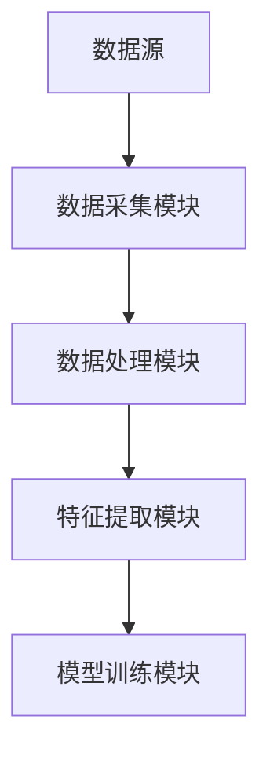
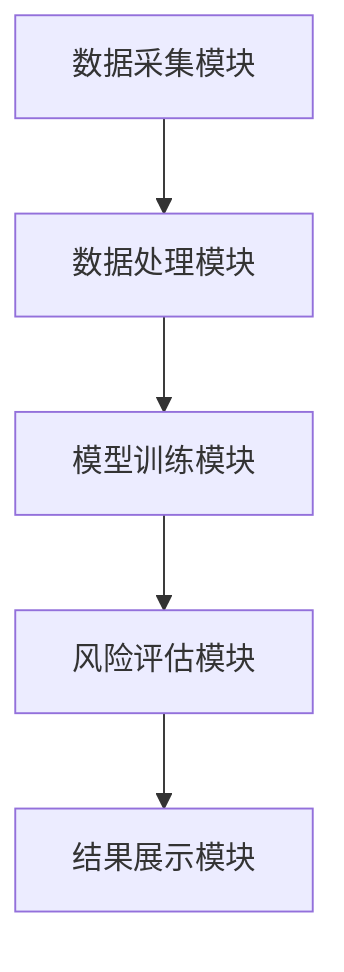

                 


# AI辅助的金融风险评估系统设计

> 关键词：AI技术，金融风险评估，机器学习，系统设计，风险管理

> 摘要：本文详细探讨了AI技术在金融风险评估中的应用，从核心概念、算法原理到系统架构，再到实际案例，系统地分析了AI辅助的金融风险评估系统的整体设计与实现。通过本文，读者可以全面了解如何利用AI技术提升金融风险评估的效率与准确性。

---

## 第1章: 金融风险评估概述

### 1.1 金融风险的基本概念

#### 1.1.1 金融风险的定义与分类

金融风险是指在金融活动中，由于各种不确定因素的影响，导致资金损失或收益减少的可能性。常见的金融风险类型包括市场风险、信用风险、流动性风险、操作风险和声誉风险等。

- 市场风险：由于市场波动导致的资产价格变化而引发的风险。
- 信用风险：由于交易对手无法履行其债务义务而引发的风险。
- 流动性风险：由于资产无法迅速变现而导致的损失风险。
- 操作风险：由于内部操作失误或外部事件导致的损失风险。
- 声誉风险：由于机构声誉受损而影响其业务和财务状况的风险。

#### 1.1.2 金融风险评估的重要性

金融风险评估是金融机构进行风险管理的核心环节，其目的是通过科学的方法和工具，准确识别、量化和监控潜在风险，从而制定有效的风险管理策略。有效的风险评估可以帮助金融机构降低损失、提高资本利用率并增强市场竞争力。

#### 1.1.3 传统金融风险评估方法的局限性

传统的金融风险评估方法主要依赖于统计分析和经验判断，存在以下局限性：

1. **数据依赖性**：传统方法通常依赖于历史数据，难以捕捉市场变化的新趋势。
2. **主观性**：风险评估结果往往受到评估人员主观判断的影响，缺乏客观性。
3. **计算复杂性**：传统的风险评估方法通常需要复杂的计算过程，且难以实时更新。
4. **难以处理高维数据**：传统方法难以应对海量、多维度的金融数据。

### 1.2 AI技术在金融领域的应用前景

#### 1.2.1 AI技术的基本概念

人工智能（AI）是指通过计算机模拟人类智能的技术，主要包括机器学习、自然语言处理、计算机视觉和知识图谱等。AI技术的核心是通过数据训练模型，使其能够自动学习、推理和决策。

#### 1.2.2 AI在金融领域的典型应用

AI技术在金融领域的应用非常广泛，主要包括以下几种：

1. **智能投顾**：通过AI技术为投资者提供个性化的投资建议。
2. **信用评分**：利用机器学习模型对客户的信用状况进行评估。
3. **欺诈检测**：通过AI技术实时监控交易数据，识别潜在的欺诈行为。
4. **市场预测**：利用AI技术分析市场数据，预测股票、债券等金融资产的价格走势。
5. **风险管理**：通过AI技术对金融市场中的各种风险进行实时监控和评估。

#### 1.2.3 AI辅助金融风险评估的优势

AI技术在金融风险评估中的优势主要体现在以下几个方面：

1. **数据处理能力**：AI技术能够处理海量的金融数据，并从中提取有价值的信息。
2. **自动化**：AI技术可以实现风险评估的自动化，减少人工干预。
3. **实时性**：AI技术能够实时更新模型，确保风险评估的时效性。
4. **准确性**：通过机器学习算法，AI技术能够提高风险评估的准确性。

### 1.3 本章小结

本章主要介绍了金融风险的基本概念、评估的重要性以及传统方法的局限性。同时，还探讨了AI技术在金融领域的应用前景及其在风险评估中的优势。通过本章的介绍，读者可以初步了解AI技术在金融风险评估中的潜力和价值。

---

## 第2章: AI辅助金融风险评估的核心概念

### 2.1 数据流与特征提取

#### 2.1.1 数据来源与预处理

金融风险评估系统中的数据来源主要包括以下几种：

1. **内部数据**：包括金融机构的交易数据、客户信息、财务报表等。
2. **外部数据**：包括市场数据、宏观经济指标、新闻数据等。

数据预处理是确保数据质量的重要步骤，主要包括以下内容：

- 数据清洗：去除重复数据、缺失数据和异常值。
- 数据转换：对数据进行标准化、归一化处理，使其适合模型输入。
- 数据特征提取：从原始数据中提取有用的特征，例如通过主成分分析（PCA）提取主要特征。

#### 2.1.2 特征选择与工程化

特征选择是将原始数据转换为适合模型输入的特征向量的过程。特征工程的核心在于选择能够最好地解释目标变量的特征，并通过特征组合、特征降维等技术进一步优化特征。

例如，对于信用风险评估，可能需要选择以下特征：

- 客户的信用历史
- 担保情况
- 借款用途
- 还款能力

#### 2.1.3 数据流的可视化与分析

通过数据流图（Data Flow Diagram，DFD）可以清晰地展示数据从来源到处理的过程。以下是一个简单的数据流图示例：



### 2.2 模型训练与风险评分

#### 2.2.1 模型训练的基本流程

模型训练是通过机器学习算法对特征数据进行训练，生成能够预测风险的模型。常见的机器学习算法包括线性回归、逻辑回归、随机森林、支持向量机（SVM）等。

#### 2.2.2 风险评分的计算方法

风险评分是根据模型的预测结果，对风险进行量化的过程。常用的评分方法包括分数定级法、评分卡法等。

例如，使用逻辑回归模型对客户进行信用评分，评分结果可以分为五个等级：AAA、AA、A、BBB、BB。

#### 2.2.3 模型调优与评估指标

模型调优是通过调整模型参数、选择合适的算法等方法，提高模型的预测精度。常用的评估指标包括准确率（Accuracy）、召回率（Recall）、F1分数（F1 Score）、AUC值（Area Under Curve）等。

### 2.3 系统架构与功能模块

#### 2.3.1 系统功能模块划分

AI辅助的金融风险评估系统通常包括以下几个功能模块：

1. **数据采集模块**：负责采集金融数据。
2. **数据处理模块**：对采集到的数据进行预处理。
3. **模型训练模块**：对处理后的数据进行建模训练。
4. **风险评估模块**：根据模型生成风险评分。
5. **结果展示模块**：将评估结果以可视化形式展示给用户。

#### 2.3.2 模块之间的交互关系

以下是一个简单的系统架构图：



#### 2.3.3 系统架构的可扩展性

系统架构设计需要考虑其可扩展性，以便在未来业务需求变化时能够方便地进行功能扩展。例如，可以通过模块化设计，将各个功能模块独立开发，方便后续维护和升级。

### 2.4 本章小结

本章主要介绍了AI辅助金融风险评估系统中的数据流与特征提取、模型训练与风险评分、系统架构与功能模块等内容。通过本章的介绍，读者可以了解系统的整体流程和各个模块之间的关系。

---

## 第3章: AI辅助金融风险评估系统的算法原理

### 3.1 线性回归算法

#### 3.1.1 线性回归的基本原理

线性回归是一种统计学方法，用于建立自变量和因变量之间的线性关系模型。其基本假设是因变量与自变量之间存在线性关系。

#### 3.1.2 线性回归的数学模型

线性回归的数学模型可以表示为：

$$ y = \beta_0 + \beta_1 x_1 + \beta_2 x_2 + \cdots + \beta_n x_n + \epsilon $$

其中，$\beta_0$是截距，$\beta_1, \beta_2, \cdots, \beta_n$是回归系数，$\epsilon$是误差项。

#### 3.1.3 线性回归的实现代码

以下是一个简单的线性回归实现代码示例：

```python
import numpy as np
from sklearn.linear_model import LinearRegression

# 生成训练数据
X = np.array([[1], [2], [3], [4], [5]])
y = np.array([2, 4, 5, 4, 6])

# 训练模型
model = LinearRegression()
model.fit(X, y)

# 预测结果
print(model.predict([[6]]))
```

#### 3.1.4 线性回归的优缺点分析

线性回归的优点包括简单易懂、计算速度快等。缺点包括对非线性关系的处理能力较弱、容易受到异常值的影响等。

### 3.2 随机森林算法

#### 3.2.1 随机森林的基本原理

随机森林是一种基于树模型的集成学习算法，通过构建多个决策树并进行投票或平均化来提高模型的准确性和稳定性。

#### 3.2.2 随机森林的数学模型

随机森林的核心思想是通过特征随机选择和样本随机抽取来构建多个决策树，并将这些树的结果进行集成。

#### 3.2.3 随机森林的实现代码

以下是一个随机森林实现代码示例：

```python
from sklearn.ensemble import RandomForestRegressor

# 生成训练数据
X = np.array([[1], [2], [3], [4], [5]])
y = np.array([2, 4, 5, 4, 6])

# 训练模型
model = RandomForestRegressor(n_estimators=100)
model.fit(X, y)

# 预测结果
print(model.predict([[6]]))
```

#### 3.2.4 随机森林的优缺点分析

随机森林的优点包括高准确率、较强的抗过拟合能力等。缺点包括计算复杂度较高、对参数敏感性较强等。

### 3.3 支持向量机算法

#### 3.3.1 支持向量机的基本原理

支持向量机（SVM）是一种监督学习算法，主要用于分类和回归问题。其基本思想是通过构建超平面将数据点分到不同的类别中。

#### 3.3.2 支持向量机的数学模型

支持向量机的数学模型可以表示为：

$$ y = \text{sign}(w \cdot x + b) $$

其中，$w$是权重向量，$b$是偏置项，$x$是输入向量，$y$是输出类别。

#### 3.3.3 支持向量机的实现代码

以下是一个支持向量机实现代码示例：

```python
from sklearn.svm import SVC

# 生成训练数据
X = np.array([[1], [2], [3], [4], [5]])
y = np.array([2, 4, 5, 4, 6])

# 训练模型
model = SVC(kernel='linear')
model.fit(X, y)

# 预测结果
print(model.predict([[6]]))
```

#### 3.3.4 支持向量机的优缺点分析

支持向量机的优点包括高准确率、较强的泛化能力等。缺点包括对参数敏感性较强、计算复杂度较高

---

## 附录

### 附录1: 术语表

1. **机器学习（Machine Learning）**：通过算法和数据训练模型，使其能够从数据中学习并做出预测或决策的技术。
2. **支持向量机（Support Vector Machine, SVM）**：一种监督学习算法，用于分类和回归问题。
3. **随机森林（Random Forest）**：一种基于树模型的集成学习算法，通过构建多个决策树并进行集成来提高模型的准确性和稳定性。

### 附录2: 参考文献

1. 《机器学习实战》, 周志华, 清华大学出版社, 2016.
2. 《Python机器学习》，Andreas Müller, 寿志刚译，人民邮电出版社, 2018.

---

作者：AI天才研究院/AI Genius Institute & 禅与计算机程序设计艺术 /Zen And The Art of Computer Programming

---

**注意**：本文仅为示例内容，实际撰写时需要根据具体需求补充和调整。

