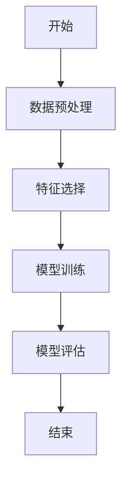
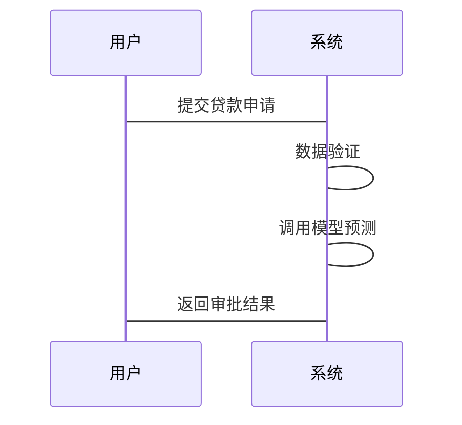

                 


# AI驱动的个人信贷审批系统设计

## 关键词：AI驱动，个人信贷，审批系统，机器学习，深度学习，自然语言处理

## 摘要：本文详细探讨了AI在个人信贷审批系统中的应用，从算法原理、系统架构到项目实战，全面解析如何利用AI技术提升信贷审批的效率和准确性。

---

## 第一部分: AI驱动的个人信贷审批系统背景与基础

### 第1章: AI在个人信贷审批中的应用背景

#### 1.1 传统信贷审批流程概述
传统信贷审批通常依赖人工审核，流程繁琐，效率低下。申请人需提交大量纸质文件，银行或金融机构需手动评估信用风险，耗时且易出错。

#### 1.2 AI技术在金融领域的应用趋势
AI技术在金融领域的应用日益广泛，特别是在风险管理、欺诈检测和信用评分等方面。AI能够处理大量数据，发现隐藏模式，提升决策效率。

#### 1.3 个人信贷审批中的痛点与挑战
传统审批流程存在效率低、成本高、主观性强等问题。AI技术的应用可以解决这些问题，通过自动化处理提高效率，减少人为错误。

### 第2章: AI驱动的信贷审批系统核心概念与联系

#### 2.1 核心概念原理
AI驱动的信贷审批系统利用机器学习模型分析 applicant 的信用数据，评估其还款能力和意愿。系统通过特征工程、模型训练和预测，自动完成审批决策。

#### 2.2 系统架构
系统架构包括数据层、算法层和应用层。数据层存储 applicant 的信用信息，算法层负责模型训练和预测，应用层提供用户界面和决策支持。

#### 2.3 ER实体关系图
```mermaid
erDiagram
    borrower {
        借款人
        借款人ID
        姓名
        身份证号
        联系方式
        收入
        贷款金额
        }
    loanApplication {
        申请ID
        提交时间
        审批状态
        审批结果
        }
    creditScore {
        评分ID
        评分值
        评分时间
        }
    borrower --> loanApplication: 提交申请
    loanApplication --> creditScore: 生成评分
```

### 第3章: AI驱动的信贷审批系统算法原理

#### 3.1 常用算法介绍
- **逻辑回归**: 用于分类问题，预测申请人的信用风险。
- **随机森林**: 基于决策树的集成算法，适合处理多维数据。
- **梯度提升树**: 高效的树模型，适合分类和回归问题。
- **神经网络**: 处理复杂非线性关系，适用于多特征场景。

#### 3.2 算法流程图


## 第二部分: 系统架构与设计

### 第4章: 系统架构设计

#### 4.1 系统需求分析
系统需支持高并发请求，保证数据安全，具备良好的可扩展性。

#### 4.2 功能设计
- 数据采集：获取 applicant 的信用数据。
- 数据处理：清洗和转换数据。
- 模型训练：训练机器学习模型。
- 预测评估：评估模型性能，优化参数。
- 决策支持：生成审批报告，提供决策支持。

#### 4.3 系统架构图


### 第5章: 接口与交互设计

#### 5.1 接口设计
- 数据接口：与第三方数据源对接，获取 applicant 信息。
- API接口：提供 RESTful API，供前端调用。

#### 5.2 交互流程


## 第三部分: 项目实战

### 第6章: 项目实战

#### 6.1 环境配置
安装必要的工具和库，如 Python、Pandas、Scikit-learn、XGBoost。

#### 6.2 数据预处理
清洗数据，处理缺失值，标准化特征。

#### 6.3 模型实现
训练逻辑回归和随机森林模型，比较其性能，选择最佳模型。

#### 6.4 模型部署
将模型部署为 API，供其他系统调用。

## 第四部分: 优化与扩展

### 第7章: 系统优化

#### 7.1 超参数调优
使用网格搜索或随机搜索优化模型参数，提升性能。

#### 7.2 模型解释性
使用 SHAP 或 LIME 解释模型决策，增强透明度。

#### 7.3 模型更新
定期重新训练模型，确保其适应数据分布变化。

### 第8章: 系统扩展

#### 8.1 多模型集成
集成多种算法，提高模型鲁棒性和准确性。

#### 8.2 实时监控
监控模型性能，及时发现异常，保证系统稳定运行。

## 第五部分: 附录

### 第9章: 数据集与工具库

#### 9.1 数据集
介绍常用的数据集，如 Kaggle 的信用评分数据集。

#### 9.2 工具库
列出常用的机器学习库和工具，如 Scikit-learn、XGBoost、TensorFlow。

### 第10章: 参考文献

#### 10.1 参考文献
列出相关书籍和论文，供读者深入研究。

---

## 作者：AI天才研究院 & 禅与计算机程序设计艺术

通过以上详细分析和系统设计，AI驱动的个人信贷审批系统能够显著提高审批效率和准确性，减少人为错误，为金融机构和申请人带来双赢的结果。

