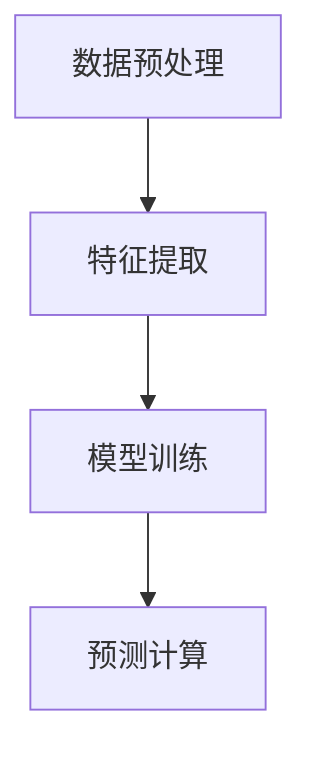
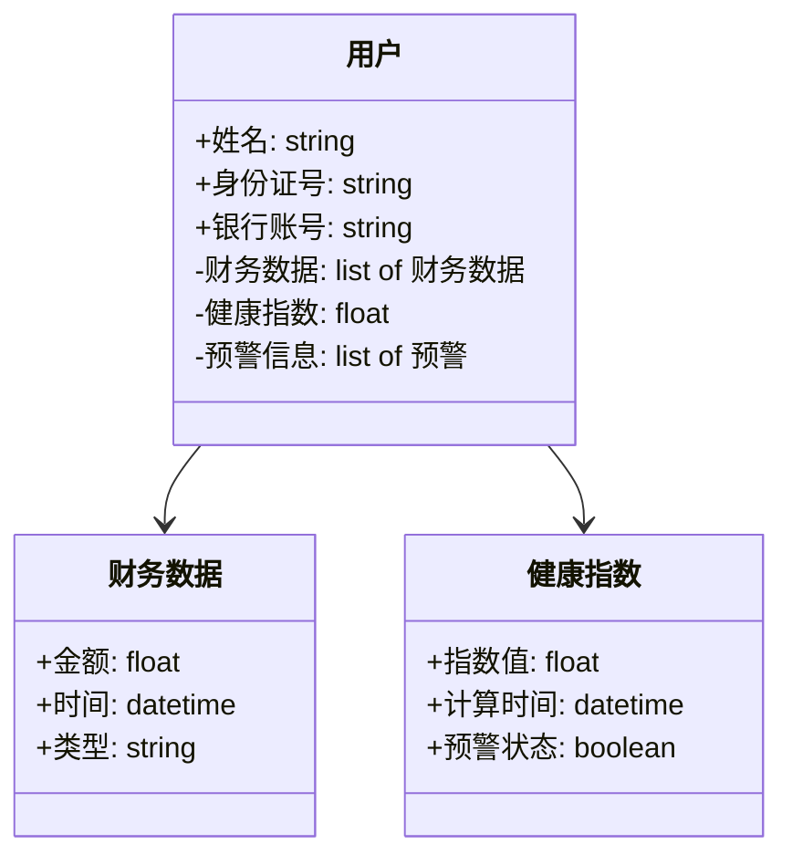
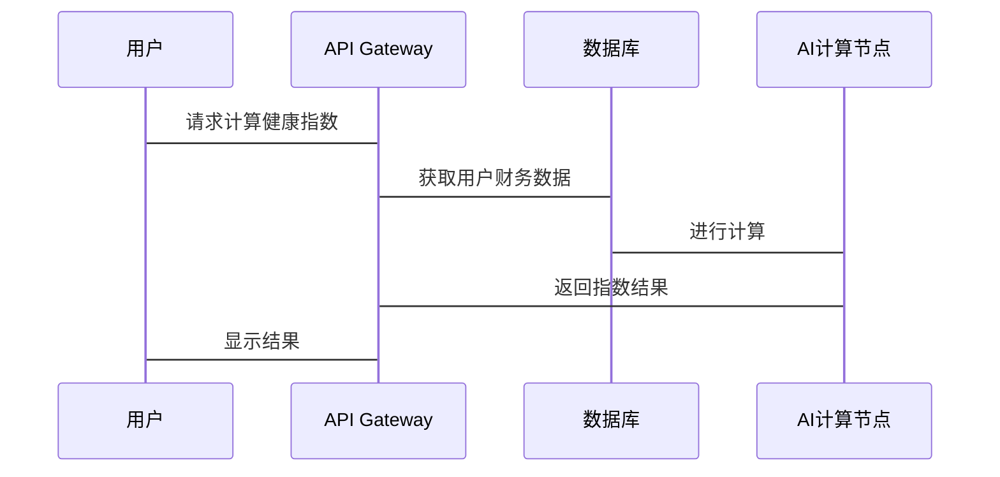

                 


# AI驱动的个人财务健康指数计算与监控系统

## 关键词：
AI驱动，个人财务健康指数，机器学习，实时监控，财务数据

## 摘要：
本文探讨了如何利用AI技术计算和监控个人财务健康指数，通过数据分析和机器学习算法，构建实时、动态的监控系统，帮助个人有效管理财务状况。

---

# 第1章: 个人财务健康指数的背景与意义

## 1.1 问题背景
### 1.1.1 个人财务管理的重要性
个人财务管理是维持经济稳定的关键，涉及支出、收入、资产和负债的管理。

### 1.1.2 传统财务管理的局限性
传统方法依赖手动记录和分析，耗时且难以实时更新，难以应对复杂金融环境。

### 1.1.3 AI技术在财务管理中的应用潜力
AI技术能处理复杂数据，提供精准预测，优化决策。

## 1.2 问题描述
### 1.2.1 财务健康指数的定义
衡量个人财务状况的综合性指标，反映收支平衡、资产结构和负债情况。

### 1.2.2 财务健康指数的计算维度
包括收入支出比、资产负债比、消费习惯等多维度。

### 1.2.3 系统监控的需求与目标
实时监控财务健康指数，及时预警潜在风险。

## 1.3 问题解决
### 1.3.1 AI驱动的解决方案
利用机器学习模型自动分析和预测财务状况。

### 1.3.2 数据驱动的健康指数计算方法
结合历史和实时数据，建立动态评估模型。

### 1.3.3 实时监控与预警机制
通过AI算法实时更新指数，设置阈值触发预警。

## 1.4 边界与外延
### 1.4.1 系统的边界
定义系统功能范围，明确与其他系统的交互。

### 1.4.2 系统的外延功能
包括数据收集、指数计算、预警通知等。

### 1.4.3 系统与其他模块的交互
与银行、支付平台等外部系统接口集成，获取实时数据。

## 1.5 概念结构与核心要素
### 1.5.1 核心概念的组成
用户、财务数据、健康指数、监控系统等。

### 1.5.2 各要素之间的关系
用户授权系统收集数据，系统计算指数并提供反馈。

### 1.5.3 系统的整体架构
数据层、计算层和应用层构成系统整体结构。

---

# 第2章: 核心概念与联系

## 2.1 AI驱动的个人财务健康指数
### 2.1.1 定义与属性
健康指数是AI算法计算的综合指标，反映个人财务状况。

### 2.1.2 核心特征对比
通过表格展示健康指数与其他财务指标的差异。

### 2.1.3 实例分析
以某用户为例，计算其健康指数并解读结果。

## 2.2 实体关系图
```mermaid
er
actor: 用户
actor: 系统
actor: 数据源
```

---

# 第3章: 算法原理与实现

## 3.1 算法选择与原理
### 3.1.1 线性回归模型
用于预测指数变化趋势。

### 3.1.2 随机森林模型
处理多维数据，提升预测准确性。

### 3.1.3 深度学习模型
用于复杂模式识别。

## 3.2 算法流程图


## 3.3 算法实现
### 3.3.1 数据预处理
处理缺失值和异常值，标准化数据。

### 3.3.2 特征提取
选择关键财务指标作为特征。

### 3.3.3 模型训练
使用训练数据拟合模型，评估性能。

### 3.3.4 模型预测
计算健康指数，生成预警信息。

## 3.4 数学模型
### 3.4.1 线性回归模型
$$y = \beta_0 + \beta_1x + \epsilon$$

### 3.4.2 随机森林模型
集成多个决策树的预测结果，提升准确性和鲁棒性。

## 3.5 代码实现
```python
import pandas as pd
from sklearn.ensemble import RandomForestRegressor

# 数据预处理
data = pd.read_csv('financial_data.csv')
data = data.dropna()

# 特征提取
features = data[['income', 'expenses', 'assets', ' liabilities']]
target = data['health_index']

# 模型训练
model = RandomForestRegressor(n_estimators=100)
model.fit(features, target)

# 预测
new_data = pd.DataFrame({
    'income': [50000],
    'expenses': [30000],
    'assets': [100000],
    'liabilities': [50000]
})
predicted_index = model.predict(new_data)
print(predicted_index)
```

---

# 第4章: 系统分析与架构设计方案

## 4.1 问题场景介绍
用户授权系统收集财务数据，实时计算健康指数并提供预警。

## 4.2 系统功能设计
### 4.2.1 领域模型类图


### 4.2.2 系统架构图
```mermaid
archi
client --> API Gateway
API Gateway --> 数据库
API Gateway --> AI计算节点
AI计算节点 --> 监控模块
监控模块 --> 用户通知
```

## 4.3 系统接口设计
定义API接口，如数据上传、指数查询、预警通知等。

## 4.4 系统交互序列图


---

# 第5章: 项目实战

## 5.1 环境安装
### 5.1.1 安装Python和必要的库
安装`pandas`、`scikit-learn`、`mermaid`等库。

## 5.2 核心代码实现
### 5.2.1 数据预处理代码
```python
import pandas as pd

data = pd.read_csv('financial_data.csv')
data = data.dropna()
```

### 5.2.2 模型训练代码
```python
from sklearn.ensemble import RandomForestRegressor

model = RandomForestRegressor(n_estimators=100)
model.fit(features, target)
```

### 5.2.3 预测与预警
计算健康指数，若低于阈值，触发预警通知。

## 5.3 案例分析
以用户数据为例，展示系统如何计算和预警。

---

# 第6章: 最佳实践

## 6.1 小结
总结AI在个人财务管理中的应用价值和优势。

## 6.2 注意事项
确保数据隐私和安全，定期更新模型。

## 6.3 拓展阅读
推荐相关书籍和资源，深入学习AI在金融领域的应用。

---

# 作者
作者：AI天才研究院

