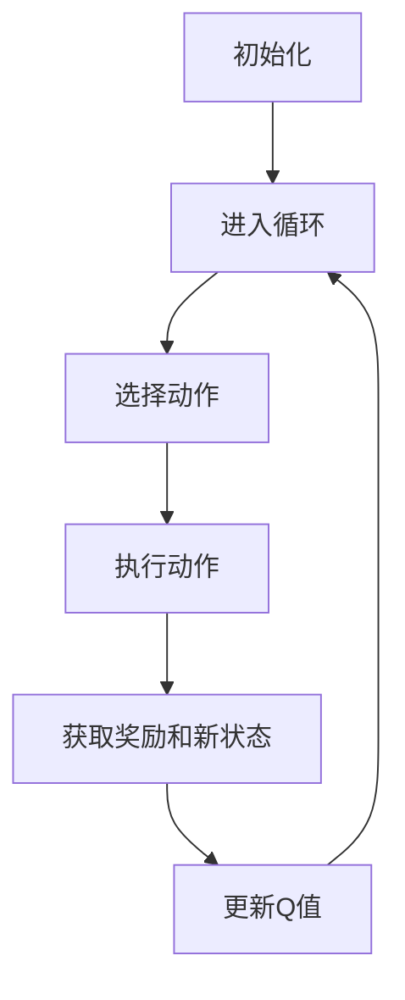

                 


# AI驱动的个人财务目标追踪与调整系统

## 关键词：AI, 个人财务, 财务目标, 自动化调整, 强化学习

## 摘要：本文详细探讨了如何利用人工智能技术构建个人财务目标追踪与调整系统。通过分析财务数据、用户行为和市场变化，结合强化学习算法，系统能够实时优化财务策略，帮助用户实现财务目标。文章从背景介绍、核心概念、算法原理、系统架构到项目实战，全面阐述了该系统的实现过程和应用场景。

---

# 第一部分: 背景介绍

## 第1章: 问题背景

### 1.1 个人财务管理的重要性

个人财务管理是每个人都需要面对的重要课题。有效的财务管理能够帮助个人实现财务目标、规避风险、优化资产配置，并在面对市场变化时做出及时调整。然而，传统的财务管理方式往往依赖人工记录和分析，效率低下且容易出错。

### 1.2 传统财务管理的局限性

传统财务管理方法存在以下问题：

- 数据分散：财务数据可能分布在不同的账户和平台中，难以统一管理。
- 数据量大：现代人每天会产生大量的财务数据，手动分析耗时耗力。
- 缺乏实时性：市场变化和用户行为是动态的，传统方法难以实时调整财务策略。
- 个性化不足：每个人的财务目标和风险承受能力不同，通用的财务管理方法难以满足个性化需求。

### 1.3 AI技术在财务管理中的潜力

人工智能技术的快速发展为个人财务管理带来了新的可能性。AI能够通过机器学习算法对海量数据进行分析，发现数据中的规律和趋势，并根据用户的具体情况提供个性化的建议。此外，AI还可以实时监控市场变化和用户行为，帮助用户做出及时的财务调整。

---

## 第2章: 问题描述

### 2.1 财务目标设定的复杂性

财务目标的设定需要考虑多个因素，包括收入、支出、资产配置、风险偏好等。不同的人有不同的财务目标，如何根据个体情况动态调整目标是一个复杂的问题。

### 2.2 财务数据的实时性和多样性

现代财务管理需要处理的数据不仅包括传统的财务数据（如收入、支出、账户余额等），还包括社交媒体数据、市场数据等。这些数据的实时性和多样性增加了财务管理的复杂性。

### 2.3 用户行为与市场变化的动态性

用户的财务行为和市场变化是动态的。用户的消费习惯可能因时间、环境等因素而变化，而市场变化（如股市波动、通货膨胀等）也会对个人财务目标产生影响。如何实时跟踪和调整财务策略是AI系统需要解决的关键问题。

---

## 第3章: 问题解决思路

### 3.1 数据驱动的财务分析

通过收集和分析用户的财务数据，AI系统可以识别用户的消费习惯、资产配置情况以及潜在的财务风险。基于这些分析结果，系统可以为用户提供个性化的财务建议。

### 3.2 AI算法在财务预测中的应用

AI算法（如机器学习、强化学习）可以用于预测市场变化、评估投资风险、优化资产配置等。通过这些预测结果，系统可以为用户提供更精准的财务建议。

### 3.3 个性化财务目标调整策略

根据用户的财务状况和市场变化，AI系统可以动态调整用户的财务目标。例如，当市场出现剧烈波动时，系统可以根据用户的承受能力和风险偏好调整投资比例。

---

## 第4章: 边界与外延

### 4.1 系统功能边界

- 数据采集与处理
- 财务数据分析与预测
- 个性化财务目标设定与调整
- 系统监控与反馈

### 4.2 与现有财务工具的区分

- 传统财务管理工具主要依赖人工操作，而AI系统能够实现自动化和智能化。
- 现有工具通常不具备动态调整功能，而AI系统可以根据实时数据和用户行为进行实时调整。

### 4.3 系统可扩展性与适应性

- 系统可以根据用户需求进行扩展，支持更多类型的财务数据和目标。
- 系统可以根据市场变化和用户行为动态调整算法模型，提高适应性。

---

## 第5章: 概念结构与核心要素

### 5.1 核心概念的定义

- 数据采集：从各种来源收集用户的财务数据，包括银行账户、消费记录、投资记录等。
- 数据分析：通过机器学习算法对数据进行分析，识别潜在的模式和趋势。
- 财务预测：基于历史数据和市场变化，预测未来的财务状况。
- 目标调整：根据用户的财务目标和预测结果，动态调整财务策略。

### 5.2 概念之间的关系

- 数据采集是数据分析的基础，数据分析为财务预测提供依据，财务预测为目标调整提供支持。
- 目标调整的结果可以反馈到数据采集和分析过程中，进一步优化系统的预测能力。

### 5.3 系统架构的核心要素

- 数据层：包括数据采集、数据存储和数据处理。
- 计算层：包括算法实现、模型训练和预测计算。
- 展示层：包括用户界面、结果展示和用户交互。

---

# 第二部分: 核心概念与联系

## 第6章: 核心概念与联系

### 6.1 AI在个人财务管理中的应用

#### 6.1.1 数据采集与处理

AI系统需要从多种来源采集用户的财务数据，包括银行账户、信用卡记录、投资账户等。数据采集可以通过API接口、文件导入或手动输入等方式完成。采集的数据需要进行清洗、转换和标准化处理，以便后续分析。

#### 6.1.2 财务数据分析与预测

通过机器学习算法（如随机森林、支持向量机、神经网络等），AI系统可以对用户的财务数据进行分析，识别潜在的模式和趋势。例如，系统可以通过分析用户的消费记录，识别用户的消费习惯和潜在的浪费点。

#### 6.1.3 个性化财务目标设定与调整

根据用户的财务状况、风险偏好和市场变化，AI系统可以为用户设定个性化的财务目标，并根据实时数据动态调整这些目标。例如，当市场出现剧烈波动时，系统可以根据用户的承受能力和风险偏好调整投资比例。

---

### 6.2 核心概念对比

#### 6.2.1 传统AI与强化学习的对比

| 对比维度 | 传统AI | 强化学习 |
|----------|--------|----------|
| 数据来源 | 静态数据 | 动态数据 |
| 模型训练 | 监督学习 | 增量学习 |
| 应用场景 | 预测与分类 | 优化与决策 |

#### 6.2.2 不同AI算法在财务管理中的应用对比

| 算法类型 | 应用场景 |
|----------|----------|
| 监督学习 | 财务预测、分类 |
| 非监督学习 | 聚类、异常检测 |
| 强化学习 | 动态优化、策略调整 |

#### 6.2.3 数据驱动与规则驱动的对比

| 对比维度 | 数据驱动 | 规则驱动 |
|----------|----------|----------|
| 数据需求 | 高 | 低 |
| 灵活性 | 高 | 低 |
| 适应性 | 高 | 低 |

---

### 6.3 ER实体关系图

```mermaid
erDiagram
    user {
        id
        name
        email
        phone
    }
    financial_data {
        id
        date
        income
        expense
        balance
        category
    }
    target {
        id
        name
        value
        deadline
        status
    }
    transaction {
        id
        amount
        description
        date
        type
    }
    model {
        id
        name
        parameters
        performance
    }
    user --|> financial_data : has
    user --|> target : has
    financial_data --|> transaction : includes
    financial_data --|> model : uses
```

---

## 第7章: 算法原理

### 7.1 强化学习算法原理

#### 7.1.1 算法选择

在本系统中，我们选择强化学习中的Q-learning算法。该算法适用于动态环境下的决策问题，能够根据当前状态和动作的反馈不断优化策略。

#### 7.1.2 算法步骤

1. 初始化：定义状态空间、动作空间和奖励函数。
2. 探索与利用：通过ε-greedy策略平衡探索和利用。
3. 动作选择：根据当前状态选择动作。
4. 执行动作：执行动作并观察下一个状态和奖励。
5. 更新Q值：根据奖励更新Q值表。

#### 7.1.3 算法实现



#### 7.1.4 数学模型

Q-learning算法的数学模型如下：

$$ Q(s, a) \leftarrow Q(s, a) + \alpha \left[ r + \gamma \max Q(s', a') - Q(s, a) \right] $$

其中：
- \( Q(s, a) \) 表示状态 \( s \) 下动作 \( a \) 的价值。
- \( \alpha \) 是学习率。
- \( r \) 是奖励。
- \( \gamma \) 是折扣因子。
- \( Q(s', a') \) 是新状态 \( s' \) 下动作 \( a' \) 的价值。

---

## 第8章: 系统分析与架构设计

### 8.1 系统功能设计

#### 8.1.1 数据采集模块

- 数据来源：银行账户、信用卡记录、投资账户等。
- 数据处理：数据清洗、转换、标准化。

#### 8.1.2 数据分析模块

- 数据分析：使用机器学习算法对数据进行分析，识别潜在的模式和趋势。
- 财务预测：基于历史数据和市场变化，预测未来的财务状况。

#### 8.1.3 目标调整模块

- 目标设定：根据用户的财务状况和风险偏好，设定个性化的财务目标。
- 动态调整：根据实时数据和市场变化，动态调整财务目标。

---

### 8.2 系统架构设计

```mermaid
graph LR
    User --> Frontend : 用户请求
    Frontend --> Backend : 传递请求
    Backend --> Database : 查询数据
    Backend --> AI_Engine : 调用算法
    AI_Engine --> Database : 更新模型
    Backend <-- Database : 返回数据
    Frontend <-- Backend : 返回结果
```

---

## 第9章: 项目实战

### 9.1 环境安装

#### 9.1.1 安装Python

```bash
python --version
pip install --upgrade pip
```

#### 9.1.2 安装依赖库

```bash
pip install numpy pandas scikit-learn tensorflow
```

---

### 9.2 核心功能实现

#### 9.2.1 数据预处理

```python
import pandas as pd
import numpy as np

# 读取数据
data = pd.read_csv('financial_data.csv')

# 数据清洗
data.dropna()
data.drop_duplicates()

# 数据标准化
from sklearn.preprocessing import StandardScaler
scaler = StandardScaler()
scaled_data = scaler.fit_transform(data)
```

#### 9.2.2 模型训练

```python
from sklearn.neural networks import MLPClassifier

# 训练模型
model = MLPClassifier(hidden_layer_sizes=(100, 50), max_iter=1000)
model.fit(scaled_data, target_labels)
```

---

### 9.3 系统实现与优化

#### 9.3.1 实现目标调整

```python
def adjust_target(current_balance, target_balance, market_condition):
    if current_balance < target_balance:
        return 'Increase investment'
    elif market_condition == 'bad':
        return 'Reduce risk'
    else:
        return 'Maintain current strategy'
```

---

## 第10章: 最佳实践与小结

### 10.1 最佳实践

- 数据质量：确保数据的准确性和完整性。
- 模型选择：根据具体场景选择合适的算法。
- 系统监控：实时监控系统性能和用户反馈。

### 10.2 小结

本文详细介绍了AI驱动的个人财务目标追踪与调整系统的核心概念、算法原理和系统架构。通过实际案例分析，展示了系统的实现过程和应用场景。未来，随着AI技术的不断发展，个人财务管理将更加智能化和个性化。

---

## 作者：AI天才研究院/AI Genius Institute & 禅与计算机程序设计艺术 /Zen And The Art of Computer Programming

