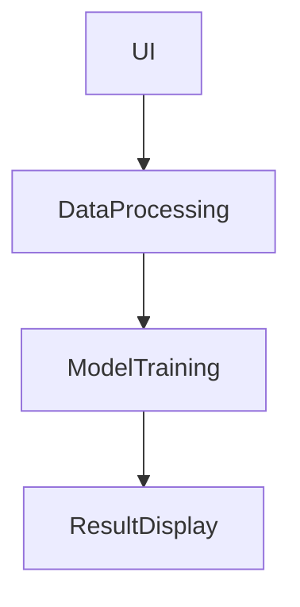
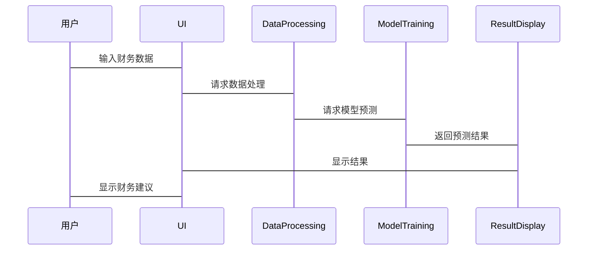

                 


# AI驱动的个人财务规划工具开发指南

> 关键词：AI驱动，个人财务规划，机器学习，自然语言处理，系统架构设计

> 摘要：本文详细探讨了AI驱动的个人财务规划工具的开发过程，从背景介绍、核心概念到算法原理、系统架构设计，再到项目实战和最佳实践，为开发者提供全面的指导。

---

## 第一部分：AI驱动的个人财务规划工具开发背景与基础

### 第1章：AI驱动的个人财务规划工具概述

#### 1.1 个人财务规划的背景与挑战

##### 1.1.1 传统个人财务规划工具的局限性
传统财务规划工具通常依赖人工输入和固定规则，难以应对复杂多变的金融市场和个性化需求。例如，用户需要手动输入收入、支出等数据，且模型缺乏动态调整能力，无法实时跟踪市场变化。

##### 1.1.2 AI技术如何解决财务规划中的问题
AI技术通过机器学习和自然语言处理，能够自动分析和处理大量财务数据，提供个性化的财务建议。例如，AI可以预测投资回报率，优化资产配置，并实时监控市场风险。

##### 1.1.3 AI驱动财务规划工具的核心优势
AI驱动的工具能够实时更新数据，提供动态调整的财务规划，帮助用户做出更明智的决策。此外，AI还能通过自然语言处理技术，分析非结构化的财务文本，提取有用信息。

#### 1.2 AI在个人财务规划中的应用场景

##### 1.2.1 财务数据分析与预测
AI可以分析历史财务数据，预测未来的收入和支出，帮助用户进行预算管理。

##### 1.2.2 投资组合优化与风险管理
通过机器学习，AI可以优化投资组合，降低风险。例如，使用支持向量机（SVM）模型进行风险评估。

##### 1.2.3 个性化财务建议与决策支持
AI可以根据用户的财务状况和目标，提供个性化的建议，如最佳的投资策略和退休规划。

---

### 第2章：AI驱动的个人财务规划工具核心概念

#### 2.1 财务数据的结构化与特征提取

##### 2.1.1 财务数据的分类与属性
财务数据通常包括收入、支出、资产、负债等。这些数据可以分为结构化数据（如表格数据）和非结构化数据（如财务报告文本）。

##### 2.1.2 数据清洗与特征工程
数据清洗是去除无效数据，特征工程是提取有用的特征，如将文本数据转换为数值表示。

##### 2.1.3 数据预处理的常见方法
常见的数据预处理方法包括归一化、标准化和缺失值填充。

#### 2.2 机器学习在财务规划中的应用

##### 2.2.1 监督学习与非监督学习在财务分析中的应用
监督学习用于分类和回归任务，如预测股票价格。非监督学习用于聚类，如客户细分。

##### 2.2.2 常见机器学习算法对比分析
| 算法 | 优点 | 缺点 |
|------|------|------|
| 线性回归 | 简单高效 | 无法处理非线性关系 |
| 支持向量机 | 高维数据表现好 | 计算复杂度高 |
| 随机森林 | 鲁棒性好 | 解释性差 |

##### 2.2.3 算法选择与模型评估指标
选择算法时需考虑数据类型、任务类型和计算资源。常用评估指标包括准确率、召回率和F1值。

#### 2.3 自然语言处理在财务文本分析中的应用

##### 2.3.1 财务文本的分词与实体识别
分词将文本分割成词语，实体识别提取如公司名称、金额等信息。

##### 2.3.2 基于NLP的财务信息提取
使用文本分类识别财务文本的情绪，提取关键信息。

##### 2.3.3 文本情感分析在投资决策中的应用
分析财务报告的情感，预测股价走势。

---

### 第3章：AI驱动的个人财务规划工具算法原理

#### 3.1 机器学习算法原理

##### 3.1.1 线性回归模型
$$ y = \beta_0 + \beta_1x + \epsilon $$
线性回归用于预测连续变量，如股票价格。

##### 3.1.2 支持向量机模型
$$ \text{最大化} \quad \frac{1}{2}||\beta||^2 $$
$$ \text{受限于} \quad y_i - \beta_0 - \beta_1x_i \geq 1 \text{或} \leq -1 $$
SVM用于分类任务，如信用评分。

#### 3.2 自然语言处理算法原理

##### 3.2.1 分词算法
使用jieba库对中文进行分词。

##### 3.2.2 实体识别算法
使用spaCy库进行实体识别。

##### 3.2.3 文本分类算法
使用TF-IDF和SVM进行文本分类。

#### 3.3 算法实现流程

##### 3.3.1 数据预处理流程
1. 数据清洗：去除无效数据。
2. 特征提取：将文本数据转换为向量。

##### 3.3.2 模型训练流程
1. 选择算法：如随机森林。
2. 训练模型：使用训练数据进行拟合。
3. 模型评估：计算准确率。

##### 3.3.3 模型优化与调参
使用网格搜索优化模型参数，提高准确率。

---

### 第4章：AI驱动的个人财务规划工具系统架构设计

#### 4.1 系统功能模块划分

##### 4.1.1 用户交互模块
负责用户输入和结果显示，如提供预算建议。

##### 4.1.2 数据处理模块
处理财务数据，如清洗和转换。

##### 4.1.3 模型计算模块
执行机器学习模型的预测和分析。

#### 4.2 系统架构设计

##### 4.2.1 模块划分
- 用户交互模块：接收输入，显示结果。
- 数据处理模块：清洗数据，提取特征。
- 模型计算模块：训练模型，生成建议。

##### 4.2.2 系统架构图


##### 4.2.3 系统接口设计
- 数据接口：接收财务数据，返回处理后的数据。
- 模型接口：接收特征向量，返回预测结果。

##### 4.2.4 系统交互流程


---

## 第五部分：AI驱动的个人财务规划工具开发实战

### 第5章：项目实战

#### 5.1 环境安装与配置

##### 5.1.1 安装Python
安装Python 3.8及以上版本。

##### 5.1.2 安装依赖库
安装pandas、scikit-learn、spaCy等库。

#### 5.2 核心代码实现

##### 5.2.1 数据预处理代码
```python
import pandas as pd

# 读取数据
data = pd.read_csv('financial_data.csv')

# 数据清洗
data.dropna(inplace=True)

# 特征提取
from sklearn.feature_extraction.text import TfidfVectorizer
vectorizer = TfidfVectorizer()
text_features = vectorizer.fit_transform(data['description'])
```

##### 5.2.2 模型训练代码
```python
from sklearn.ensemble import RandomForestClassifier
model = RandomForestClassifier()
model.fit(text_features, data['label'])
```

#### 5.3 项目案例分析与解读

##### 5.3.1 案例分析
分析用户的财务数据，预测投资回报率。

##### 5.3.2 代码实现解读
解释代码的功能和实现步骤，如数据清洗和模型训练。

##### 5.3.3 案例结果与分析
展示预测结果，并分析其合理性。

#### 5.4 项目小结

##### 5.4.1 项目总结
总结项目的开发过程和成果。

##### 5.4.2 经验与教训
分享开发中的经验教训，如数据预处理的重要性。

##### 5.4.3 项目优化建议
提出进一步优化的方向，如引入深度学习模型。

---

## 第六部分：最佳实践与总结

### 第6章：AI驱动的个人财务规划工具开发总结

#### 6.1 最佳实践 tips

##### 6.1.1 数据质量的重要性
强调数据清洗和特征工程的重要性。

##### 6.1.2 模型选择与调优
建议根据数据类型选择合适的算法，并进行调参优化。

##### 6.1.3 系统设计的模块化
建议将系统划分为功能模块，便于维护和扩展。

#### 6.2 开发注意事项

##### 6.2.1 数据隐私保护
注意保护用户数据隐私，符合相关法规。

##### 6.2.2 系统性能优化
优化代码性能，减少计算时间。

##### 6.2.3 模型解释性
选择可解释性好的模型，便于用户理解。

#### 6.3 未来拓展与深入学习

##### 6.3.1 深度学习在财务规划中的应用
探索深度学习模型在财务分析中的应用。

##### 6.3.2 多模态数据融合
结合结构化和非结构化数据，提高模型性能。

##### 6.3.3 智能交互设计
优化用户界面，提供更智能的交互体验。

---

## 作者

作者：AI天才研究院（AI Genius Institute） & 禅与计算机程序设计艺术（Zen And The Art of Computer Programming）

---

通过本文，读者可以系统地了解AI驱动的个人财务规划工具的开发过程，从理论到实践，掌握关键技术和最佳实践，为开发高效、智能的财务规划工具提供指导。

