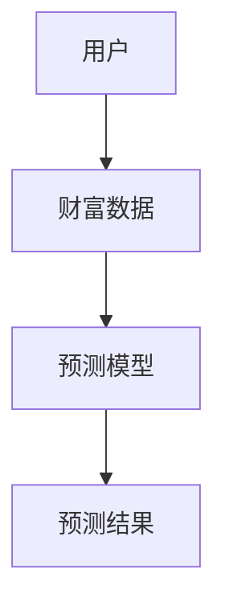
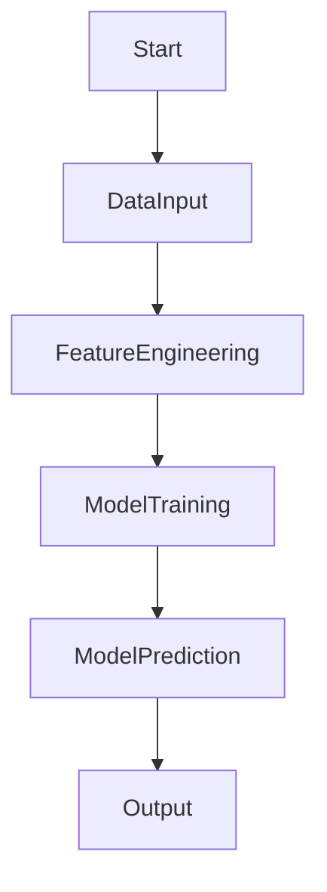
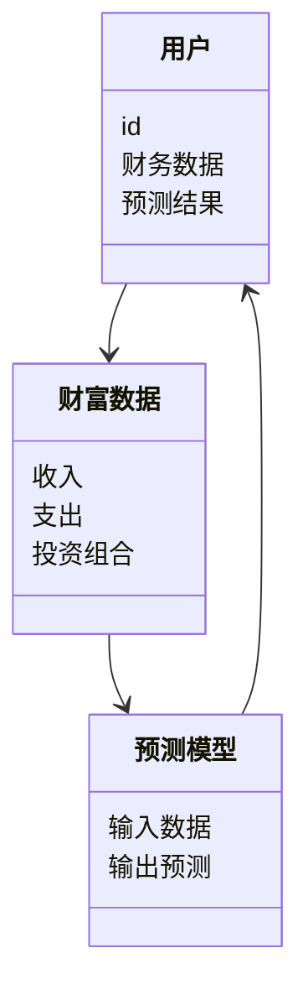
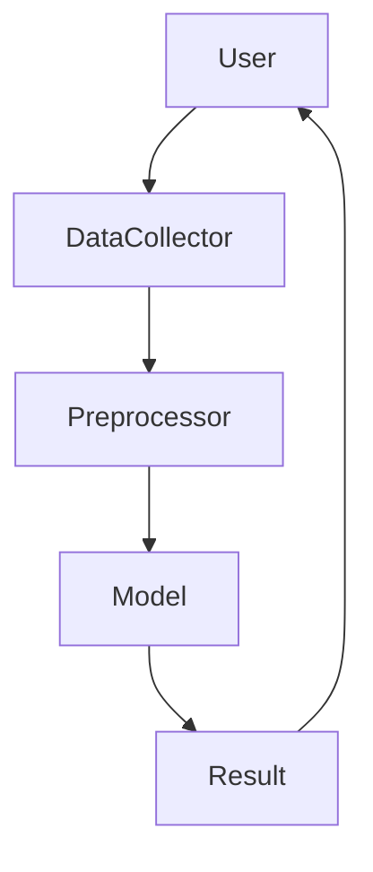
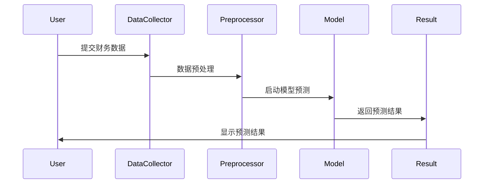

                 


# AI驱动的个人财富积累速度预测器

> 关键词：AI预测模型、财富积累速度、机器学习、算法设计、数据特征分析

> 摘要：本文探讨了如何利用人工智能技术预测个人财富积累速度。通过分析影响财富积累的关键因素，结合机器学习算法，构建了一个高效的预测模型。文章详细介绍了模型的设计思路、算法实现、系统架构，并通过实际案例展示了模型的应用效果。

---

# 第1章: 问题背景与描述

## 1.1 问题背景

### 1.1.1 传统财富积累分析的局限性
传统的财富积累分析主要依赖于财务报表和人工计算，这种方式不仅效率低下，而且容易受到主观因素的影响。例如，个人的消费习惯、投资决策等都会对财富积累速度产生重大影响，但传统方法难以捕捉这些动态变化。

### 1.1.2 AI技术在财富管理中的应用潜力
人工智能技术的快速发展为财富管理带来了新的可能性。通过机器学习算法，我们可以从海量数据中提取有价值的信息，帮助个人更好地规划财务。

### 1.1.3 个人财富积累速度预测的现实需求
随着经济全球化和金融市场的复杂化，个人财富管理的需求日益增长。通过AI技术预测财富积累速度，可以帮助个人制定更科学的财务计划，优化资产配置。

## 1.2 问题描述

### 1.2.1 财富积累速度的定义与测量
财富积累速度是指个人在一定时间内财富增长的速度。它可以通过资产净值的变化率来衡量。

### 1.2.2 影响财富积累速度的关键因素
- **收入水平**：收入是财富积累的基础。
- **消费习惯**：消费支出直接影响可投资金额。
- **投资行为**：投资种类和策略影响财富增长的速度。
- **市场环境**：经济波动、政策变化等外部因素也会影响财富积累。

### 1.2.3 预测模型的输入输出关系
- **输入**：个人的收入、支出、资产配置、投资行为等数据。
- **输出**：预测的财富积累速度及其影响因素分析。

## 1.3 问题解决思路

### 1.3.1 数据驱动的预测方法
通过收集和分析大量数据，利用机器学习算法构建预测模型。

### 1.3.2 AI算法在预测中的应用
采用回归分析、随机森林等算法，对数据进行建模和预测。

### 1.3.3 模型的可解释性与实用性
确保模型不仅准确，还能被用户理解和应用。

## 1.4 问题的边界与外延

### 1.4.1 预测范围的界定
本模型主要预测个人财富积累速度，不包括企业或机构的财务预测。

### 1.4.2 模型的适用场景
适用于有稳定收入来源的个人，尤其是那些有明确投资目标的用户。

### 1.4.3 预测结果的误差范围
模型预测结果可能存在一定的误差，具体取决于数据质量和算法选择。

## 1.5 核心概念结构

### 1.5.1 财富积累速度预测模型的组成
- 数据输入模块
- 特征提取模块
- 预测模型模块
- 结果输出模块

### 1.5.2 输入数据的特征分析
- 收入来源
- 支出类别
- 投资组合
- 市场环境

### 1.5.3 模型输出的解释框架
- 预测结果
- 影响因素分析
- 风险提示

## 1.6 本章小结

---

# 第2章: 核心概念与联系

## 2.1 AI驱动的预测模型原理

### 2.1.1 数据特征分析
通过数据分析提取关键特征，如收入、支出、投资组合等。

### 2.1.2 模型算法选择
采用回归分析和随机森林等算法，结合特征的重要性进行预测。

### 2.1.3 结果评估指标
使用均方误差（RMSE）和平均绝对误差（MAE）等指标评估模型性能。

## 2.2 概念属性对比表

| 概念 | 属性 | 描述 |
|------|------|------|
| 财富积累速度 | 输入数据 | 收入、支出、资产配置等 |
| 预测模型 | 算法类型 | 线性回归、随机森林等 |
| 评估指标 | 准确率 | MAE、RMSE等 |

## 2.3 ER实体关系图



---

# 第3章: 算法原理讲解

## 3.1 算法选择与流程

### 3.1.1 线性回归算法
线性回归是一种简单且常用的回归算法，适用于线性关系较强的预测场景。

### 3.1.2 随机森林算法
随机森林是一种基于树的集成算法，具有较高的鲁棒性和准确性。

### 3.1.3 算法选择依据
根据数据特征和预测目标选择合适的算法。

## 3.2 算法流程图



## 3.3 算法实现代码

### 3.3.1 线性回归代码

```python
import numpy as np
from sklearn.linear_model import LinearRegression

# 示例数据
X = np.array([[1], [2], [3], [4], [5]])
y = np.array([2, 4, 5, 4, 6])

# 模型训练
model = LinearRegression()
model.fit(X, y)

# 预测
new_X = np.array([[6]])
print(model.predict(new_X))
```

### 3.3.2 随机森林代码

```python
from sklearn.ensemble import RandomForestRegressor

# 示例数据
X = [[1], [2], [3], [4], [5]]
y = [2, 4, 5, 4, 6]

# 模型训练
model = RandomForestRegressor(n_estimators=100)
model.fit(X, y)

# 预测
new_X = [[6]]
print(model.predict(new_X))
```

## 3.4 数学模型

### 3.4.1 线性回归模型

$$ y = \beta_0 + \beta_1 x + \epsilon $$

### 3.4.2 随机森林模型
随机森林是一种集成学习方法，通过构建多棵决策树并对结果进行投票或平均来提高预测准确性。

---

# 第4章: 系统分析与架构设计

## 4.1 问题场景介绍

### 4.1.1 系统目标
构建一个基于AI的个人财富积累速度预测系统。

### 4.1.2 使用场景
用户输入相关财务数据，系统输出预测结果及建议。

## 4.2 系统功能设计

### 4.2.1 领域模型



### 4.2.2 系统架构



## 4.3 接口设计

### 4.3.1 数据接口
- 输入接口：接收用户的财务数据。
- 输出接口：返回预测结果及分析报告。

### 4.3.2 交互流程



---

# 第5章: 项目实战

## 5.1 环境安装

### 5.1.1 安装Python
```bash
python --version
pip install numpy scikit-learn
```

### 5.1.2 安装Jupyter Notebook
```bash
pip install jupyter
jupyter notebook
```

## 5.2 核心代码实现

### 5.2.1 数据预处理

```python
import pandas as pd
import numpy as np

# 加载数据
data = pd.read_csv('wealth_data.csv')

# 数据清洗
data.dropna()
data = data.astype(float)
```

### 5.2.2 模型训练

```python
from sklearn.model_selection import train_test_split
from sklearn.ensemble import RandomForestRegressor

# 划分数据集
X_train, X_test, y_train, y_test = train_test_split(data.drop('wealth_growth', axis=1), data['wealth_growth'], test_size=0.2)

# 模型训练
model = RandomForestRegressor(n_estimators=100)
model.fit(X_train, y_train)
```

### 5.2.3 模型预测

```python
# 预测
y_pred = model.predict(X_test)
print('预测结果:', y_pred)
```

## 5.3 案例分析

### 5.3.1 数据准备

```python
# 示例数据
data = {
    'income': [50000, 60000, 70000, 80000],
    'expenses': [20000, 25000, 30000, 35000],
    'investments': [10000, 15000, 20000, 25000]
}
df = pd.DataFrame(data)
```

### 5.3.2 模型应用

```python
model.predict(df.drop('wealth_growth', axis=1))
```

## 5.4 代码解读与分析

### 5.4.1 数据预处理
- 数据清洗：删除缺失值。
- 数据转换：将数据转换为数值类型。

### 5.4.2 模型训练
- 数据分割：将数据划分为训练集和测试集。
- 模型选择：随机森林回归模型。
- 模型训练：使用训练数据训练模型。

### 5.4.3 模型预测
- 使用测试数据进行预测。
- 输出预测结果。

---

# 第6章: 最佳实践与注意事项

## 6.1 最佳实践

### 6.1.1 数据质量
确保数据的完整性和准确性。

### 6.1.2 模型选择
根据具体场景选择合适的算法。

### 6.1.3 模型调优
通过交叉验证等方法优化模型性能。

## 6.2 小结

## 6.3 注意事项

### 6.3.1 数据隐私
保护用户数据隐私，避免数据泄露。

### 6.3.2 模型局限性
模型预测结果仅供参考，实际财富积累还受多种不可控因素影响。

### 6.3.3 持续优化
定期更新模型，以适应市场变化。

## 6.4 拓展阅读

### 6.4.1 推荐书籍
- 《机器学习实战》
- 《Python机器学习》

### 6.4.2 技术博客
- Medium上的AI相关文章

---

# 作者

作者：AI天才研究院/AI Genius Institute & 禅与计算机程序设计艺术/Zen And The Art of Computer Programming

---

感谢您的阅读！希望本文对您理解AI驱动的个人财富积累速度预测器有所帮助。如需进一步探讨或有疑问，请随时联系。

