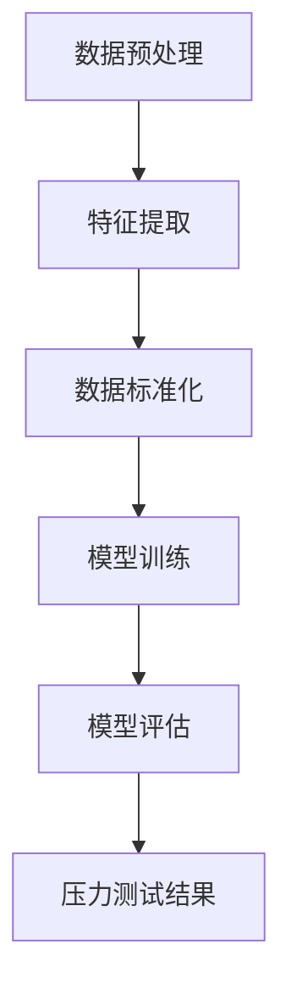
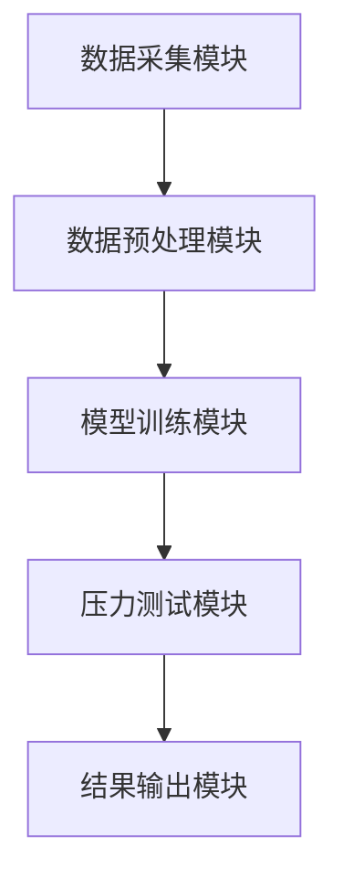

                 


# AI驱动的价值投资组合压力测试

> **关键词**: AI, 价值投资组合, 压力测试, 机器学习, 风险评估, 投资组合管理, 深度学习

> **摘要**:  
本文探讨如何利用人工智能技术构建价值投资组合的压力测试系统。通过分析AI在金融建模中的应用，结合深度学习算法，提出一种创新的端到端解决方案，用于评估投资组合在极端市场条件下的表现。文章详细阐述了从数据预处理、模型训练到系统架构设计的完整流程，并通过实际案例分析展示了该方法的有效性。

---

## 第1章: 价值投资组合压力测试概述

### 1.1 问题背景

#### 1.1.1 投资组合风险评估的重要性  
在金融市场中，投资组合的价值受多种因素影响，包括市场波动、经济指标、公司基本面等。准确评估投资组合在极端情况下的表现，对于投资者和机构至关重要。传统的方法依赖于历史数据和统计模型，但其局限性日益显现。

#### 1.1.2 传统压力测试的局限性  
传统压力测试通常基于情景分析，假设市场可能出现极端情况（如经济衰退、市场崩盘）。然而，这种方法依赖于分析师的经验，主观性较强，且难以捕捉复杂市场动态中的非线性关系。

#### 1.1.3 AI驱动的优势与必要性  
人工智能技术，特别是深度学习，能够处理海量非结构化数据，发现传统方法难以察觉的模式。通过AI驱动的压力测试，可以更准确地预测投资组合在极端情况下的表现，为投资者提供更可靠的决策支持。

---

### 1.2 问题描述

#### 1.2.1 投资组合压力测试的目标  
通过模拟不同市场条件下的投资组合表现，评估其在极端情况下的风险和收益，从而优化投资组合配置。

#### 1.2.2 数据驱动的压力测试需求  
现代金融市场数据量庞大，包括股票价格、新闻 sentiment、经济指标等。利用这些数据，AI可以构建更精准的压力测试模型。

#### 1.2.3 AI在金融建模中的应用潜力  
深度学习模型（如LSTM、Transformer）在时间序列预测和特征提取方面表现出色，为压力测试提供了新的工具。

---

### 1.3 问题解决

#### 1.3.1 AI驱动的压力测试方法  
利用神经网络模型，结合历史数据和实时市场信息，构建投资组合的动态风险评估模型。

#### 1.3.2 数据处理与特征提取  
对金融数据进行清洗、特征提取和标准化处理，为模型训练提供高质量输入。

#### 1.3.3 模型训练与评估  
通过监督学习训练模型，使用回测数据验证其预测能力，并根据评估指标（如均方误差、准确率）进行优化。

---

### 1.4 边界与外延

#### 1.4.1 适用场景与限制  
AI驱动的压力测试适用于数据充足、市场相对稳定的场景，但对数据质量和模型解释性有一定要求。

#### 1.4.2 与其他投资组合管理方法的对比  
对比传统统计方法和AI驱动方法的优劣势，明确AI在复杂场景中的优势。

#### 1.4.3 未来发展趋势  
随着AI技术的进步，压力测试将更加智能化、个性化，能够实时适应市场变化。

---

## 第2章: 核心概念与原理

### 2.1 AI在投资组合压力测试中的原理

#### 2.1.1 生成模型与压力测试  
生成模型（如GAN）可以模拟极端市场条件，生成虚拟数据用于测试投资组合的鲁棒性。

#### 2.1.2 强化学习在风险评估中的应用  
强化学习通过模拟投资决策过程，优化投资组合在极端情况下的表现。

#### 2.1.3 深度学习的优势  
深度学习能够自动提取特征，捕捉数据中的非线性关系，提高模型的预测精度。

---

### 2.2 核心概念对比

#### 2.2.1 传统模型与AI模型的对比  
通过表格对比传统统计模型和AI模型在准确性、实时性、适应性等方面的表现。

#### 2.2.2 不同AI算法的优劣势分析  
分析LSTM、Transformer等算法在时间序列预测中的优劣势。

#### 2.2.3 概念属性特征对比表格  
| 概念 | 特性 | 传统模型 | AI模型 |
|------|------|-----------|--------|
| 数据需求 | 结构化 | 高       | 低     |
| 预测能力 | 线性   | 高       | 低     |

---

### 2.3 ER实体关系图

#### 2.3.1 实体关系展示  
使用Mermaid绘制实体关系图，展示投资组合、市场数据、压力测试结果之间的关系。

```mermaid
erDiagram
    investor_investment
    {
        investor_investment(investor_id, investment_id, investment_amount)
        investor(investor_id, investor_name, contact_info)
        investment(investment_id, investment_name, investment_type)
    }
```

---

## 第3章: 算法原理讲解

### 3.1 算法流程

#### 3.1.1 数据预处理  
1. 数据清洗：去除缺失值、异常值。
2. 特征提取：提取股价、成交量、市场指数等特征。
3. 数据标准化：归一化处理。

#### 3.1.2 模型训练  
1. 选择模型：使用LSTM进行时间序列预测。
2. 训练数据：将历史数据分为训练集和验证集。
3. 模型优化：调整超参数，如学习率、批量大小。

#### 3.1.3 模型评估  
1. 预测结果与实际数据对比。
2. 计算误差指标：如MAE、RMSE。

---

### 3.2 Mermaid流程图



---

### 3.3 算法实现代码

```python
import numpy as np
import pandas as pd
from tensorflow.keras.models import Sequential
from tensorflow.keras.layers import LSTM, Dense, Dropout
from sklearn.preprocessing import MinMaxScaler

# 数据预处理
data = pd.read_csv('stock_data.csv')
data = data['Close'].values
data = data.reshape(-1, 1)

# 特征提取
window_size = 30
X = []
y = []
for i in range(len(data) - window_size):
    X.append(data[i:i+window_size])
    y.append(data[i+window_size])
X = np.array(X)
y = np.array(y)

# 数据标准化
scaler = MinMaxScaler()
X_scaled = scaler.fit_transform(X)
X_scaled = X_scaled.reshape(X_scaled.shape[0], X_scaled.shape[1], 1)
y_scaled = scaler.fit_transform(y.reshape(-1, 1))

# 模型训练
model = Sequential()
model.add(LSTM(64, input_shape=(window_size, 1)))
model.add(Dropout(0.2))
model.add(Dense(1))
model.compile(loss='mean_squared_error', optimizer='adam')
model.fit(X_scaled, y_scaled, epochs=50, batch_size=32)

# 模型评估
预测值 = model.predict(X_scaled)
```

---

## 第4章: 系统分析与架构设计

### 4.1 系统架构设计

#### 4.1.1 系统功能模块  
1. 数据采集模块：从多个数据源获取实时市场数据。
2. 模型训练模块：构建并训练AI模型。
3. 压力测试模块：模拟极端市场条件，评估投资组合表现。

#### 4.1.2 系统架构图  
使用Mermaid绘制系统架构图，展示各模块之间的关系。



---

## 第5章: 项目实战

### 5.1 实际案例分析

#### 5.1.1 案例背景  
假设一个投资组合包含科技股和蓝筹股，需测试其在2020年疫情冲击下的表现。

#### 5.1.2 数据准备  
使用2015-2020年的历史数据进行训练，2020年后的数据进行回测。

#### 5.1.3 模型预测  
训练模型预测投资组合在极端情况下的收益和损失。

---

### 5.2 最佳实践 tips

- 数据清洗和特征工程是关键，确保输入数据的质量。
- 选择合适的模型和超参数，避免过拟合。
- 定期更新模型，适应市场变化。

---

## 第6章: 小结

### 6.1 本章总结  
本文详细介绍了AI驱动的价值投资组合压力测试方法，从理论到实践，展示了如何利用深度学习技术提高压力测试的准确性。

### 6.2 注意事项  
- 数据隐私和模型解释性是实际应用中的重要考虑因素。
- 在实际操作中，需结合市场专家的意见，避免模型的片面性。

---

## 第7章: 拓展阅读

### 7.1 拓展阅读建议  
- 关注最新的AI在金融领域的应用，如GPT-3.5在金融文本分析中的应用。
- 学习更复杂的深度学习模型，如Transformer架构。

---

**作者：AI天才研究院/AI Genius Institute & 禅与计算机程序设计艺术 /Zen And The Art of Computer Programming**

