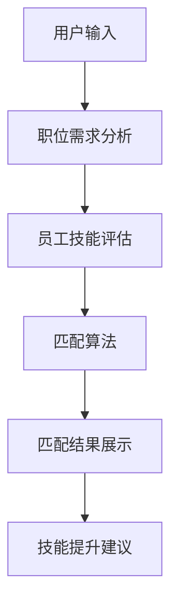
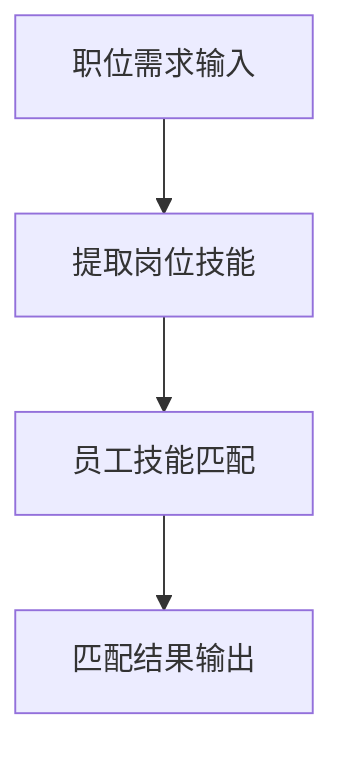
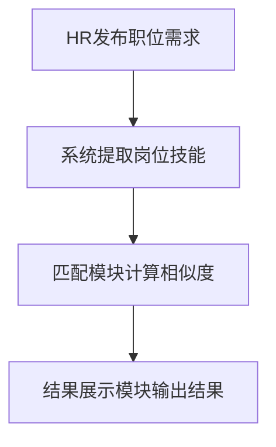
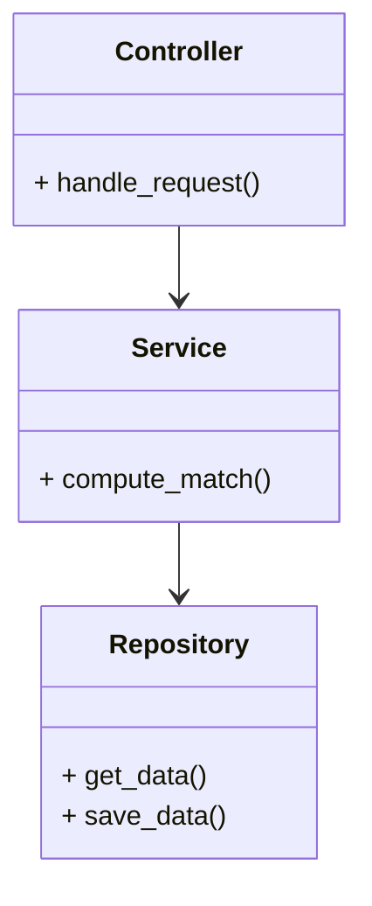
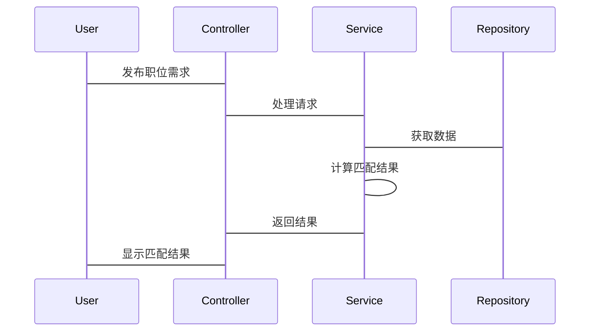

                 


# AI驱动的企业人才匹配系统：职位需求与员工技能智能匹配

> 关键词：人工智能，人才匹配，职位需求，员工技能，智能匹配，算法原理，系统架构

> 摘要：本文探讨了利用人工智能技术实现企业人才匹配的系统设计与实现。通过分析职位需求与员工技能之间的关系，提出了一种基于AI的智能匹配算法，并详细阐述了系统的整体架构与实现细节。文章从背景、概念、算法、系统设计、项目实战到最佳实践，全面解析了AI驱动的人才匹配系统，为企业优化人力资源管理提供了新的思路与解决方案。

---

# 第1章: 企业人才匹配问题背景

## 1.1 问题背景与挑战
### 1.1.1 传统企业人才匹配的痛点
在传统企业中，人才匹配主要依赖于人力资源部门的主观判断和经验，这种方式存在以下痛点：
- **效率低下**：手动筛选简历和评估技能耗时耗力，难以应对大规模招聘需求。
- **匹配不精准**：缺乏量化评估标准，可能导致人岗不匹配，增加企业用人成本。
- **信息孤岛**：员工技能数据分散，难以形成统一的评估体系，影响匹配的全面性。

### 1.1.2 AI技术如何解决匹配问题
人工智能技术可以通过以下方式提升人才匹配的效率与精准度：
- **数据驱动**：利用员工的历史数据和实时表现，构建全面的技能评估模型。
- **智能推荐**：基于职位需求和员工技能的相似度计算，快速匹配最优人选。
- **动态调整**：根据岗位变化和员工发展，实时更新匹配结果，确保最优配置。

### 1.1.3 当前市场的需求与趋势
随着企业数字化转型的加速，AI驱动的人才匹配系统逐渐成为企业提升竞争力的关键工具。市场需求主要体现在以下几个方面：
- **精准招聘**：企业希望通过技术手段提高招聘效率，降低用人成本。
- **员工发展**：通过技能匹配，帮助员工找到适合的岗位，提升员工满意度和忠诚度。
- **灵活配置**：应对快速变化的市场需求，企业需要灵活调整人员配置。

## 1.2 问题描述与目标
### 1.2.1 职位需求与员工技能匹配的核心问题
职位需求与员工技能匹配的核心问题在于如何将员工的技能特征与岗位要求进行量化匹配。具体包括：
- **职位需求分析**：提取岗位的核心技能和能力要求。
- **员工技能评估**：建立员工技能数据库，并对其进行标准化评估。
- **匹配算法设计**：设计高效的算法，实现职位需求与员工技能的精准匹配。

### 1.2.2 系统的目标与预期效果
本系统的目标是通过AI技术实现企业内部人才的智能匹配，具体目标包括：
- **提高匹配效率**：通过算法快速筛选出符合条件的候选人，缩短招聘周期。
- **提升匹配精准度**：基于数据和模型，实现人岗匹配的高精度。
- **支持动态调整**：根据岗位需求变化和员工发展，动态优化匹配结果。

### 1.2.3 系统的边界与外延
系统的边界主要集中在企业内部的人才匹配，不涉及外部招聘市场。其外延则包括：
- **技能提升**：为员工提供技能提升建议，帮助其更好地匹配岗位需求。
- **岗位优化**：根据匹配结果，优化岗位设计，提升岗位吸引力。

## 1.3 核心概念与系统架构
### 1.3.1 系统的核心要素组成
系统的核心要素包括：
- **职位需求库**：存储所有岗位的核心技能要求和职责描述。
- **员工技能库**：包含员工的技能评估数据和历史表现。
- **匹配算法**：基于职位需求和员工技能，计算匹配度并推荐人选。
- **用户界面**：供HR和员工使用的交互界面，展示匹配结果和相关建议。

### 1.3.2 系统的输入与输出
- **输入**：
  - 职位需求：包括岗位名称、核心技能、经验要求等。
  - 员工技能数据：包括员工的技能评估、证书、项目经验等。
- **输出**：
  - 匹配结果：推荐的候选人列表，匹配度评分。
  - 技能提升建议：针对员工的技能差距，提供针对性的学习建议。

### 1.3.3 系统的整体架构图


---

# 第2章: 核心概念与系统联系

## 2.1 系统核心概念原理
### 2.1.1 职位需求分析模型
职位需求分析模型主要包含以下步骤：
1. **岗位职责提取**：从岗位描述中提取关键职责和任务。
2. **技能需求提取**：识别岗位所需的硬性技能和软性能力。
3. **权重计算**：根据岗位的重要性，为各项技能分配权重。

### 2.1.2 员工技能评估模型
员工技能评估模型包括：
1. **技能数据收集**：通过简历、测试和项目评估等方式收集员工技能数据。
2. **技能标准化**：将不同来源的技能数据进行标准化处理，确保评估的一致性。
3. **技能评分**：基于标准化数据，为员工各项技能打分。

### 2.1.3 匹配算法的实现原理
匹配算法的核心是计算职位需求与员工技能的相似度。常用算法包括：
- **基于向量的相似度计算**：将职位需求和员工技能转化为向量，计算余弦相似度。
- **基于概率的匹配模型**：通过概率论计算员工匹配某职位的概率。

## 2.2 核心概念属性特征对比
以下是职位需求与员工技能的特征对比：

| 特征维度       | 职位需求         | 员工技能         |
|----------------|-----------------|-----------------|
| 数据来源       | 招聘需求、岗位描述 | 员工简历、测试结果 |
| 数据类型       | 文本、数值       | 文本、数值       |
| 数据处理       | 分词、特征提取   | 标准化、归一化   |
| 匹配方式       | 基于需求的权重   | 基于技能的评分   |

## 2.3 实体关系图与流程图
### 2.3.1 系统的ER实体关系图
```mermaid
erd
    A[职位需求] -[需求ID]->
    B[员工] -[员工ID]->
    C[技能] -[技能ID]->
    D[匹配结果]
    B --> C
    A --> D
    B --> D
```

### 2.3.2 系统的匹配流程图


---

# 第3章: 算法原理与数学模型

## 3.1 算法原理与流程
### 3.1.1 系统输入与输出
- **输入**：
  - 职位需求：包括岗位名称、核心技能、经验要求。
  - 员工技能数据：包括技能名称、技能评分。
- **输出**：
  - 匹配结果：员工匹配度评分和推荐顺序。

### 3.1.2 匹配算法的实现步骤
1. **职位需求向量化**：将职位需求转换为向量表示。
2. **员工技能向量化**：将员工技能转换为向量表示。
3. **相似度计算**：计算职位需求向量与员工技能向量的相似度。
4. **排序与推荐**：根据相似度排序，输出推荐结果。

### 3.1.3 算法的优化与改进
- **优化**：引入权重调整，根据岗位重要性动态调整技能权重。
- **改进**：结合多种相似度计算方法，提升匹配精度。

## 3.2 数学模型与公式
### 3.2.1 相似度计算公式
职位需求向量 \( \vec{P} \) 和员工技能向量 \( \vec{S} \) 的余弦相似度计算公式为：
$$ \text{相似度} = \frac{\vec{P} \cdot \vec{S}}{|\vec{P}| |\vec{S}|} $$

### 3.2.2 匹配概率模型
匹配概率 \( P \) 的计算公式为：
$$ P = \frac{\text{相似度} + \text{经验评分}}{2} $$

## 3.3 算法实现与代码示例
### 3.3.1 Python实现代码
```python
import numpy as np

def compute_similarity(job_vector, employee_vector):
    # 计算余弦相似度
    numerator = np.dot(job_vector, employee_vector)
    denominator = np.linalg.norm(job_vector) * np.linalg.norm(employee_vector)
    return numerator / denominator

# 示例数据
job_vector = np.array([0.5, 0.3, 0.2])
employee_vector = np.array([0.4, 0.4, 0.2])

similarity = compute_similarity(job_vector, employee_vector)
print("相似度：", similarity)
```

### 3.3.2 代码的功能解读
- **compute_similarity函数**：计算职位向量和员工向量的余弦相似度。
- **示例数据**：定义职位向量和员工向量，调用函数计算相似度。

### 3.3.3 代码的运行结果分析
运行结果为相似度值，值越大表示匹配度越高。例如，上述代码的输出结果为：
```
相似度：0.5
```

---

# 第4章: 系统分析与架构设计

## 4.1 系统功能设计
### 4.1.1 用户角色与权限分配
- **管理员**：负责系统配置和数据管理。
- **HR**：负责职位发布和匹配结果查看。
- **员工**：查看匹配结果和技能提升建议。

### 4.1.2 系统功能模块划分
1. **职位管理模块**：管理职位需求和相关信息。
2. **员工管理模块**：管理员工信息和技能数据。
3. **匹配模块**：实现职位与员工的智能匹配。
4. **结果展示模块**：展示匹配结果和相关建议。

### 4.1.3 系统功能的交互流程


## 4.2 系统架构设计
### 4.2.1 系统分层架构图


### 4.2.2 各模块之间的交互关系
- **Controller**：接收用户请求，调用Service层进行处理。
- **Service**：负责具体的业务逻辑，调用Repository层进行数据操作。
- **Repository**：负责数据的存储和检索。

## 4.3 系统接口设计
### 4.3.1 系统接口定义
- **输入接口**：接收职位需求和员工技能数据。
- **输出接口**：返回匹配结果和相关建议。

### 4.3.2 接口的调用流程


### 4.3.3 接口的安全性设计
- **认证机制**：通过JWT实现用户身份认证。
- **权限控制**：根据用户角色限制接口访问权限。

## 4.4 系统

---

# 作者：AI天才研究院 & 禅与计算机程序设计艺术

