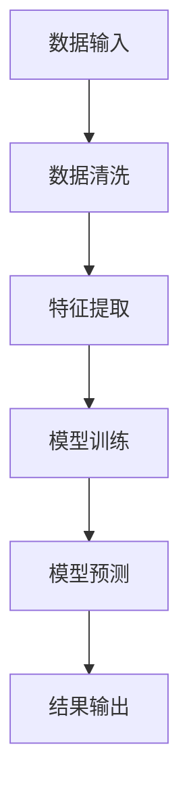
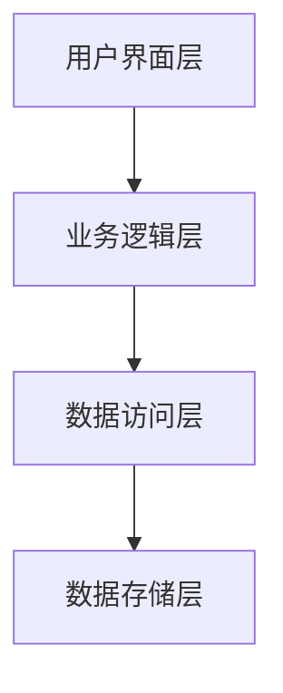
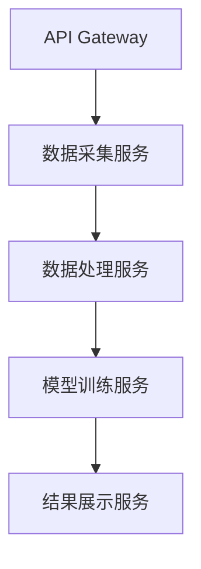

                 


# AI驱动的企业人才画像系统：多维度能力评估与发展预测

> 关键词：企业人才画像、AI技术、多维度评估、能力发展预测、机器学习、深度学习、系统架构

> 摘要：随着人工智能技术的飞速发展，企业人才管理也在不断进化。传统的基于经验的人才评估方法逐渐被AI驱动的多维度能力评估系统所取代。本文将深入探讨AI如何驱动企业人才画像系统，通过多维度能力评估模型预测员工的能力发展，为企业提供科学、高效的人才管理解决方案。

---

# 第一部分: AI驱动的企业人才画像系统背景与概念

## 第1章: AI驱动的企业人才画像系统概述

### 1.1 企业人才画像的定义与核心概念

#### 1.1.1 什么是企业人才画像

企业人才画像是指通过收集和分析员工的多维度数据（如工作表现、技能水平、性格特征、职业兴趣等），构建一个全面、动态的员工能力模型。该模型能够帮助企业识别员工的优势与潜力，从而优化人才管理策略。

#### 1.1.2 人才画像的核心要素

人才画像的核心要素包括：

1. **工作表现**：员工在工作中的实际表现，如任务完成度、工作效率等。
2. **技能水平**：员工在特定岗位上的专业技能和知识储备。
3. **性格特征**：员工的性格特质，如外向性、责任心、开放性等。
4. **职业兴趣**：员工对职业发展的兴趣和偏好，如偏好技术岗位或管理岗位。
5. **潜力评估**：基于历史数据和模型预测，评估员工未来的发展潜力。

#### 1.1.3 人才画像的多维度能力评估模型

多维度能力评估模型是一个综合性的框架，它将员工的能力分解为多个维度，并通过量化指标进行评估。例如：

- **技术能力**：员工在技术岗位上的专业技能水平。
- **团队合作能力**：员工在团队中的协作能力和影响力。
- **创新能力**：员工在解决问题和创新方面的表现。
- **学习能力**：员工适应新知识和新技术的速度。

### 1.2 企业人才画像系统的发展背景

#### 1.2.1 传统企业人才评估的局限性

传统的企业人才评估方法主要依赖于主观判断和有限的数据支持，存在以下问题：

1. **主观性**：评估结果受到评估者的主观影响，可能存在偏见。
2. **数据不足**：缺乏足够的数据支持，难以全面评估员工的能力。
3. **效率低下**：手动评估过程耗时且效率低，难以应对大规模的人才管理需求。

#### 1.2.2 AI技术在人才管理中的应用现状

随着AI技术的快速发展，越来越多的企业开始采用AI驱动的人才管理工具。例如：

- **自动简历筛选**：通过自然语言处理技术快速筛选合适的简历。
- **能力评估模型**：利用机器学习算法分析员工的能力和潜力。
- **绩效预测**：基于历史数据预测员工未来的工作表现。

#### 1.2.3 企业人才画像系统的价值与意义

企业人才画像系统能够为HR部门提供以下价值：

1. **提升招聘效率**：通过AI技术快速筛选和评估候选人。
2. **优化人才培养**：基于员工的能力画像制定个性化的职业发展计划。
3. **提高决策准确性**：通过数据驱动的评估结果辅助决策，减少主观偏见的影响。

### 1.3 本章小结

本章介绍了企业人才画像的基本概念、核心要素和多维度能力评估模型，并分析了传统评估方法的局限性和AI技术在人才管理中的应用现状。企业人才画像系统的引入能够显著提升企业的人才管理效率和准确性。

---

# 第二部分: 企业人才画像系统的算法原理

## 第2章: 多维度能力评估的算法基础

### 2.1 人才画像数据的特征提取

#### 2.1.1 数据预处理与特征工程

在进行模型训练之前，需要对原始数据进行预处理，包括：

1. **数据清洗**：去除重复数据、处理缺失值和异常值。
2. **特征提取**：从原始数据中提取有助于模型预测的特征，例如工作年限、绩效评分、技能水平等。

#### 2.1.2 基于机器学习的特征选择

为了提高模型的准确性和效率，可以使用特征选择算法，如：

- **Lasso回归**：通过L1正则化系数，自动选择重要特征。
- **递归特征消除（RFE）**：通过递归地训练模型并逐步移除对模型贡献最小的特征。

#### 2.1.3 基于深度学习的特征提取

深度学习模型（如卷积神经网络CNN、循环神经网络RNN）可以自动提取数据中的高层次特征，减少特征工程的工作量。

### 2.2 基于深度学习的多维度评估模型

#### 2.2.1 神经网络模型在人才评估中的应用

神经网络模型可以通过多层非线性变换，捕捉数据中的复杂关系。例如：

- **卷积神经网络（CNN）**：适用于图像数据的特征提取。
- **循环神经网络（RNN）**：适用于序列数据的处理，如时间序列数据。

#### 2.2.2 深度学习模型的优缺点分析

| 优缺点 | 深度学习模型 |
|--------|--------------|
| 优点    | 高准确性、自动提取特征 |
| 缺点    | 需要大量数据、计算资源消耗大 |

### 2.3 算法原理的数学模型与公式

#### 2.3.1 线性回归模型

线性回归是最简单的回归模型，适用于线性关系的数据。

$$ y = \beta_0 + \beta_1x_1 + \beta_2x_2 + ... + \beta_nx_n $$

其中：
- $y$ 是目标变量。
- $\beta_0$ 是截距项。
- $\beta_1, \beta_2, ..., \beta_n$ 是各个特征的系数。
- $x_1, x_2, ..., x_n$ 是各个特征变量。

#### 2.3.2 支持向量机模型

支持向量机（SVM）是一种常用的分类模型，适用于非线性可分的数据。

$$ \text{最大化} \quad \frac{1}{2}||\mathbf{w}||^2 $$
$$ \text{约束} \quad y_i(\mathbf{w} \cdot \mathbf{x}_i + b) \geq 1, \quad i=1,2,...,n $$

其中：
- $\mathbf{w}$ 是权重向量。
- $b$ 是偏置项。
- $y_i$ 是标签变量。
- $\mathbf{x}_i$ 是输入向量。

### 2.4 算法实现的流程图



---

# 第三部分: 企业人才画像系统的架构设计

## 第3章: 系统架构与功能设计

### 3.1 系统功能模块划分

#### 3.1.1 数据采集模块

数据采集模块负责从企业内部系统（如HR系统、绩效管理系统）和外部数据源（如社交媒体、招聘平台）获取员工的相关数据。

#### 3.1.2 数据处理模块

数据处理模块对采集到的数据进行清洗、转换和特征提取，为后续的模型训练提供高质量的数据。

#### 3.1.3 模型训练模块

模型训练模块基于处理后的数据，利用机器学习或深度学习算法训练出人才画像模型。

#### 3.1.4 结果展示模块

结果展示模块将模型输出的结果以可视化的方式呈现，便于企业HR部门理解和使用。

### 3.2 系统架构设计

#### 3.2.1 分层架构设计



#### 3.2.2 微服务架构设计



---

# 第四部分: 项目实战与案例分析

## 第4章: 企业人才画像系统实战

### 4.1 项目环境搭建

#### 4.1.1 环境要求

- 操作系统：Linux/Windows/MacOS
- Python版本：3.6+
- 依赖库：Scikit-learn、TensorFlow、Keras、Pandas、Matplotlib

#### 4.1.2 安装依赖

使用pip安装所需依赖：

```bash
pip install scikit-learn tensorflow pandas matplotlib
```

### 4.2 系统核心实现源代码

#### 4.2.1 数据预处理代码

```python
import pandas as pd
from sklearn.impute import SimpleImputer
from sklearn.preprocessing import StandardScaler

# 读取数据
data = pd.read_csv('employee_data.csv')

# 处理缺失值
imputer = SimpleImputer(strategy='mean')
imputed_data = imputer.fit_transform(data)

# 标准化处理
scaler = StandardScaler()
scaled_data = scaler.fit_transform(imputed_data)
```

#### 4.2.2 模型训练代码

```python
from sklearn.model import LinearRegression

# 训练线性回归模型
model = LinearRegression()
model.fit(X_train, y_train)

# 预测结果
y_pred = model.predict(X_test)
```

### 4.3 案例分析

#### 4.3.1 案例背景

假设某科技公司希望评估其开发团队的员工能力，包括技术能力、团队合作能力和学习能力。

#### 4.3.2 数据分析

通过数据可视化工具（如Matplotlib）绘制员工绩效与能力分布图，帮助识别高潜力员工和需要提升的员工。

#### 4.3.3 模型预测

基于训练好的模型，预测员工未来的工作表现，并制定相应的人才培养计划。

### 4.4 项目小结

本章通过一个实际案例，详细介绍了企业人才画像系统的环境搭建、数据处理和模型训练过程。通过案例分析，展示了如何利用AI技术提升企业的人才管理效率和准确性。

---

# 第五部分: 总结与展望

## 第5章: 总结与展望

### 5.1 本章总结

本文详细探讨了AI驱动的企业人才画像系统，从概念、算法到系统架构和项目实战，全面介绍了如何利用AI技术进行多维度能力评估与发展预测。通过AI技术的应用，企业能够更科学地管理人才，提高招聘和培养效率。

### 5.2 未来展望

随着AI技术的不断发展，企业人才画像系统将更加智能化和个性化。未来的发展方向包括：

1. **实时数据更新**：基于实时数据，动态更新员工能力画像。
2. **智能化推荐**：根据员工的能力和发展潜力，智能化推荐适合的培训和岗位。
3. **跨企业协作**：通过共享和分析跨企业的人才数据，形成更全面的人才画像。

---

# 作者：AI天才研究院/AI Genius Institute & 禅与计算机程序设计艺术 /Zen And The Art of Computer Programming

---

以上就是《AI驱动的企业人才画像系统：多维度能力评估与发展预测》的完整目录和内容概要。

