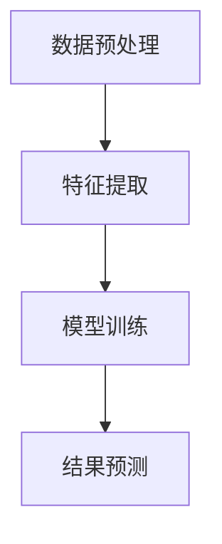
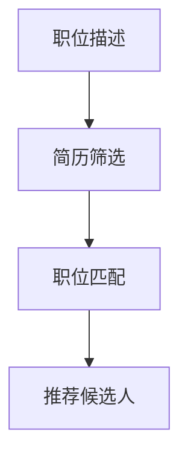
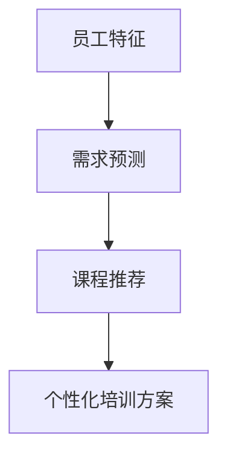
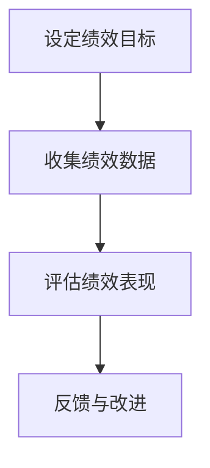
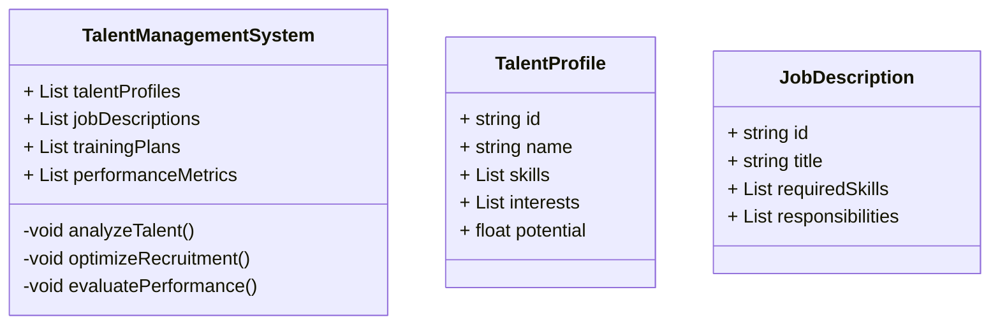
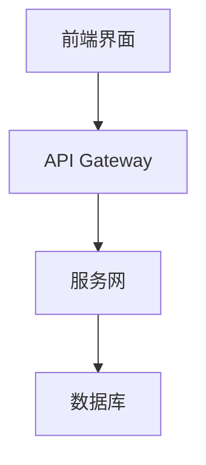
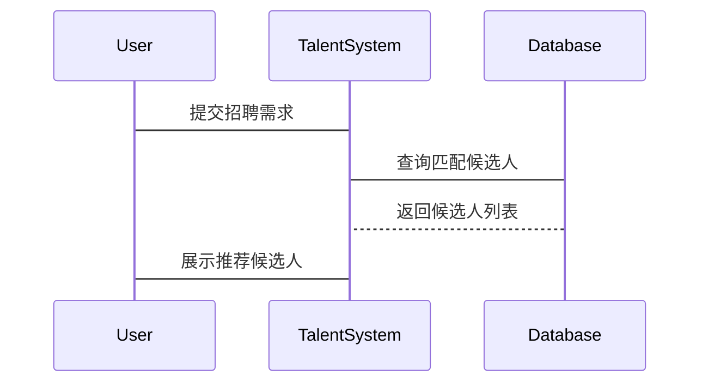

                 


# AI驱动的企业人才管理：招聘、培训到绩效评估

> 关键词：AI驱动，企业人才管理，招聘，培训，绩效评估，机器学习，自然语言处理

> 摘要：本文将探讨AI技术如何 revolutionize 企业人才管理的各个阶段，从招聘、培训到绩效评估，提供一套系统化的方法和工具，帮助企业在数字化转型中提升人才管理的效率和效果。

---

## 第1章: AI驱动的企业人才管理背景

### 1.1 企业人才管理的数字化转型

#### 1.1.1 传统企业人才管理的痛点
- 传统招聘流程效率低下，难以精准匹配人才。
- 培训效果难以量化，难以满足个性化需求。
- 绩效评估主观性强，缺乏数据支持。

#### 1.1.2 数字化转型的必要性
- 企业竞争日益激烈，人才管理需要更高效的工具。
- 数据驱动的决策成为企业核心竞争力。
- 员工期望个性化的职业发展路径。

#### 1.1.3 AI技术在企业人才管理中的应用前景
- AI技术可以帮助企业实现人才管理的智能化和自动化。
- 通过数据分析，优化招聘策略，提升培训效果，实现绩效评估的客观性。

### 1.2 AI驱动人才管理的核心概念

#### 1.2.1 数据驱动的决策
- 利用大数据分析员工表现和企业需求，制定科学的人才管理策略。
- 通过数据可视化工具，帮助企业管理者快速获取关键信息。

#### 1.2.2 智能化的人才匹配
- 利用自然语言处理技术，精准匹配职位需求和候选人能力。
- 通过机器学习算法，预测候选人潜力，优化招聘决策。

#### 1.2.3 个性化的职业发展路径
- 基于员工的技能和兴趣，制定个性化的职业发展规划。
- 利用AI技术，实时调整培训内容，满足员工个性化需求。

### 1.3 本书内容框架

#### 1.3.1 招聘、培训到绩效评估的全周期管理
- 从招聘到培训，再到绩效评估，AI技术贯穿人才管理的全生命周期。
- 每个阶段的具体应用场景和解决方案。

#### 1.3.2 AI技术在各环节的具体应用
- 招聘：简历筛选、人才匹配。
- 培训：个性化培训方案、效果评估。
- 绩效评估：数据驱动的评估体系、反馈机制。

#### 1.3.3 实际案例分析与最佳实践
- 通过实际案例，展示AI技术在企业人才管理中的应用效果。
- 总结最佳实践，为读者提供可参考的操作指南。

---

## 第2章: AI驱动人才管理的核心技术与算法

### 2.1 数据驱动的人才分析

#### 2.1.1 数据收集与预处理
- 数据来源：企业内部数据（如绩效数据、培训数据）和外部数据（如市场数据）。
- 数据清洗：处理缺失值、异常值，确保数据质量。
- 特征提取：利用自然语言处理技术提取文本特征，构建人才画像。

#### 2.1.2 人才画像的构建
- 用户画像的概念：基于数据分析，构建员工的多维画像，包括技能、兴趣、潜力等。
- 人才画像的属性特征对比表：

| 属性 | 描述 |
|------|------|
| 技能 | 员工的核心技能和优势 |
| 兴趣 | 员工感兴趣的领域和发展方向 |
| 潜力 | 员工未来发展的潜力评估 |

- ER实体关系图：展示人才、职位、绩效之间的关系。

#### 2.1.3 算法原理与实现
- 机器学习在人才分析中的应用：监督学习、无监督学习、深度学习。
- Mermaid流程图展示算法工作流程：



- Python代码实现：基于逻辑回归的人才匹配模型。

```python
import pandas as pd
from sklearn.linear_model import LogisticRegression

# 数据预处理
data = pd.read_csv('talent_data.csv')
X = data[['skill', 'interest', 'potential']]
y = data['job_match']

# 模型训练
model = LogisticRegression()
model.fit(X, y)

# 预测
new_talent = [[0.8, 0.6, 0.7]]
print(model.predict(new_talent))
```

- 数学模型：逻辑回归模型的公式：

$$ P(y=1|x) = \frac{1}{1 + e^{-(\beta_0 + \beta_1x_1 + \beta_2x_2 + \beta_3x_3)}} $$

---

## 第3章: AI驱动的招聘优化

### 3.1 招聘需求分析与职位匹配

#### 3.1.1 职位描述的自然语言处理
- 利用NLP技术提取职位描述中的关键词，构建职位特征向量。
- 基于向量空间模型，计算候选人简历与职位的匹配度。

#### 3.1.2 基于向量空间模型的职位匹配
- 使用余弦相似度计算职位与简历的匹配度：
$$ \text{相似度} = \frac{\vec{v}_1 \cdot \vec{v}_2}{\|\vec{v}_1\| \|\vec{v}_2\|} $$

#### 3.1.3 Mermaid流程图展示招聘优化算法



---

## 第4章: AI驱动的培训与学习

### 4.1 培训需求分析

#### 4.1.1 基于学习者特征的培训需求预测
- 利用机器学习算法预测员工的培训需求，如K-近邻算法。

#### 4.1.2 基于知识图谱的课程推荐
- 构建知识图谱，根据员工的技能和兴趣推荐个性化课程。

#### 4.1.3 Mermaid流程图展示培训需求分析算法



---

## 第5章: AI驱动的绩效评估与反馈

### 5.1 绩效指标体系构建

#### 5.1.1 绩效指标的分类与选择
- 制定科学的绩效指标，如KPI和OKR。

#### 5.1.2 基于层次分析法的绩效指标权重计算
- 使用层次分析法（AHP）确定各指标的权重。

#### 5.1.3 Mermaid流程图展示绩效评估流程



---

## 第6章: 系统分析与架构设计

### 6.1 系统功能设计

#### 6.1.1 领域模型Mermaid类图


### 6.2 系统架构设计

#### 6.2.1 系统架构Mermaid图


### 6.3 系统接口设计

#### 6.3.1 接口定义
- RESTful API：用于前后端交互，如获取人才数据、提交招聘需求。

### 6.4 系统交互Mermaid序列图



---

## 第7章: 项目实战

### 7.1 环境安装

```bash
pip install numpy pandas scikit-learn spacy
```

### 7.2 核心实现代码

#### 7.2.1 招聘优化代码

```python
import spacy

nlp = spacy.load('en_core_web_sm')

def analyze_job_description(job_desc):
    doc = nlp(job_desc)
    keywords = [token.text for token in doc if token.is_alpha]
    return keywords

job_desc = "Software Engineer with experience in AI and Python"
print(analyze_job_description(job_desc))
```

---

## 第8章: 最佳实践与小结

### 8.1 最佳实践

#### 8.1.1 数据质量管理
- 确保数据的准确性和完整性，避免数据偏差。

#### 8.1.2 模型调优
- 定期更新模型，保持模型的准确性。

### 8.2 小结

通过AI技术的应用，企业可以实现人才管理的智能化和高效化，提升企业的核心竞争力。AI技术不仅改变了传统的人才管理方式，还为企业提供了更多的可能性和灵活性。

### 8.3 注意事项

- 数据隐私和安全问题需要高度重视。
- AI技术的应用需要与企业实际需求相结合，避免盲目应用。

### 8.4 拓展阅读

- 《机器学习实战》
- 《自然语言处理入门》
- 《数据驱动的决策管理》

---

作者：AI天才研究院/AI Genius Institute & 禅与计算机程序设计艺术 /Zen And The Art of Computer Programming

