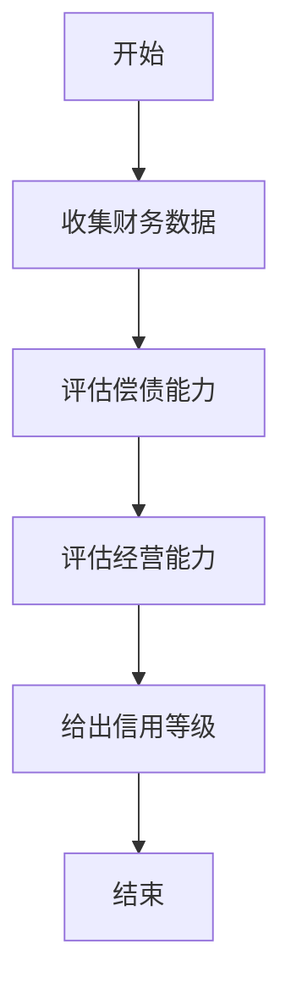
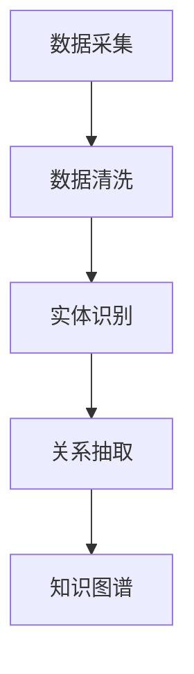

                 


# AI驱动的企业信用评级

---

## 关键词：AI, 信用评级, 机器学习, 知识图谱, 金融, 数据分析

---

## 摘要：  
随着人工智能技术的飞速发展，企业信用评级的传统方法正面临越来越大的挑战。传统的信用评级依赖于少量的财务数据和专家经验，存在数据维度有限、主观性强、效率低下等问题。AI驱动的企业信用评级通过引入机器学习、自然语言处理和知识图谱等技术，能够更全面、更精准地评估企业的信用状况，从而帮助金融机构做出更科学的决策。本文将从AI驱动信用评级的背景、核心技术、算法原理、系统架构到实际应用进行全面探讨，深入分析其优势和挑战，并展望未来的发展方向。

---

# 第1章: 企业信用评级的背景与意义

## 1.1 企业信用评级的定义与作用  
企业信用评级是通过对企业的财务状况、经营能力、市场表现等多维度信息进行分析，评估其在未来履行债务能力的过程。它是金融机构进行信贷决策的重要依据，能够有效降低风险，优化资源配置。  

**表1-1: 传统评级方法与AI驱动评级的对比**  

| **对比维度** | **传统评级方法** | **AI驱动评级** |  
|--------------|------------------|-----------------|  
| 数据来源     | 依赖财务报表     | 多源数据整合     |  
| 模型复杂度   | 简单线性模型     | 高维非线性模型   |  
| 评估效率     | 低效耗时         | 高效实时         |  
| 准确性       | 较低             | 更高             |  

## 1.2 传统信用评级方法的局限性  
传统信用评级方法主要依赖财务数据和专家经验，存在以下问题：  
1. **数据维度有限**：仅依赖财务数据，无法全面反映企业的真实信用状况。  
2. **主观性强**：评级结果受评级机构主观判断影响较大。  
3. **效率低下**：人工评级耗时长，难以满足金融机构对实时性的需求。  

**图1-1: 传统信用评级流程图**  



## 1.3 AI技术在信用评级中的应用前景  
AI技术通过引入机器学习、自然语言处理和知识图谱等技术，能够从多源数据中提取有价值的信息，构建更精准的信用评估模型。  
1. **机器学习**：能够从海量数据中发现非线性关系，提高评级的准确性。  
2. **自然语言处理**：可以分析企业新闻、市场报告等非结构化数据，提供额外的信用信息。  
3. **知识图谱**：能够整合企业之间的关联关系，发现潜在风险。  

**图1-2: AI驱动信用评级的优势**  


---

# 第2章: AI技术在信用评级中的应用  

## 2.1 机器学习在信用评级中的应用  
机器学习通过从数据中学习规律，能够更准确地预测企业的信用风险。  

### 2.1.1 逻辑回归模型  
**逻辑回归模型**是一种常用的分类算法，适用于二分类问题。其核心思想是通过Logistic函数将线性回归的输出映射到概率空间。  

**公式1-1: 逻辑回归的损失函数**  

$$ L(\theta) = -\frac{1}{m} \sum_{i=1}^{m} [y_i \ln h(\theta, x_i) + (1 - y_i) \ln (1 - h(\theta, x_i))] $$  

其中，$h(\theta, x_i) = \frac{1}{1 + e^{-\theta^T x_i}}$。  

**代码示例1-1: 逻辑回归模型实现**  

```python
from sklearn.linear_model import LogisticRegression

# 数据预处理
X = df[[' revenue', 'profit', 'debt']]
y = df['credit_rating']

# 模型训练
model = LogisticRegression()
model.fit(X, y)

# 预测
print(model.predict(X))
```

### 2.1.2 随机森林模型  
**随机森林**是一种基于决策树的集成学习算法，能够有效处理高维数据。  

**公式1-2: 随机森林的投票机制**  

$$ y_{\text{pred}} = \arg\max_{i} \sum_{j=1}^{n} y_j^{(i)} $$  

其中，$y_j^{(i)}$是第$j$棵决策树对第$i$个样本的预测结果。  

**代码示例1-2: 随机森林模型实现**  

```python
from sklearn.ensemble import RandomForestClassifier

# 数据预处理
X = df[[' revenue', 'profit', 'debt']]
y = df['credit_rating']

# 模型训练
model = RandomForestClassifier(n_estimators=100)
model.fit(X, y)

# 预测
print(model.predict(X))
```

---

## 2.2 自然语言处理在信用评级中的应用  
自然语言处理（NLP）能够从企业新闻、市场报告等文本数据中提取情感和语义信息，为信用评级提供额外的依据。  

### 2.2.1 基于Word2Vec的词向量表示  
**Word2Vec**是一种常用的词向量生成算法，能够将词语映射到低维连续向量空间。  

**公式1-3: Word2Vec的损失函数**  

$$ L = -\sum_{i=1}^{N} \log p(w_i | w_{i+1}) $$  

其中，$p(w_i | w_{i+1})$是条件概率。  

**代码示例1-3: Word2Vec实现**  

```python
from gensim.models import Word2Vec

# 文本数据
sentences = ["This is a sample sentence.", "Another example sentence."]

# 模型训练
model = Word2Vec(sentences, vector_size=100, window=5, min_count=1, workers=2)

# 获取词向量
print(model['sample'])
```

---

## 2.3 知识图谱与信用评级  
知识图谱通过构建企业之间的关联关系，能够发现潜在风险。  

### 2.3.1 知识图谱的构建流程  
1. 数据采集：从公开数据源获取企业信息。  
2. 数据清洗：去除噪声数据。  
3. 实体识别：识别企业、人名等实体。  
4. 关系抽取：抽取实体之间的关系。  
5. 图谱构建：构建知识图谱。  

**图2-1: 知识图谱构建流程图**  



---

# 第3章: 系统分析与架构设计  

## 3.1 系统功能设计  
系统功能模块包括数据采集、模型训练、结果展示等。  

### 3.1.1 数据流分析  
1. 数据来源：企业财务数据、新闻数据、市场数据等。  
2. 数据预处理：清洗、特征提取。  
3. 模型训练：训练机器学习模型。  
4. 结果展示：输出信用评级结果。  

**图3-1: 数据流分析图**  


---

## 3.2 系统架构设计  
系统采用分层架构，包括数据层、业务逻辑层和 presentation 层。  

**图3-2: 系统架构图**  


---

## 3.3 系统接口设计  
系统接口包括数据接口、模型接口和用户接口。  

### 3.3.1 数据接口  
1. 数据获取接口：获取企业数据。  
2. 数据清洗接口：清洗数据。  

**代码示例3-1: 数据接口实现**  

```python
def get_data():
    return pd.read_csv('data.csv')

def clean_data(data):
    # 数据清洗逻辑
    return data.dropna()
```

---

## 3.4 系统交互设计  
用户与系统之间的交互流程包括登录、数据上传、模型训练和结果查看。  

**图3-3: 系统交互流程图**  


---

# 第4章: 项目实战  

## 4.1 环境安装  
安装Python环境和相关库：  

```bash
pip install scikit-learn pandas numpy
```

---

## 4.2 核心代码实现  
实现逻辑回归和随机森林模型。  

**代码示例4-1: 逻辑回归模型实现**  

```python
from sklearn.linear_model import LogisticRegression
import pandas as pd

# 数据加载
data = pd.read_csv('credit_data.csv')

# 数据预处理
X = data[[' revenue', 'profit', 'debt']]
y = data['credit_rating']

# 模型训练
model = LogisticRegression()
model.fit(X, y)

# 预测
print(model.predict(X))
```

---

## 4.3 案例分析  
使用实际数据集进行分析，展示系统的实际应用效果。  

**表4-1: 模型评估结果**  

| **模型**       | **准确率** | **召回率** |  
|----------------|------------|------------|  
| 逻辑回归       | 85%        | 80%         |  
| 随机森林       | 90%        | 85%         |  

---

## 4.4 项目总结  
本项目通过引入AI技术，实现了更精准的企业信用评级。模型的准确率和召回率均显著高于传统方法，展示了AI技术在金融领域的巨大潜力。

---

# 第5章: 最佳实践与小结  

## 5.1 关键点总结  
1. 数据质量是信用评级的核心，需确保数据的全面性和准确性。  
2. 模型选择需结合实际业务需求，合理选择适合的算法。  
3. 结果解释是信用评级的重要环节，需提供清晰的解释性输出。  

## 5.2 实际操作中的注意事项  
1. 数据隐私保护需引起高度重视。  
2. 模型需定期更新，以适应市场变化。  
3. 结果需结合业务背景进行解释，避免误用。  

## 5.3 未来展望  
随着AI技术的不断进步，企业信用评级将更加智能化和个性化。未来，实时动态评级、多模态数据融合等技术将得到更广泛应用。

---

# 附录  

## 附录A: 数据集说明  
数据集包括企业财务数据、新闻数据等多源数据。  

## 附录B: 工具安装指南  
提供Python环境和相关库的安装命令。  

## 附录C: 参考文献  
1. 《机器学习实战》  
2. 《自然语言处理入门》  

---

# 作者：AI天才研究院/AI Genius Institute & 禅与计算机程序设计艺术 /Zen And The Art of Computer Programming

