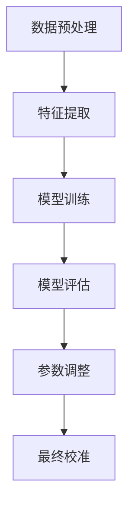
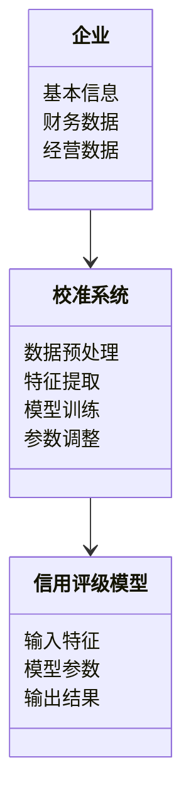
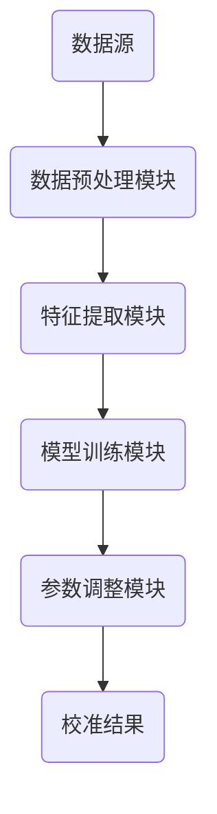
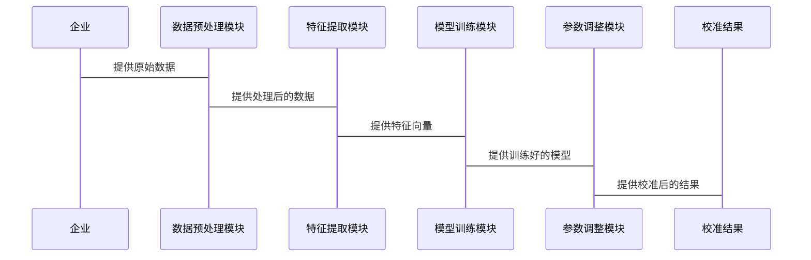

                 


# AI驱动的企业信用评级模型校准系统

> 关键词：AI, 信用评级, 模型校准, 企业信用, 机器学习, 深度学习

> 摘要：随着人工智能技术的快速发展，企业信用评级领域的传统方法逐渐暴露出诸多局限性。本文深入探讨了如何利用AI技术驱动信用评级模型的校准过程，通过系统化的分析和设计，提出了基于机器学习和深度学习的校准算法，结合实际案例展示了系统的实现与应用。本文旨在为金融领域的技术人员提供一份详尽的技术指南，帮助他们构建高效、准确的企业信用评级模型。

---

## 第1章: 企业信用评级与AI驱动模型的背景介绍

### 1.1 企业信用评级的基本概念

企业信用评级是通过对企业的财务状况、经营能力、市场表现等多维度信息进行综合评估，以确定企业信用等级的过程。信用评级结果直接关系到企业的融资成本、投资决策以及合作伙伴的选择。

#### 1.1.1 信用评级的定义与作用
信用评级是衡量企业信用风险的重要指标，其作用包括：
- **降低风险**：帮助投资者和金融机构识别高风险企业，避免潜在损失。
- **优化资源配置**：通过信用评级引导资金流向优质企业，提升整体经济效率。
- **促进市场信任**：良好的信用评级能够增强企业与合作伙伴的信任关系。

#### 1.1.2 企业信用评级的核心要素
企业信用评级的核心要素包括：
- **财务状况**：包括资产负债表、利润表、现金流等财务数据。
- **经营能力**：包括企业的市场占有率、竞争优势、管理团队能力等。
- **信用历史**：包括企业过去的还款记录、违约情况等。
- **外部环境**：包括行业趋势、宏观经济环境、政策法规等。

#### 1.1.3 传统信用评级方法的局限性
传统信用评级方法主要依赖于财务指标和专家经验，存在以下问题：
- **主观性强**：评级结果受评估人员主观判断的影响较大。
- **数据维度有限**：难以全面捕捉企业的动态信息和非财务因素。
- **效率低下**：传统方法通常需要大量人工分析，耗时且成本高。

### 1.2 AI驱动模型在信用评级中的应用背景

随着人工智能技术的快速发展，AI在金融领域的应用越来越广泛。AI驱动的信用评级模型能够通过大数据分析和机器学习算法，更精准地评估企业的信用风险。

#### 1.2.1 AI技术在金融领域的应用现状
AI技术在金融领域的应用包括：
- **智能投顾**：通过算法为投资者提供个性化的投资建议。
- **风险管理**：利用AI技术实时监控市场风险，预测潜在危机。
- **信用评估**：通过机器学习模型分析企业信用状况，评估信用风险。

#### 1.2.2 信用评级领域的痛点与挑战
信用评级领域面临的主要挑战包括：
- **数据复杂性**：企业信用评级涉及大量非结构化数据，如文本、图像等。
- **模型泛化能力不足**：传统模型难以适应不同行业和市场环境的变化。
- **实时性要求高**：金融市场对实时数据处理能力要求高。

#### 1.2.3 AI驱动模型的优势与潜力
AI驱动模型在信用评级中的优势包括：
- **高效性**：通过自动化处理大量数据，提高评级效率。
- **准确性**：机器学习算法能够发现数据中的潜在规律，提高评级准确性。
- **适应性**：AI模型可以根据市场变化动态调整评级策略。

---

## 第2章: 企业信用评级模型校准的核心概念

### 2.1 信用评级模型校准的基本原理

模型校准是通过调整模型参数，使其预测结果与实际数据更加一致的过程。

#### 2.1.1 模型校准的定义
模型校准是指通过对模型参数的调整，使得模型的预测结果与实际数据分布一致的过程。校准的目的是提高模型的预测准确性和可靠性。

#### 2.1.2 校准的目的与意义
校准的主要目的是：
- **提高预测准确性**：通过校准消除模型预测结果的偏差。
- **增强模型的可靠性**：校准后的模型能够更好地反映实际情况。
- **提升模型的可解释性**：校准过程能够帮助我们更好地理解模型的工作原理。

#### 2.1.3 校准的关键步骤
校准的关键步骤包括：
1. **数据准备**：收集和整理用于校准的数据。
2. **选择校准方法**：根据数据特点选择合适的校准算法。
3. **参数调整**：通过优化算法调整模型参数。
4. **模型验证**：验证校准后的模型是否达到预期效果。

### 2.2 AI驱动模型校准的特征对比

AI驱动模型校准与传统模型校准在方法和效果上有显著差异。

#### 2.2.1 传统模型校准与AI模型校准的对比
| 对比维度 | 传统模型校准 | AI模型校准 |
|----------|---------------|------------|
| 数据需求 | 数据量小，依赖专家经验 | 数据量大，利用大数据分析 |
| 方法 | 主观调整参数 | 自动化算法优化 |
| 效率 | 低效 | 高效 |

#### 2.2.2 基于机器学习的校准方法
基于机器学习的校准方法包括：
- **Platt校正**：通过Logistic回归模型对模型输出进行校准。
- **Sigmoid calibrated**：通过Sigmoid函数对模型输出进行调整。

#### 2.2.3 深度学习模型在校准中的应用
深度学习模型在校准中的应用包括：
- **神经网络校准**：通过神经网络对模型输出进行非线性调整。
- **自适应校准**：模型能够根据输入数据自动调整校准参数。

### 2.3 实体关系图与流程图

#### 2.3.1 企业信用评级系统的ER图
```mermaid
er
  actor(企业)
  actor(评估机构)
  actor(数据源)
  database(企业信用数据)
  database(模型参数)
  database(校准结果)
  relationship(企业 -> 企业信用数据)
  relationship(评估机构 -> 模型参数)
  relationship(数据源 -> 企业信用数据)
  relationship(企业 -> 校准结果)
```

#### 2.3.2 校准流程图


---

## 第3章: AI驱动模型校准的算法原理

### 3.1 基于机器学习的校准算法

#### 3.1.1 Platt校正方法
Platt校正是一种常用的校准方法，其数学模型如下：
$$ P(y=1|x) = \frac{1}{1 + e^{-\beta x - \alpha}} $$
其中，$\alpha$ 和 $\beta$ 是通过Logistic回归模型训练得到的参数。

#### 3.1.2 Sigmoid calibrated方法
Sigmoid校正方法通过Sigmoid函数对模型输出进行调整：
$$ P(y=1|x) = \frac{1}{1 + e^{-w^T x - b}} $$
其中，$w$ 是权重向量，$b$ 是偏置项。

#### 3.1.3 深度学习校准方法
深度学习校准方法通过神经网络对模型输出进行非线性调整，典型模型如下：
$$ y = \sigma(w_2 \sigma(w_1 x + b_1) + b_2) $$
其中，$\sigma$ 是Sigmoid函数，$w_1$、$w_2$ 是神经网络的权重，$b_1$、$b_2$ 是偏置项。

---

## 第4章: 系统分析与架构设计

### 4.1 问题场景介绍

### 4.2 系统功能设计

#### 4.2.1 领域模型


### 4.3 系统架构设计

#### 4.3.1 系统架构图


### 4.4 系统接口设计

#### 4.4.1 接口交互图


---

## 第5章: 项目实战

### 5.1 环境安装

#### 5.1.1 安装Python环境
```bash
python --version
pip install numpy
pip install pandas
pip install scikit-learn
pip install matplotlib
pip install jupyter
```

#### 5.1.2 安装深度学习框架
```bash
pip install tensorflow
pip install keras
```

### 5.2 核心代码实现

#### 5.2.1 数据预处理代码
```python
import pandas as pd
import numpy as np

# 读取数据
data = pd.read_csv('企业信用数据.csv')

# 删除缺失值
data = data.dropna()

# 标准化处理
from sklearn.preprocessing import StandardScaler
scaler = StandardScaler()
data_scaled = scaler.fit_transform(data)
```

#### 5.2.2 模型训练代码
```python
from sklearn.linear_model import LogisticRegression
from sklearn.metrics import accuracy_score

# 训练模型
model = LogisticRegression()
model.fit(X_train, y_train)

# 模型评估
print(accuracy_score(y_test, model.predict(X_test)))
```

---

## 第6章: 最佳实践与总结

### 6.1 小结

---

作者：AI天才研究院/AI Genius Institute & 禅与计算机程序设计艺术/Zen And The Art of Computer Programming

