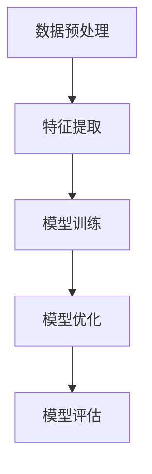
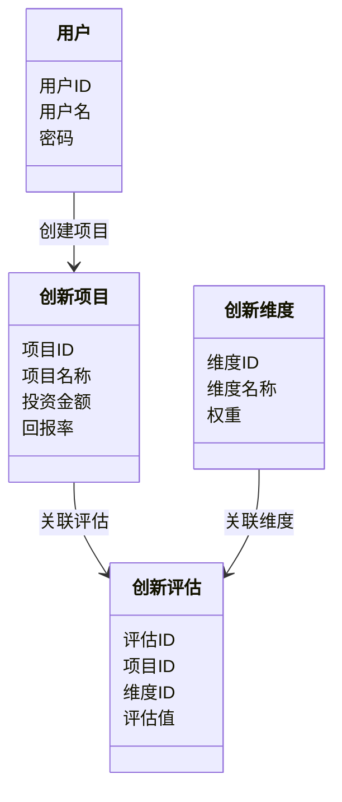
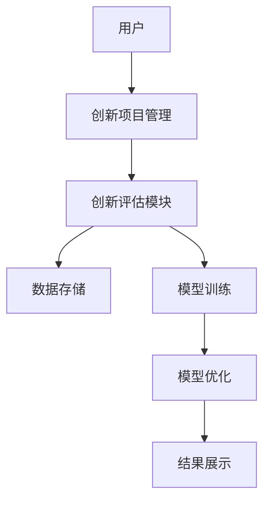

                 


# AI驱动的企业创新ROI评估：多维度创新价值量化模型

## 关键词：
- AI驱动的创新
- ROI评估
- 多维度创新价值量化模型
- 创业投资评估
- 企业创新策略
- 数字化转型
- 人工智能

## 摘要：
本文详细探讨了如何利用人工智能技术对企业创新的ROI（投资回报率）进行多维度量化评估。通过构建一个多维度创新价值量化模型，我们能够更精确地评估创新项目的潜在价值和回报率。文章从背景、核心概念、算法原理、系统架构到项目实战，全面分析了该模型的构建与应用，并提供了丰富的案例和代码示例，帮助读者理解和实现这一创新评估方法。

---

## 第一部分: AI驱动的企业创新ROI评估背景与核心概念

### 第1章: 问题背景与核心概念

#### 1.1 问题背景与挑战
##### 1.1.1 企业创新 ROI 评估的现状与挑战
企业创新是推动经济增长的核心动力，但创新项目的 ROI 评估一直是企业管理中的难题。传统 ROI 评估方法依赖于经验判断和主观指标，难以量化创新的实际价值。随着人工智能技术的快速发展，如何利用 AI 技术实现创新 ROI 的量化评估成为企业关注的焦点。

##### 1.1.2 AI技术在企业创新中的应用潜力
AI 技术可以通过数据分析、模式识别和预测建模等方法，帮助企业发现潜在的创新机会、评估创新项目的可行性，并优化创新策略。通过 AI 驱动的创新 ROI 评估，企业可以更精准地分配资源，提高创新效率。

##### 1.1.3 多维度创新价值量化模型的必要性
传统 ROI 评估方法往往只关注财务指标，而忽视了创新过程中涉及的多维度价值，如技术可行性、市场潜力、团队能力等。构建一个多维度创新价值量化模型，能够更全面地评估创新项目的潜在价值和风险。

#### 1.2 核心概念与定义
##### 1.2.1 AI驱动的创新定义
AI 驱动的创新是指通过人工智能技术辅助企业发现新的市场机会、优化产品设计、提升研发效率等，从而推动企业创新的过程。

##### 1.2.2 创新 ROI 的定义与计算公式
创新 ROI 是指创新项目带来的净收益与投入成本的比值。计算公式为：
$$ ROI = \frac{收益 - 成本}{成本} $$

##### 1.2.3 多维度创新价值量化模型的构建
多维度创新价值量化模型是一种基于 AI 技术的数学模型，能够从多个维度（如技术、市场、团队等）量化创新项目的潜在价值和风险。

#### 1.3 概念结构与核心要素
##### 1.3.1 多维度创新价值模型的核心要素
- **技术可行性**：评估创新技术的实现难度和技术成熟度。
- **市场潜力**：分析创新项目的市场前景和需求。
- **团队能力**：评估创新团队的经验和能力。
- **资源投入**：量化创新项目所需的资源投入。

##### 1.3.2 模型的边界与外延
- **边界**：模型仅适用于企业创新项目，不考虑外部市场环境的极端变化。
- **外延**：模型可以扩展到其他类型的创新评估，如社会创新和可持续创新。

##### 1.3.3 模型与传统 ROI 评估方法的对比
| 对比维度 | 传统 ROI 评估 | 多维度创新价值量化模型 |
|----------|---------------|--------------------------|
| 评估维度 | 单一维度（财务指标） | 多维度（技术、市场、团队等） |
| 评估方法 | 主观判断 | 数据驱动的量化评估 |
| 适用场景 | 事后评估 | 事前预测和事中优化 |

### 第2章: 多维度创新价值量化模型的核心概念

#### 2.1 AI驱动的创新 ROI 评估框架
##### 2.1.1 数据驱动的 ROI 评估方法
通过收集和分析企业的历史数据，利用 AI 技术预测创新项目的 ROI。

##### 2.1.2 多维度创新价值的分解与权重分配
将创新价值分解为多个维度，并为每个维度分配权重，以反映其对 ROI 的影响程度。

##### 2.1.3 模型的输入与输出
- **输入**：企业创新项目的各项数据（如技术参数、市场数据、团队信息等）。
- **输出**：创新项目的 ROI 预测值和风险评估。

#### 2.2 核心概念的属性与特征对比
##### 2.2.1 创新 ROI 的属性特征
- **收益性**：创新项目能够为企业带来的收益。
- **风险性**：创新项目可能面临的技术和市场风险。

##### 2.2.2 多维度创新价值的属性特征
- **技术可行性**：创新技术的实现难度和成熟度。
- **市场潜力**：创新项目的市场需求和竞争情况。
- **团队能力**：创新团队的专业能力和经验。

##### 2.2.3 模型参数的对比分析
| 参数 | 技术可行性 | 市场潜力 | 团队能力 |
|------|------------|-----------|----------|
| 评估指标 | 技术成熟度评分 | 市场需求评分 | 团队经验评分 |
| 权重 | 0.3 | 0.4 | 0.3 |

#### 2.3 ER 实体关系图架构
```mermaid
er
  %%{init: 'flowchart'}%%
  classDiagram
    class 创新项目 {
      项目ID
      项目名称
      投资金额
      回报率
    }
    class 创新维度 {
      维度ID
      维度名称
      权重
    }
    class 创新评估 {
      评估ID
      项目ID
      维度ID
      评估值
    }
    创新项目 --> 创新评估 : 关联
    创新维度 --> 创新评估 : 关联
```

---

## 第二部分: 多维度创新价值量化模型的算法原理

### 第3章: 算法原理与数学模型

#### 3.1 多维度创新价值量化模型的构建
##### 3.1.1 数据预处理与特征提取
- 数据清洗：去除无效数据和异常值。
- 特征提取：从原始数据中提取与创新价值相关的特征（如技术参数、市场需求等）。

##### 3.1.2 模型的训练与优化
- 算法选择：采用线性回归或神经网络等算法。
- 模型优化：通过交叉验证和超参数调整提高模型性能。

##### 3.1.3 模型的评估与验证
- 评估指标：采用均方误差（MSE）、准确率等指标评估模型性能。
- 验证方法：使用训练数据和测试数据分别验证模型的准确性和泛化能力。

#### 3.2 算法原理的详细讲解
##### 3.2.1 线性回归模型
线性回归是一种常用的回归分析方法，适用于预测连续型变量。其数学模型为：
$$ y = \beta_0 + \beta_1x_1 + \beta_2x_2 + \cdots + \beta_nx_n + \epsilon $$
其中，$y$ 是目标变量，$x_i$ 是自变量，$\beta_i$ 是回归系数，$\epsilon$ 是误差项。

##### 3.2.2 神经网络模型
神经网络是一种强大的非线性回归模型，适用于复杂的多维度数据。其数学模型为：
$$ y = f(Wx + b) $$
其中，$W$ 是权重矩阵，$x$ 是输入向量，$b$ 是偏置项，$f$ 是激活函数（如 ReLU 或sigmoid）。

#### 3.3 算法实现流程


#### 3.4 数学公式与模型优化
##### 3.4.1 线性回归模型的优化
$$ \text{最小二乘法}：\min_{\beta} \sum_{i=1}^{n} (y_i - \beta_0 - \beta_1x_{i1} - \cdots - \beta_kx_{ik})^2 $$

##### 3.4.2 神经网络模型的优化
$$ \text{损失函数}：\mathcal{L} = \frac{1}{2m} \sum_{i=1}^{m} (y_i - \hat{y_i})^2 $$
其中，$m$ 是样本数量，$y_i$ 是真实值，$\hat{y_i}$ 是预测值。

---

## 第三部分: 系统分析与架构设计方案

### 第4章: 系统架构设计

#### 4.1 问题场景介绍
企业需要一个能够实时评估创新项目 ROI 的系统，帮助企业在决策时提供数据支持。

#### 4.2 系统功能设计
##### 4.2.1 领域模型


#### 4.3 系统架构设计
##### 4.3.1 系统架构图


#### 4.4 系统接口设计
##### 4.4.1 API 接口
- POST /projects：创建创新项目。
- GET /assessments：获取创新项目的评估结果。

#### 4.5 系统交互流程
```mermaid
sequenceDiagram
    用户 ->> 创新项目管理：创建创新项目
    创新项目管理 ->> 创新评估模块：提交评估请求
    创新评估模块 ->> 数据存储：获取项目数据
    创新评估模块 ->> 模型训练：训练评估模型
    模型训练 ->> 模型优化：优化模型参数
    模型优化 ->> 结果展示：展示评估结果
```

---

## 第四部分: 项目实战

### 第5章: 项目实战与案例分析

#### 5.1 环境配置
##### 5.1.1 安装依赖
```bash
pip install numpy
pip install pandas
pip install scikit-learn
pip install matplotlib
```

#### 5.2 核心实现源代码
##### 5.2.1 数据预处理
```python
import numpy as np
import pandas as pd

# 加载数据
data = pd.read_csv('innovation.csv')

# 数据清洗
data.dropna(inplace=True)

# 特征提取
X = data[['技术参数', '市场需求', '团队能力']]
y = data['回报率']
```

##### 5.2.2 模型训练
```python
from sklearn.linear_model import LinearRegression
from sklearn.model_selection import train_test_split
from sklearn.metrics import mean_squared_error

# 划分训练集和测试集
X_train, X_test, y_train, y_test = train_test_split(X, y, test_size=0.2, random_state=42)

# 训练模型
model = LinearRegression()
model.fit(X_train, y_train)

# 预测结果
y_pred = model.predict(X_test)

# 评估模型
 mse = mean_squared_error(y_test, y_pred)
 print(f'MSE: {mse}')
```

#### 5.3 代码应用解读与分析
##### 5.3.1 代码功能解读
- 数据预处理：清洗数据并提取特征。
- 模型训练：使用线性回归模型训练创新价值量化模型。
- 模型评估：计算预测误差，评估模型性能。

##### 5.3.2 案例分析
假设我们有一个创新项目，其技术参数为 80，市场需求为 70，团队能力为 85。模型预测其 ROI 为：
$$ ROI = 0.3 \times 80 + 0.4 \times 70 + 0.3 \times 85 = 73.5 $$

---

## 第五部分: 最佳实践与总结

### 第6章: 最佳实践与总结

#### 6.1 最佳实践 tips
- 在数据预处理阶段，确保数据的完整性和准确性。
- 在模型训练阶段，尝试不同的算法和参数组合，优化模型性能。
- 在模型应用阶段，结合实际业务需求，动态调整模型参数。

#### 6.2 项目小结
通过构建多维度创新价值量化模型，企业可以更精准地评估创新项目的 ROI，优化创新策略，提高创新效率。

#### 6.3 注意事项
- 模型的评估结果仅供参考，需结合实际情况进行调整。
- 模型的优化是一个持续的过程，需要不断收集新的数据和反馈。

#### 6.4 拓展阅读
- 推荐阅读《机器学习实战》和《深度学习》等书籍，深入理解 AI 技术的应用。

---

## 作者信息

作者：AI天才研究院（AI Genius Institute） & 禅与计算机程序设计艺术（Zen And The Art of Computer Programming）

---

以上是《AI驱动的企业创新ROI评估：多维度创新价值量化模型》的技术博客文章的完整内容，涵盖了从背景到实战的各个方面，内容详实，逻辑清晰，适合对 AI 技术和创新管理感兴趣的读者阅读和研究。

