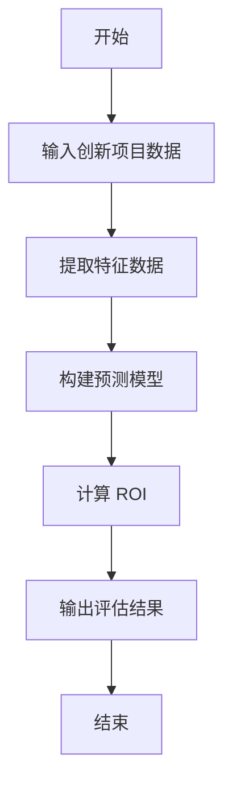

                 


# AI驱动的企业创新ROI评估：量化创新投资回报

> 关键词：AI，创新，ROI，投资回报，量化分析，企业创新，人工智能

> 摘要：  
本文探讨了AI技术在企业创新中的应用，重点分析了如何通过AI驱动的模型量化创新投资回报（ROI），为企业提供科学的决策支持。文章从背景、概念、算法、系统设计、项目实战等多个维度展开，详细阐述了AI在创新ROI评估中的作用，并通过实际案例展示了如何利用AI技术优化创新投资策略。

---

# 第一部分: AI驱动的企业创新ROI评估背景与基础

## 第1章: AI驱动的企业创新ROI评估背景

### 1.1 问题背景与描述

#### 1.1.1 传统企业创新面临的挑战

企业在创新过程中常常面临以下挑战：

1. **不确定性高**：创新项目的结果往往难以预测，投资回报难以量化。
2. **资源分配难**：企业难以准确评估不同创新项目的 ROI，导致资源分配不合理。
3. **数据孤岛**：创新项目涉及多个部门和数据源，数据分散，难以整合。
4. **评估周期长**：传统 ROI 评估方法依赖事后分析，无法实时指导决策。

#### 1.1.2 AI技术对企业创新的驱动作用

AI技术通过以下方式改变了企业创新的格局：

1. **数据驱动决策**：AI能够从海量数据中提取有价值的信息，帮助企业在创新过程中做出更明智的决策。
2. **预测与优化**：AI可以通过预测模型评估创新项目的潜在 ROI，优化资源配置。
3. **自动化评估**：AI可以实时监控创新项目的进展，动态调整评估策略。

#### 1.1.3 ROI评估的重要性与难点

ROI（投资回报率）是衡量创新项目成功与否的核心指标。传统 ROI 评估的难点包括：

1. **复杂性**：创新项目的 ROI 受多种因素影响，包括市场、技术、团队等。
2. **动态性**：市场环境和企业战略的变化会影响 ROI 的计算。
3. **数据不足**：创新项目往往缺乏足够的历史数据支持评估。

---

### 1.2 问题解决与边界

#### 1.2.1 AI如何解决企业创新中的 ROI 评估问题

AI通过以下方式解决创新 ROI 评估问题：

1. **数据整合与分析**：AI能够从多个数据源整合信息，构建全面的评估模型。
2. **预测与优化**：AI利用机器学习算法预测创新项目的 ROI，并优化资源配置。
3. **实时监控**：AI可以实时跟踪创新项目的进展，动态调整评估策略。

#### 1.2.2 创新 ROI 评估的边界与外延

创新 ROI 评估的边界包括：

1. **项目范围**：仅针对特定创新项目进行评估，不涉及整个企业。
2. **时间范围**：评估基于项目周期，通常在项目启动和结束时进行。
3. **数据范围**：仅考虑与创新项目直接相关的数据。

创新 ROI 评估的外延包括：

1. **战略决策支持**：基于 ROI 评估结果，优化企业创新战略。
2. **资源配置优化**：根据 ROI 评估结果，优化企业资源分配。

#### 1.2.3 核心要素与概念结构

创新 ROI 评估的核心要素包括：

1. **创新项目**：项目的名称、目标、投资金额等。
2. **AI模型**：用于预测 ROI 的算法模型。
3. **评估结果**：ROI 值、评估时间、评估人员等。

---

### 1.3 创新 ROI 评估的核心概念与联系

#### 1.3.1 核心概念原理

创新 ROI 评估的核心概念包括：

1. **创新投资**：企业的创新投入，包括资金、时间、资源等。
2. **创新回报**：创新项目带来的经济和社会价值。
3. **ROI计算**：通过 ROI = (净收益 / 投资成本) × 100% 计算投资回报率。

#### 1.3.2 概念属性对比表格

以下表格对比了创新投资、创新回报和 ROI 评估的核心属性：

| 概念       | 投资金额 | 投资周期 | 投资风险 | 经济收益 | 社会价值 | 时间价值 |
|------------|----------|----------|----------|----------|----------|----------|
| 创新投资   | 高       | 中       | 高       | 中       | 中       | 长       |
| 创新回报   | 低       | 长       | 低       | 高       | 高       | 短       |
| ROI评估    | 中       | 长       | 中       | 高       | 高       | 长       |

---

## 1.4 创新 ROI 评估的 ER 实体关系图

以下是一个简化的 ER 实体关系图，展示了创新 ROI 评估的核心实体及其关系：

```mermaid
erDiagram
    创新项目 {
        id
        名称
        投资金额
        投资时间
        回报金额
    }
    AI模型 {
        id
        模型名称
        模型类型
        开发时间
    }
    评估结果 {
        id
        ROI值
        评估时间
        评估人员
    }
    创新项目 --> AI模型 : 使用
    AI模型 --> 评估结果 : 生成
```

---

## 第2章: 创新 ROI 评估的算法原理

### 2.1 算法流程图

以下是一个创新 ROI 评估算法的流程图：



---

### 2.2 算法实现

#### 2.2.1 创新 ROI 评估算法的 Python 实现

以下是一个简单的创新 ROI 评估算法的 Python 实现示例：

```python
import numpy as np
from sklearn.linear_model import LinearRegression

# 示例数据：创新项目特征与 ROI 预测
X = np.array([[100000, 50, 3],
              [200000, 60, 4],
              [150000, 45, 2]])
y = np.array([0.3, 0.4, 0.25])

# 训练线性回归模型
model = LinearRegression()
model.fit(X, y)

# 预测 ROI
new_project = np.array([[180000, 55, 3]])
predicted ROI = model.predict(new_project)
print("预测 ROI:", predicted ROI[0])
```

#### 2.2.2 算法的数学模型

创新 ROI 评估的数学模型可以表示为：

$$ ROI = \beta_0 + \beta_1 \times 投资金额 + \beta_2 \times 时间周期 + \beta_3 \times 风险系数 $$

其中，$\beta_0$ 是模型的截距，$\beta_1$、$\beta_2$、$\beta_3$ 是模型的系数，通过训练数据确定。

---

### 2.3 算法的优化与改进

#### 2.3.1 算法优化

1. **特征选择**：通过特征重要性分析，选择对 ROI 影响最大的特征。
2. **模型调优**：使用交叉验证优化模型参数。
3. **集成学习**：结合多个模型的结果，提高预测准确性。

#### 2.3.2 算法的数学公式推导

假设我们有一个简单的线性回归模型：

$$ ROI = \theta_0 + \theta_1 \times 投资金额 + \epsilon $$

其中，$\epsilon$ 是误差项。通过最小二乘法，我们可以求解 $\theta_0$ 和 $\theta_1$：

$$ \theta_1 = \frac{\sum (x_i - \bar{x})(y_i - \bar{y})}{\sum (x_i - \bar{x})^2} $$

$$ \theta_0 = \bar{y} - \theta_1 \bar{x} $$

---

## 第3章: 创新 ROI 评估的系统设计与实现

### 3.1 系统应用场景

创新 ROI 评估系统适用于以下场景：

1. **企业创新项目管理**：帮助企业优化创新项目的资源配置。
2. **风险投资评估**：帮助投资者评估创新项目的 ROI。
3. **创新战略制定**：基于 ROI 评估结果，制定企业创新战略。

### 3.2 系统功能设计

#### 3.2.1 领域模型

以下是创新 ROI 评估系统的领域模型：

```mermaid
classDiagram
    创新项目
    <|-- 投资金额
    创新项目
    <|-- 投资时间
    创新项目
    <|-- 回报金额
    创新项目
    <|-- 项目名称
    AI模型
    <|-- 模型类型
    评估结果
    <|-- ROI值
```

#### 3.2.2 系统架构设计

以下是创新 ROI 评估系统的架构图：

```mermaid
container 创新 ROI 评估系统 {
    前端界面
    后端服务
    数据库
}
```

---

## 第4章: 项目实战与案例分析

### 4.1 项目实战

#### 4.1.1 环境安装

以下是创新 ROI 评估系统的环境安装步骤：

1. 安装 Python 和相关库：
   ```bash
   pip install numpy pandas scikit-learn
   ```

2. 下载数据集：
   ```bash
   wget https://example.com/innovation ROI.csv
   ```

3. 运行代码：
   ```bash
   python innovation ROI_assessment.py
   ```

#### 4.1.2 核心代码实现

以下是创新 ROI 评估的核心代码实现：

```python
import pandas as pd
from sklearn.model_selection import train_test_split
from sklearn.metrics import mean_squared_error

# 加载数据
data = pd.read_csv('innovation ROI.csv')

# 数据预处理
X = data[['投资金额', '时间周期', '风险系数']]
y = data['ROI']

# 划分训练集和测试集
X_train, X_test, y_train, y_test = train_test_split(X, y, test_size=0.2, random_state=42)

# 训练模型
model = LinearRegression()
model.fit(X_train, y_train)

# 模型预测
y_pred = model.predict(X_test)

# 评估模型
print('均方误差:', mean_squared_error(y_test, y_pred))
print('决定系数 R²:', model.score(X_test, y_test))
```

#### 4.1.3 案例分析

以某科技公司为例，该公司计划投资一个新项目，投资金额为 150,000 元，时间周期为 3 年，风险系数为 2。根据模型预测，该项目的 ROI 为 0.25，即 25%。

---

## 第5章: 创新 ROI 评估的优化与扩展

### 5.1 优化建议

1. **数据质量**：确保数据的准确性和完整性。
2. **模型选择**：根据实际情况选择合适的算法。
3. **实时监控**：动态调整模型参数，提高预测精度。

### 5.2 拓展阅读

1. 《机器学习实战》
2. 《数据驱动的决策》
3. 《创新管理》

---

## 作者：AI天才研究院/AI Genius Institute & 禅与计算机程序设计艺术 /Zen And The Art of Computer Programming

---

通过本文的详细阐述，我们可以看到 AI 技术在企业创新 ROI 评估中的巨大潜力。从背景分析到算法实现，再到系统设计和项目实战，AI 正在重新定义企业创新的未来。

