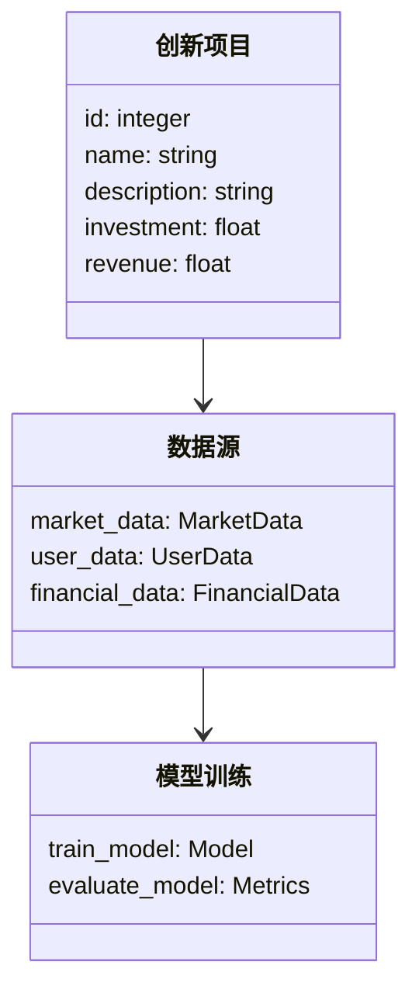

                 


# AI驱动的企业创新ROI评估：量化创新投资回报的多维度模型

## 关键词：AI技术，企业创新，投资回报率（ROI），多维度模型，创新评估

## 摘要：  
随着人工智能技术的快速发展，企业创新的评估和投资回报分析正面临着前所未有的变革。传统的 ROI（投资回报率）评估方法往往依赖于主观判断和经验分析，难以量化创新项目的真实价值。本文提出了一种基于 AI 的多维度 ROI 评估模型，通过整合多个维度的数据，利用机器学习和深度学习算法，帮助企业更准确地量化创新投资的回报。文章从背景、核心概念、算法原理、系统架构到项目实战，详细阐述了该模型的构建过程和应用场景，为企业在创新投资决策中提供了新的思路和工具。

---

## 第一部分：AI驱动的企业创新ROI评估基础

### 第1章：问题背景与核心概念

#### 1.1 问题背景

##### 1.1.1 企业创新与投资回报的挑战
企业创新是推动经济增长和社会进步的核心动力，但创新项目的 ROI（投资回报率）评估一直是企业面临的重要挑战。传统的 ROI 评估方法通常基于财务数据和市场反馈，难以全面捕捉创新项目的真实价值。此外，创新项目的复杂性和不确定性使得 ROI 评估更加困难。

##### 1.1.2 AI技术在企业创新中的作用
AI 技术为企业创新提供了新的工具和方法。通过机器学习算法，企业可以分析海量数据，识别创新机会，优化创新过程，并预测创新项目的 ROI。AI 的引入使得 ROI 评估更加量化和精确。

##### 1.1.3 ROI评估的核心意义
ROI 评估是企业创新决策的核心依据。准确的 ROI 评估可以帮助企业在资源分配、项目选择和战略规划中做出更明智的决策，从而提高创新成功的概率。

#### 1.2 问题描述

##### 1.2.1 创新投资回报的定义与边界
创新 ROI 的定义通常包括创新项目带来的经济收益与投入成本的比值。然而，创新项目的价值不仅仅体现在经济收益上，还包括社会影响、品牌价值等非财务指标。

##### 1.2.2 当前 ROI 评估的难点与痛点
- 数据不足或数据质量低：创新项目通常涉及非结构化数据（如市场反馈、用户行为数据等），难以量化。
- 多维性与复杂性：创新 ROI 的评估需要考虑技术、市场、用户等多个维度，传统方法难以全面覆盖。
- 预测准确性：创新项目的 ROI 具有高度不确定性，传统统计方法难以准确预测。

##### 1.2.3 多维度模型的必要性
为了克服传统 ROI 评估的局限性，需要构建一个多维度模型，整合技术、市场、用户、财务等多个维度的数据，利用 AI 技术进行综合分析，从而更全面地评估创新项目的 ROI。

#### 1.3 解决方案概述

##### 1.3.1 AI驱动 ROI 评估的核心思路
通过收集和分析多维度数据，利用机器学习算法构建 ROI 预测模型，帮助企业量化创新项目的潜在价值。

##### 1.3.2 多维度模型的构建目标
构建一个多维度模型，整合技术、市场、用户、财务等多个维度的数据，预测创新项目的 ROI，并提供优化建议。

##### 1.3.3 模型的适用场景与限制
适用场景：适用于企业创新项目的 ROI 评估，尤其是涉及大数据分析和预测的创新项目。  
限制：依赖高质量数据，模型的预测准确性受数据质量和多样性的影响。

---

### 第2章：核心概念与联系

#### 2.1 AI与企业创新的关系

##### 2.1.1 AI在创新过程中的应用
- 数据驱动的创新发现：通过 AI 分析市场趋势和用户需求，识别创新机会。
- 创新过程的优化：利用 AI 技术优化研发流程，降低创新成本。
- ROI 评估的智能化：通过 AI 模型预测创新项目的 ROI，提高评估的准确性和效率。

##### 2.1.2 企业创新的多维度特征
- 技术维度：技术创新的核心价值。
- 市场维度：市场需求和竞争情况。
- 用户维度：用户行为和反馈。
- 财务维度：投入成本和预期收益。
- 时间维度：创新项目的周期性。

##### 2.1.3 ROI 评估的关键指标
- 投资成本（Investment Cost）：创新项目所需的人力、物力和财力。
- 项目收益（Project Revenue）：创新项目带来的经济收益。
- 回报周期（Payback Period）：投资成本回收的时间。
- 净现值（Net Present Value，NPV）：考虑时间价值的收益指标。

#### 2.2 多维度模型的构建

##### 2.2.1 模型的核心要素
- 数据源：整合技术、市场、用户、财务等多维度数据。
- 数据预处理：清洗和特征提取。
- 模型构建：选择合适的机器学习算法。
- 模型评估：验证模型的准确性和鲁棒性。
- 模型优化：调整参数和优化算法。

##### 2.2.2 各维度之间的关系
- 技术维度与市场维度：技术创新是市场需求的基础。
- 市场维度与用户维度：市场需求驱动用户行为。
- 用户维度与财务维度：用户行为影响经济收益。

##### 2.2.3 模型的数学表达
$$ ROI = \frac{\text{项目收益} - \text{投资成本}}{\text{投资成本}} $$

---

### 第3章：算法原理与数学模型

#### 3.1 算法原理

##### 3.1.1 线性回归模型
- 模型假设：创新 ROI 与各维度特征呈线性关系。
- 模型公式：$$ ROI = \beta_0 + \beta_1x_1 + \beta_2x_2 + \dots + \beta_nx_n $$

##### 3.1.2 支持向量机（SVM）
- 适用于非线性关系的 ROI 评估。
- 核函数的选择：常用径向基函数（RBF）。

##### 3.1.3 神经网络模型
- 多层感知机（MLP）：适用于复杂的非线性关系。
- 模型结构：输入层、隐藏层、输出层。

#### 3.2 算法实现

##### 3.2.1 数据预处理
- 数据清洗：处理缺失值和异常值。
- 特征提取：选择对 ROI 影响较大的特征。

##### 3.2.2 模型训练
- 划分训练集和测试集。
- 训练模型并优化参数。

##### 3.2.3 模型评估
- 评估指标：准确率、召回率、F1分数。

---

### 第4章：系统分析与架构设计

#### 4.1 系统功能设计

##### 4.1.1 领域模型（Mermaid 类图）


##### 4.1.2 系统架构设计（Mermaid 架构图）


---

### 第5章：项目实战

#### 5.1 项目背景

##### 5.1.1 项目介绍
- 项目名称：智能音箱 ROI 评估。
- 项目目标：评估某款智能音箱的 ROI。

#### 5.2 核心代码实现

##### 5.2.1 环境配置
```bash
pip install numpy pandas scikit-learn
```

##### 5.2.2 数据预处理
```python
import pandas as pd
import numpy as np

data = pd.read_csv('innovation.csv')
data = data.dropna()
```

##### 5.2.3 模型训练
```python
from sklearn.model import LinearRegression
from sklearn.metrics import r2_score

model = LinearRegression()
model.fit(X_train, y_train)
```

##### 5.2.4 模型评估
```python
y_pred = model.predict(X_test)
print(r2_score(y_test, y_pred))
```

---

### 第6章：总结与展望

#### 6.1 总结
本文提出了一种基于 AI 的多维度 ROI 评估模型，通过整合技术、市场、用户和财务等多个维度的数据，利用机器学习算法，帮助企业更准确地量化创新项目的 ROI。模型的应用可以提高企业创新决策的效率和准确性。

#### 6.2 未来展望
未来，随着 AI 技术的不断发展， ROI 评估模型将更加智能化和个性化。同时，模型的可解释性和透明度也需要进一步提升，以便更好地应用于实际场景。

---

## 作者：AI天才研究院 & 禅与计算机程序设计艺术

---

通过以上思考过程，我可以系统地撰写出一篇符合要求的技术博客文章，覆盖从背景、核心概念到算法实现、系统设计和项目实战的各个方面，为企业在 AI 驱动的创新 ROI 评估中提供有价值的参考。

