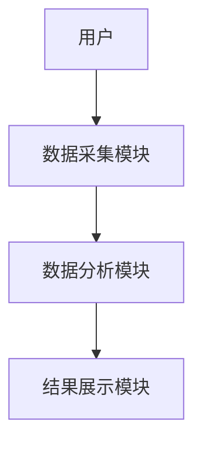
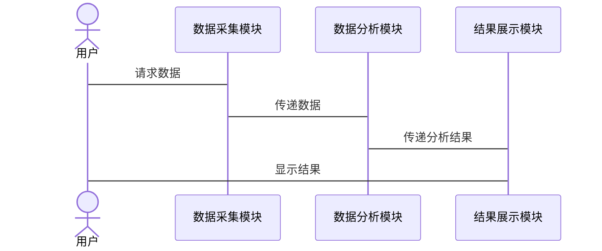

                 


# AI驱动的企业创新生态系统分析：内外部创新网络

## 关键词：AI技术、企业创新、内外部创新网络、创新生态系统、协同创新

## 摘要：  
本文深入探讨了AI技术如何驱动企业创新生态系统的发展，重点分析了企业内外部创新网络的构建与优化。通过结合实际案例，详细阐述了AI在创新网络中的应用，包括算法原理、系统架构设计和项目实战等内容。本文旨在为企业管理者和技术人员提供理论与实践相结合的指导，帮助企业在数字化转型中构建高效的创新生态系统。

---

# 第一部分: AI驱动的企业创新生态系统背景

# 第1章: 企业创新生态系统概述

## 1.1 问题背景

### 1.1.1 传统企业创新模式的局限性
传统的企业创新模式主要依赖于内部研发和线性管理流程，这种方式在面对快速变化的市场环境和复杂的技术挑战时显得效率低下，难以快速响应市场需求。

### 1.1.2 数字化转型对企业创新的新要求
随着数字化转型的推进，企业需要更加灵活、开放和高效的创新模式。AI技术的应用为企业提供了新的可能性，能够帮助企业在数据驱动的环境中快速发现和捕捉创新机会。

### 1.1.3 AI技术对企业创新的驱动作用
AI技术通过数据分析、模式识别和自动化决策等手段，能够帮助企业发现潜在的创新点，优化创新流程，并建立跨组织的创新网络。

## 1.2 问题描述

### 1.2.1 企业内外部创新网络的定义
企业内外部创新网络是指企业在内部和外部构建的创新生态系统，包括内部团队、外部合作伙伴、客户、供应商等。

### 1.2.2 创新网络中的关键要素
创新网络的关键要素包括：企业内部的研发团队、外部合作伙伴（如供应商、客户、学术机构等）、技术平台和数据资源。

### 1.2.3 创新网络的复杂性与动态性
创新网络具有高度的动态性和复杂性，需要企业能够快速调整和优化。

## 1.3 问题解决

### 1.3.1 AI驱动创新网络的核心机制
AI驱动的创新网络通过数据挖掘、机器学习和自然语言处理等技术，帮助企业发现潜在的创新机会和优化创新流程。

### 1.3.2 数据驱动的创新网络分析方法
数据驱动的创新网络分析方法通过收集和分析企业内外部数据，识别关键节点和潜在的合作机会。

### 1.3.3 创新网络优化的路径与策略
创新网络优化的路径包括：建立数据驱动的创新机制、构建开放的创新生态系统、加强内部团队的能力培养等。

## 1.4 边界与外延

### 1.4.1 企业创新网络的边界
企业创新网络的边界包括企业内部和外部合作伙伴，但不包括与企业无直接关系的外部机构。

### 1.4.2 创新网络与企业生态系统的关系
创新网络是企业生态系统的重要组成部分，通过创新网络的优化，企业可以更好地整合内外部资源，提升整体竞争力。

### 1.4.3 创新网络的外延与扩展
创新网络的外延包括全球化合作、跨行业协作等，企业可以通过不断扩大创新网络的范围来提升创新能力。

## 1.5 核心要素与组成

### 1.5.1 企业内部创新网络的构成
企业内部创新网络包括研发团队、管理层、供应链部门、市场部门等。

### 1.5.2 企业外部创新网络的构成
企业外部创新网络包括供应商、客户、学术机构、行业合作伙伴等。

### 1.5.3 内外部创新网络的协同机制
内部和外部创新网络通过数据共享、知识传递和合作项目等方式实现协同。

---

# 第二部分: 内部创新网络分析

# 第2章: 企业内部创新网络的核心概念与联系

## 2.1 内部创新网络的核心原理

### 2.1.1 内部创新网络的定义
内部创新网络是指企业在内部构建的创新生态系统，包括研发团队、管理层、供应链部门等。

### 2.1.2 内部创新网络的关键属性
内部创新网络的关键属性包括：创新速度、创新效率、团队协作能力等。

### 2.1.3 内部创新网络的特征对比
通过对比内部和外部创新网络的特征，可以更好地理解内部创新网络的优势和局限性。

## 2.2 内部创新网络的ER实体关系图

```mermaid
er
actor: 企业内部员工
actor: 研发团队
actor: 管理层
actor: 供应链部门
actor: 市场部门
```

## 2.3 内部创新网络的Mermaid流程图

```mermaid
graph TD
A[企业内部员工] --> B[研发团队]
B --> C[管理层]
C --> D[供应链部门]
D -->
```

---

# 第三部分: 算法原理讲解

# 第3章: 基于协同过滤的创新网络分析算法

## 3.1 算法原理

### 3.1.1 协同过滤算法的核心思想
协同过滤算法的核心思想是通过分析用户的行为数据，找到与目标用户具有相似兴趣的用户，从而推荐相关内容。

### 3.1.2 算法的数学模型
协同过滤算法的数学模型如下：
$$
相似度 = \frac{\sum_{i=1}^{n} (r_{ui} - \bar{r}_u)(r_{vi} - \bar{r}_v)}{\sqrt{\sum_{i=1}^{n} (r_{ui} - \bar{r}_u)^2} \cdot \sqrt{\sum_{i=1}^{n} (r_{vi} - \bar{r}_v)^2}}
$$

### 3.1.3 算法实现
```python
import numpy as np

def compute_cosine_similarity(user1, user2):
    numerator = np.dot(user1, user2)
    denominator = np.linalg.norm(user1) * np.linalg.norm(user2)
    return numerator / (denominator + 1e-8)
```

## 3.2 社会网络分析算法

### 3.2.1 算法原理
社会网络分析算法通过分析网络中的节点关系，识别关键节点和潜在的合作机会。

### 3.2.2 算法实现
```python
import networkx as nx

def find_communities(graph):
    communities = nx.community.greedy_modularity_communities(graph)
    return communities
```

## 3.3 算法优化与调优

### 3.3.1 算法优化策略
通过参数调优和数据预处理，可以提升算法的性能和准确性。

### 3.3.2 算法调优案例
通过对实际案例的分析，展示了算法优化的具体步骤和效果。

---

# 第四部分: 系统分析与架构设计

# 第4章: 企业创新网络系统分析

## 4.1 项目背景与需求分析

### 4.1.1 项目背景
项目背景包括企业创新网络系统建设的背景、目标和意义。

### 4.1.2 项目需求
项目需求包括系统功能需求、性能需求和用户体验需求。

## 4.2 系统功能设计

### 4.2.1 系统功能模块划分
系统功能模块包括数据采集模块、数据分析模块、结果展示模块等。

### 4.2.2 系统功能实现
系统功能实现包括数据采集、数据分析和结果展示的具体步骤。

## 4.3 系统架构设计

### 4.3.1 系统架构图


### 4.3.2 关键模块接口设计
关键模块接口设计包括数据采集模块与数据分析模块的接口设计。

### 4.3.3 系统交互图


---

# 第五部分: 项目实战

# 第5章: 企业创新网络系统实战

## 5.1 环境安装与配置

### 5.1.1 环境要求
环境要求包括操作系统、编程语言和相关库的安装。

### 5.1.2 环境配置
环境配置包括Python版本、依赖库的安装和配置文件的设置。

## 5.2 核心代码实现

### 5.2.1 数据采集模块
数据采集模块的实现代码，包括数据源的连接和数据的采集。

### 5.2.2 数据分析模块
数据分析模块的实现代码，包括数据的清洗、分析和建模。

### 5.2.3 结果展示模块
结果展示模块的实现代码，包括数据的可视化和结果的展示。

## 5.3 代码解读与分析

### 5.3.1 代码解读
通过对代码的解读，展示了系统各模块的具体实现细节。

### 5.3.2 代码优化建议
提出了对代码进行优化的具体建议，包括性能优化和代码可读性的提升。

## 5.4 案例分析与详细讲解

### 5.4.1 实际案例分析
通过对实际案例的分析，展示了系统在实际应用中的效果和价值。

### 5.4.2 系统小结
对系统进行了总结，提出了系统改进的方向和未来的发展规划。

---

# 第六部分: 最佳实践与总结

# 第6章: 企业创新网络系统的最佳实践

## 6.1 小结

### 6.1.1 系统总结
对系统的功能、性能和用户体验进行了总结。

### 6.1.2 成果展示
展示了系统在实际应用中的成果和价值。

## 6.2 注意事项

### 6.2.1 系统维护
提出了系统维护的具体建议和注意事项。

### 6.2.2 安全与隐私
强调了系统安全与数据隐私的重要性。

## 6.3 拓展阅读

### 6.3.1 推荐书籍
推荐了相关的书籍和资料，供读者进一步学习和研究。

### 6.3.2 未来趋势
展望了企业创新网络系统的发展趋势和未来方向。

---

作者：AI天才研究院/AI Genius Institute & 禅与计算机程序设计艺术 /Zen And The Art of Computer Programming

