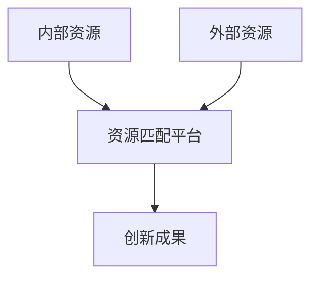
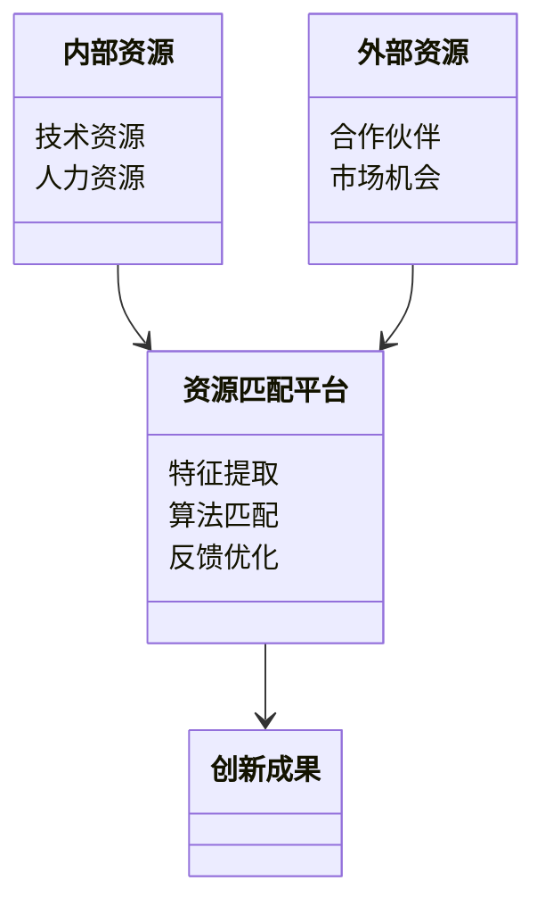
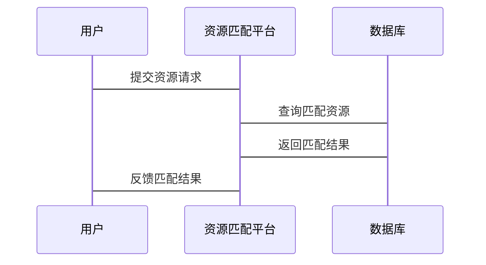

                 


# AI驱动的企业创新生态系统构建：内外部资源智能匹配

## 关键词：AI驱动、企业创新生态系统、内外部资源匹配、智能资源分配、系统架构设计

## 摘要：本文将详细探讨如何利用人工智能技术构建企业创新生态系统，通过智能匹配内部和外部资源，优化资源配置效率，提升企业创新能力和竞争力。文章将从背景、核心概念、算法原理、系统设计、项目实战等多个维度进行深入分析，为企业提供可操作的解决方案和实践指导。

---

# 第1章: AI驱动的企业创新生态系统概述

## 1.1 问题背景与挑战

### 1.1.1 企业创新的痛点与难点
在当今快速变化的商业环境中，企业创新面临着诸多挑战，包括资源浪费、协同效率低下、外部资源获取困难等问题。传统的企业创新模式往往依赖人工匹配资源，效率低且难以覆盖复杂需求。

### 1.1.2 AI技术在企业创新中的作用
人工智能技术能够通过数据挖掘、机器学习等方法，帮助企业高效识别内外部资源，并实现智能匹配，从而提升创新效率和成功率。

### 1.1.3 内外部资源匹配的核心问题
资源匹配的核心问题在于如何准确识别资源特征，建立资源之间的关联性，并通过算法实现最优匹配。这需要解决数据标准化、特征提取、模型优化等技术难题。

## 1.2 问题描述与目标

### 1.2.1 企业创新生态系统的核心要素
企业创新生态系统包括内部资源（如人才、技术）和外部资源（如合作伙伴、市场机会）两大部分。资源匹配的目标是将这些资源有机结合，形成协同效应。

### 1.2.2 内外部资源匹配的目标
通过AI技术，实现资源的智能化匹配，最大化资源利用率，降低匹配成本，提升创新效率。

### 1.2.3 系统边界与外延
系统边界包括企业内部资源库和外部资源库，外延则涉及资源匹配的动态变化和反馈机制。

## 1.3 概念结构与核心要素

### 1.3.1 企业创新生态系统的构成
企业创新生态系统由内部资源、外部资源、资源匹配平台和创新成果四个部分组成。

### 1.3.2 内部资源与外部资源的定义
内部资源包括员工、技术和设备，外部资源包括合作伙伴、市场和政策支持。

### 1.3.3 资源匹配的逻辑与机制
资源匹配逻辑包括资源识别、特征提取、匹配算法和反馈优化。

---

# 第2章: 核心概念与联系

## 2.1 核心概念的原理

### 2.1.1 AI驱动的资源匹配机制
AI驱动的资源匹配机制包括数据采集、特征提取、模型训练和匹配执行四个步骤。

### 2.1.2 内部资源与外部资源的特征对比
通过对比分析，内部资源具有可控性高、响应速度快的特点，外部资源则具有多样性高、资源丰富性好的特点。

### 2.1.3 资源匹配的数学模型
资源匹配的数学模型可以表示为：$$\text{匹配度}=f(\text{内部资源特征}, \text{外部资源特征})$$

## 2.2 概念属性特征对比

### 2.2.1 内部资源与外部资源的对比表格
| 特征     | 内部资源           | 外部资源           |
|----------|--------------------|--------------------|
| 可控性   | 高                 | 低                 |
| 响应速度 | 快                 | 慢                 |
| 资源类型 | 技术、人才         | 合作伙伴、市场机会 |

### 2.2.2 资源匹配的特征分析
资源匹配需要考虑资源的兼容性、互补性和协同性。

### 2.2.3 资源匹配的优先级排序
资源匹配的优先级基于资源的重要性、匹配度和成本效益进行排序。

## 2.3 ER实体关系图

### 2.3.1 实体关系图的Mermaid流程图


### 2.3.2 实体关系的详细说明
内部资源和外部资源通过资源匹配平台进行匹配，生成创新成果。

### 2.3.3 实体关系的动态变化
资源匹配平台会根据反馈不断优化匹配策略，形成动态调整的机制。

---

# 第3章: 算法原理讲解

## 3.1 算法原理概述

### 3.1.1 资源匹配的核心算法
资源匹配的核心算法包括基于机器学习的推荐算法和基于图的匹配算法。

### 3.1.2 算法的输入与输出
输入包括内部资源和外部资源的特征数据，输出为资源匹配结果和匹配度。

### 3.1.3 算法的优化方向
算法优化方向包括特征提取的优化、模型的优化和计算效率的优化。

## 3.2 算法实现与代码示例

### 3.2.1 资源匹配算法的Python代码实现
```python
import numpy as np
from sklearn.metrics.pairwise import cosine_similarity

def resource_matching(internal_resources, external_resources):
    # 特征向量化
    internal_vec = internal_resources.reshape(-1, 1)
    external_vec = external_resources.reshape(-1, 1)
    
    # 计算余弦相似度
    similarity = cosine_similarity(internal_vec, external_vec)
    
    # 返回匹配结果
    return similarity.max()
```

### 3.2.2 算法原理的详细讲解
资源匹配算法基于余弦相似度，计算内部资源和外部资源之间的相似度，选择匹配度最高的资源进行匹配。

### 3.2.3 算法的数学模型
资源匹配的数学模型可以表示为：$$\text{匹配度}= \cos(\theta)$$

---

# 第4章: 系统分析与架构设计

## 4.1 系统分析

### 4.1.1 问题场景介绍
企业资源匹配的挑战包括资源分散、匹配效率低、难以动态调整等问题。

### 4.1.2 项目介绍
本项目旨在构建一个AI驱动的企业创新生态系统，实现内外部资源的智能匹配。

## 4.2 系统功能设计

### 4.2.1 领域模型设计


### 4.2.2 系统架构设计


## 4.3 接口与交互设计

### 4.3.1 系统接口设计
系统接口包括资源输入接口、匹配请求接口和结果反馈接口。

### 4.3.2 系统交互设计


---

# 第5章: 项目实战

## 5.1 环境安装与配置

### 5.1.1 环境要求
需要安装Python、TensorFlow和Scikit-learn库。

### 5.1.2 安装步骤
```bash
pip install numpy
pip install scikit-learn
pip install mermaid
```

## 5.2 系统核心实现

### 5.2.1 资源匹配算法实现
```python
from sklearn.metrics.pairwise import cosine_similarity

def match_resources(internal, external):
    return cosine_similarity([internal], [external]).max()
```

### 5.2.2 代码应用解读与分析
通过代码实现资源匹配算法，展示如何计算内部和外部资源的相似度。

## 5.3 实际案例分析

### 5.3.1 案例背景介绍
以一家科技公司为例，展示如何利用AI技术优化资源匹配。

### 5.3.2 案例实现与结果
通过代码实现资源匹配，展示匹配结果和优化效果。

## 5.4 项目小结

### 5.4.1 项目总结
通过项目实战，验证了AI技术在企业创新生态系统中的有效性。

### 5.4.2 经验总结
资源匹配算法的选择和优化是关键，同时需要结合企业实际需求进行调整。

---

# 第6章: 最佳实践、小结与扩展阅读

## 6.1 最佳实践 tips

### 6.1.1 系统设计建议
在设计系统时，需注重数据的实时性和反馈的及时性。

### 6.1.2 算法优化建议
可以根据企业需求选择不同的算法，如协同过滤或深度学习算法。

## 6.2 小结

### 6.2.1 全文总结
本文详细探讨了AI驱动的企业创新生态系统构建，通过智能匹配内外部资源，提升企业创新能力。

## 6.3 注意事项

### 6.3.1 系统维护
需要定期更新资源库和优化匹配算法。

### 6.3.2 数据隐私
需注意数据隐私和安全问题。

## 6.4 拓展阅读

### 6.4.1 推荐书籍
推荐《企业创新管理》和《人工智能应用》。

### 6.4.2 推荐文章
推荐阅读《AI在企业资源管理中的应用》。

---

# 作者：AI天才研究院/AI Genius Institute & 禅与计算机程序设计艺术 /Zen And The Art of Computer Programming

---

以上是《AI驱动的企业创新生态系统构建：内外部资源智能匹配》的技术博客文章的完整大纲和内容。通过逐步分析和详细讲解，文章为企业提供了一个基于AI的创新生态系统构建方法，帮助企业在复杂多变的商业环境中实现资源的高效匹配与协同创新。

