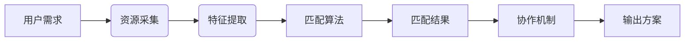
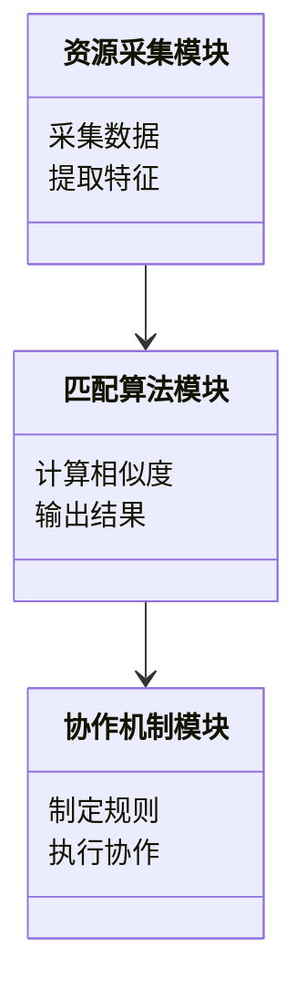

                 


# AI驱动的企业创新生态系统构建：内外部资源智能匹配与协作

**关键词**：AI、企业创新、资源匹配、协作机制、系统架构、算法原理

**摘要**：本文深入探讨了AI驱动的企业创新生态系统构建，重点分析了内外部资源的智能匹配与协作机制。通过系统化的分析与设计，结合实际项目案例，详细阐述了算法原理、系统架构、项目实现等核心内容，为企业构建高效创新生态系统提供理论支持和实践指导。

---

## 第1章: 背景介绍

### 1.1 问题背景与问题描述

#### 1.1.1 企业创新面临的挑战
企业创新是企业保持竞争力的核心驱动力。然而，企业在创新过程中常常面临以下挑战：
- **资源分散**：企业内部资源（如研发团队、技术平台）与外部资源（如合作伙伴、市场数据）难以有效整合。
- **匹配效率低**：资源匹配过程依赖人工经验，效率低下且容易出现错配。
- **协作复杂**：内外部资源的协作过程涉及多方利益，难以协调一致。

#### 1.1.2 问题描述
企业创新生态系统的核心问题在于如何高效匹配和协作内外部资源。传统方法依赖人工判断，存在以下问题：
- **信息孤岛**：内外部资源数据分散，难以形成统一的资源视图。
- **决策滞后**：资源匹配和协作决策依赖人工分析，无法快速响应市场变化。
- **效率低下**：资源匹配和协作过程耗时长，且容易错配。

#### 1.1.3 问题解决与边界外延
AI技术的引入为解决上述问题提供了新的思路。通过AI驱动的创新生态系统，企业可以实现资源的智能化匹配与协作。系统的边界包括：
- **输入**：企业内外部资源数据、市场需求数据。
- **输出**：智能化的资源匹配方案和协作策略。
- **核心要素**：数据采集、算法模型、协作机制。

### 1.2 核心概念结构与组成

#### 1.2.1 创新生态系统的组成要素
创新生态系统由以下要素组成：
- **内部资源**：企业内部的技术、团队、设备等。
- **外部资源**：外部合作伙伴、市场数据、行业趋势等。
- **匹配算法**：基于AI的资源匹配算法。
- **协作机制**：资源协作的具体规则和流程。

#### 1.2.2 内外部资源的特征与属性
- **内部资源**：
  - 属性：技术性、可用性、成本。
  - 特征：可控性高、响应速度快。
- **外部资源**：
  - 属性：灵活性、多样性、可扩展性。
  - 特征：资源丰富、但难以直接控制。

#### 1.2.3 智能匹配与协作的机制
智能匹配与协作机制包括：
- **数据采集**：整合企业内外部资源数据。
- **特征提取**：提取资源的关键特征。
- **匹配算法**：基于特征的资源匹配算法。
- **协作规则**：根据匹配结果制定协作规则。

---

## 第2章: AI驱动的创新生态系统原理

### 2.1 AI在资源匹配中的作用

#### 2.1.1 大模型的应用
大模型（如GPT、BERT）在资源匹配中的应用包括：
- **自然语言处理**：从文本数据中提取资源特征。
- **模式识别**：识别资源之间的关联性。
- **预测模型**：预测资源匹配的概率。

#### 2.1.2 匹配算法的选择
常用的匹配算法包括：
- **协同过滤算法**：基于用户行为的资源推荐。
- **聚类算法**：将相似资源聚类。
- **图神经网络**：基于图结构的资源匹配。

#### 2.1.3 资源匹配的评价指标
资源匹配的评价指标包括：
- **准确率**：匹配结果的准确性。
- **召回率**：匹配结果的覆盖率。
- **F1值**：准确率和召回率的调和平均。

### 2.2 实体关系图与流程图分析

#### 2.2.1 实体关系图
```mermaid
er
    entity(内部资源) {
        id
        name
        type
    }
    entity(外部资源) {
        id
        name
        type
    }
    entity(匹配算法) {
        id
        name
        type
    }
    entity(协作机制) {
        id
        name
        type
    }
    relation(匹配关系) {
        内部资源
        与
        外部资源
        关联
    }
```

#### 2.2.2 流程图分析


---

## 第3章: 算法原理与实现

### 3.1 协同过滤算法实现

#### 3.1.1 算法流程
1. 数据预处理：提取用户行为数据。
2. 特征提取：计算资源的相似度。
3. 匹配计算：基于相似度推荐资源。
4. 输出结果：匹配结果。

#### 3.1.2 Python代码实现
```python
import numpy as np

# 示例数据：资源特征向量
resource_features = np.array([
    [1, 0, 1],
    [0, 1, 1],
    [1, 1, 0]
])

# 计算资源相似度
def calculate_similarity(resource_features):
    similarity_matrix = np.dot(resource_features, resource_features.T)
    return similarity_matrix

similarity_matrix = calculate_similarity(resource_features)
print(similarity_matrix)
```

#### 3.1.3 算法数学模型
资源匹配的概率计算公式：
$$ P(i,j) = \frac{\sum_{k=1}^{n} w_{ik} \cdot w_{jk}}{\sqrt{\sum_{k=1}^{n} w_{ik}^2} \cdot \sqrt{\sum_{k=1}^{n} w_{jk}^2}} $$

---

## 第4章: 系统架构与设计

### 4.1 系统功能设计

#### 4.1.1 领域模型类图


#### 4.1.2 系统架构图
```mermaid
container 资源采集模块 {
    组件 数据采集
    组件 特征提取
}
container 匹配算法模块 {
    组件 相似度计算
    组件 匹配结果
}
container 协作机制模块 {
    组件 协作规则
    组件 协作执行
}
```

---

## 第5章: 项目实战与案例分析

### 5.1 环境安装与配置

#### 5.1.1 Python环境安装
```bash
pip install numpy
pip install scikit-learn
```

### 5.2 核心功能实现

#### 5.2.1 资源匹配代码
```python
from sklearn.metrics.pairwise import cosine_similarity

resource_features = np.array([
    [1, 0, 1],
    [0, 1, 1],
    [1, 1, 0]
])

similarity = cosine_similarity(resource_features)
print(similarity)
```

#### 5.2.2 算法实现与解读
- **代码功能**：计算资源特征向量的余弦相似度。
- **输出结果**：输出资源之间的相似度矩阵。

### 5.3 案例分析

#### 5.3.1 案例背景
某企业希望匹配内部技术团队与外部合作伙伴。

#### 5.3.2 实施步骤
1. 采集数据：内部团队技能数据与外部合作伙伴数据。
2. 特征提取：提取团队技能关键词。
3. 匹配算法：计算相似度。
4. 输出结果：匹配最优合作伙伴。

---

## 第6章: 总结与展望

### 6.1 最佳实践 tips
- **数据质量**：确保数据的准确性和完整性。
- **算法选择**：根据实际需求选择合适的算法。
- **协作机制**：制定清晰的协作规则和流程。

### 6.2 项目小结
通过AI驱动的企业创新生态系统，企业可以实现内外部资源的智能匹配与协作，提升创新效率和竞争力。

### 6.3 注意事项
- **数据隐私**：注意数据隐私和安全问题。
- **系统维护**：定期更新算法模型和数据。

### 6.4 拓展阅读
- 推荐阅读《机器学习实战》和《深度学习入门》。

---

**作者：AI天才研究院（AI Genius Institute） & 禅与计算机程序设计艺术（Zen And The Art of Computer Programming）**

