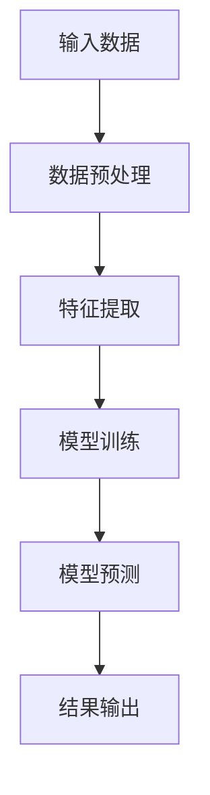
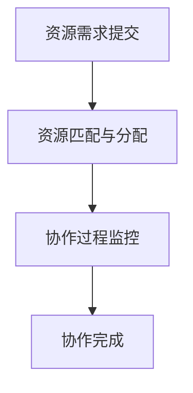
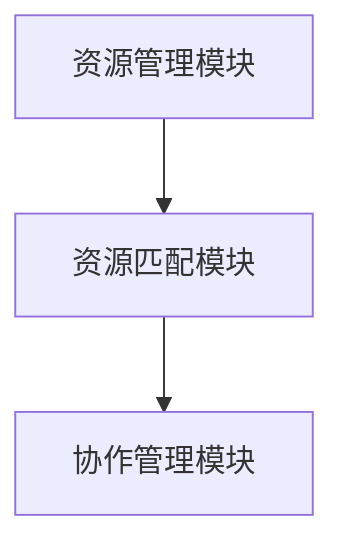
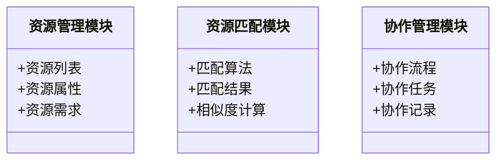
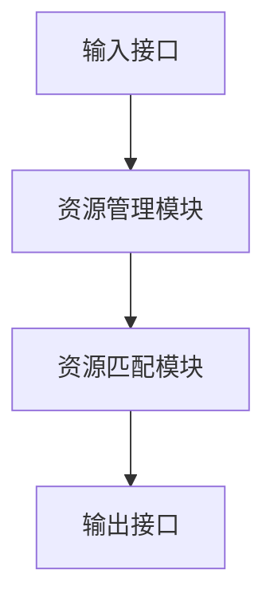
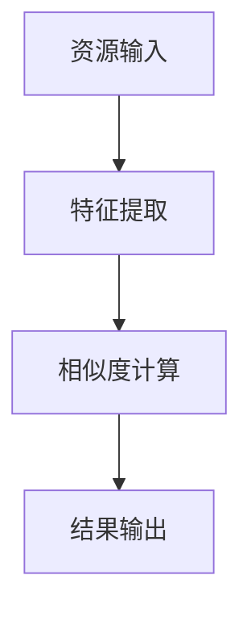

                 


# AI驱动的企业创新生态系统构建：内外部资源智能匹配与协作平台

## 关键词：AI驱动，企业创新生态系统，资源匹配，协作平台，系统架构

## 摘要：本文详细探讨了如何利用人工智能技术构建企业创新生态系统，通过内外部资源的智能匹配与协作，提升企业的创新能力。文章从理论基础、算法实现、系统设计到项目实战，全面分析了AI驱动的资源匹配协作平台的构建过程，为企业的创新管理提供了新的思路和方法。

---

### 第1章 AI驱动的企业创新生态系统概述

#### 1.1 企业创新生态系统的核心概念
##### 1.1.1 企业创新生态系统的定义
企业创新生态系统是指由企业内部资源（如员工、技术、数据）和外部资源（如合作伙伴、供应商、客户）共同构成的复杂系统，通过智能匹配和协作，实现创新价值的最大化。

##### 1.1.2 AI在企业创新生态系统中的作用
人工智能技术能够通过数据分析、模式识别和自动化匹配，优化企业内外部资源的配置，提高创新效率。

##### 1.1.3 企业创新生态系统的核心要素
- **内部资源**：员工、技术、数据
- **外部资源**：合作伙伴、供应商、客户
- **协作机制**：智能匹配算法、协同工具

#### 1.2 外部资源与内部资源的匹配问题
##### 1.2.1 企业内外部资源的分类
- 内部资源：研发团队、专利技术
- 外部资源：合作伙伴、市场数据

##### 1.2.2 资源匹配的挑战与机遇
- 挑战：信息不对称、匹配效率低
- 机遇：AI技术提升匹配精准度

##### 1.2.3 智能匹配平台的必要性
通过AI技术实现资源的智能匹配，降低协作成本，提升创新效率。

#### 1.3 本章小结
企业创新生态系统的核心在于资源的智能匹配与协作，AI技术的应用为这一目标提供了可能。

---

### 第2章 外部资源与内部资源的智能匹配理论

#### 2.1 资源匹配的理论基础
##### 2.1.1 资源匹配的定义与分类
资源匹配是指将企业内外部资源按照一定的规则进行配对，以实现最佳的协同效果。

##### 2.1.2 资源匹配的核心原则
- 相似性原则：资源属性相似性越高，匹配效果越好
- 互补性原则：资源之间互补性越强，匹配效果越好

##### 2.1.3 资源匹配的评价指标
- 匹配度：资源匹配的相关性
- 匹配效率：匹配所需的时间和资源

#### 2.2 基于AI的资源匹配模型
##### 2.2.1 模型的构建与优化
资源匹配模型基于机器学习算法，通过训练数据优化模型参数。

##### 2.2.2 模型的输入与输出
- 输入：资源属性、历史匹配数据
- 输出：资源匹配概率、匹配建议

##### 2.2.3 模型的训练与验证
使用训练数据训练模型，通过验证数据评估模型性能。

#### 2.3 资源匹配的算法实现
##### 2.3.1 算法的流程图（Mermaid）


##### 2.3.2 算法的Python实现
```python
# 示例代码
import numpy as np
from sklearn.metrics.pairwise import cosine_similarity

def resource_matching_algorithm(embeddings):
    similarity_matrix = cosine_similarity(embeddings)
    return similarity_matrix
```

#### 2.4 本章小结
基于AI的资源匹配模型能够有效提升资源匹配的效率和准确性。

---

### 第3章 AI驱动的内外部资源协作机制

#### 3.1 协作流程
##### 3.1.1 资源需求识别
通过数据分析识别企业内外部资源的需求。

##### 3.1.2 资源匹配与分配
基于AI算法进行资源匹配与分配。

##### 3.1.3 协作过程监控
实时监控协作过程，确保协作顺利进行。

#### 3.2 协作模式
##### 3.2.1 协作模式的分类
- 独立协作模式
- 联合协作模式
- 网络协作模式

##### 3.2.2 协作模式的优缺点
- 独立协作模式：灵活性高，但协作效率低
- 联合协作模式：协作效率高，但灵活性低
- 网络协作模式：灵活性高且协作效率高

#### 3.3 协作平台的运行机制
##### 3.3.1 平台的功能模块
- 资源需求提交
- 资源匹配与分配
- 协作过程监控

##### 3.3.2 平台的运行流程


#### 3.4 本章小结
AI驱动的协作机制能够有效提升企业内外部资源的协作效率和效果。

---

### 第4章 内外部资源智能匹配与协作平台的设计

#### 4.1 系统架构设计
##### 4.1.1 系统架构的模块划分
- 资源管理模块
- 资源匹配模块
- 协作管理模块

##### 4.1.2 系统架构的Mermaid图


#### 4.2 系统功能设计
##### 4.2.1 功能模块的类图（Mermaid）


#### 4.3 系统接口设计
##### 4.3.1 系统接口的定义
- 输入接口：资源需求
- 输出接口：匹配结果

##### 4.3.2 系统接口的交互流程


#### 4.4 本章小结
系统架构设计为平台的实现提供了清晰的指导。

---

### 第5章 平台的实现与算法实现

#### 5.1 算法的实现细节
##### 5.1.1 算法的数学模型
$$相似度计算：similarity = \frac{\vec{a} \cdot \vec{b}}{||\vec{a}|| \cdot ||\vec{b}||}$$

##### 5.1.2 算法的优化策略
- 参数优化
- 模型优化

#### 5.2 系统实现的细节
##### 5.2.1 系统实现的代码示例
```python
def match_resources(resources):
    embeddings = resources_embeddings(resources)
    similarity_matrix = cosine_similarity(embeddings)
    return similarity_matrix
```

##### 5.2.2 系统实现的流程图


#### 5.3 本章小结
算法的实现为平台的运行提供了核心动力。

---

### 第6章 项目实战

#### 6.1 项目背景与需求分析
##### 6.1.1 项目背景
- 企业资源匹配效率低
- 创新能力不足

##### 6.1.2 项目需求
- 提升资源匹配效率
- 提高创新能力

#### 6.2 系统设计与实现
##### 6.2.1 系统设计
- 功能模块设计
- 系统架构设计

##### 6.2.2 系统实现
- 代码实现
- 系统测试

#### 6.3 项目总结
##### 6.3.1 项目成果
- 提升资源匹配效率
- 提高创新能力

##### 6.3.2 项目经验
- 系统设计的重要性
- 算法优化的必要性

#### 6.4 本章小结
项目实战验证了理论的可行性。

---

### 第7章 系统优化与扩展

#### 7.1 系统优化策略
##### 7.1.1 性能优化
- 算法优化
- 系统架构优化

##### 7.1.2 可扩展性优化
- 模块化设计
- 异构资源支持

#### 7.2 系统扩展方向
##### 7.2.1 新功能开发
- 更多资源类型的匹配
- 更复杂的协作模式

##### 7.2.2 新技术应用
- 区块链技术
- 边缘计算

#### 7.3 本章小结
系统优化与扩展为平台的未来发展提供了方向。

---

### 第8章 总结与展望

#### 8.1 全文总结
本文详细探讨了AI驱动的企业创新生态系统构建的内外部资源智能匹配与协作平台的构建过程，从理论到实践，为企业的创新管理提供了新的思路。

#### 8.2 未来展望
未来，随着AI技术的不断发展，企业创新生态系统将更加智能化和高效化。

---

### 作者：AI天才研究院/AI Genius Institute & 禅与计算机程序设计艺术 /Zen And The Art of Computer Programming

