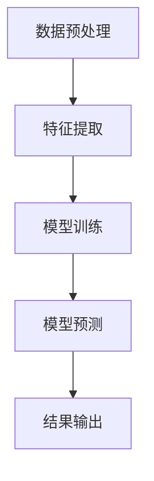
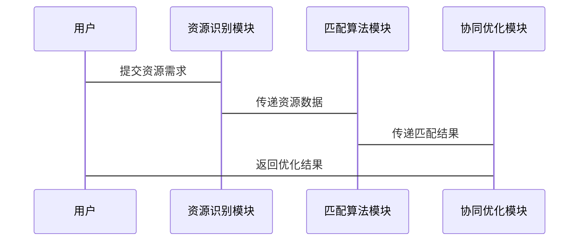

                 


# AI驱动的企业创新生态系统构建：内外部资源智能匹配与协同

> 关键词：企业创新、AI驱动、资源匹配、系统架构、协同优化

> 摘要：本文深入探讨了AI驱动的企业创新生态系统构建中的内外部资源智能匹配与协同问题。通过系统化的分析和设计，提出了基于AI的资源匹配算法和协同优化机制，构建了一个完整的创新生态系统架构，并通过实际案例验证了该方法的有效性。

---

## 第1章：AI驱动的企业创新生态系统概述

### 1.1 问题背景与挑战

#### 1.1.1 企业创新面临的传统问题

企业在创新过程中常常面临以下挑战：

- **资源分散**：企业内部资源（如人才、技术、数据）和外部资源（如合作伙伴、供应商、客户）往往分散在不同的部门或系统中，难以有效整合。
- **匹配效率低**：传统的人工匹配方式效率低下，且容易受到主观因素的影响，难以实现最优匹配。
- **协同困难**：内外部资源之间的协同效率不高，导致创新过程中的资源浪费和周期延长。

#### 1.1.2 数字化转型中的AI机遇

随着AI技术的快速发展，企业可以通过智能化手段实现资源的高效匹配与协同。AI技术能够帮助企业：

- **自动化识别资源需求**：通过自然语言处理（NLP）和知识图谱技术，自动识别企业内部和外部资源的需求。
- **智能推荐与匹配**：基于机器学习算法，实现资源的智能推荐和精准匹配。
- **实时协同优化**：通过动态优化算法，实时调整资源分配，确保资源的最优利用。

#### 1.1.3 内外部资源匹配的核心问题

内外部资源匹配的核心问题在于如何通过AI技术实现资源的高效识别、智能推荐和动态优化。具体包括：

- **资源识别**：如何准确识别企业内部和外部资源的属性、需求和潜力。
- **资源匹配**：如何基于资源的属性和需求，实现快速、精准的匹配。
- **协同优化**：如何通过动态调整资源分配，实现创新过程中的协同优化。

### 1.2 问题描述与目标

#### 1.2.1 企业创新生态系统的核心要素

企业创新生态系统由以下核心要素构成：

- **内部资源**：包括企业内部的人才、技术、数据等资源。
- **外部资源**：包括合作伙伴、供应商、客户、第三方服务提供商等外部资源。
- **创新过程**：包括需求识别、资源匹配、协同创新、成果输出等环节。

#### 1.2.2 内外部资源匹配的目标

内外部资源匹配的目标是通过AI技术实现资源的高效识别、智能推荐和动态优化，从而：

- **提高创新效率**：通过快速匹配资源，缩短创新周期。
- **降低资源浪费**：通过精准匹配，减少资源的浪费。
- **提升协同效果**：通过动态优化，实现资源的最优协同。

#### 1.2.3 系统边界与外延

系统边界包括企业内部资源和外部资源的识别、匹配和协同优化过程。系统外延则包括资源的实际应用和创新成果的输出。

### 1.3 核心概念与联系

#### 1.3.1 内外部资源的定义与属性

| 资源类型 | 属性         | 示例                     |
|----------|--------------|--------------------------|
| 内部资源 | 人才、技术、数据 | 研发团队、专利技术、内部数据库 |
| 外部资源 | 合作伙伴、供应商、客户 | 第三方服务提供商、供应商、客户 |

#### 1.3.2 资源匹配的核心逻辑

资源匹配的核心逻辑包括以下步骤：

1. **资源识别**：通过数据采集和分析，识别资源的属性和需求。
2. **资源推荐**：基于资源匹配算法，推荐最优匹配方案。
3. **协同优化**：通过动态调整资源分配，实现协同优化。

#### 1.3.3 实体关系图（ER图）

```mermaid
erDiagram
    actor 企业内部资源
    actor 企业外部资源
    actor 创新过程
    企业内部资源 --> 创新过程 : 提供内部资源
    企业外部资源 --> 创新过程 : 提供外部资源
    创新过程 --> 资源匹配系统 : 实现资源匹配
```

---

## 第2章：AI驱动的内外部资源协同机制

### 2.1 内部资源的数字化管理

#### 2.1.1 企业内部资源的分类

企业内部资源可以分为以下几类：

- **人力资源**：包括研发团队、市场团队等。
- **技术资源**：包括专利技术、研发工具等。
- **数据资源**：包括内部数据库、客户数据等。

#### 2.1.2 数字化管理的实现方式

数字化管理的实现方式包括：

1. **数据采集**：通过API或手动输入，采集企业内部资源的数据。
2. **数据存储**：将资源数据存储在数据库中，便于后续处理。
3. **数据分析**：通过机器学习算法，分析资源的属性和需求。

#### 2.1.3 内部资源协同的关键点

内部资源协同的关键点包括：

- **资源分配的合理性**：确保资源分配合理，避免资源浪费。
- **协同效率的提升**：通过AI技术，提高内部资源的协同效率。

### 2.2 外部资源的智能匹配

#### 2.2.1 外部资源的获取与筛选

外部资源的获取与筛选包括以下步骤：

1. **资源获取**：通过公开数据源或合作伙伴，获取外部资源的数据。
2. **资源筛选**：基于预设的筛选条件，筛选出符合需求的外部资源。

#### 2.2.2 智能匹配算法的实现

智能匹配算法的实现步骤如下：

1. **数据预处理**：对内外部资源数据进行清洗和预处理。
2. **特征提取**：提取资源的关键特征，如资源类型、需求类型等。
3. **匹配算法**：基于机器学习算法，实现资源的智能匹配。

#### 2.2.3 外部资源协同的挑战

外部资源协同的挑战包括：

- **数据隐私问题**：外部资源的数据隐私问题需要严格保护。
- **协同效率问题**：外部资源的协同效率可能受到地域、组织结构等因素的影响。

### 2.3 内外部资源协同的实现路径

#### 2.3.1 资源识别与需求分析

资源识别与需求分析包括以下步骤：

1. **资源识别**：通过数据采集和分析，识别内外部资源的属性和需求。
2. **需求分析**：基于资源的属性和需求，进行深入分析。

#### 2.3.2 资源匹配的策略选择

资源匹配的策略选择包括：

- **基于相似度的匹配**：根据资源的相似度，进行匹配。
- **基于规则的匹配**：根据预设的规则，进行匹配。
- **基于机器学习的匹配**：基于机器学习模型，进行匹配。

#### 2.3.3 协同机制的设计与优化

协同机制的设计与优化包括：

1. **协同机制设计**：设计协同机制，确保资源的高效协同。
2. **协同优化**：通过动态调整，优化协同效果。

---

## 第3章：AI驱动的资源匹配算法原理

### 3.1 资源匹配的核心算法

#### 3.1.1 基于机器学习的匹配模型

基于机器学习的匹配模型包括以下步骤：

1. **数据预处理**：对数据进行清洗和特征提取。
2. **模型训练**：基于训练数据，训练机器学习模型。
3. **模型预测**：利用训练好的模型，进行资源匹配预测。

#### 3.1.2 基于图论的资源网络构建

基于图论的资源网络构建包括以下步骤：

1. **构建资源网络**：将资源视为图中的节点，资源之间的关系视为边。
2. **网络分析**：通过图论算法，分析资源网络的结构。

#### 3.1.3 基于规则的匹配策略

基于规则的匹配策略包括：

- **规则定义**：定义资源匹配的规则。
- **规则应用**：基于规则，进行资源匹配。

### 3.2 资源协同的数学模型

#### 3.2.1 资源匹配的数学表达

资源匹配的数学表达可以表示为：

$$
\text{匹配度} = \sum_{i=1}^{n} w_i \cdot x_i
$$

其中，$w_i$ 是第$i$个特征的权重，$x_i$ 是第$i$个特征的值。

#### 3.2.2 协同优化的目标函数

协同优化的目标函数可以表示为：

$$
\text{目标函数} = \sum_{i=1}^{m} \lambda_i \cdot f_i
$$

其中，$\lambda_i$ 是第$i$个目标函数的权重，$f_i$ 是第$i$个目标函数。

#### 3.2.3 约束条件与优化目标

约束条件包括：

$$
\sum_{i=1}^{n} x_i \leq 1
$$

优化目标包括：

$$
\text{最大化匹配度}
$$

### 3.3 算法实现与流程图

#### 3.3.1 算法实现步骤

1. **数据预处理**：对数据进行清洗和特征提取。
2. **模型训练**：基于训练数据，训练机器学习模型。
3. **模型预测**：利用训练好的模型，进行资源匹配预测。

#### 3.3.2 算法流程图



#### 3.3.3 代码实现示例

以下是一个基于机器学习的资源匹配算法的Python代码示例：

```python
import numpy as np
from sklearn.linear_model import LinearRegression

# 数据预处理
X = np.array([[1, 2], [3, 4], [5, 6]])
y = np.array([2, 4, 6])

# 模型训练
model = LinearRegression()
model.fit(X, y)

# 模型预测
new_X = np.array([[7, 8]])
predicted_y = model.predict(new_X)
print(predicted_y)
```

---

## 第4章：企业创新生态系统架构设计

### 4.1 系统功能模块设计

#### 4.1.1 资源识别模块

资源识别模块的功能包括：

- 数据采集与清洗
- 资源属性提取

#### 4.1.2 匹配算法模块

匹配算法模块的功能包括：

- 资源匹配算法实现
- 匹配结果输出

#### 4.1.3 协同优化模块

协同优化模块的功能包括：

- 协同机制设计
- 协同优化实现

### 4.2 系统架构设计

#### 4.2.1 分层架构设计

分层架构设计包括以下层次：

1. **数据层**：存储资源数据。
2. **业务逻辑层**：实现资源匹配和协同优化逻辑。
3. **用户界面层**：提供用户交互界面。

#### 4.2.2 微服务架构设计

微服务架构设计包括以下服务：

1. **资源识别服务**
2. **匹配算法服务**
3. **协同优化服务**

#### 4.2.3 架构交互流程图



### 4.3 系统接口设计

#### 4.3.1 内部接口设计

内部接口设计包括：

- 资源识别模块与匹配算法模块之间的接口
- 匹配算法模块与协同优化模块之间的接口

#### 4.3.2 外部接口设计

外部接口设计包括：

- 用户与系统之间的接口
- 第三方服务与系统之间的接口

#### 4.3.3 接口交互协议

接口交互协议包括：

- RESTful API
- RPC协议

---

## 第5章：项目实战与案例分析

### 5.1 项目环境安装与配置

#### 5.1.1 安装Python环境

安装Python环境的具体步骤：

1. 下载并安装Python 3.x
2. 配置环境变量
3. 安装必要的Python库（如numpy、scikit-learn）

#### 5.1.2 安装机器学习框架

安装机器学习框架的具体步骤：

1. 安装scikit-learn
2. 安装其他必要的库

#### 5.1.3 配置数据库

配置数据库的具体步骤：

1. 安装数据库（如MySQL）
2. 创建数据库和表
3. 配置数据库连接信息

### 5.2 系统核心实现

#### 5.2.1 资源识别模块实现

资源识别模块的实现代码：

```python
import pandas as pd

# 数据加载
data = pd.read_csv('resources.csv')

# 数据清洗
data.dropna(inplace=True)

# 特征提取
features = data[['feature1', 'feature2']]
```

#### 5.2.2 匹配算法模块实现

匹配算法模块的实现代码：

```python
from sklearn.model

