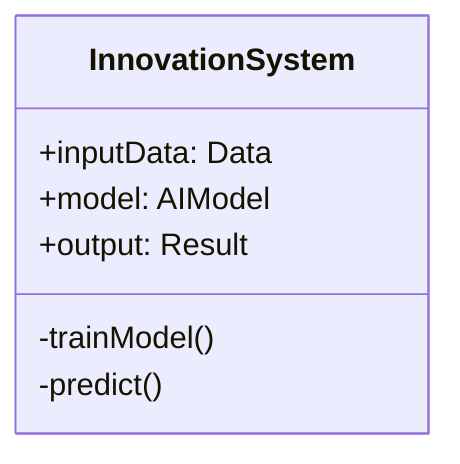
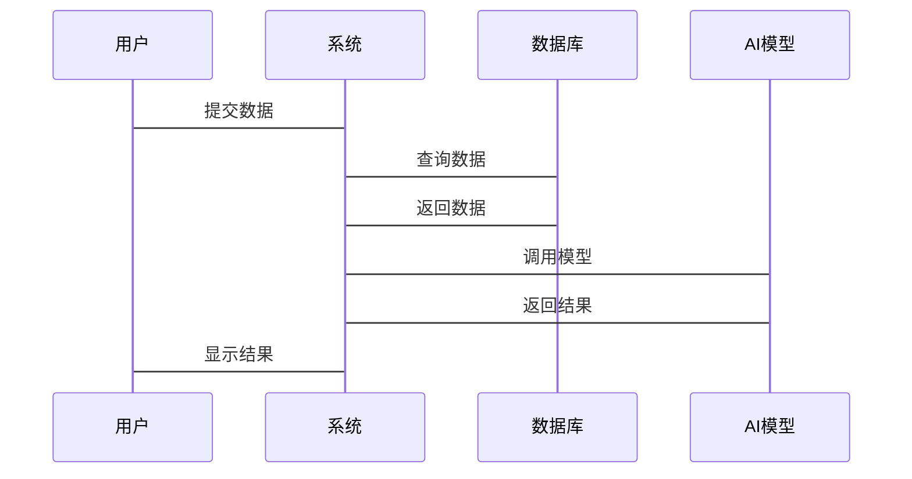

                 


# AI驱动的企业创新生态系统评估：内外部创新能力量化

## 关键词
AI驱动, 企业创新生态系统, 内外部创新能力, 创新评估, 机器学习

## 摘要
在当前快速变化的商业环境中，企业创新生态系统的重要性日益凸显。通过AI驱动的方法，我们可以系统地评估企业的内外部创新能力，从而为企业的战略决策提供数据支持。本文将详细探讨如何量化内外部创新能力，构建创新生态系统评估模型，并通过AI算法进行优化。

---

# 第1章: AI驱动的企业创新生态系统概述

## 1.1 企业创新生态系统的基本概念
### 1.1.1 企业创新的定义与内涵
企业的创新能力是企业在市场中保持竞争力的关键。创新不仅包括产品和服务的创新，还包括商业模式、管理方法和组织结构的创新。

### 1.1.2 创新生态系统的核心要素
创新生态系统由以下几个核心要素组成：
1. **企业内部创新机制**：包括研发团队、创新文化、内部流程等。
2. **外部创新资源**：包括合作伙伴、供应商、客户、学术机构等。
3. **市场环境**：包括行业趋势、政策法规、竞争状况等。

### 1.1.3 AI在企业创新中的作用
AI技术可以帮助企业更好地识别创新机会，优化创新过程，并预测创新成果的市场表现。

---

## 1.2 企业内外部创新能力的定义
### 1.2.1 内部创新能力的内涵
内部创新能力是指企业在内部资源和能力的基础上，进行创新活动的能力。主要包括研发能力、技术储备、人才储备等。

### 1.2.2 外部创新能力的内涵
外部创新能力是指企业通过与外部资源合作，获取外部知识和技术的能力。主要包括合作伙伴数量、外部研发投入、市场反馈等。

### 1.2.3 内外部创新能力的关系
内外部创新能力相辅相成，内部能力是基础，外部能力是补充。两者的结合能够提升企业的整体创新能力。

---

## 1.3 企业创新生态系统评估的重要性
### 1.3.1 企业创新对竞争力的影响
创新是企业保持竞争优势的关键。通过创新，企业可以不断推出新产品，满足市场需求。

### 1.3.2 创新生态系统评估的意义
通过评估创新生态系统，企业可以识别自身的创新优势和短板，制定针对性的创新战略。

### 1.3.3 AI驱动评估的优势
AI技术可以帮助企业快速分析大量数据，提供客观的评估结果，并预测未来的创新趋势。

---

## 1.4 本章小结
本章介绍了企业创新生态系统的基本概念，定义了内外部创新能力，并探讨了AI在创新评估中的作用。下一章将详细讲解内外部创新能力的量化方法。

---

# 第2章: 企业内外部创新能力的量化方法

## 2.1 内部创新能力的量化指标
### 2.1.1 R&D投入
R&D投入是衡量企业内部创新能力的重要指标。包括研发投入金额、研发人员数量等。

### 2.1.2 人才储备
人才储备包括企业内部的研发团队规模、高级人才比例等。

### 2.1.3 技术储备
技术储备包括企业拥有的专利数量、技术领先性等。

---

## 2.2 外部创新能力的量化指标
### 2.2.1 合作伙伴数量与质量
合作伙伴数量越多，质量越高，外部创新能力越强。

### 2.2.2 市场反馈与用户需求
通过分析市场反馈和用户需求，可以评估企业外部创新能力。

### 2.2.3 行业趋势与竞争分析
行业趋势和竞争分析可以帮助企业识别外部创新机会。

---

## 2.3 内外部创新能力的综合评估模型
### 2.3.1 模型构建逻辑
综合评估模型将内外部创新能力作为输入，通过加权平均的方式，计算出综合创新能力得分。

### 2.3.2 模型权重分配
权重分配可以根据企业的实际情况进行调整。例如，内部能力权重为0.6，外部能力权重为0.4。

### 2.3.3 模型验证与优化
通过实际数据验证模型的准确性，并根据反馈进行优化。

---

## 2.4 本章小结
本章详细介绍了内外部创新能力的量化指标，并构建了一个综合评估模型。下一章将探讨AI在创新生态系统评估中的应用。

---

# 第3章: AI驱动的创新生态系统评估理论

## 3.1 机器学习在创新评估中的应用
### 3.1.1 监督学习
监督学习可以通过历史数据训练模型，预测未来的创新趋势。

### 3.1.2 非监督学习
非监督学习可以发现数据中的潜在模式，帮助识别创新机会。

### 3.1.3 强化学习
强化学习可以通过模拟实验，优化创新策略。

---

## 3.2 创新生态系统评估的AI算法选择
### 3.2.1 线性回归模型
线性回归模型适用于简单的预测任务，但对复杂问题的处理能力有限。

### 3.2.2 支持向量机
支持向量机适用于分类问题，可以用于创新成果的分类评估。

### 3.2.3 神经网络模型
神经网络模型适用于复杂的非线性问题，可以用于创新趋势的预测。

---

## 3.3 创新生态系统评估的AI流程
### 3.3.1 数据采集与预处理
数据预处理包括数据清洗、特征提取等。

### 3.3.2 模型训练与优化
通过训练数据优化模型参数，提高预测准确性。

### 3.3.3 模型评估与部署
通过测试数据评估模型性能，并将其部署到实际应用中。

---

## 3.4 本章小结
本章探讨了AI在创新生态系统评估中的应用，并介绍了几种常用的算法。下一章将详细讲解基于机器学习的企业创新评估算法。

---

# 第4章: 基于机器学习的企业创新评估算法

## 4.1 算法原理
### 4.1.1 数据预处理
使用Python进行数据清洗和特征提取。

### 4.1.2 特征提取
通过PCA（主成分分析）提取关键特征。

### 4.1.3 模型训练
使用随机森林算法进行模型训练。

### 4.1.4 模型优化
通过网格搜索优化模型参数。

---

## 4.2 算法实现
### 4.2.1 数据加载与预处理
```python
import pandas as pd
from sklearn.preprocessing import StandardScaler

data = pd.read_csv('innovation.csv')
X = data.drop('target', axis=1)
y = data['target']

scaler = StandardScaler()
X_scaled = scaler.fit_transform(X)
```

### 4.2.2 模型训练与优化
```python
from sklearn.ensemble import RandomForestClassifier
from sklearn.model_selection import GridSearchCV

param_grid = {'n_estimators': [100, 200], 'max_depth': [None, 10]}
grid_search = GridSearchCV(RandomForestClassifier(), param_grid, cv=5)
grid_search.fit(X_scaled, y)
best_model = grid_search.best_estimator_
```

---

## 4.3 算法结果与分析
通过训练数据和测试数据验证模型的准确率、召回率等指标，评估模型的性能。

---

## 4.4 本章小结
本章详细讲解了基于机器学习的企业创新评估算法，并通过代码示例展示了算法的实现过程。

---

# 第5章: 系统分析与架构设计方案

## 5.1 系统功能设计
### 5.1.1 领域模型
使用Mermaid绘制领域模型类图。



### 5.1.2 系统架构
使用Mermaid绘制系统架构图。


### 5.1.3 系统接口设计
定义系统的输入输出接口，例如API接口。

### 5.1.4 系统交互
使用Mermaid绘制交互序列图。



---

## 5.2 本章小结
本章详细设计了创新生态系统评估系统的架构，并通过图表展示了系统的设计细节。

---

# 第6章: 项目实战

## 6.1 环境安装
安装所需的Python库，例如scikit-learn、pandas、mermaid等。

## 6.2 核心代码实现
实现创新生态系统评估的核心代码。

```python
from sklearn.metrics import accuracy_score

# 训练模型
best_model.fit(X_train, y_train)

# 预测
y_pred = best_model.predict(X_test)

# 评估
accuracy = accuracy_score(y_test, y_pred)
print(f'模型准确率：{accuracy}')
```

---

## 6.3 案例分析
通过具体案例分析，展示算法的应用效果。

---

## 6.4 项目总结
总结项目实施的经验和教训，提出改进建议。

---

# 第7章: 最佳实践与总结

## 7.1 小结
总结全文的主要内容和结论。

## 7.2 注意事项
在实际应用中，需要注意数据质量和模型选择等问题。

## 7.3 拓展阅读
推荐相关的书籍和论文，供读者进一步学习。

---

# 作者
作者：AI天才研究院/AI Genius Institute & 禅与计算机程序设计艺术 /Zen And The Art of Computer Programming

