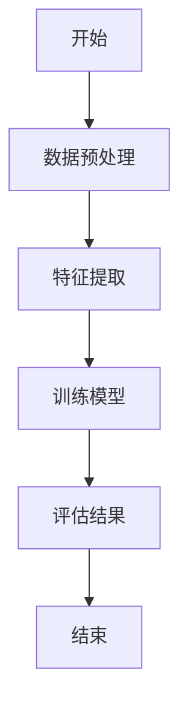
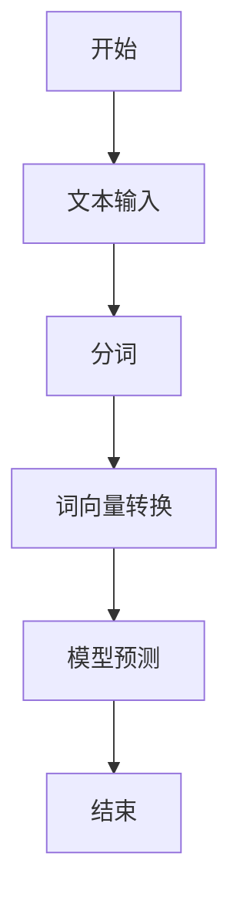
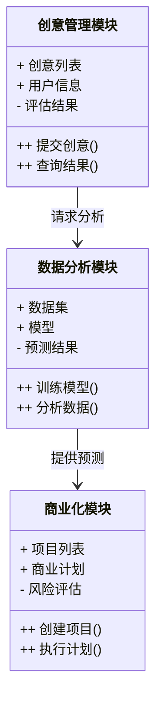
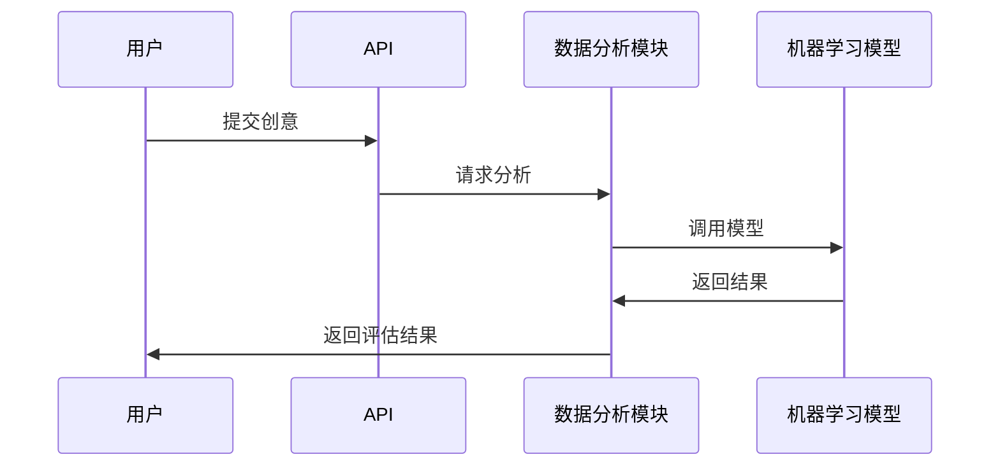

                 


# AI驱动的企业创新管理平台：从创意孵化到商业化

## 关键词：AI驱动，企业创新管理，创意孵化，商业化，系统架构，机器学习，自然语言处理

## 摘要：  
随着人工智能技术的飞速发展，企业创新管理正在经历一场深刻的变革。AI驱动的企业创新管理平台通过整合先进的算法和系统架构，从创意的孵化到商业化的落地，为企业提供了智能化的解决方案。本文将详细探讨AI在企业创新管理中的应用，分析其核心算法、系统架构，并通过实际案例展示如何将创意转化为商业价值。  

---

## 第1章: AI驱动的企业创新管理平台背景

### 1.1 企业创新管理的现状与挑战

#### 1.1.1 传统企业创新管理的痛点  
传统企业创新管理依赖于人工流程，存在效率低、资源浪费、创新成果难以量化等问题。创意的收集、筛选和评估过程耗时且主观性强，难以保证创新的高效性和可持续性。  

#### 1.1.2 数字化转型对企业创新管理的需求  
随着市场竞争的加剧，企业需要快速响应市场变化，推动创新。数字化转型为企业提供了利用AI技术优化创新管理的机会，通过数据驱动的决策和自动化流程，提升创新效率。  

#### 1.1.3 AI技术在企业创新管理中的作用  
AI技术能够通过自然语言处理、机器学习等方法，自动分析创意的潜力、市场可行性，并提供个性化建议。AI不仅提高了创新管理的效率，还帮助企业发现潜在的创新机会。  

### 1.2 AI驱动的企业创新管理平台的定义与目标

#### 1.2.1 平台的核心定义  
AI驱动的企业创新管理平台是一个整合了AI技术的数字化平台，旨在从创意的收集、评估到商业化落地的整个过程中，提供智能化支持。  

#### 1.2.2 平台的目标与价值  
平台的目标是通过AI技术优化创新流程，降低创新成本，提高创新成功率。其价值在于帮助企业快速发现、评估和实现创新，推动企业持续发展。  

#### 1.2.3 平台的边界与外延  
平台的边界包括创意的收集、筛选、评估和商业化支持，外延则涉及市场分析、风险评估等外部数据源的整合。  

### 1.3 创意孵化与商业化的核心要素

#### 1.3.1 创意孵化的关键环节  
创意孵化包括创意的收集、筛选、评估和孵化支持。通过AI技术，平台能够自动筛选出具有潜力的创意，并提供评估报告。  

#### 1.3.2 商业化的核心要素  
商业化涉及市场分析、风险评估、商业模式设计等。AI技术能够帮助企业预测市场趋势，优化商业模式，降低商业化风险。  

#### 1.3.3 平台如何连接创意与商业化  
平台通过整合创意孵化和商业化模块，实现创意到商业化的无缝对接。AI技术的应用使得整个过程更加智能化和高效。  

### 1.4 本章小结  
本章介绍了AI驱动的企业创新管理平台的背景，分析了传统创新管理的痛点，探讨了AI技术在其中的作用，并总结了平台的核心概念和目标。  

---

## 第2章: AI驱动的企业创新管理平台的核心要素

### 2.1 创意孵化模块

#### 2.1.1 创意收集与筛选  
平台通过自然语言处理技术，自动收集员工提交的创意，并通过关键词提取和主题分析进行初步筛选。  

#### 2.1.2 创意评估与优先级排序  
利用机器学习算法，平台对创意进行评估，包括创新性、可行性和潜在收益。评估结果用于确定创意的优先级。  

#### 2.1.3 创意孵化的流程管理  
平台提供流程化的创意孵化支持，包括资源分配、进度跟踪和结果评估。  

### 2.2 商业化模块

#### 2.2.1 商业化规划与执行  
平台基于市场分析和竞争情报，生成商业计划书，并提供执行支持。  

#### 2.2.2 市场分析与风险评估  
利用大数据分析技术，平台帮助企业评估市场潜力和风险，优化商业模式。  

#### 2.2.3 商业化过程中的AI支持  
AI技术在产品开发、市场推广和客户反馈分析中提供实时支持。  

### 2.3 平台的系统架构

#### 2.3.1 系统的模块划分  
平台包括创意管理模块、数据分析模块、商业规划模块等。  

#### 2.3.2 各模块之间的关系  
创意管理模块与数据分析模块交互，提供创意评估结果；数据分析模块为商业规划模块提供市场情报。  

#### 2.3.3 系统的核心功能与流程  
系统通过数据驱动的流程优化，实现创意到商业化的高效转化。  

### 2.4 核心概念的ER实体关系图  
以下是平台核心概念的ER实体关系图：

```mermaid
erDiagram
    actor 用户
    actor 管理员
    actor 创意提供者
    actor 商业化团队
    entity 创意
    entity 项目
    entity 风险评估
    entity 市场分析
    用户 --> 创意 : 提交
    用户 --> 项目 : 关注
    用户 --> 风险评估 : 查询
    创意提供者 --> 创意 : 提供
    商业化团队 --> 项目 : 执行
    管理员 --> 用户 : 管理
    创意 --> 项目 : 关联
    风险评估 --> 项目 : 支持
    市场分析 --> 项目 : 支持
```

---

## 第3章: AI驱动的企业创新管理平台的算法原理

### 3.1 创意评估的机器学习算法

#### 3.1.1 算法选择与原理  
使用支持向量机（SVM）进行创意分类，基于TF-IDF特征提取。  

#### 3.1.2 算法流程图  
以下是创意评估的机器学习算法流程图：



#### 3.1.3 Python代码实现  
以下是创意评估的Python代码示例：

```python
from sklearn.feature_extraction.text import TfidfVectorizer
from sklearn import svm

# 数据预处理
corpus = [...]  # 创意文本数据

# 特征提取
vectorizer = TfidfVectorizer()
X = vectorizer.fit_transform(corpus)

# 模型训练
model = svm.SVC()
model.fit(X, labels)

# 评估结果
predicted_labels = model.predict(X_test)
```

### 3.2 商业化预测的自然语言处理算法

#### 3.2.1 算法选择与原理  
使用情感分析模型（如LSTM）预测市场反馈。  

#### 3.2.2 算法流程图  
以下是情感分析算法流程图：



#### 3.2.3 Python代码实现  
以下是情感分析的Python代码示例：

```python
import tensorflow as tf
from tensorflow.keras import layers

# 模型定义
model = tf.keras.Sequential([
    layers.Embedding(input_dim=..., output_dim=...),
    layers.LSTM(64),
    layers.Dense(1, activation='sigmoid')
])

# 模型训练
model.compile(optimizer='adam', loss='binary_crossentropy', metrics=['accuracy'])
model.fit(...)
```

---

## 第4章: AI驱动的企业创新管理平台的系统分析与架构设计

### 4.1 系统分析

#### 4.1.1 问题场景介绍  
平台需要支持创意的收集、评估和商业化落地，同时处理大量数据和用户请求。  

#### 4.1.2 项目介绍  
本项目旨在构建一个高效的企业创新管理平台，利用AI技术优化创新流程。  

### 4.2 系统功能设计

#### 4.2.1 领域模型设计  
以下是领域模型的类图：



### 4.3 系统架构设计

#### 4.3.1 架构设计  
以下是系统架构的mermaid图：

```mermaid
graph TD
    UI[用户界面] --> API[API Gateway]
    API --> DB[数据库]
    API --> ML[机器学习模型]
    ML --> DB
    DB --> 角色: 管理员
    DB --> 角色: 用户
```

#### 4.3.2 系统接口设计  
API接口包括创意提交、数据查询、模型调用等功能。  

#### 4.3.3 系统交互设计  
以下是系统交互的序列图：



---

## 第5章: AI驱动的企业创新管理平台项目实战

### 5.1 环境配置

#### 5.1.1 技术选型  
使用Python、TensorFlow、Flask搭建平台。  

#### 5.1.2 环境安装  
安装必要的库，如：`pip install flask tensorflow scikit-learn`。  

### 5.2 核心实现

#### 5.2.1 创意管理模块的实现  
以下是创意管理模块的代码示例：

```python
from flask import Flask, request, jsonify

app = Flask(__name__)

@app.route('/submit_creative', methods=['POST'])
def submit_creative():
    data = request.json
    # 处理创意提交
    return jsonify({'status': 'success'})

if __name__ == '__main__':
    app.run()
```

#### 5.2.2 商业化模块的实现  
以下是商业化模块的代码示例：

```python
import tensorflow as tf
from tensorflow.keras import layers

model = tf.keras.Sequential([
    layers.Embedding(input_dim=1000, output_dim=64),
    layers.LSTM(64),
    layers.Dense(1, activation='sigmoid')
])

model.compile(optimizer='adam', loss='binary_crossentropy', metrics=['accuracy'])
model.load_weights('model.h5')
```

### 5.3 案例分析

#### 5.3.1 创意孵化案例  
某公司通过平台提交创意，AI算法评估其可行性和市场潜力。  

#### 5.3.2 商业化案例  
创意通过平台评估后，生成商业计划并执行，最终实现商业化。  

### 5.4 项目小结  
通过实际案例分析，展示了平台在创意孵化和商业化中的应用价值。  

---

## 第6章: AI驱动的企业创新管理平台的最佳实践

### 6.1 最佳实践 Tips

#### 6.1.1 数据质量的重要性  
确保数据的准确性和完整性，以提高模型的性能。  

#### 6.1.2 模型的可解释性  
选择可解释的模型，便于用户理解和信任。  

#### 6.1.3 安全与隐私保护  
保护用户数据的安全，遵守相关法律法规。  

### 6.2 小结  
本文总结了AI驱动的企业创新管理平台的核心内容，强调了AI技术在创新管理中的重要性。  

### 6.3 注意事项  
在实际应用中，需注意模型的泛化能力、数据隐私等问题。  

### 6.4 拓展阅读  
推荐阅读相关领域的书籍和论文，深入学习AI技术的应用。  

---

## 附录: 工具与资源

### 附录A: 参考文献  
1. 刘强, 等. 《人工智能技术与企业创新管理》. 北京: 清华大学出版社, 2023.  
2. Andrew Ng. 《机器学习实战》. 北京: 人民邮电出版社, 2018.  

### 附录B: 开源工具与库  
- TensorFlow: https://tensorflow.org  
- Flask: https://flask.com  
- scikit-learn: https://scikit-learn.org  

---

## 作者：AI天才研究院/AI Genius Institute & 禅与计算机程序设计艺术/Zen And The Art of Computer Programming  

---

通过以上内容，您可以详细了解AI驱动的企业创新管理平台的核心概念、算法原理、系统架构以及实际应用。

