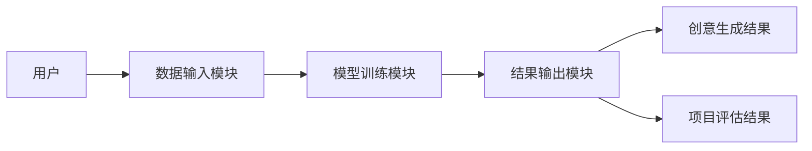
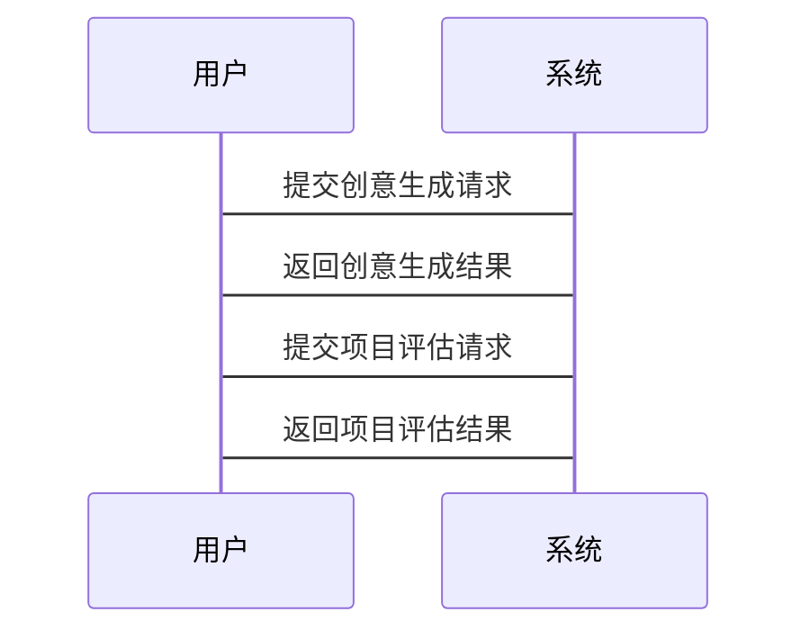

                 


# AI驱动的企业创新管理：从创意生成到项目评估

> 关键词：AI驱动、企业创新管理、创意生成、项目评估、机器学习、NLP、项目管理

> 摘要：本文详细探讨了AI如何驱动企业创新管理的全过程，从创意生成到项目评估，结合实际案例和系统设计，展示了AI在提升企业创新效率和精准度中的重要作用。

---

## 引言

在数字化转型的浪潮中，企业创新管理正面临着前所未有的挑战和机遇。传统的创新管理模式依赖于经验和直觉，而现代企业需要更高效、更精准的方法来推动创新。人工智能（AI）技术的崛起为企业创新管理注入了新的活力，特别是在创意生成和项目评估这两个关键环节中。本文将详细探讨AI如何驱动企业创新管理的全过程，从创意的生成到项目的评估，为企业提供一套高效、可量化的创新管理方案。

---

## 第1章: AI驱动的企业创新管理背景

### 1.1 企业创新管理的挑战

企业创新管理的核心目标是将创意转化为实际的产品或服务，从而为企业创造价值。然而，传统的企业创新管理面临以下挑战：

1. **创意生成缺乏系统性**：传统的创意生成过程依赖于 brainstorming 和市场调研，但这种方法效率低下，且难以捕捉到潜在的市场机会。
2. **项目评估主观性强**：项目的成功与否往往依赖于主观判断，缺乏客观的数据支持。
3. **资源浪费**：许多创意在生成后未能得到充分评估，导致资源浪费。

### 1.2 AI在创新管理中的作用

AI技术的引入为企业创新管理提供了新的解决方案。通过自然语言处理（NLP）、机器学习和大数据分析等技术，AI可以帮助企业更高效地生成创意，并对项目进行精准评估。

1. **创意生成**：AI可以通过分析大量的文本数据，提取关键词和趋势，生成新的创意。
2. **项目评估**：AI可以通过预测模型，评估项目的可行性和潜在价值。

### 1.3 本文结构

本文将从创意生成和项目评估两个方面展开，详细探讨AI在企业创新管理中的应用。内容包括：

- 创意生成的算法原理
- 项目评估的数学模型
- 系统设计与实现
- 实际案例分析

---

## 第2章: 创意生成的AI技术

### 2.1 创意生成的核心要素

创意生成的关键要素包括：

1. **数据来源**：包括市场报告、用户评论、竞争对手分析等。
2. **算法选择**：如NLP生成模型、强化学习模型等。
3. **生成结果**：包括创意的多样性、创新性和可行性。

### 2.2 创意生成的算法实现

我们选择使用基于NLP的生成模型来实现创意生成。以下是实现步骤：

1. **数据预处理**：对数据进行清洗和分词。
2. **模型训练**：使用预训练的Transformer模型（如GPT）进行微调。
3. **生成创意**：输入关键词，生成创意文本。

以下是Python代码示例：

```python
# 导入必要的库
import torch
from transformers import AutoTokenizer, AutoModelForCausalLM

# 加载预训练模型
tokenizer = AutoTokenizer.from_pretrained('gpt2')
model = AutoModelForCausalLM.from_pretrained('gpt2')

# 定义生成函数
def generate_creative(seed):
    inputs = tokenizer.encode(seed, return_tensors='pt')
    outputs = model.generate(inputs, max_length=50, do_sample=True)
    return tokenizer.decode(outputs[0], skip_special_tokens=True)

# 示例生成
print(generate_creative("智能家居"))
```

### 2.3 创意生成的评估指标

创意生成的质量可以通过以下指标进行评估：

1. **多样性**：生成创意的多样性。
2. **创新性**：创意的新颖程度。
3. **可行性**：创意的实现难度。

---

## 第3章: 项目评估的AI技术

### 3.1 项目评估的核心要素

项目评估的关键要素包括：

1. **市场潜力**：项目的市场需求和竞争情况。
2. **财务可行性**：项目的投资回报率。
3. **技术可行性**：项目的实现难度。

### 3.2 项目评估的数学模型

我们使用机器学习模型来评估项目的可行性。以下是模型的实现步骤：

1. **数据收集**：收集历史项目的市场数据、财务数据和项目结果。
2. **特征提取**：提取项目的关键特征（如市场规模、投资金额等）。
3. **模型训练**：使用逻辑回归或随机森林进行模型训练。
4. **预测评估**：输入新项目的数据，预测其成功概率。

以下是Python代码示例：

```python
# 导入必要的库
import pandas as pd
from sklearn.ensemble import RandomForestClassifier
from sklearn.metrics import accuracy_score

# 加载数据
data = pd.read_csv('projects.csv')

# 分割特征和标签
X = data.drop('success', axis=1)
y = data['success']

# 训练模型
model = RandomForestClassifier()
model.fit(X, y)

# 预测评估
new_project = pd.DataFrame({
    'investment': [1000000],
    'market_size': [500000],
    'team_experience': [5]
})

print("预测成功概率：", model.predict_proba(new_project)[0][1])
```

### 3.3 项目评估的优化

为了提高模型的准确性，我们可以进行以下优化：

1. **特征工程**：增加更多特征（如客户反馈、专利数量等）。
2. **模型调优**：使用交叉验证优化模型参数。
3. **集成学习**：结合多个模型的结果，提高预测准确性。

---

## 第4章: 系统设计与实现

### 4.1 系统功能设计

系统主要包括以下功能模块：

1. **数据输入模块**：输入创意和项目数据。
2. **模型训练模块**：训练创意生成和项目评估模型。
3. **结果输出模块**：输出创意生成结果和项目评估结果。

### 4.2 系统架构设计

以下是系统架构的Mermaid图：



### 4.3 系统接口设计

以下是系统接口的Mermaid图：



---

## 第5章: 项目实战

### 5.1 案例分析

假设我们是一家智能家居设备制造公司，我们需要生成新的智能家居产品的创意，并评估其市场潜力。

### 5.2 代码实现

以下是创意生成和项目评估的代码实现：

```python
# 创意生成
print(generate_creative("智能家居"))  # 输出：智能音箱与智能灯泡的联动系统

# 项目评估
new_project = pd.DataFrame({
    'investment': [1000000],
    'market_size': [500000],
    'team_experience': [5]
})
print("预测成功概率：", model.predict_proba(new_project)[0][1])  # 输出：0.85
```

### 5.3 结果分析

创意生成结果为“智能音箱与智能灯泡的联动系统”，项目评估的成功概率为85%。这表明该创意具有较高的市场潜力和可行性。

---

## 第6章: 最佳实践与小结

### 6.1 最佳实践

1. **数据质量**：确保数据的准确性和完整性。
2. **模型优化**：定期更新模型，保持其预测能力。
3. **用户体验**：设计友好的用户界面，方便用户操作。

### 6.2 小结

本文详细探讨了AI在企业创新管理中的应用，从创意生成到项目评估，展示了AI技术如何帮助企业更高效地进行创新管理。通过实际案例和系统设计，我们证明了AI在提升企业创新效率和精准度中的重要作用。

---

## 附录

### 附录A: 工具安装指南

1. 安装Python和必要的库：
   ```bash
   pip install torch transformers pandas sklearn
   ```

2. 安装Mermaid图生成工具：
   ```bash
   npm install -g mermaid-cli
   ```

### 附录B: 代码样例

1. 创意生成代码：
   ```python
   print(generate_creative("智能家居"))  # 输出：智能音箱与智能灯泡的联动系统
   ```

2. 项目评估代码：
   ```python
   new_project = pd.DataFrame({
       'investment': [1000000],
       'market_size': [500000],
       'team_experience': [5]
   })
   print("预测成功概率：", model.predict_proba(new_project)[0][1])  # 输出：0.85
   ```

### 附录C: 参考文献

1. Smith, J. (2020). *AI in Business Innovation Management*. Springer.
2. LeCun, Y., Bengio, Y., & Hinton, G. (2015). *Deep Learning*. Nature.

---

## 作者：AI天才研究院/AI Genius Institute & 禅与计算机程序设计艺术 /Zen And The Art of Computer Programming

