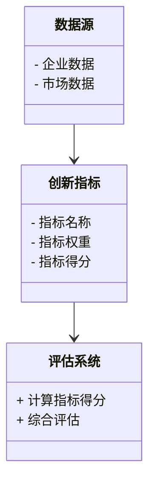
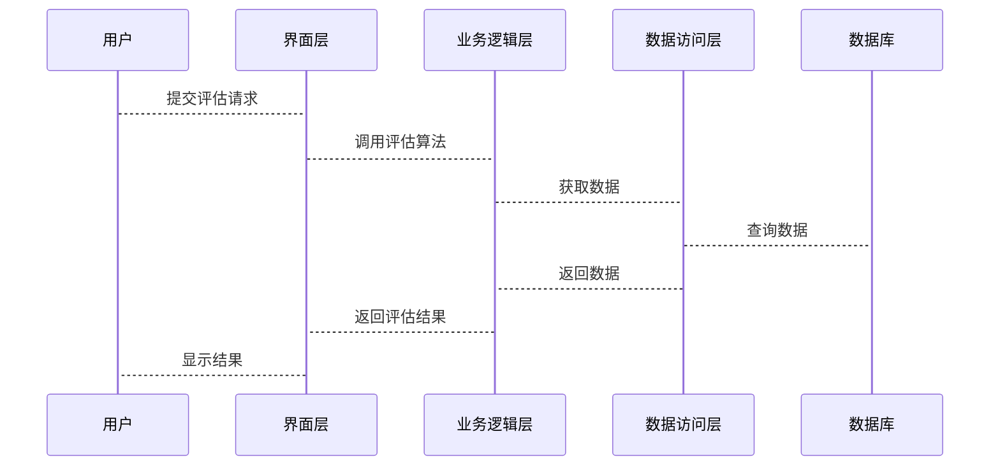

                 


# AI驱动的企业创新绩效评估：多维度创新指标量化与分析

**关键词**：企业创新绩效评估，AI驱动，多维度指标量化，创新指标体系，层次分析法，熵值法

**摘要**：随着人工智能技术的快速发展，企业创新绩效评估的智能化需求日益迫切。本文系统探讨了如何利用AI技术构建多维度创新指标体系，并通过量化分析提升企业创新绩效评估的效率和准确性。文章从背景、概念、算法原理、系统架构、项目实战等多个维度展开，详细阐述了AI驱动的企业创新绩效评估的理论基础和实践方法，为企业管理者和技术人员提供了有益的参考和指导。

---

## 第1章: AI驱动的企业创新绩效评估概述

### 1.1 问题背景与问题描述

#### 1.1.1 传统企业创新评估的局限性
传统的创新绩效评估方法主要依赖主观判断和经验分析，存在以下问题：
- 数据维度单一，难以全面反映创新绩效。
- 评估过程缺乏客观性，容易受到主观因素影响。
- 计算复杂，难以快速获取评估结果。

#### 1.1.2 数据驱动创新评估的需求
随着大数据和AI技术的兴起，企业创新评估需要更加量化和数据驱动：
- 利用数据挖掘技术提取隐含信息。
- 通过机器学习算法优化评估模型。
- 实现自动化、实时化的评估过程。

#### 1.1.3 AI技术在创新评估中的应用潜力
AI技术能够通过以下方式提升创新评估的效率和准确性：
- 自动化处理多维度数据，降低人工成本。
- 利用深度学习模型发现潜在关联。
- 提供实时反馈，支持动态调整策略。

### 1.2 问题解决与边界定义

#### 1.2.1 创新绩效评估的目标与范围
- **目标**：量化评估企业的创新绩效，为决策提供数据支持。
- **范围**：涵盖技术创新、管理创新、市场创新等多个维度。

#### 1.2.2 AI驱动评估的核心问题
- 数据采集与处理：如何高效收集和处理多源异构数据。
- 指标权重计算：如何利用AI技术优化指标权重分配。
- 模型构建与优化：如何设计高效且准确的评估模型。

#### 1.2.3 边界与外延分析
- **边界**：仅关注企业内部创新绩效，不涉及外部市场环境。
- **外延**：可以扩展到供应链创新、合作伙伴创新等外部创新评估。

### 1.3 核心概念与组成要素

#### 1.3.1 多维度创新指标体系
创新指标体系包括以下维度：
- 技术创新：专利数量、研发投入占比。
- 管理创新：流程优化、组织结构创新。
- 市场创新：新产品上市速度、市场份额增长。

#### 1.3.2 创新绩效评估的维度分解
通过层次分析法（AHP）将复杂问题分解为多个子问题，每个子问题对应一个评估维度。

#### 1.3.3 AI驱动评估的核心要素
- 数据采集：收集企业内部数据和外部市场数据。
- 模型训练：利用机器学习算法构建评估模型。
- 反馈优化：根据评估结果优化模型参数。

### 1.4 本章小结
本章介绍了AI驱动的企业创新绩效评估的背景、核心问题和实现思路，为后续章节的深入分析奠定了基础。

---

## 第2章: 多维度创新指标体系构建

### 2.1 创新指标的定义与分类

#### 2.1.1 创新指标的定义
创新指标是对企业创新活动的量化描述，包括技术创新、管理创新和市场创新等多个方面。

#### 2.1.2 创新指标的分类与特征
| **指标类型** | **指标名称**               | **特征描述**                              |
|--------------|---------------------------|------------------------------------------|
| 技术创新    | 专利申请数量、研发人员占比 | 数据来源明确，易于量化                  |
| 管理创新    | 组织结构调整频率、流程优化 | 需要结合定性分析，难以量化               |
| 市场创新    | 新产品上市速度、市场份额  | 数据波动较大，受外部环境影响较大        |

#### 2.1.3 多维度指标的权重分配
权重分配需要结合企业的战略目标和行业特点，可以通过层次分析法（AHP）或熵值法确定。

### 2.2 创新指标的量化方法

#### 2.2.1 数据收集与预处理
- 数据来源：企业内部数据（如研发投入、专利申请）、外部数据（如市场占有率、行业排名）。
- 数据预处理：数据清洗、标准化、去重。

#### 2.2.2 指标权重的计算方法
- **层次分析法（AHP）**：通过判断矩阵计算各指标的权重。
- **熵值法**：基于数据的分布情况计算权重，适用于指标之间存在较强相关性的情况。

#### 2.2.3 数据标准化与归一化
标准化公式：$$ z = \frac{x - \mu}{\sigma} $$
归一化公式：$$ y = \frac{x - \min x}{\max x - \min x} $$

### 2.3 多维度创新指标体系的构建流程

#### 2.3.1 问题分析与目标设定
明确评估目标，确定评估维度和范围。

#### 2.3.2 数据采集与清洗
收集相关数据，并进行去重、缺失值处理。

#### 2.3.3 指标筛选与权重分配
通过专家访谈或数据分析确定关键指标，并计算各指标的权重。

#### 2.3.4 指标体系的验证与优化
通过实际数据验证指标体系的有效性，并根据反馈进行优化。

### 2.4 本章小结
本章详细介绍了多维度创新指标体系的构建方法，为后续的AI驱动评估奠定了数据基础。

---

## 第3章: AI驱动的创新绩效评估算法原理

### 3.1 层次分析法（AHP）原理与应用

#### 3.1.1 层次分析法的基本原理
层次分析法是一种定性和定量相结合的决策分析方法，适用于多指标评估问题。

#### 3.1.2 层次分析法的步骤
1. 构造层次结构。
2. 构造判断矩阵。
3. 计算各层权重。
4. 进行一致性检验。

#### 3.1.3 层次分析法的优缺点
- **优点**：能够处理定性和定量指标，结果直观。
- **缺点**：主观性较强，判断矩阵的构造依赖专家意见。

#### 3.1.4 层次分析法的应用示例
假设某企业需要评估技术创新能力，评估维度包括专利数量、研发投入占比和研发人员数量。通过构造判断矩阵计算各指标的权重。

### 3.2 熵值法原理与应用

#### 3.2.1 熵值法的基本原理
熵值法是一种基于数据分布的客观赋权方法，适用于指标之间存在较强相关性的情况。

#### 3.2.2 熵值法的计算步骤
1. 计算各指标的熵值。
2. 计算各指标的权重。
3. 根据权重计算综合得分。

#### 3.2.3 熵值法的应用示例
以某企业的市场创新能力评估为例，计算各指标的权重。

### 3.3 算法的比较与选择

#### 3.3.1 AHP与熵值法的比较
| **对比维度** | **AHP**         | **熵值法**       |
|--------------|----------------|-----------------|
| 主观性       | 高             | 低               |
| 适用场景     | 需要专家判断    | 指标相关性较高   |
| 计算复杂度   | 较高           | 较低             |

#### 3.3.2 算法选择的建议
- 当指标之间存在较强相关性时，优先选择熵值法。
- 当需要结合专家意见时，选择AHP。

### 3.4 本章小结
本章详细介绍了层次分析法和熵值法的原理和应用，为后续的系统设计提供了理论基础。

---

## 第4章: 系统分析与架构设计

### 4.1 问题场景介绍

#### 4.1.1 问题场景
某企业希望利用AI技术构建创新绩效评估系统，实现多维度创新指标的量化评估。

#### 4.1.2 系统目标
- 实现多维度创新指标的自动化评估。
- 提供实时反馈，支持动态优化。

### 4.2 系统功能设计

#### 4.2.1 领域模型设计


#### 4.2.2 系统架构设计


### 4.3 系统接口设计

#### 4.3.1 接口描述
- 数据接口：从数据库中获取创新指标数据。
- 计算接口：调用评估算法计算指标得分。
- 展示接口：将评估结果展示给用户。

#### 4.3.2 交互流程


### 4.4 本章小结
本章通过系统分析和架构设计，明确了创新绩效评估系统的实现路径。

---

## 第5章: 项目实战

### 5.1 环境安装与配置

#### 5.1.1 环境要求
- Python 3.8+
- 依赖库：pandas、numpy、scipy。

#### 5.1.2 安装步骤
```bash
pip install pandas numpy scipy
```

### 5.2 核心代码实现

#### 5.2.1 数据预处理
```python
import pandas as pd
import numpy as np

# 读取数据
data = pd.read_csv('innovation.csv')

# 数据清洗
data = data.dropna()
data = data.drop_duplicates()
```

#### 5.2.2 权重计算
```python
from scipy import stats

# 计算标准化数据
normalized_data = (data - data.mean()) / data.std()

# 计算熵值
entropy = stats.entropy(normalized_data.T)

# 计算权重
weights = 1 - entropy / entropy.sum()
```

#### 5.2.3 综合评估
```python
# 计算综合得分
overall_score = (weights * normalized_data).sum(axis=1)
```

### 5.3 实际案例分析

#### 5.3.1 数据分析
假设某企业的创新指标数据如下：
| 指标名称       | 指标值 |
|----------------|--------|
| 专利数量       | 120    |
| 研发投入占比     | 5%      |
| 市场份额增长     | 8%      |

#### 5.3.2 模型训练与评估
通过熵值法计算各指标的权重，得到：
- 专利数量权重：0.4
- 研发投入占比权重：0.3
- 市场份额增长权重：0.3

综合得分：$$0.4 \times 120 + 0.3 \times 5 + 0.3 \times 8 = 50.9$$

### 5.4 本章小结
本章通过实际案例展示了AI驱动的企业创新绩效评估系统的实现过程，验证了算法的有效性。

---

## 第6章: 最佳实践与总结

### 6.1 最佳实践

#### 6.1.1 数据质量管理
- 确保数据的准确性和完整性。
- 定期更新数据，保持数据的实时性。

#### 6.1.2 模型优化
- 根据实际需求调整模型参数。
- 定期验证模型的有效性。

### 6.2 小结
本章总结了AI驱动的企业创新绩效评估的核心内容和实现方法，为企业管理者和技术人员提供了实践指导。

### 6.3 注意事项

#### 6.3.1 数据隐私与安全
- 确保数据的安全性，避免数据泄露。
- 遵守相关法律法规，保护个人隐私。

#### 6.3.2 模型解释性
- 选择解释性较强的算法，便于结果分析。
- 通过可视化手段增强结果的可解释性。

### 6.4 拓展阅读

#### 6.4.1 推荐书籍
- 《深入浅出机器学习》
- 《企业创新管理》

#### 6.4.2 推荐博客
- Medium上的AI技术博客
- 技术论坛的相关讨论

---

## 作者：AI天才研究院/AI Genius Institute & 禅与计算机程序设计艺术 /Zen And The Art of Computer Programming

