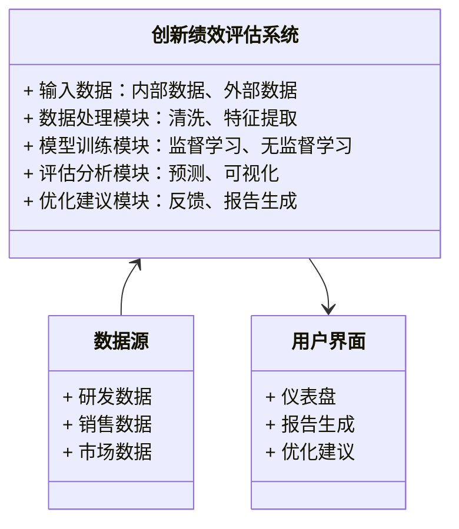
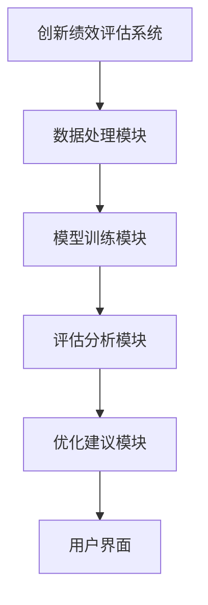

                 


# AI驱动的企业创新绩效评估：量化创新价值与影响

## 关键词：企业创新，AI驱动，绩效评估，创新价值，AI算法

## 摘要

在当今快速变化的商业环境中，企业创新绩效评估已成为衡量企业竞争力和未来发展潜力的关键指标。传统的评估方法往往依赖于主观判断和有限的数据分析，而随着人工智能（AI）技术的飞速发展，企业可以通过更精准、更全面的方式量化创新价值与影响。本文将探讨如何利用AI技术构建创新绩效评估体系，从数据采集、模型构建到系统实现，详细阐述AI在创新绩效评估中的应用及其优势。

---

## 第一部分：AI驱动的企业创新绩效评估背景

### 第1章：AI驱动的企业创新绩效评估背景

#### 1.1 企业创新绩效评估的基本概念

##### 1.1.1 什么是企业创新绩效
企业创新绩效是指企业在创新活动中的表现和成果，包括研发投入、创新产出、市场表现等多个维度。创新绩效评估是通过量化这些指标，帮助企业了解创新活动的效果和效率。

##### 1.1.2 创新绩效的评估维度
- **创新投入**：包括研发投入、人力资源投入、时间投入等。
- **创新过程**：包括创新项目的管理、团队协作、创新文化等。
- **创新产出**：包括新产品数量、专利数量、市场占有率等。

##### 1.1.3 AI在创新绩效评估中的作用
AI技术可以通过数据分析、模式识别和预测建模，帮助企业更精准地评估创新绩效，发现创新过程中的瓶颈，并提供优化建议。

#### 1.2 AI技术对企业创新的影响

##### 1.2.1 AI技术的定义与特点
AI是一种模拟人类智能的技术，包括机器学习、自然语言处理、计算机视觉等。其特点是数据驱动、自动化和可扩展性。

##### 1.2.2 AI如何推动企业创新
AI可以通过自动化数据分析、预测建模和智能推荐，帮助企业发现新的市场机会、优化创新流程、提升创新效率。

##### 1.2.3 AI在创新绩效评估中的优势
AI能够处理海量数据，发现传统方法难以察觉的模式和趋势，提供更精准的评估结果。

#### 1.3 企业创新绩效评估的现状与挑战

##### 1.3.1 当前企业创新绩效评估的主要方法
- **定性评估**：通过专家评分、案例分析等方法进行评估。
- **定量评估**：通过财务指标、专利数量等定量数据进行评估。

##### 1.3.2 传统方法的局限性
- 数据维度有限，难以全面反映创新绩效。
- 评估过程主观性强，缺乏客观性。

##### 1.3.3 引入AI技术的必要性
AI可以通过整合多源数据，构建全面的创新绩效评估模型，提高评估的准确性和客观性。

---

## 第二部分：创新绩效评估的核心概念与模型

### 第2章：创新绩效评估的核心概念与模型

#### 2.1 创新绩效评估的核心概念

##### 2.1.1 创新投入与创新产出的关系
创新投入是创新产出的基础，但投入并不直接等于产出。AI可以通过分析投入与产出的关系，优化资源配置。

##### 2.1.2 创新绩效的量化指标
- **创新投入指标**：研发人员数量、研发投入金额。
- **创新过程指标**：创新项目周期、创新团队协作效率。
- **创新产出指标**：新产品数量、专利数量、市场占有率。

##### 2.1.3 AI驱动的创新绩效评估框架
AI驱动的创新绩效评估框架包括数据采集、模型构建、评估分析和优化建议四个阶段。

#### 2.2 创新绩效评估模型的构建

##### 2.2.1 数据驱动的创新绩效评估模型
数据驱动的创新绩效评估模型通过整合企业内外部数据，构建多维度的评估体系。

##### 2.2.2 基于AI的创新绩效预测模型
基于AI的创新绩效预测模型可以通过机器学习算法预测未来创新绩效的变化趋势。

##### 2.2.3 模型的输入与输出
- **输入**：企业内部数据（研发、销售）、外部数据（市场、竞争）。
- **输出**：创新绩效评分、优化建议、预测结果。

#### 2.3 创新绩效评估的核心要素

##### 2.3.1 创新资源的分配
AI可以通过分析资源分配的效果，优化资源配置，提高创新效率。

##### 2.3.2 创新过程的优化
AI可以通过自动化流程管理和智能监控，优化创新过程，缩短项目周期。

##### 2.3.3 创新成果的衡量
AI可以通过预测模型和结果分析，准确衡量创新成果的价值和影响。

---

## 第三部分：AI驱动的创新绩效评估方法

### 第3章：AI驱动的创新绩效评估方法

#### 3.1 数据采集与处理

##### 3.1.1 数据来源与类型
- **内部数据**：研发数据、销售数据、项目管理数据。
- **外部数据**：市场数据、竞争对手数据、行业趋势数据。

##### 3.1.2 数据清洗与预处理
通过数据清洗、去重、标准化等步骤，确保数据质量。

##### 3.1.3 数据标注与特征提取
对数据进行标注，提取关键特征，为模型训练提供高质量的数据。

#### 3.2 基于机器学习的创新绩效预测

##### 3.2.1 监督学习在创新绩效预测中的应用
- **线性回归**：用于预测连续型创新绩效指标。
- **支持向量机（SVM）**：用于分类创新绩效的等级。

##### 3.2.2 无监督学习在创新绩效分析中的应用
- **聚类分析**：发现创新绩效的潜在模式。
- **主成分分析（PCA）**：降维处理，提取核心特征。

##### 3.2.3 深度学习在创新绩效评估中的优势
- **神经网络模型**：通过深度学习捕捉复杂数据关系。
- **Transformer模型**：用于处理序列数据，如时间序列分析。

#### 3.3 创新绩效评估的可视化与解释

##### 3.3.1 可视化工具的选择与应用
- **图表展示**：如折线图、柱状图、热力图等。
- **交互式仪表盘**：实时监控创新绩效。

##### 3.3.2 评估结果的解释与反馈
通过可视化工具，将评估结果以直观的方式呈现给企业管理层，提供反馈和优化建议。

##### 3.3.3 基于AI的创新绩效报告生成
AI可以自动生成创新绩效报告，包括数据分析、趋势预测和优化建议。

---

## 第四部分：创新绩效评估的数学模型与算法

### 第4章：创新绩效评估的数学模型与算法

#### 4.1 创新绩效评估的数学模型

##### 4.1.1 线性回归模型在创新绩效预测中的应用
线性回归模型用于预测连续型创新绩效指标，如研发投入与新产品数量的关系。

##### 4.1.2 支持向量机（SVM）在创新绩效分类中的应用
SVM用于将创新绩效分为不同等级，如高、中、低绩效。

##### 4.1.3 随机森林在创新绩效评估中的应用
随机森林通过集成学习，提高模型的准确性和稳定性。

#### 4.2 基于深度学习的创新绩效评估算法

##### 4.2.1 神经网络模型在创新绩效预测中的应用
神经网络模型通过多层感知机（MLP）捕捉非线性关系。

##### 4.2.2 Transformer模型在创新绩效分析中的应用
Transformer模型用于处理序列数据，如时间序列分析。

##### 4.2.3 图神经网络在创新绩效评估中的应用
图神经网络用于分析复杂的企业网络关系，如供应链、合作伙伴网络。

#### 4.3 算法实现与优化

##### 4.3.1 算法实现的步骤与流程
- 数据预处理：清洗、特征提取。
- 模型训练：选择算法、调整参数。
- 模型评估：验证准确率、召回率。

##### 4.3.2 算法优化策略
- 参数调优：使用网格搜索、随机搜索。
- 模型集成：通过投票、加权平均提高模型性能。

##### 4.3.3 模型部署与应用
将模型部署到企业系统中，实时监控创新绩效。

---

## 第五部分：系统分析与架构设计方案

### 第5章：系统分析与架构设计方案

#### 5.1 问题场景介绍
企业需要一个基于AI的创新绩效评估系统，整合内部和外部数据，提供实时评估和优化建议。

#### 5.2 项目介绍
项目目标是构建一个AI驱动的创新绩效评估系统，帮助企业管理层优化创新策略。

#### 5.3 系统功能设计

##### 5.3.1 领域模型（Mermaid类图）


#### 5.4 系统架构设计

##### 5.4.1 系统架构（Mermaid架构图）


#### 5.5 系统接口设计

##### 5.5.1 系统接口（Mermaid序列图）
```mermaid
sequenceDiagram
    participant 用户
    participant 系统
    用户 -> 系统：提交数据
    系统 -> 用户：返回评估结果
    用户 -> 系统：请求优化建议
    系统 -> 用户：返回优化建议
```

---

## 第六部分：项目实战

### 第6章：项目实战

#### 6.1 环境安装与配置

##### 6.1.1 安装Python环境
使用Anaconda安装Python 3.8及以上版本。

##### 6.1.2 安装依赖库
安装必要的库，如Pandas、Scikit-learn、TensorFlow等。

#### 6.2 系统核心实现

##### 6.2.1 数据预处理代码
```python
import pandas as pd
from sklearn.preprocessing import StandardScaler

# 加载数据
data = pd.read_csv('innovation.csv')

# 数据清洗
data.dropna(inplace=True)
data = data.drop_duplicates()

# 特征提取
features = data[['研发人员数量', '研发投入金额', '新产品数量', '专利数量']]
labels = data['创新绩效评分']

# 标准化处理
scaler = StandardScaler()
features_scaled = scaler.fit_transform(features)
```

##### 6.2.2 模型训练代码
```python
from sklearn.ensemble import RandomForestRegressor

# 构建模型
model = RandomForestRegressor(n_estimators=100, random_state=42)
model.fit(features_scaled, labels)

# 预测结果
importances = model.feature_importances_
```

##### 6.2.3 可视化代码
```python
import matplotlib.pyplot as plt

# 绘制特征重要性
importances = model.feature_importances_
features = ['研发人员数量', '研发投入金额', '新产品数量', '专利数量']

plt.bar(features, importances)
plt.title('特征重要性')
plt.show()
```

#### 6.3 案例分析与详细解读

##### 6.3.1 案例背景
某科技公司希望通过AI技术优化其创新绩效评估体系。

##### 6.3.2 数据收集与分析
收集过去5年的研发、销售、市场等数据，进行清洗和特征提取。

##### 6.3.3 模型训练与验证
使用随机森林模型进行训练，验证模型的准确性和稳定性。

##### 6.3.4 优化建议
根据模型结果，优化资源配置，缩短创新周期，提高创新产出。

#### 6.4 项目小结
通过AI技术，企业能够更精准地评估创新绩效，优化创新策略，提升整体竞争力。

---

## 第七部分：总结与展望

### 第7章：总结与展望

#### 7.1 小结
本文详细探讨了AI在企业创新绩效评估中的应用，从数据采集、模型构建到系统实现，全面分析了AI驱动的创新绩效评估体系。

#### 7.2 注意事项
- 数据隐私和安全问题需要高度重视。
- 模型的可解释性需要进一步提升。
- 系统的实时性和稳定性需要优化。

#### 7.3 拓展阅读
- 《机器学习实战》
- 《深度学习》
- 《企业创新管理》

---

## 作者：AI天才研究院/AI Genius Institute & 禅与计算机程序设计艺术/Zen And The Art of Computer Programming

---

以上是《AI驱动的企业创新绩效评估：量化创新价值与影响》的技术博客文章的详细内容，涵盖从理论到实践的各个方面，结合了AI技术、数学模型和系统设计，为企业创新绩效评估提供了全面的解决方案。

