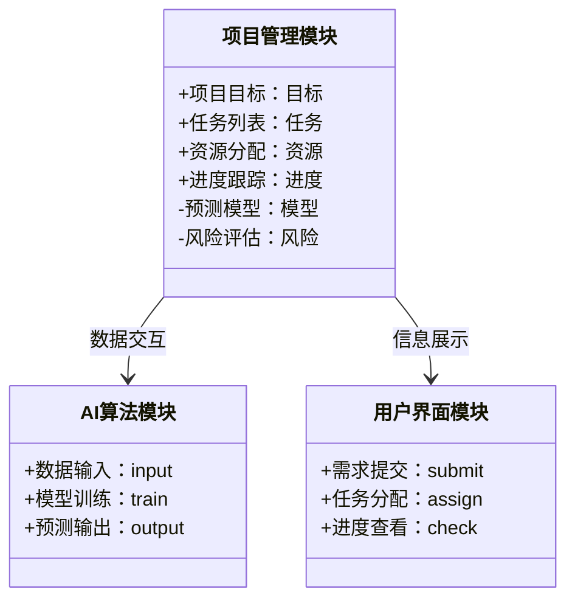
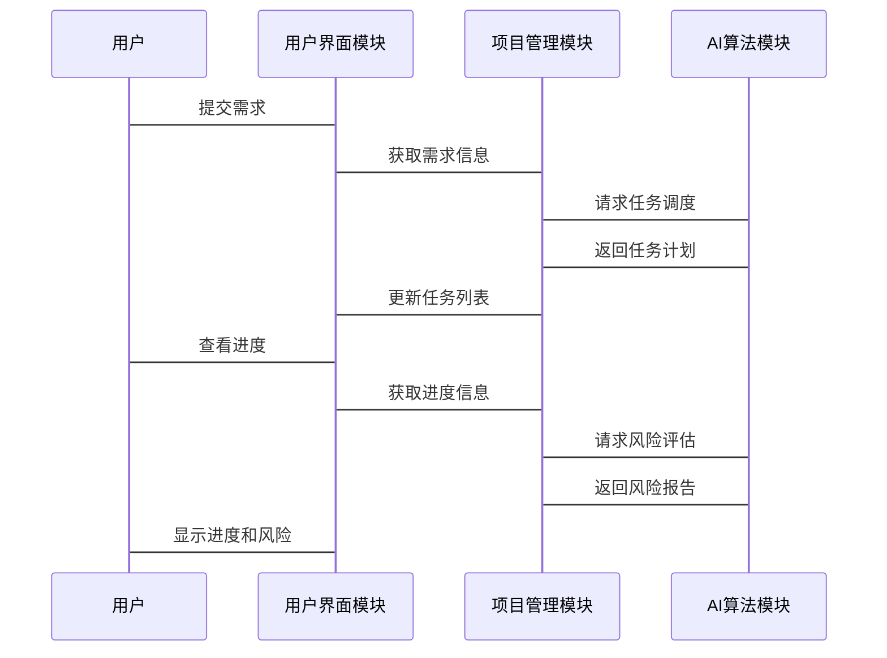

                 

<think>
好的，现在我需要根据用户的详细要求，一步一步地编写一篇关于《AI驱动的企业创新项目管理：敏捷方法与AI的结合》的技术博客文章。用户希望文章结构清晰，内容详尽，并且包含背景介绍、核心概念、算法原理、系统架构、项目实战以及最佳实践等部分。同时，用户还希望在适当的地方使用Mermaid图表和数学公式，以增强文章的可读性和专业性。

首先，我会按照用户提供的目录大纲开始撰写文章，每个部分都会详细展开，确保内容完整、逻辑清晰。同时，我会在每个部分中添加必要的图表和公式，以帮助读者更好地理解和掌握所讲的内容。

### 第一部分: AI驱动的企业创新项目管理概述

#### 第1章: AI与敏捷方法的结合背景

##### 1.1 企业创新项目管理的挑战

###### 1.1.1 传统项目管理的局限性

在传统的项目管理方法中，项目经理通常需要手动制定项目计划、分配资源、监控进度，并进行风险评估。这种方法在处理复杂和动态变化的项目时显得力不从心，尤其是在企业创新项目中，需求和技术可能会迅速变化，传统方法往往无法及时适应这些变化，导致项目延期或成本超支。

###### 1.1.2 敏捷方法的兴起

敏捷方法作为一种迭代和增量式的开发方法，强调灵活性、客户协作和快速响应变化。它通过短周期的迭代（如Sprint）来逐步交付产品功能，使得团队能够更好地适应需求的变化。敏捷方法在软件开发领域取得了显著的成功，但将其应用于更广泛的项目管理领域还存在一定的挑战。

###### 1.1.3 AI技术对企业创新的推动作用

人工智能技术的快速发展为企业创新项目管理带来了新的机遇。通过AI技术，企业可以更高效地分析大量数据，预测项目风险，优化资源分配，并提高决策的准确性。AI技术的应用不仅提高了项目的执行效率，还增强了项目的预测能力，使得企业在面对复杂和不确定的市场环境时更具竞争力。

##### 1.2 AI与敏捷方法的结合意义

###### 1.2.1 提高项目管理效率

通过AI技术，企业可以自动化处理大量的项目管理任务，如任务分配、进度跟踪和资源调度。这不仅提高了管理效率，还减少了人为错误，使项目经理能够将更多精力集中在战略性的决策上。

###### 1.2.2 增强决策的智能化

AI技术能够基于历史数据和实时信息，提供智能化的决策支持。例如，通过机器学习算法，AI可以预测项目风险，并提出相应的应对策略。这种智能化的决策支持能够显著提高项目的成功率。

###### 1.2.3 优化资源分配与风险控制

AI技术可以通过分析项目数据，优化资源的分配，确保资源的合理利用。同时，AI还可以实时监控项目进度，及时发现潜在风险，并提出风险控制的建议，从而降低项目失败的可能性。

##### 1.3 企业创新项目管理的未来趋势

###### 1.3.1 数字化转型的加速

随着数字化转型的加速，企业对智能化项目管理的需求日益增加。AI技术的应用将成为企业创新项目管理的核心驱动力。

###### 1.3.2 AI在项目管理中的广泛应用

未来，AI技术将在项目管理的各个环节中得到广泛应用，从需求分析、任务调度到风险控制，都将有AI的身影。这将使得项目管理更加智能化和高效化。

###### 1.3.3 敏捷方法的持续进化

敏捷方法作为一种灵活的项目管理方法，将在与AI技术的结合中不断进化，以更好地适应企业创新的需求。未来的敏捷方法将更加注重数据驱动的决策和智能化的项目管理。

#### 第2章: AI驱动的企业创新项目管理核心概念

##### 2.1 项目管理的基本概念

###### 2.1.1 项目管理的定义与目标

项目管理是指为了实现特定目标而对项目的资源、进度和质量进行规划、组织、协调和控制的过程。其目标是确保项目按时完成、质量达标且成本控制在预算内。

###### 2.1.2 项目生命周期与阶段划分

项目生命周期通常包括启动、计划、执行、监控和收尾五个阶段。每个阶段都有其特定的任务和目标，如需求分析、计划制定、任务执行和项目总结等。

###### 2.1.3 项目管理的关键要素（范围、时间、成本、质量）

项目管理的四大关键要素包括：
- **范围**：确定项目的目标和 deliverables。
- **时间**：制定项目的时间表和进度计划。
- **成本**：控制项目的预算和资源分配。
- **质量**：确保项目 deliverables 的质量符合要求。

##### 2.2 敏捷方法的核心理念

###### 2.2.1 敏捷宣言与价值观

敏捷宣言强调个体互动、客户合作、响应变化和交付可用的软件。敏捷方法的核心价值观包括：
- **个体互动**：重视团队成员之间的协作和互动。
- **客户合作**：与客户保持紧密合作，确保项目符合客户需求。
- **响应变化**：灵活应对需求的变化，及时调整项目计划。
- **交付可用的软件**：通过短周期的迭代交付可用的软件增量。

###### 2.2.2 敏捷开发的实践与方法

敏捷开发的实践包括：
- **Scrum**：一种常用的敏捷框架，强调角色、事件和工件。
- **Kanban**：基于看板方法，强调可视化工作流程和持续改进。
- **极限编程（XP）**：强调测试驱动开发、持续集成和代码优化。

###### 2.2.3 敏捷项目管理的特点

敏捷项目管理的特点包括：
- **迭代开发**：通过短周期的迭代逐步交付功能。
- **持续反馈**：通过频繁的迭代和交付，及时获取客户反馈。
- **自组织团队**：团队成员具有高度自治权，能够自行组织和协调工作。

##### 2.3 AI在项目管理中的应用场景

###### 2.3.1 AI驱动的需求分析

通过自然语言处理（NLP）技术，AI可以自动分析客户的需求文档，提取关键信息，并生成项目需求清单。此外，AI还可以基于历史数据，预测客户可能的需求变化。

###### 2.3.2 AI辅助的任务调度与资源分配

AI可以通过优化算法，根据项目任务的优先级和资源的可用性，自动制定任务调度计划，并动态调整资源分配，以确保项目按时完成。

###### 2.3.3 AI支持的风险预测与控制

AI可以通过分析项目的历史数据和当前状态，预测潜在风险，并提出相应的风险应对策略。例如，通过机器学习模型预测项目延期的可能性，并建议采取的风险控制措施。

### 第三部分: 系统分析与架构设计方案

#### 第3章: 系统分析与架构设计方案

##### 3.1 问题场景介绍

在企业创新项目管理中，项目经理需要面对复杂的任务调度、资源分配和风险控制等问题。传统的项目管理方法往往难以应对这些挑战，而敏捷方法虽然提供了一定的灵活性，但在数据驱动的决策和支持方面仍有不足。因此，结合AI技术的敏捷方法将能够更有效地解决这些问题。

##### 3.2 系统功能设计

###### 3.2.1 领域模型设计（Mermaid类图）



##### 3.2.2 系统架构设计（Mermaid架构图）

```mermaid
archi
    title AI驱动的企业创新项目管理系统架构
    网络 -> 项目管理模块: HTTP接口
    项目管理模块 -> 数据库: 数据存储
    项目管理模块 --> AI算法模块: 数据交互
    AI算法模块 --> 网络: 结果返回
    项目管理模块 --> 用户界面模块: 信息展示
```

##### 3.2.3 系统交互设计（Mermaid序列图）



### 第四部分: 项目实战

#### 第4章: 项目实战

##### 4.1 环境安装

为了实现AI驱动的企业创新项目管理系统，首先需要安装以下环境：

- **Python**：3.8+
- **Scikit-learn**：用于机器学习模型的训练
- **Mermaid CLI**：用于生成图表
- **Django**：用于开发Web界面

安装命令如下：

```bash
pip install python-scikit-learn mermaid-cli django
```

##### 4.2 系统核心实现源代码

以下是一个简单的AI驱动的任务调度算法的Python代码示例：

```python
from sklearn.model_selection import train_test_split
from sklearn.linear_model import LinearRegression
import numpy as np

# 示例数据：任务需求与所需时间的关系
X = np.array([[1, 2], [2, 4], [3, 6], [4, 8], [5, 10]])
y = np.array([1, 2, 3, 4, 5])

# 划分训练集和测试集
X_train, X_test, y_train, y_test = train_test_split(X, y, test_size=0.2)

# 训练模型
model = LinearRegression()
model.fit(X_train, y_train)

# 预测任务所需时间
new_task = [[6, 12]]  # 示例新任务
print(model.predict(new_task))
```

##### 4.3 代码应用解读与分析

上述代码实现了基于线性回归的简单任务调度算法。通过训练数据，模型能够预测新任务所需的时间，从而帮助项目经理进行任务调度和资源分配。

##### 4.4 实际案例分析和详细讲解剖析

假设我们有一个企业创新项目，需要开发一个新产品。通过AI驱动的任务调度算法，我们可以预测每个任务的所需时间，并根据团队成员的技能和当前的工作负载，自动分配任务。例如，如果一个任务需要的数据分析师技能，且预测所需时间为5天，而团队中有一个成员擅长数据分析且当前工作负载较低，系统会自动将该任务分配给该成员。

##### 4.5 项目小结

通过上述实战案例，我们可以看到AI技术在企业创新项目管理中的巨大潜力。通过自动化任务调度和资源分配，不仅提高了项目管理的效率，还增强了项目的可预测性和可控性。

### 第五部分: 总结与展望

#### 第5章: 总结与展望

##### 5.1 最佳实践 tips

- 在实施AI驱动的项目管理时，建议先从局部试点开始，逐步推广。
- 确保团队成员接受相关的培训，以适应新的项目管理模式。
- 定期评估AI算法的效果，并根据实际情况进行优化。

##### 5.2 小结

本文详细探讨了AI驱动的企业创新项目管理与敏捷方法的结合。通过分析AI在项目管理中的应用场景，设计了系统的架构方案，并通过实际案例展示了AI技术的应用效果。AI技术的应用不仅提高了项目管理的效率，还增强了项目的智能化水平。

##### 5.3 注意事项

- 在实施AI驱动的项目管理时，需要考虑数据的隐私和安全问题。
- 确保AI算法的透明性和可解释性，以便在出现问题时能够及时调整和优化。

##### 5.4 拓展阅读

- 《敏捷宣言》
- 《Scrum指南》
- 《机器学习实战》

### 作者信息

作者：AI天才研究院/AI Genius Institute & 禅与计算机程序设计艺术 /Zen And The Art of Computer Programming

---

以上是一个详细的目录大纲和文章内容的示例，您可以根据实际需要进行调整和补充。

