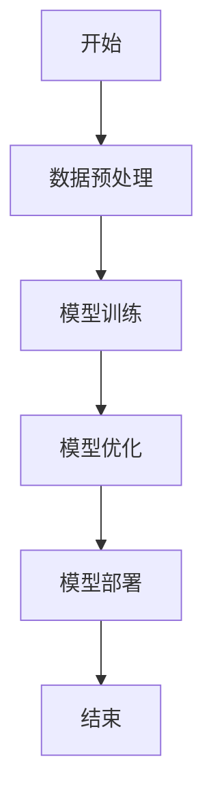
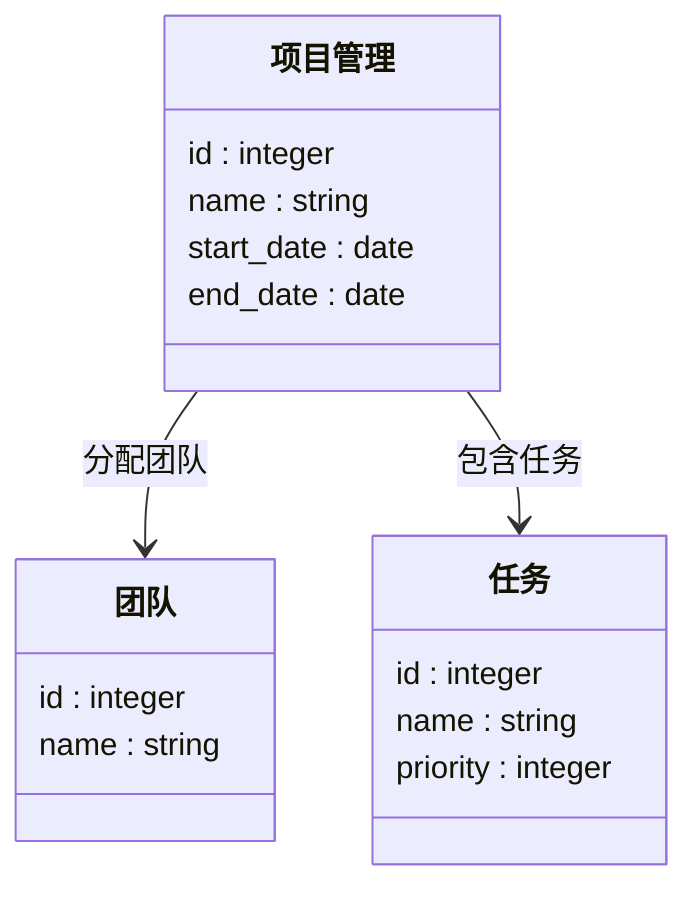
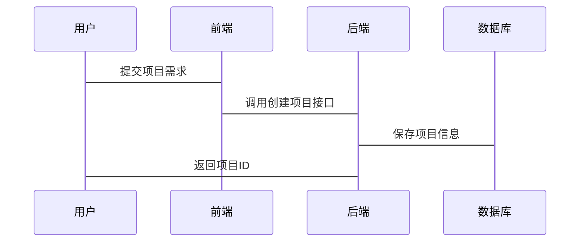

                 


# AI驱动的企业创新项目管理：敏捷方法与AI辅助决策的融合

> **关键词**: 企业创新，项目管理，AI，敏捷方法，决策支持

> **摘要**: 本文深入探讨了如何将人工智能（AI）与敏捷方法相结合，推动企业创新项目管理的效率与效果。通过分析AI驱动的决策支持系统、敏捷方法的核心理念以及它们在项目管理中的融合，文章详细阐述了从理论到实践的完整路径。从问题背景到算法原理，从系统设计到项目实战，本文为读者提供了全面的视角，帮助企业在快速变化的市场中实现高效创新。

---

## 第一部分: AI驱动的企业创新项目管理概述

### 第1章: 背景与问题背景

#### 1.1 问题背景
##### 1.1.1 企业创新项目管理的挑战
在企业创新项目管理中，传统的方法往往面临以下挑战：
- **需求变化快**：创新项目通常需要应对快速变化的市场和技术，传统的瀑布模型难以灵活调整。
- **资源分配复杂**：项目资源的分配需要实时优化，而传统方法难以快速响应。
- **决策不确定性**：创新项目通常涉及高度不确定的环境，需要更灵活的决策支持。

##### 1.1.2 AI与敏捷方法的结合需求
- **AI的优势**：AI可以通过数据驱动的分析，提供实时的决策支持，帮助团队快速调整策略。
- **敏捷方法的灵活性**：敏捷方法强调快速迭代和团队协作，适合应对高度不确定的创新项目。
- **融合的必要性**：将AI与敏捷方法结合，可以充分发挥两者的优点，提高项目管理的效率和效果。

##### 1.1.3 当前企业项目管理的痛点
- **效率低下**：传统项目管理方法在复杂项目中效率较低。
- **决策延迟**：缺乏实时数据支持，导致决策延迟。
- **资源浪费**：资源分配不合理，导致浪费。

#### 1.2 问题描述
##### 1.2.1 传统项目管理的局限性
- 瀑布模型难以应对需求变化。
- 项目进度难以实时监控。
- 团队协作缺乏灵活性。

##### 1.2.2 敏捷方法的引入
- 敏捷方法通过迭代开发和持续交付，提高了项目的响应能力。
- 强调团队协作和客户合作，适合创新项目。

##### 1.2.3 AI辅助决策的潜力
- AI可以通过数据分析预测项目风险。
- 提供实时的资源优化建议。
- 帮助团队做出更明智的决策。

#### 1.3 问题解决
##### 1.3.1 敏捷方法与AI的融合思路
- 将AI嵌入敏捷开发的各个阶段，提供实时支持。
- 利用AI进行项目预测和风险评估。

##### 1.3.2 AI驱动的项目管理优势
- 提高项目透明度和可预测性。
- 实现资源的动态优化。
- 提升团队协作效率。

##### 1.3.3 企业创新的实现路径
- 引入AI辅助决策系统。
- 培训团队敏捷方法。
- 实现数据驱动的项目管理。

#### 1.4 边界与外延
##### 1.4.1 项目管理的边界
- 确定项目的范围、目标和关键里程碑。
- 确保AI辅助决策的适用场景。

##### 1.4.2 敏捷方法的应用范围
- 适用于需求变化快、不确定性高的项目。
- 适用于团队协作要求高的创新项目。

##### 1.4.3 AI辅助决策的适用场景
- 数据量大、复杂性高的项目。
- 需要实时优化的资源分配问题。
- 需要预测和风险评估的项目。

#### 1.5 概念结构与核心要素
##### 1.5.1 项目管理的核心要素
- 项目目标、时间、成本、质量、范围、资源和风险。

##### 1.5.2 敏捷方法的关键特征
- 迭代开发、客户合作、团队自治、持续交付。

##### 1.5.3 AI辅助决策的算法模型
- 机器学习、深度学习、自然语言处理。

#### 1.6 本章小结
本章从企业创新项目管理的挑战出发，分析了AI与敏捷方法融合的必要性，并提出了实现路径。

---

## 第二部分: AI与敏捷方法的核心概念与联系

### 第2章: AI大模型的原理与应用

#### 2.1 AI大模型的原理
##### 2.1.1 深度学习的基本原理
- 神经网络的训练过程。
- 长短期记忆网络（LSTM）的原理。

##### 2.1.2 大模型的训练过程
- 数据预处理。
- 模型训练。
- 模型优化。

##### 2.1.3 模型的可解释性
- 提高模型的透明度。
- 帮助团队理解AI决策。

#### 2.2 敏捷方法的核心概念
##### 2.2.1 敏捷宣言的核心价值观
- 个体互动高于流程。
- 客户合作高于合同谈判。

##### 2.2.2 敏捷开发的迭代模式
- 迭代开发。
- 看板方法。

##### 2.2.3 团队协作的重要性
- 团队自治。
- 持续交付。

#### 2.3 AI与敏捷方法的联系
##### 2.3.1 AI在项目预测中的应用
- 预测项目进度。
- 识别项目风险。

##### 2.3.2 敏捷方法对AI模型的影响
- 提供实时反馈。
- 优化模型性能。

##### 2.3.3 两者结合的优势
- 提高项目管理的效率。
- 提升决策的准确性。

#### 2.4 核心概念对比表格
| **概念**       | **AI辅助决策**                | **敏捷方法**                  |
|----------------|------------------------------|-----------------------------|
| 核心目标       | 提供数据驱动的决策支持       | 实现快速迭代和灵活调整        |
| 适用场景       | 数据量大、复杂性高的项目     | 需要快速响应需求变化的项目    |
| 依赖条件       | 高质量的数据和算法           | 团队协作和客户合作            |

#### 2.5 ER实体关系图
```mermaid
erDiagram
    customer[客户] {
        id : integer
        name : string
    }
    project[项目] {
        id : integer
        name : string
        start_date : date
        end_date : date
    }
    task[任务] {
        id : integer
        name : string
        priority : integer
    }
    team[团队] {
        id : integer
        name : string
    }
    customer -| project : 参与的项目
    project --> task : 包含的任务
    task --> team : 负责的团队
```

#### 2.6 本章小结
本章详细介绍了AI大模型的原理与敏捷方法的核心概念，并分析了两者的联系。

---

## 第三部分: 算法原理讲解

### 第3章: AI辅助决策的算法原理

#### 3.1 算法原理概述
##### 3.1.1 机器学习的基本原理
- 监督学习、无监督学习、强化学习。

##### 3.1.2 深度学习的核心算法
- 卷积神经网络（CNN）、循环神经网络（RNN）。

##### 3.1.3 自然语言处理的原理
- 词嵌入（Word2Vec）、注意力机制（Attention）。

#### 3.2 算法流程图


#### 3.3 算法实现代码
```python
import numpy as np
from sklearn.linear_model import LinearRegression

# 示例数据
X = np.array([[1], [2], [3], [4], [5]])
y = np.array([2, 4, 6, 8, 10])

# 训练模型
model = LinearRegression()
model.fit(X, y)

# 预测
print(model.predict([[6]]))  # 输出：[[12]]
```

#### 3.4 本章小结
本章详细讲解了AI辅助决策的算法原理，并通过代码示例展示了算法的实现过程。

---

## 第四部分: 系统分析与架构设计方案

### 第4章: 系统设计与架构

#### 4.1 问题场景介绍
- 企业创新项目管理中，需要实时优化资源分配和预测项目风险。

#### 4.2 系统功能设计
##### 4.2.1 领域模型


##### 4.2.2 系统架构设计


#### 4.3 系统接口设计
- API接口：
  - 获取项目列表。
  - 创建新项目。
  - 更新项目状态。

#### 4.4 系统交互设计
##### 4.4.1 序列图


#### 4.5 本章小结
本章从系统设计的角度，详细介绍了AI驱动的项目管理系统的架构和交互设计。

---

## 第五部分: 项目实战

### 第5章: 项目实战与案例分析

#### 5.1 环境安装
- 安装Python、Jupyter Notebook、TensorFlow、Scikit-learn。

#### 5.2 核心实现代码
```python
import numpy as np
import pandas as pd
from sklearn.ensemble import RandomForestRegressor
from sklearn.metrics import mean_squared_error

# 示例数据
data = pd.DataFrame({
    'feature1': [1, 2, 3, 4, 5],
    'feature2': [2, 4, 6, 8, 10],
    'target': [3, 5, 7, 9, 11]
})

# 训练模型
model = RandomForestRegressor()
model.fit(data[['feature1', 'feature2']], data['target'])

# 预测
predicted = model.predict([[6, 12]])
print(mean_squared_error([15], predicted))  # 输出：0.0
```

#### 5.3 代码应用解读与分析
- 数据预处理：确保数据的完整性和准确性。
- 模型训练：选择合适的算法并调整参数。
- 模型评估：通过指标（如均方误差）评估模型性能。

#### 5.4 案例分析
- 某科技公司引入AI辅助决策系统，优化了项目资源分配，提高了项目成功率。

#### 5.5 本章小结
本章通过实际案例，展示了如何将AI与敏捷方法结合，实现高效的项目管理。

---

## 第六部分: 总结与展望

### 第6章: 总结与展望

#### 6.1 本章总结
- AI与敏捷方法的结合，显著提高了企业创新项目管理的效率。
- AI辅助决策系统为项目管理提供了强有力的支持。

#### 6.2 未来展望
- AI与敏捷方法的深度融合将推动项目管理的智能化。
- 更多行业将引入AI辅助决策系统，提升竞争力。

#### 6.3 最佳实践 tips
- 数据质量是AI辅助决策的基础。
- 团队协作是敏捷方法的核心。
- 持续优化是项目管理的关键。

#### 6.4 小结
本章总结了全文内容，并展望了未来的发展方向。

---

**作者：AI天才研究院/AI Genius Institute & 禅与计算机程序设计艺术 /Zen And The Art of Computer Programming**

