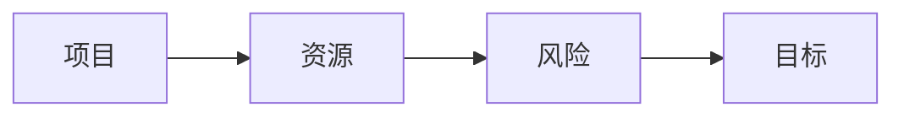

                 


# AI驱动的企业创新项目组合管理：资源优化与风险平衡

> 关键词：AI驱动，项目组合管理，资源优化，风险平衡，企业创新

> 摘要：在现代企业环境中，创新项目管理面临着资源分配和风险平衡的双重挑战。本文探讨如何通过AI技术优化企业创新项目的组合管理，实现资源的高效利用和风险的有效控制。通过分析AI在项目组合管理中的应用，提出基于机器学习的资源优化和风险平衡方法，为企业的创新管理提供新的思路。

---

## 第一部分：背景与概念

### 第1章：问题背景与问题描述

#### 1.1 问题背景
- **传统项目组合管理的挑战**：企业在创新项目管理中面临资源有限、项目复杂度高、风险多样的问题，传统方法难以高效应对。
- **AI技术的推动作用**：AI通过数据驱动的决策支持，帮助企业在复杂环境中优化资源分配和风险控制。
- **当前痛点**：资源分配不均、项目优先级难以确定、风险评估缺乏动态性。

#### 1.2 问题描述
- **核心问题**：如何在有限资源下选择最优项目组合，平衡创新风险。
- **复杂性**：项目间的相互依赖、资源约束、动态风险因素。
- **改进需求**：引入AI技术，提升决策的准确性和效率。

#### 1.3 解决思路
- **AI引入的必要性**：利用机器学习模型处理海量数据，发现潜在规律。
- **数据驱动的优势**：通过数据分析优化决策过程，提高资源利用效率。
- **AI的应用前景**：动态调整项目组合，实时监控风险，提高企业竞争力。

### 第2章：核心概念与联系

#### 2.1 核心概念原理
- **项目组合管理**：将项目视为组合，优化整体价值。
- **资源优化的数学模型**：线性规划、整数规划等模型的应用。
- **风险平衡的理论基础**：概率论、统计学在风险评估中的应用。

#### 2.2 概念属性对比
- **项目组合与单一项目**：组合管理考虑整体效益，单一项目关注个体目标。
- **资源分配与风险评估**：资源分配是输入，风险评估是输出，两者相互影响。
- **AI驱动与传统方法**：AI提供动态优化，传统方法依赖固定规则。

#### 2.3 实体关系图


---

## 第二部分：算法原理

### 第3章：算法原理与流程

#### 3.1 AI模型的构建与训练
- **数据预处理**：清洗、特征提取。
- **模型选择**：使用随机森林、神经网络等方法。
- **模型调优**：交叉验证、超参数优化。

#### 3.2 资源优化算法
- **线性规划模型**：目标函数为最大化收益，约束条件为资源限制。
  $$ \text{最大化} \sum_{i=1}^{n} w_i x_i $$
  $$ \text{约束} \sum_{i=1}^{n} r_i x_i \leq R $$
- **AI驱动的资源分配**：基于预测模型的动态调整。
- **流程图**
  ```mermaid
  graph LR
      A[开始] --> B[数据输入]
      B --> C[特征提取]
      C --> D[模型训练]
      D --> E[资源分配]
  ```

---

## 第三部分：系统分析与设计

### 第4章：系统架构设计

#### 4.1 问题场景
- **创新项目管理**：企业需要管理多个创新项目，确保资源合理分配和风险可控。

#### 4.2 系统功能设计
- **领域模型**：项目、资源、风险三者的关系。
  ```mermaid
  classDiagram
      class 项目 {
          名称：字符串
          预测收益：浮点数
          风险等级：整数
      }
      class 资源 {
          类型：字符串
          数量：整数
          预算：浮点数
      }
      class 风险 {
          类别：字符串
          概率：浮点数
          影响：整数
      }
      项目 --> 资源
      资源 --> 风险
  ```

#### 4.3 系统架构设计
- **分层架构**：数据层、业务逻辑层、用户界面层。
  ```mermaid
  graph LR
      A[数据层] --> B[业务逻辑层]
      B --> C[用户界面层]
  ```

#### 4.4 接口与交互设计
- **API接口**：RESTful接口实现数据传输。
- **交互流程**：
  ```mermaid
  graph LR
      A[用户] --> B[输入数据]
      B --> C[模型处理]
      C --> D[返回结果]
  ```

---

## 第四部分：项目实战

### 第5章：环境安装与代码实现

#### 5.1 环境安装
- **Python 3.8+**
- **库的安装**：pandas, scikit-learn, matplotlib.

#### 5.2 核心代码实现
- **数据预处理**：
  ```python
  import pandas as pd
  data = pd.read_csv('projects.csv')
  ```

- **模型训练**：
  ```python
  from sklearn.ensemble import RandomForestRegressor
  model = RandomForestRegressor()
  model.fit(X_train, y_train)
  ```

- **资源分配**：
  ```python
  def allocate_resources():
      for project in projects:
          if model.predict([project]) > threshold:
              allocate资源(project)
  ```

#### 5.3 实例分析与结果解读
- **案例分析**：假设某公司有5个项目，资源限制为100万元。
- **结果解读**：模型预测哪些项目值得投资，动态调整资源分配。

---

## 第五部分：最佳实践与总结

### 第6章：总结与展望

#### 6.1 最佳实践
- **数据质量**：确保数据的准确性和完整性。
- **模型选择**：根据具体情况选择合适的算法。
- **动态调整**：定期更新模型，适应环境变化。

#### 6.2 小结
- AI驱动的项目组合管理显著提升了资源利用效率和风险控制能力。
- 通过数据驱动的决策，企业在创新项目管理中更具竞争力。

#### 6.3 注意事项
- **数据隐私**：确保数据安全，遵守相关法规。
- **模型解释性**：选择可解释的模型，便于业务理解。

#### 6.4 拓展阅读
- 推荐阅读《机器学习实战》和《企业项目组合管理》。

---

## 作者：AI天才研究院 & 禅与计算机程序设计艺术

