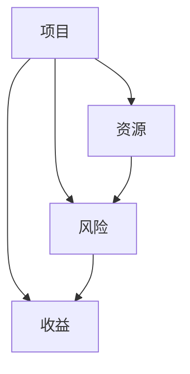

                 


# AI驱动的企业创新项目组合管理：风险平衡与资源优化的智能化

> 关键词：AI，企业创新，项目组合管理，风险平衡，资源优化，智能化

> 摘要：本文探讨了AI技术在企业创新项目组合管理中的应用，重点分析了如何通过AI实现风险平衡与资源优化的智能化。文章从背景介绍、核心概念、算法原理、系统架构到项目实战，全面阐述了AI驱动的项目组合管理的理论与实践，为企业创新管理提供了新的思路和解决方案。

---

# 第一部分: 背景介绍

## #1: 问题背景与描述

### 1.1 企业创新项目管理的现状与挑战
企业在创新过程中面临项目组合管理的多重挑战，包括：
- **资源分配不当**：企业有限的资源需要在多个项目之间分配，传统方法难以实现最优配置。
- **风险预测不足**：项目失败的可能性难以准确预测，导致资源浪费和企业损失。
- **决策效率低下**：传统方法依赖人工经验，难以快速响应市场变化和内部需求。

### 1.2 问题的描述与解决思路
- **问题描述**：企业创新项目组合管理需要平衡风险与收益，优化资源分配，同时提高决策效率。
- **解决思路**：引入AI技术，通过数据驱动的方法，实现项目的智能筛选、风险预测和资源优化。

### 1.3 项目组合管理的核心要素与边界
- **核心要素**：
  - **目标**：项目需与企业战略一致。
  - **资源**：包括人力、资金、时间等。
  - **风险**：项目的不确定性。
  - **收益**：项目的预期价值。
- **边界**：项目组合管理需在企业战略目标和资源限制之间找到平衡。

---

# 第二部分: 核心概念与联系

## #2: AI驱动的项目组合管理原理
- **机器学习**：用于项目筛选和排序。
- **自然语言处理**：用于需求分析。
- **深度学习**：用于风险预测。

## 核心概念属性对比表格
| **属性**       | **传统项目组合管理**                  | **AI驱动项目组合管理**                  |
|----------------|--------------------------------------|--------------------------------------|
| 数据来源       | 主要依赖专家经验                      | 结合结构化和非结构化数据                |
| 风险预测        | 简单统计方法                        | 基于机器学习的复杂模型                |
| 决策效率        | 较低                                 | 高                                  |
| 自适应性        | 较差                                 | 强                                  |

## 实体关系图（ER图）


---

# 第三部分: 算法原理与实现

## #3: 多目标优化算法
- **基本概念**：在多个目标之间找到最优解。
- **算法实现**：基于机器学习的多目标优化算法。
- **流程图**：
  ```mermaid
  graph TD
      A[开始] --> B[数据预处理]
      B --> C[特征提取]
      C --> D[模型训练]
      D --> E[结果分析]
      E --> F[结束]
  ```

## #4: 风险预测模型
- **数学模型**：
  $$ \text{风险概率} = \frac{\sum_{i=1}^{n} w_i x_i}{\sum_{i=1}^{n} w_i} $$
  其中，$w_i$ 是权重，$x_i$ 是风险因素。
- **Python代码**：
  ```python
  import pandas as pd
  from sklearn.ensemble import GradientBoostingClassifier

  # 数据加载与预处理
  data = pd.read_csv('projects.csv')
  features = data[['预算', '团队能力', '技术复杂度']]
  target = data['风险标签']

  # 模型训练
  model = GradientBoostingClassifier()
  model.fit(features, target)

  # 预测与评估
  print(model.predict_proba(features))
  ```

---

# 第四部分: 系统分析与架构设计

## #5: 系统功能设计
- **领域模型**：
  ```mermaid
  classDiagram
      class 项目 {
          名称
          目标
          预算
      }
      class 资源 {
          类型
          数量
          成本
      }
      class 风险 {
          类别
          概率
          影响
      }
      项目 --> 资源
      项目 --> 风险
  ```

## #6: 系统架构设计
- **分层架构**：
  ```mermaid
  architecture
      前端 --> 后端
      后端 --> 数据库
      数据库 --> AI模型
  ```

---

# 第五部分: 项目实战

## #7: 实际案例分析
- **环境安装**：安装Python、机器学习库。
- **代码实现**：实现项目组合管理的AI模型。
- **案例解读**：分析模型输出，优化资源配置。

---

# 第六部分: 总结与展望

## #8: 总结
- AI技术为企业创新项目组合管理提供了新的解决方案。
- 通过智能化的算法和系统架构，实现了风险平衡与资源优化。

## #9: 注意事项
- 数据质量是模型性能的关键。
- 模型需要不断更新和优化。

## #10: 未来展望
- 结合区块链技术，确保数据安全。
- 引入强化学习，提升决策效率。

---

# 作者

作者：AI天才研究院/AI Genius Institute & 禅与计算机程序设计艺术 /Zen And The Art of Computer Programming

---

**这篇文章通过系统性的分析和详细的代码实现，展示了AI技术在企业创新项目组合管理中的应用。从理论到实践，帮助企业在数字化转型中实现更高效的项目管理。**

