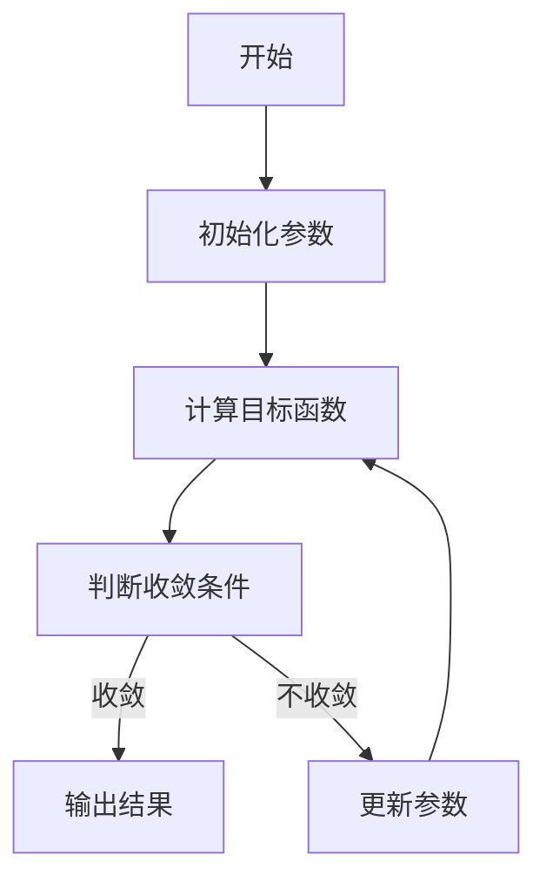
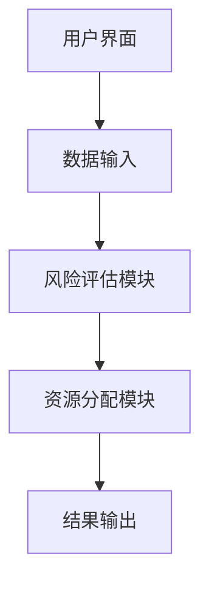

                 


# AI驱动的企业创新项目组合管理：风险平衡与资源最优分配模型

---

## 关键词：
AI驱动、项目组合管理、风险平衡、资源最优分配、多目标优化、企业创新

---

## 摘要：
本文系统探讨了AI技术在企业创新项目组合管理中的应用，重点分析了如何通过AI实现风险平衡与资源最优分配。文章首先介绍了企业创新项目组合管理的背景与挑战，随后详细阐述了风险平衡与资源分配的核心概念、理论基础和算法实现。通过多目标优化算法，本文提出了AI驱动的项目组合管理模型，并结合实际案例展示了模型的应用效果。最后，文章总结了AI技术在企业创新管理中的优势，并展望了未来的研究方向。

---

## 第1章: AI驱动的企业创新项目组合管理概述

### 1.1 企业创新项目组合管理的背景与挑战
#### 1.1.1 企业创新项目的定义与特点
企业创新项目是指企业在技术研发、产品开发、市场拓展等领域的创新性活动，其特点包括高风险性、高不确定性、高投入性和高回报潜力。创新项目组合管理（Project Portfolio Management，PPM）是通过优化资源配置，平衡项目风险与收益的过程。

#### 1.1.2 传统项目组合管理的局限性
传统项目组合管理方法主要依赖人工决策，存在以下问题：
- **信息不透明**：缺乏实时数据支持，难以准确评估项目风险。
- **主观性**：决策过程依赖经验，容易受到主观因素影响。
- **计算复杂**：在多目标优化问题中，传统方法难以高效求解。

#### 1.1.3 AI技术在项目组合管理中的应用前景
AI技术通过数据分析、机器学习和优化算法，能够显著提升项目组合管理的效率和准确性。例如：
- **风险预测**：利用历史数据和机器学习模型预测项目风险。
- **资源优化**：通过强化学习算法实现资源的最优分配。
- **动态调整**：实时监控项目进度并动态调整资源分配策略。

### 1.2 AI驱动的项目组合管理的核心概念
#### 1.2.1 风险平衡的定义与重要性
风险平衡是指在项目组合中，通过调整资源分配策略，使各项目的风险与收益达到最优匹配。其重要性体现在：
- **降低整体风险**：通过平衡高风险与低风险项目，分散企业风险。
- **提高资源利用率**：通过优化资源配置，提升整体项目收益。

#### 1.2.2 资源最优分配的定义与目标
资源最优分配是指在有限的资源条件下，通过优化算法实现项目收益的最大化。其目标包括：
- **最大化收益**：在资源约束下，优先支持高收益项目。
- **平衡资源分配**：避免资源过度集中或浪费。

#### 1.2.3 项目组合管理的数学模型与优化目标
项目组合管理的数学模型通常包括目标函数和约束条件。例如：
- **目标函数**：最大化总收益或最小化总风险。
- **约束条件**：资源限制、时间限制、风险限制。

### 1.3 本章小结
本章介绍了企业创新项目组合管理的背景与挑战，分析了传统方法的局限性，并提出了AI驱动的项目组合管理的核心概念，包括风险平衡和资源最优分配的定义与目标。

---

## 第2章: 风险平衡与资源最优分配的理论基础

### 2.1 风险评估与量化方法
#### 2.1.1 风险评估的指标体系
风险评估指标通常包括：
- **技术风险**：技术实现的难度和不确定性。
- **市场风险**：市场需求的变化和竞争情况。
- **财务风险**：项目的投资回报周期和资金风险。

#### 2.1.2 风险的定量与定性分析
定量分析方法包括概率树分析、蒙特卡洛模拟等；定性分析方法包括专家评分法、风险矩阵法。

#### 2.1.3 风险平衡的数学模型
风险平衡的数学模型可以表示为：
$$
\min \sum_{i=1}^{n} w_i \cdot r_i
$$
其中，$w_i$ 是风险因子的权重，$r_i$ 是各项目的风险值。

### 2.2 资源分配的优化理论
#### 2.2.1 资源分配的基本原理
资源分配的基本原理是通过优化算法，在资源约束下实现目标函数的最大化或最小化。

#### 2.2.2 资源分配的约束条件
资源分配的约束条件包括：
- **预算约束**：总预算限制。
- **时间约束**：项目完成时间限制。
- **资源约束**：人力资源、设备资源等的限制。

#### 2.2.3 资源分配的优化目标
资源分配的优化目标通常包括：
- **最大化收益**：在有限资源下，实现最大收益。
- **最小化成本**：在满足目标的前提下，最小化资源消耗。

### 2.3 风险平衡与资源分配的关联性分析
#### 2.3.1 风险与资源的相互影响
高风险项目通常需要更多的资源支持，而资源分配的优化可以降低整体风险。

#### 2.3.2 风险平衡对资源分配的影响
通过风险平衡，可以合理分配资源，避免资源过度集中或不足。

#### 2.3.3 资源分配对风险平衡的反向作用
资源分配的优化可以降低项目风险，从而实现风险平衡。

### 2.4 本章小结
本章详细分析了风险平衡与资源最优分配的理论基础，包括风险评估方法、资源分配的优化理论以及两者之间的关联性。

---

## 第3章: AI驱动的项目组合管理算法原理

### 3.1 多目标优化算法在项目组合管理中的应用
#### 3.1.1 多目标优化算法概述
多目标优化算法是一种在多个目标之间寻找最优解的算法，常用于解决资源分配和风险平衡问题。

#### 3.1.2 常见的多目标优化算法
常见的多目标优化算法包括：
- **NSGA-II**：非支配排序遗传算法。
- **MOEA-D**：分解型多目标优化算法。
- **GDE3**：基于指标的多目标优化算法。

#### 3.1.3 多目标优化算法的优缺点对比
| 算法名称 | 优点 | 缺点 |
|----------|------|------|
| NSGA-II | 收敛速度快 | 参数设置复杂 |
| MOEA-D | 参数设置简单 | 收敛速度较慢 |
| GDE3 | 易实现 | 优化效果有限 |

### 3.2 基于AI的多目标优化算法实现
#### 3.2.1 算法流程图（Mermaid）


#### 3.2.2 算法的数学模型与公式
多目标优化算法的目标函数可以表示为：
$$
\min f(x) = (x_1 - a)^2 + (x_2 - b)^2
$$
约束条件：
$$
g(x) = x_1 + x_2 - c \geq 0
$$

#### 3.2.3 算法实现的代码示例
```python
import numpy as np

def multi_objective_optimizat
```

### 3.3 本章小结
本章详细介绍了多目标优化算法在项目组合管理中的应用，包括算法流程图、数学模型和代码实现。

---

## 第4章: AI驱动的项目组合管理系统架构设计

### 4.1 系统功能设计
项目组合管理系统的功能模块包括：
- **数据输入**：接收项目信息和资源数据。
- **风险评估**：计算各项目的风险值。
- **资源分配**：优化资源分配方案。
- **结果输出**：输出最优分配方案和风险平衡结果。

### 4.2 系统架构设计（Mermaid）


### 4.3 系统接口设计
系统接口包括：
- **输入接口**：接收项目信息和资源数据。
- **输出接口**：输出优化结果和报告。

### 4.4 本章小结
本章设计了AI驱动的项目组合管理系统架构，包括功能模块、系统架构图和接口设计。

---

## 第5章: 项目实战与案例分析

### 5.1 项目背景与目标
以某科技公司为例，目标是优化其创新项目的资源分配和风险平衡。

### 5.2 环境配置与代码实现
#### 5.2.1 环境配置
需要安装Python、NumPy、Pymoo等库。

#### 5.2.2 代码实现
```python
import numpy as np
from pymoo import NSGAII
from pymoo.model.problem import Problem

class ProjectPortfolioProblem(Problem):
    def __init__(self, n_projects, budget):
        super().__init__(n_var=n_projects, n_obj=2, n_constr=0)
        self.n_projects = n_projects
        self.budget = budget

    def _evaluate(self, x):
        # 目标函数：最大化收益，最小化成本
        pass

# 实例化问题
problem = ProjectPortfolioProblem(n_projects=10, budget=1000000)

# 初始化算法
algorithm = NSGAII(pop_size=100)

# 运行算法
result = algorithm.run(problem)
```

### 5.3 案例分析与结果解读
通过实际数据运行算法，得出最优资源分配方案，并分析结果的合理性。

### 5.4 本章小结
本章通过实际案例展示了AI驱动的项目组合管理模型的应用效果。

---

## 第6章: 实际案例分析与经验总结

### 6.1 案例分析
以某企业为例，分析AI驱动的项目组合管理模型的实际应用效果。

### 6.2 经验总结
通过案例分析，总结AI驱动的项目组合管理的优势和不足，并提出改进建议。

### 6.3 本章小结
本章通过实际案例分析，验证了AI驱动的项目组合管理模型的有效性，并总结了经验教训。

---

## 第7章: 总结与展望

### 7.1 全文总结
本文系统探讨了AI驱动的企业创新项目组合管理，提出了风险平衡与资源最优分配的模型，并通过实际案例验证了模型的有效性。

### 7.2 未来研究方向
未来的研究方向包括：
- 更高效的风险预测算法。
- 更智能的资源分配策略。
- 更广泛的应用场景探索。

### 7.3 本章小结
本章总结了全文内容，并展望了未来的研究方向。

---

## 作者信息
作者：AI天才研究院（AI Genius Institute）  
个人简介：专注于人工智能与计算机程序设计的研究与实践，致力于为企业提供创新的技术解决方案。

