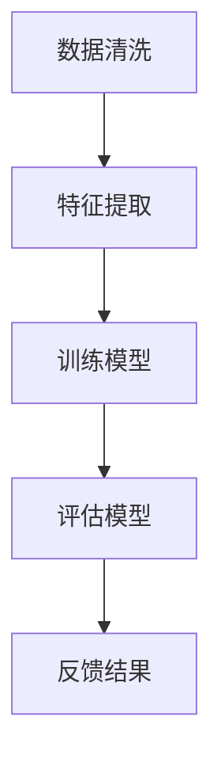
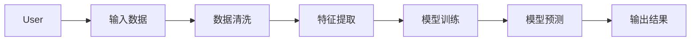

                 


```markdown
# AI驱动的企业员工绩效评估与发展规划

> 关键词：AI，绩效评估，员工发展，机器学习，数据分析

> 摘要：本文探讨如何利用人工智能技术优化企业员工的绩效评估和职业发展规划。通过分析传统方法的局限性，介绍AI驱动的评估模型、算法原理及系统架构，提供实际项目案例，总结最佳实践。

---

## 第一部分: AI驱动的企业员工绩效评估与发展规划概述

### 第1章: AI驱动的员工绩效评估与发展规划背景

#### 1.1 问题背景与描述
- **传统绩效评估的局限性**：主观性、不透明性、缺乏动态反馈。
- **问题解决方法**：引入AI技术，实现数据驱动的评估和个性化发展计划。
- **边界与外延**：AI应用于数据收集、分析、预测和反馈。

#### 1.2 核心概念与联系
- **核心概念**：AI驱动的绩效评估涉及数据采集、分析和反馈。
- **概念关系**：员工、绩效指标、评估结果。

---

## 第二部分: 核心概念与联系

### 第2章: AI驱动的员工绩效评估原理

#### 2.1 数据采集与处理
- **数据来源**：KPI、任务完成度、反馈。
- **数据预处理**：清洗、转换、特征提取。

#### 2.2 绩效预测模型
- **算法选择**：监督学习（回归、分类）。
- **模型训练**：数据特征选择、训练集划分、评估指标（准确率、F1分数）。

#### 2.3 绩效反馈与改进
- **反馈机制**：动态反馈、个性化建议。
- **模型优化**：迭代训练、参数调整。

---

## 第三部分: 算法原理与数学模型

### 第3章: 绩效评估算法原理

#### 3.1 机器学习算法概述
- **监督学习**：用于预测绩效。
- **无监督学习**：用于发现数据中的模式。

#### 3.2 绩效预测的数学模型
- **线性回归模型**：
$$ y = \beta_0 + \beta_1x + \epsilon $$
- **决策树模型**：用于分类和回归。

#### 3.3 算法流程图


---

## 第四部分: 系统分析与架构设计

### 第4章: 系统架构设计

#### 4.1 问题场景
- **需求分析**：员工绩效评估的动态性和个性化需求。
- **系统功能设计**：数据采集、分析、反馈模块。

#### 4.2 系统架构图


---

## 第五部分: 项目实战

### 第5章: 项目实施与代码解读

#### 5.1 环境安装
- Python、Pandas、Scikit-learn安装与配置。

#### 5.2 核心代码实现
```python
import pandas as pd
from sklearn.linear_model import LinearRegression
from sklearn.metrics import mean_squared_error

# 数据加载
data = pd.read_csv('performance.csv')

# 特征与目标分离
X = data[['hours_worked', 'task_completed']]
y = data['performance_score']

# 模型训练
model = LinearRegression()
model.fit(X, y)

# 预测与评估
y_pred = model.predict(X)
print(mean_squared_error(y, y_pred))
```

#### 5.3 案例分析
- 数据分析、模型训练、结果解读与优化建议。

---

## 第六部分: 最佳实践与总结

### 第6章: 最佳实践与总结

#### 6.1 实施建议
- 数据质量、模型选择、反馈机制。
- 数据隐私保护的重要性。

#### 6.2 小结与展望
- 总结AI技术在绩效评估中的应用价值。
- 展望未来可能的优化方向。

---

## 作者信息

作者：AI天才研究院（AI Genius Institute） & 禅与计算机程序设计艺术（Zen And The Art of Computer Programming）

---

本文系统地探讨了AI在企业员工绩效评估与发展规划中的应用，从理论到实践，为读者提供了全面的指导。通过详细分析和实际案例，展示了如何利用AI技术优化绩效评估过程，助力员工职业发展。
```

