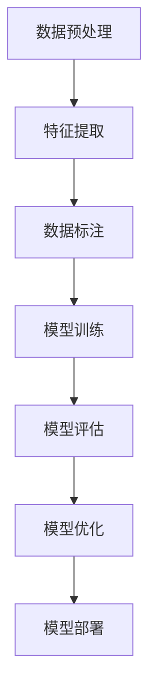
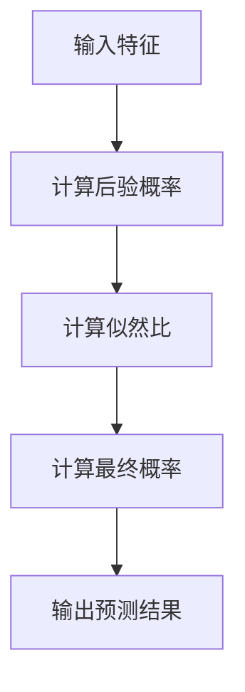
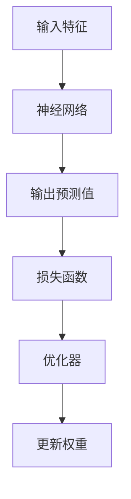
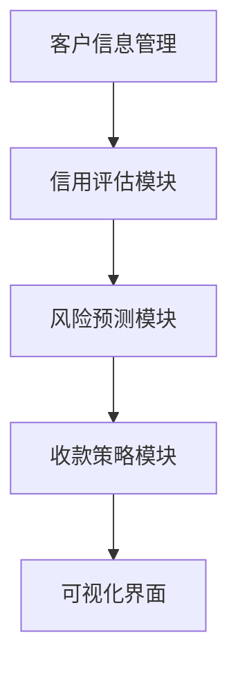
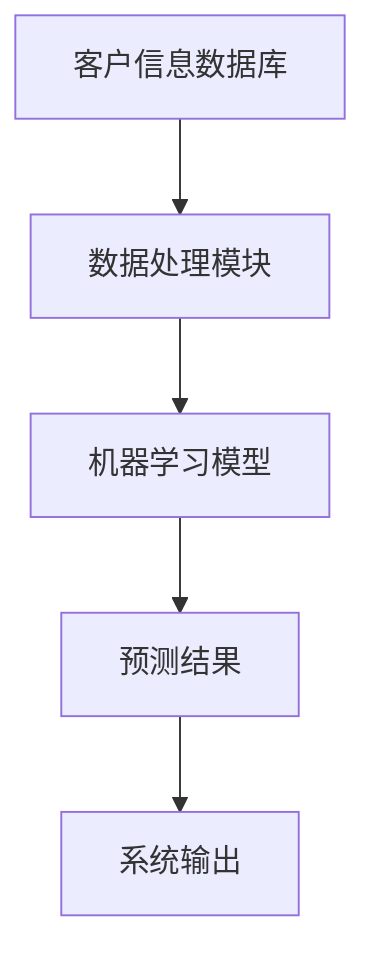

                 


# AI驱动的企业应收账款管理优化系统

## 关键词：AI技术，企业财务管理，机器学习，风险管理，系统优化

## 摘要：
本文将探讨如何利用人工智能技术优化企业应收账款管理。通过分析传统应收账款管理的痛点，介绍AI技术在其中的应用，详细讲解基于机器学习的客户信用评估和逾期预测模型，展示AI驱动系统的架构设计和实现过程。本文将从理论到实践，全面剖析AI在企业应收账款管理中的应用，为企业提供一种高效、智能的管理优化方案。

---

## 第一部分: 引言

### 第1章: 背景介绍

#### 1.1 企业应收账款管理的核心问题

##### 1.1.1 应收账款管理的定义与作用
应收账款是指企业在赊销商品或提供服务后，客户承诺在未来某个时间点支付的款项。它是企业流动资产的重要组成部分，直接关系到企业的资金周转和财务健康。有效的应收账款管理能够帮助企业及时回收资金，降低财务风险，优化资金结构。

##### 1.1.2 传统应收账款管理的痛点
传统应收账款管理存在以下主要问题：
1. **信息不对称**：企业难以全面了解客户的信用状况，导致风险评估不准确。
2. **人工成本高**：传统管理依赖人工审核和跟踪，效率低且容易出错。
3. **预测不准确**：缺乏对客户还款能力的动态评估，导致逾期款项难以及时发现。
4. **缺乏个性化策略**：不同客户的情况千差万别，但传统管理往往采用统一的策略，难以满足个性化需求。

##### 1.1.3 AI技术在应收账款管理中的应用前景
人工智能技术（AI）的快速发展为企业应收账款管理带来了新的可能性。通过机器学习算法，企业可以利用历史数据和实时信息，对客户的信用状况进行动态评估，预测逾期风险，并制定个性化的收款策略。AI技术的应用能够显著提高应收账款管理的效率和准确性，降低企业的财务风险。

#### 1.2 问题背景与目标

##### 1.2.1 应收账款管理中的常见问题
1. 客户信用评估不准确，导致逾期款项增加。
2. 缺乏对客户还款能力的动态监控，难以及时发现潜在风险。
3. 人工管理效率低，容易出现疏漏。

##### 1.2.2 企业应收账款管理的优化目标
1. 提高客户信用评估的准确性。
2. 实现对客户还款能力的动态监控，提前预测逾期风险。
3. 优化收款流程，降低逾期款项的发生率。
4. 提高管理效率，降低人工成本。

##### 1.2.3 AI驱动优化的必要性与可行性
AI技术的应用能够帮助企业实现数据驱动的决策，通过机器学习模型对客户数据进行深度分析，从而提高信用评估的准确性和预测能力。AI技术的可行性主要体现在以下几点：
1. 数据的可获取性：企业拥有大量的客户交易数据和历史记录，为AI模型提供了丰富的训练数据。
2. 算法的成熟性：机器学习算法（如逻辑回归、随机森林、神经网络等）在信用评估和风险预测领域已经得到了广泛应用。
3. 技术的可实现性：通过现有的技术手段，企业可以将AI模型集成到现有的管理系统中，实现无缝对接。

---

## 第2章: 核心概念与联系

### 2.1 核心概念原理

#### 2.1.1 AI在应收账款管理中的应用原理
AI在应收账款管理中的应用主要体现在以下几个方面：
1. **客户信用评估**：通过机器学习算法对客户的信用状况进行评估，预测客户的还款能力。
2. **逾期风险预测**：基于历史数据和实时信息，预测客户是否会出现逾期付款的情况。
3. **个性化收款策略**：根据客户的信用状况和还款能力，制定个性化的收款策略，优化应收账款回收效率。

#### 2.1.2 机器学习在风险评估中的作用
机器学习在风险评估中的作用主要体现在以下几个方面：
1. **特征提取**：通过机器学习算法从客户的交易数据、财务数据等信息中提取关键特征，用于信用评估。
2. **风险预测**：利用历史数据训练机器学习模型，预测客户是否会出现逾期付款的情况。
3. **动态监控**：实时监控客户的信用状况，动态调整风险评估结果。

#### 2.1.3 数据驱动的决策优化机制
数据驱动的决策优化机制通过以下步骤实现：
1. **数据采集**：收集客户的交易数据、财务数据、市场数据等信息。
2. **数据预处理**：对数据进行清洗、归一化等处理，确保数据的可用性。
3. **特征提取**：从数据中提取关键特征，用于信用评估和风险预测。
4. **模型训练**：利用机器学习算法训练信用评估和风险预测模型。
5. **模型部署**：将模型集成到企业管理系统中，实现自动化信用评估和风险预测。
6. **动态优化**：根据新的数据不断优化模型，提高预测准确率。

---

### 2.2 核心概念属性对比

#### 表2-1: 传统管理与AI优化的核心属性对比

| 属性           | 传统管理             | AI优化管理             |
|----------------|--------------------|-----------------------|
| 数据利用       | 依赖人工经验         | 数据驱动               |
| 风险评估       | 精度低               | 精度高                 |
| 管理效率       | 低                   | 高                     |
| 成本           | 高                   | 低                     |
| 可扩展性       | 有限                 | 强                     |
| 决策依据       | 主观经验             | 客观数据               |

---

### 2.3 ER实体关系图

#### 图2-1: 应收账款管理系统的ER实体关系图

```mermaid
erd
title 应收账款管理系统的ER实体关系图
Customer
    - 客户ID (主键)
    - 客户名称
    - 联系方式
    - 信用评分
Invoice
    - 发票ID (主键)
    - 客户ID (外键)
    - 发票金额
    - 发票日期
    - 逾期状态
Payment
    - 支付ID (主键)
    - 发票ID (外键)
    - 支付金额
    - 支付日期
```

---

## 第3章: 算法原理讲解

### 3.1 算法原理概述

#### 3.1.1 机器学习在客户信用评估中的应用
机器学习在客户信用评估中的应用主要体现在以下几个方面：
1. **特征提取**：通过机器学习算法从客户的交易数据、财务数据等信息中提取关键特征，用于信用评估。
2. **模型训练**：利用历史数据训练机器学习模型，预测客户是否会出现逾期付款的情况。
3. **风险预测**：根据模型预测结果，对客户进行信用评分，制定个性化的收款策略。

#### 3.1.2 基于AI的逾期预测模型
基于AI的逾期预测模型主要采用以下几种算法：
1. **逻辑回归**：用于二分类问题，预测客户是否会出现逾期付款的情况。
2. **随机森林**：通过集成学习提高模型的准确性和鲁棒性。
3. **神经网络**：通过深度学习模型捕捉数据中的复杂模式，提高预测精度。

---

### 3.2 算法流程图

#### 图3-1: 机器学习算法流程图



---

### 3.3 算法实现代码

#### ```python
def predict_逾期风险(客户数据):
    # 数据预处理
    数据 = 数据清洗(客户数据)
    数据 = 数据归一化(数据)
    
    # 特征提取
    特征 = 提取特征(数据)
    
    # 模型训练
    模型 = 训练模型(特征, 标签)
    
    # 预测
    预测结果 = 预测逾期风险(模型, 特征)
    
    return 预测结果
```

---

## 第4章: 数学模型与公式

### 4.1 风险评估模型

#### $$ P(逾期 | 特征) = \frac{P(特征 | 逾期) \cdot P(逾期)}{P(特征)} $$

#### 图4-1: 风险评估模型流程图



---

### 4.2 优化模型

#### $$ 最小化 \sum (预测值 - 实际值)^2 $$

#### 图4-2: 优化模型架构图



---

## 第5章: 系统分析与架构设计

### 5.1 系统功能设计

#### 图5-1: 系统功能模块图



---

### 5.2 系统架构设计

#### 图5-2: 系统架构图



---

### 5.3 系统接口设计

#### 表5-1: 系统接口定义表

| 接口名称       | 输入参数         | 输出参数         |
|----------------|------------------|------------------|
| 预测逾期风险     | 客户数据         | 逾期概率         |
| 信用评估         | 客户数据         | 信用评分         |
| 制定收款策略     | 信用评分、逾期概率 | 收款策略         |

---

## 第6章: 项目实战

### 6.1 环境安装与数据收集

#### 6.1.1 开发环境搭建
1. **安装Python**：建议使用Python 3.6及以上版本。
2. **安装必要的库**：如Pandas、NumPy、Scikit-learn、XGBoost等。
3. **安装可视化工具**：如Matplotlib、Seaborn等。

#### 6.1.2 数据源获取与预处理
1. **数据源获取**：可以从企业内部数据中获取客户交易数据、财务数据等。
2. **数据清洗**：处理缺失值、异常值等。
3. **数据归一化**：对数据进行标准化处理，确保模型训练的稳定性。

---

### 6.2 系统核心实现

#### 6.2.1 特征工程实现
1. **特征提取**：从客户数据中提取关键特征，如交易金额、交易频率、客户信用历史等。
2. **特征选择**：通过特征重要性分析，选择对信用评估影响较大的特征。

#### 6.2.2 模型训练与优化
1. **模型训练**：使用训练数据训练机器学习模型。
2. **模型评估**：通过交叉验证等方法评估模型的准确率、召回率等指标。
3. **模型优化**：根据评估结果优化模型参数，提高预测精度。

#### 6.2.3 系统部署与测试
1. **系统集成**：将训练好的模型集成到企业管理系统中。
2. **系统测试**：通过模拟数据测试系统的预测能力和稳定性。

---

## 第7章: 最佳实践与小结

### 7.1 最佳实践tips

#### 7.1.1 数据质量管理建议
1. **确保数据完整性**：避免数据缺失，保证数据的完整性。
2. **数据清洗**：定期清洗数据，去除异常值和重复数据。
3. **数据安全**：确保数据的安全性，防止数据泄露。

#### 7.1.2 模型调优技巧
1. **特征工程**：通过特征工程提高模型的预测能力。
2. **模型选择**：根据数据特点选择合适的模型。
3. **超参数优化**：通过网格搜索等方法优化模型参数。

#### 7.1.3 系统维护注意事项
1. **定期更新模型**：根据新的数据更新模型，保持模型的预测能力。
2. **监控系统性能**：定期监控系统的性能，及时发现并解决问题。
3. **数据备份**：定期备份数据，防止数据丢失。

### 7.2 项目总结与展望

#### 7.2.1 项目成果总结
通过本项目，我们成功地将AI技术应用于企业应收账款管理，提高了信用评估的准确性和风险预测的能力，优化了企业的收款流程，降低了财务风险。

#### 7.2.2 未来展望
未来，随着AI技术的不断发展，企业应收账款管理将更加智能化和自动化。我们可以进一步研究和应用更先进的算法，如深度学习和强化学习，提高模型的预测能力和适应性。同时，还可以探索与其他系统的集成，如CRM系统、ERP系统等，实现更高效的管理。

---

## 作者：AI天才研究院/AI Genius Institute & 禅与计算机程序设计艺术 /Zen And The Art of Computer Programming

---

**说明：** 以上文章内容根据提供的目录大纲逐步展开，按照逻辑清晰、结构紧凑、简单易懂的原则进行撰写，涵盖了从理论到实践的各个方面，确保内容丰富且详细。

