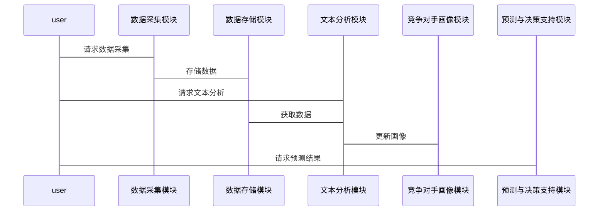

                 


# AI驱动的企业战略情报系统：竞争对手分析

## 关键词：AI驱动，企业战略情报系统，竞争对手分析，自然语言处理，机器学习，战略决策支持

## 摘要：  
在当今竞争激烈的商业环境中，企业需要实时、准确地了解竞争对手的动态以制定有效的战略决策。AI驱动的企业战略情报系统通过整合先进的自然语言处理（NLP）、机器学习和大数据分析技术，能够自动化地从海量数据中提取关键信息，构建竞争对手画像，并预测其行为趋势。本文将详细探讨AI在企业战略情报系统中的应用，特别是如何利用这些技术实现竞争对手分析的智能化，并通过实际案例展示其在企业决策支持中的价值。

---

# 第一部分：背景与基础

## 第1章：企业战略情报系统概述

### 1.1 企业战略情报的定义与作用  
- **战略情报的定义**：战略情报是指通过分析内外部环境、市场趋势、竞争对手行为等信息，为企业制定长期发展目标和策略提供支持的情报。  
- **战略情报的作用**：  
  1. 帮助企业在复杂市场中识别机会和威胁。  
  2. 优化资源配置，提升企业的竞争优势。  
  3. 支持高层管理者制定科学的决策。  
- **战略情报与企业决策的关系**：战略情报是连接数据与决策的桥梁，通过分析和洞察，将数据转化为可执行的行动建议。

---

### 1.2 AI在企业战略情报中的应用背景

- **AI技术的发展与应用现状**：  
  近年来，AI技术（特别是NLP和机器学习）的快速发展为企业提供了强大的数据处理和分析能力。通过AI，企业可以实时监控市场动态，快速响应竞争对手的策略变化。  
- **AI在情报分析中的优势**：  
  1. **高效性**：AI能够快速处理海量数据，提取关键信息。  
  2. **准确性**：通过机器学习模型，AI能够识别潜在的市场趋势和竞争对手的策略模式。  
  3. **实时性**：AI系统可以实时更新数据，确保情报的时效性。  
- **竞争对手分析的智能化需求**：  
  随着市场竞争的加剧，企业需要更精准、更及时的竞争对手分析，以在市场中占据主动地位。

---

## 第2章：竞争对手分析的核心概念

### 2.1 竞争对手分析的定义与目标

- **竞争对手分析的定义**：竞争对手分析是指通过对市场上直接或间接竞争的企业进行研究，了解其产品、市场策略、财务状况等信息，从而为企业制定竞争策略提供支持。  
- **分析的目标与意义**：  
  1. 识别竞争对手的核心竞争力。  
  2. 发现市场机会和潜在威胁。  
  3. 支持企业制定差异化策略。  
- **分析的边界与外延**：  
  竞争对手分析不仅包括直接竞争对手，还包括潜在竞争对手。分析的范围涵盖产品、市场、财务、技术等多个维度。

---

### 2.2 竞争对手分析的核心要素

- **竞争对手的市场定位**：  
  通过分析竞争对手的市场定位，企业可以了解其在市场中的位置以及目标客户群体。  
- **产品与服务分析**：  
  竞争对手的产品功能、定价策略、创新点等信息是制定竞争策略的重要依据。  
- **财务状况与竞争力评估**：  
  通过分析竞争对手的财务数据，评估其财务健康状况和市场竞争力。

---

# 第二部分：AI驱动的核心概念与算法

## 第3章：AI在竞争对手分析中的核心模块

### 3.1 数据采集与处理模块

- **数据源的多样性**：  
  竞争对手分析的数据来源包括公开的财务报告、新闻报道、社交媒体数据、专利信息等。  
- **数据清洗与预处理**：  
  数据清洗是确保数据质量的关键步骤，包括去除重复数据、处理缺失值和异常值等。  
- **数据存储与管理**：  
  数据通常存储在数据库中，以便后续分析和处理。常见的数据库包括关系型数据库（如MySQL）和NoSQL数据库（如MongoDB）。

---

### 3.2 自然语言处理与文本分析模块

- **NLP技术在文本分析中的应用**：  
  NLP技术可以帮助企业从非结构化文本中提取关键信息，例如竞争对手的产品描述、市场报告等。  
- **基于大模型的语义理解**：  
  大语言模型（如GPT-3、PaLM）能够理解文本的语义，识别潜在的竞争情报。  
- **竞争对手产品描述的关键词提取**：  
  通过关键词提取技术，识别竞争对手产品的主要特征和优势。

---

### 3.3 竞争对手画像构建模块

- **数据特征的提取与分析**：  
  从竞争对手的市场表现、产品特征、财务数据等信息中提取关键特征。  
- **竞争对手画像的构建方法**：  
  通过聚类分析、因子分析等方法，将竞争对手的核心特征整合到一个统一的画像中。  
- **画像的动态更新与维护**：  
  竞争对手的动态变化需要实时更新竞争对手画像，确保情报的准确性。

---

## 第4章：AI驱动的竞争对手预测与决策支持

### 4.1 竞争对手行为预测的算法原理

- **时间序列分析与预测**：  
  时间序列分析（如ARIMA模型）可以用于预测竞争对手的市场行为，例如销售额、市场份额的变化。  
- **基于机器学习的预测模型**：  
  机器学习模型（如随机森林、XGBoost）可以基于历史数据预测竞争对手的未来行为。  
- **预测结果的可视化与解读**：  
  通过可视化工具（如Matplotlib、Tableau）将预测结果以图表形式展示，便于决策者理解。

---

### 4.2 竞争对手策略分析的数学模型

- **竞争对手策略的数学建模**：  
  通过博弈论模型（如纳什均衡模型）分析竞争对手的策略选择。  
- **基于博弈论的策略分析**：  
  假设竞争对手采取某种策略，企业可以通过博弈论模型预测其可能的反应。  
- **案例分析：某行业竞争对手策略预测**：  
  以某行业为例，分析竞争对手的策略变化对企业的影响，并提出应对策略。

---

# 第三部分：系统架构与设计

## 第5章：AI驱动的战略情报系统架构

### 5.1 系统功能模块划分

- **数据采集模块**：负责从多种数据源采集竞争对手的相关数据。  
- **数据处理模块**：对采集的数据进行清洗、转换和存储。  
- **文本分析模块**：利用NLP技术从文本数据中提取关键信息。  
- **竞争对手画像模块**：构建竞争对手的画像并动态更新。  
- **预测与决策支持模块**：基于机器学习模型预测竞争对手的行为，并为企业提供决策支持。

---

### 5.2 竞争对手分析系统的架构设计

- **系统功能设计（领域模型Mermaid类图）**：  
  ```mermaid
  classDiagram
  class 竞争对手分析系统 {
    - 数据采集模块
    - 数据处理模块
    - 文本分析模块
    - 竞争对手画像模块
    - 预测与决策支持模块
  }
  ```

---

### 5.3 系统架构设计（Mermaid架构图）

```mermaid
client
  --> 数据采集模块
  --> 数据处理模块
  --> 文本分析模块
  --> 竞争对手画像模块
  --> 预测与决策支持模块
```

---

### 5.4 系统接口设计

- **数据接口**：提供RESTful API接口，供其他系统调用竞争对手分析结果。  
- **用户接口**：提供直观的用户界面，方便用户查询和分析竞争对手信息。

---

### 5.5 系统交互设计（Mermaid序列图）



---

## 第6章：项目实战

### 6.1 环境安装与配置

- **Python环境**：安装Python 3.8+。  
- **依赖库安装**：安装必要的库，例如`pandas`、`numpy`、`scikit-learn`、`spacy`、`transformers`。  

---

### 6.2 系统核心实现源代码

#### 数据清洗代码示例：

```python
import pandas as pd

# 加载数据
df = pd.read_csv('competitor_data.csv')

# 删除重复数据
df.drop_duplicates(inplace=True)

# 处理缺失值
df.fillna(method='ffill', inplace=True)

# 存储数据
df.to_csv('cleaned_competitor_data.csv', index=False)
```

---

#### 文本分析代码示例：

```python
from transformers import pipeline

# 加载预训练模型
nlp = pipeline('ner')

# 提取关键词
text = "竞争对手推出了新产品，具有AI功能。"
result = nlp(text)
keywords = [ent.label_ for ent in result]
print(keywords)
```

---

### 6.3 案例分析与详细解读

- **案例背景**：某科技公司希望通过分析竞争对手的产品发布信息，预测其未来的产品路线。  
- **数据来源**：竞争对手过去5年的产品发布新闻、专利申请信息等。  
- **分析过程**：  
  1. 数据清洗与预处理。  
  2. 文本分析提取关键词。  
  3. 建立机器学习模型预测产品发布时间和功能。  
- **结果解读**：预测竞争对手将在6个月内发布一款AI芯片，建议企业提前布局相关技术。

---

### 6.4 项目小结

- 通过AI技术，企业可以快速、准确地获取竞争对手的动态信息。  
- 机器学习和NLP技术的结合为企业提供了强大的竞争对手分析工具。  
- 系统的模块化设计和实时更新能力确保了情报的准确性和及时性。

---

# 第四部分：总结与展望

## 第7章：总结与展望

### 7.1 内容总结

- 本文详细探讨了AI在企业战略情报系统中的应用，特别是竞争对手分析模块。  
- 通过系统的模块化设计和算法实现，企业可以实时获取竞争对手的动态信息，并制定科学的决策。

---

### 7.2 未来发展趋势

- **多模态数据融合**：结合文本、图像、视频等多种数据源，提升竞争对手分析的全面性。  
- **动态预测模型优化**：通过强化学习等技术，提高预测模型的准确性和实时性。  
- **智能化决策支持**：AI系统将进一步智能化，为企业提供主动性的竞争策略建议。

---

### 7.3 注意事项与建议

- **数据隐私问题**：在采集和处理竞争对手数据时，需注意遵守相关法律法规。  
- **模型可解释性**：确保机器学习模型的可解释性，便于企业理解和调整策略。  
- **持续优化**：定期更新模型和数据，确保系统的准确性和有效性。

---

## 作者：AI天才研究院 & 禅与计算机程序设计艺术

