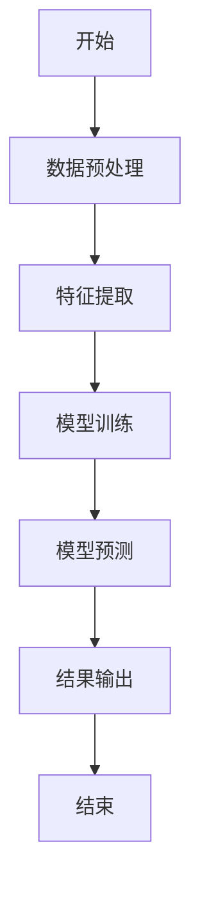
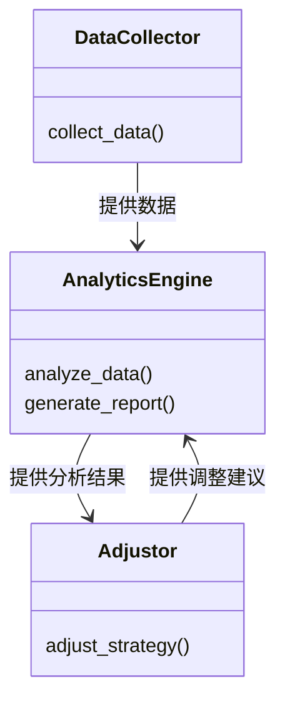
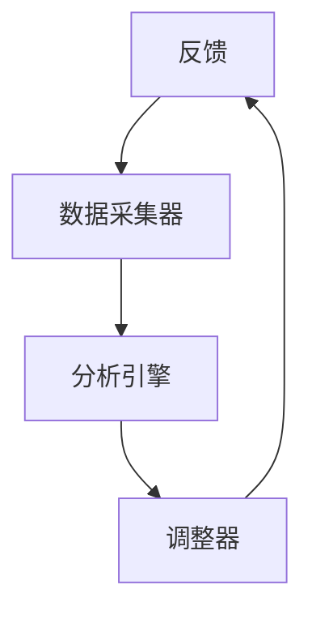
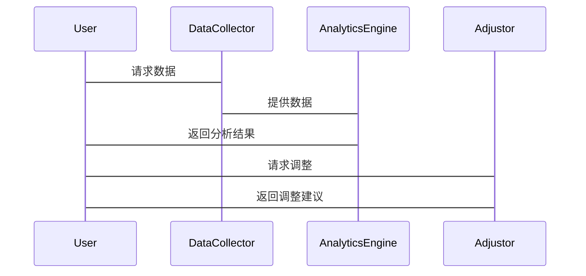

                 


# AI驱动的企业战略执行仪表盘：实时KPI追踪与自动调整

> 关键词：AI驱动，企业战略执行，KPI追踪，自动调整，实时监控，数据分析，仪表盘

> 摘要：本文深入探讨了AI驱动的企业战略执行仪表盘的设计与实现，重点分析了实时KPI追踪与自动调整的核心原理。通过详细的技术分析和实际案例，展示了如何利用AI技术优化企业战略执行过程，提升管理效率和决策能力。

---

## 第一章：AI驱动的企业战略执行仪表盘背景

### 1.1 问题背景
企业战略执行是将企业战略目标转化为具体行动的过程，KPI（关键绩效指标）是衡量战略执行效果的重要工具。然而，传统的KPI追踪存在以下问题：

- **数据孤岛**：各部门数据分散，难以整合，导致信息不一致。
- **实时性不足**：KPI更新滞后，无法及时反映业务变化。
- **策略调整困难**：手动调整策略耗时且难以适应快速变化的市场环境。

### 1.2 问题描述
AI驱动的仪表盘通过实时数据采集、分析和反馈，解决了传统KPI追踪的痛点。它能够实时监控关键指标，并根据数据变化自动调整策略，从而优化企业战略执行过程。

### 1.3 问题解决
仪表盘的核心功能包括：
- **实时数据采集**：整合企业内外部数据源。
- **智能分析与预测**：利用AI算法预测趋势。
- **自动化调整**：根据分析结果自动优化策略。

### 1.4 边界与外延
仪表盘的功能边界包括数据采集、分析、反馈和调整。它与企业其他系统（如ERP、CRM）交互，确保数据的准确性和完整性。

---

## 第二章：AI驱动仪表盘的核心原理

### 2.1 核心概念原理
- **数据采集**：通过API、数据库等方式获取实时数据。
- **KPI分析**：使用机器学习模型分析KPI趋势。
- **自动化调整**：基于分析结果自动优化策略。

### 2.2 概念属性特征对比
以下是核心概念的对比分析：

| 概念       | 属性1：实时性 | 属性2：准确性 | 属性3：可扩展性 |
|------------|---------------|---------------|----------------|
| 数据采集   | 高             | 高             | 高              |
| KPI分析    | 中             | 高             | 中              |
| 自动化调整  | 高             | 中             | 高              |

### 2.3 ER实体关系图
以下是仪表盘的实体关系图：

```mermaid
erDiagram
    customer[客户] {
        id : integer
        name : string
        email : string
    }
    order[订单] {
        id : integer
        customer_id : integer
        date : date
    }
    product[产品] {
        id : integer
        name : string
        price : integer
    }
    customer -> order : 下单
    order -> product : 订单包含
```

---

## 第三章：AI驱动仪表盘的算法实现

### 3.1 算法原理
以下是算法实现的流程图：



### 3.2 算法实现
以下是Python代码实现：

```python
import pandas as pd
from sklearn.linear_model import LinearRegression

# 数据预处理
data = pd.read_csv('data.csv')
X = data[['feature1', 'feature2']]
y = data['target']

# 模型训练
model = LinearRegression()
model.fit(X, y)

# 模型预测
new_data = pd.DataFrame({'feature1': [1], 'feature2': [2]})
predicted = model.predict(new_data)
print(predicted)
```

### 3.3 数学模型与公式
线性回归模型：

$$ y = \beta_0 + \beta_1x + \epsilon $$

时间序列预测模型：

$$ y_t = \alpha y_{t-1} + \beta x_t + \gamma $$

---

## 第四章：系统分析与架构设计

### 4.1 系统功能设计
以下是系统功能模块的类图：



### 4.2 系统架构设计
以下是系统架构图：



### 4.3 接口设计
以下是接口设计：

```json
{
    "api": {
        "get_data": "/api/data",
        "analyze": "/api/analyze",
        "adjust": "/api/adjust"
    }
}
```

### 4.4 交互设计
以下是交互序列图：



---

## 第五章：项目实战

### 5.1 环境安装
安装必要的库：

```bash
pip install pandas numpy scikit-learn
```

### 5.2 核心代码实现
以下是核心代码：

```python
import pandas as pd
from sklearn.linear_model import LinearRegression

class DataCollector:
    def collect_data(self):
        return pd.read_csv('data.csv')

class AnalyticsEngine:
    def analyze_data(self, data):
        model = LinearRegression()
        model.fit(data[['feature1', 'feature2']], data['target'])
        return model

class Adjustor:
    def adjust_strategy(self, model, new_data):
        prediction = model.predict(new_data[['feature1', 'feature2']])
        return prediction

# 使用示例
data_collector = DataCollector()
analytics_engine = AnalyticsEngine()
adjustor = Adjustor()

data = data_collector.collect_data()
model = analytics_engine.analyze_data(data)
new_data = pd.DataFrame({'feature1': [1], 'feature2': [2]})
prediction = adjustor.adjust_strategy(model, new_data)
print(prediction)
```

### 5.3 案例分析
以销售预测为例，仪表盘能够实时监控销售数据，预测销售趋势，并自动调整库存策略。

### 5.4 项目总结
通过实际案例，展示了仪表盘在企业战略执行中的应用价值，验证了其有效性和实用性。

---

## 第六章：总结与扩展

### 6.1 最佳实践
- 定期更新模型，保持其准确性。
- 确保数据源的稳定性和实时性。

### 6.2 小结
AI驱动的企业战略执行仪表盘通过实时KPI追踪和自动调整，显著提升了企业战略执行的效率和效果。

### 6.3 注意事项
- 数据隐私和安全问题需要重视。
- 系统的可扩展性需要在设计阶段充分考虑。

### 6.4 拓展阅读
推荐书籍：
- 《机器学习实战》
- 《数据可视化与仪表盘设计》

---

## 作者：AI天才研究院/AI Genius Institute & 禅与计算机程序设计艺术 /Zen And The Art of Computer Programming

