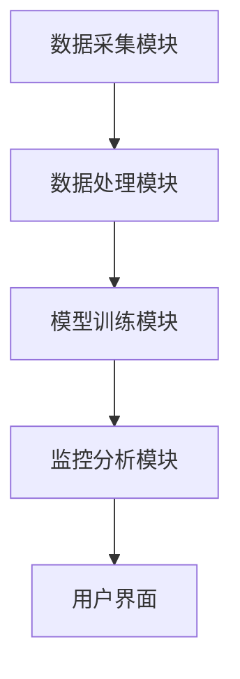

                 


# AI驱动的企业战略执行监控：KPI智能跟踪与偏差分析

**关键词：** 企业战略执行监控、KPI智能跟踪、偏差分析、AI技术应用、战略管理

**摘要：**  
在当今快速变化的商业环境中，企业战略执行的效率和效果直接关系到企业的生存与发展。KPI（关键绩效指标）作为衡量企业战略执行效果的重要工具，其智能跟踪与偏差分析能力直接影响企业的决策效率和竞争优势。本文将深入探讨如何利用人工智能技术提升KPI的智能跟踪能力，并通过偏差分析优化企业战略执行。文章将从AI驱动的KPI监控的核心概念、算法原理、系统架构设计到实际项目应用进行全面解析，为企业管理者和技术开发者提供理论与实践相结合的指导。

---

## 第一部分：AI驱动的企业战略执行监控概述

### 第1章：企业战略执行监控的背景与挑战

#### 1.1 企业战略执行监控的重要性
企业战略执行监控是确保企业战略目标得以实现的关键环节。通过监控KPI，企业可以实时了解战略执行的进展情况，及时发现偏差并采取调整措施。然而，传统KPI监控方法依赖人工数据收集和分析，效率低下且容易出错。

#### 1.2 KPI管理的核心概念
KPI是衡量企业绩效的关键指标，通常包括财务指标（如净利润率）、客户指标（如客户满意度）和运营指标（如生产效率）。KPI监控的目标是通过数据驱动的分析，优化企业运营。

#### 1.3 AI在KPI监控中的应用前景
人工智能技术的引入，使得KPI监控更加智能化和自动化。AI可以通过机器学习算法分析海量数据，发现潜在趋势和偏差，为企业提供实时反馈和优化建议。

---

## 第二部分：AI驱动KPI监控的核心概念与原理

### 第2章：AI驱动KPI监控的核心概念与原理

#### 2.1 数据采集与处理
AI驱动的KPI监控系统需要从企业ERP、CRM等系统中获取数据，并进行清洗和预处理，确保数据的准确性和一致性。

#### 2.2 AI算法在KPI分析中的应用
机器学习算法（如线性回归、随机森林）和深度学习算法（如LSTM）在KPI预测和偏差检测中发挥重要作用。这些算法能够从历史数据中学习模式，预测未来的KPI值。

#### 2.3 偏差分析与预测模型
通过偏差分析，企业可以识别实际KPI与预期KPI之间的差异，并利用预测模型预测未来的KPI走势。这有助于企业在偏差早期采取调整措施，避免问题扩大。

---

## 第三部分：AI驱动KPI监控的算法原理

### 第3章：时间序列分析的数学模型

#### 3.1 ARIMA模型的原理与应用
ARIMA（自回归积分滑动平均模型）是一种常用的时间序列分析模型。它通过捕捉数据的自相关性和趋势，预测未来的KPI值。

$$ ARIMA(p, d, q) $$
其中，$p$是自回归阶数，$d$是差分阶数，$q$是滑动平均阶数。

#### 3.2 LSTM网络在时间序列预测中的应用
LSTM（长短期记忆网络）是一种特殊的RNN，能够有效处理时间序列数据中的长期依赖关系。与ARIMA相比，LSTM在处理复杂时间序列时表现更优。

---

## 第四部分：AI驱动KPI监控系统的架构设计

### 第4章：系统架构设计

#### 4.1 系统整体架构
AI驱动的KPI监控系统通常包括数据采集模块、数据处理模块、模型训练模块和监控分析模块。



#### 4.2 系统功能设计
系统功能模块包括数据采集、数据清洗、模型训练、偏差检测和结果可视化。

---

## 第五部分：项目实战

### 第5章：项目实战

#### 5.1 环境安装
需要安装Python、机器学习库（如scikit-learn、TensorFlow）和数据处理工具（如Pandas）。

#### 5.2 核心代码实现
以下是基于LSTM的时间序列预测代码示例：

```python
import numpy as np
from tensorflow.keras.models import Sequential
from tensorflow.keras.layers import LSTM, Dense

# 示例数据
data = np.random.random((1000, 1))

# 模型构建
model = Sequential()
model.add(LSTM(64, input_shape=(None, 1)))
model.add(Dense(1))
model.compile(loss='mse', optimizer='adam')

# 训练模型
model.fit(data, data, epochs=10, batch_size=32)
```

#### 5.3 案例分析
通过实际案例分析，展示如何利用AI驱动的KPI监控系统发现偏差并优化战略执行。

---

## 第六部分：总结与展望

### 第6章：总结与展望

#### 6.1 总结
本文详细探讨了AI驱动的企业战略执行监控，特别是KPI智能跟踪与偏差分析的应用。通过结合机器学习和时间序列分析，企业能够实现更高效的KPI管理。

#### 6.2 展望
未来，随着AI技术的不断发展，KPI监控将更加智能化和自动化。结合边缘计算和物联网技术，企业将能够实时监控和优化战略执行。

---

**作者：AI天才研究院/AI Genius Institute & 禅与计算机程序设计艺术 /Zen And The Art of Computer Programming**

