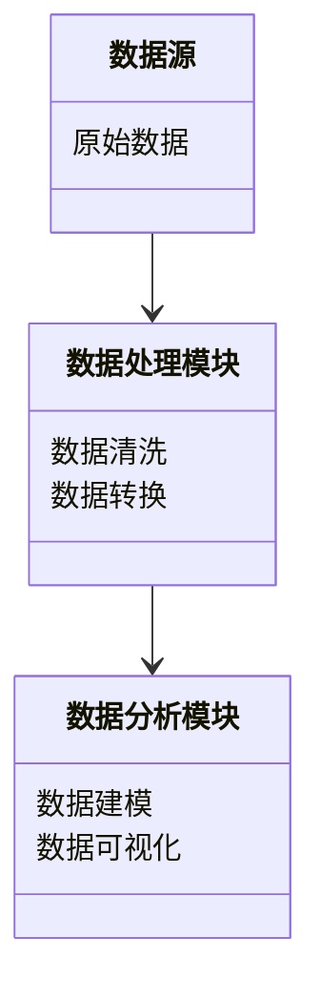
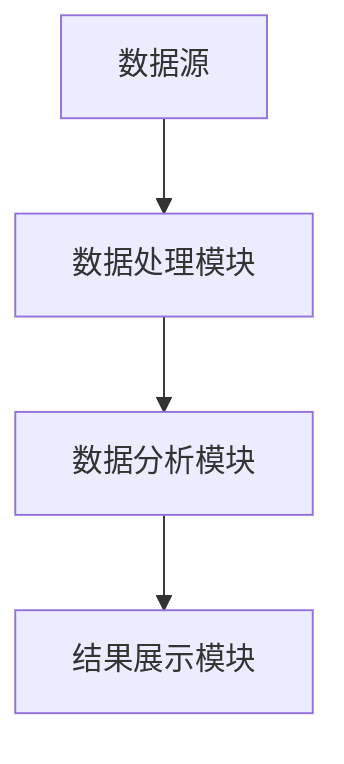
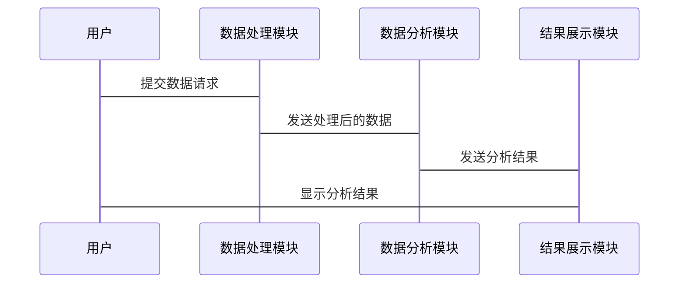

                 


# 第三章: 预测性建模的数学模型与算法

## 3.1 线性回归模型

### 3.1.1 线性回归的基本概念
线性回归是一种统计学方法，用于建立一个或多个预测变量（自变量）和目标变量（因变量）之间的线性关系。在企业战略规划中，线性回归常用于预测销售量、成本或其他连续型指标。

### 3.1.2 线性回归的数学公式
$$ y = \beta_0 + \beta_1x + \epsilon $$
其中：
- \( y \) 是目标变量
- \( \beta_0 \) 是截距
- \( \beta_1 \) 是斜率
- \( x \) 是自变量
- \( \epsilon \) 是误差项

### 3.1.3 线性回归的实现步骤
1. **数据收集**：收集相关的数据，确保数据的完整性和准确性。
2. **数据预处理**：对数据进行清洗和转换，处理缺失值和异常值。
3. **建立模型**：使用最小二乘法或其他方法估计回归系数。
4. **模型评估**：通过R²值、调整R²值和残差分析等方法评估模型的拟合优度。
5. **模型应用**：利用模型进行预测，并根据结果调整企业战略。

### 3.1.4 线性回归的优缺点
- **优点**：简单易懂，计算速度快，适合线性关系明确的情况。
- **缺点**：无法处理非线性关系，对异常值敏感。

## 3.2 logistic回归模型

### 3.2.1 logistic回归的基本概念
logistic回归是一种用于分类的统计方法，特别适用于二分类问题。在企业战略规划中，可以用于预测客户是否购买某个产品或预测某个事件是否发生。

### 3.2.2 logistic回归的数学公式
$$ P(y=1|x) = \frac{e^{\beta_0 + \beta_1x}}{1 + e^{\beta_0 + \beta_1x}} $$
其中：
- \( P(y=1|x) \) 是目标变量为1的概率
- \( \beta_0 \) 是截距
- \( \beta_1 \) 是斜率
- \( x \) 是自变量

### 3.2.3 logistic回归的实现步骤
1. **数据收集**：收集分类数据，确保数据的平衡性。
2. **数据预处理**：处理缺失值和标准化数据。
3. **建立模型**：使用最大似然估计方法估计回归系数。
4. **模型评估**：通过准确率、召回率和F1分数等指标评估模型性能。
5. **模型应用**：利用模型进行分类预测，并根据结果优化战略决策。

### 3.2.4 logistic回归的优缺点
- **优点**：适用于二分类问题，模型解释性强。
- **缺点**：无法处理多分类问题，对数据分布敏感。

## 3.3 决策树模型

### 3.3.1 决策树的基本概念
决策树是一种树状结构，通过内部节点进行特征选择，叶子节点进行预测。在企业战略规划中，决策树可以用于预测客户流失、市场趋势等。

### 3.3.2 决策树的数学公式
决策树的预测过程可以通过以下步骤描述：
1. 从根节点开始，根据特征选择的准则（如信息增益）选择最优特征。
2. 沿着选定的特征分支，继续选择下一个特征，直到达到叶子节点。
3. 根据叶子节点的多数类或预测值进行预测。

### 3.3.3 决策树的实现步骤
1. **数据收集**：收集分类数据，确保数据的多样性。
2. **数据预处理**：处理缺失值和标准化数据。
3. **建立模型**：使用ID3、C4.5或CART算法构建决策树。
4. **模型评估**：通过准确率、召回率和F1分数等指标评估模型性能。
5. **模型应用**：利用模型进行预测，并根据结果优化企业战略。

### 3.3.4 决策树的优缺点
- **优点**：易于解释，能够处理非线性关系。
- **缺点**：容易过拟合，计算复杂度较高。

## 3.4 预测模型的评估与优化

### 3.4.1 模型评估指标
- **准确率**：正确预测的样本数占总样本数的比例。
- **召回率**：正确预测的正类样本数占所有正类样本数的比例。
- **F1分数**：准确率和召回率的调和平均数。
- **AUC-ROC曲线**：评估模型在不同阈值下的性能。

### 3.4.2 超参数优化方法
1. **网格搜索**：遍历所有可能的参数组合，选择最优参数。
2. **随机搜索**：随机选择参数组合，减少计算时间。
3. **贝叶斯优化**：利用贝叶斯定理优化参数选择。

### 3.4.3 模型调优与部署
1. **模型调优**：根据评估结果调整模型参数，优化模型性能。
2. **模型部署**：将模型部署到生产环境，实现自动化预测。

# 第四章: 企业战略规划系统的设计与实现

## 4.1 系统需求分析

### 4.1.1 问题场景介绍
在企业战略规划中，企业需要预测市场需求、优化资源配置、识别潜在风险。传统的方法依赖于经验和直觉，而大数据分析和预测性建模可以提供更准确和客观的决策支持。

### 4.1.2 项目目标与范围
本项目旨在开发一个基于AI的大数据分析系统，用于企业战略规划。系统将包括数据收集、数据处理、数据分析和结果展示等功能。

### 4.1.3 系统功能需求
- 数据采集模块：从多种数据源收集数据。
- 数据处理模块：清洗和转换数据。
- 数据分析模块：建立和训练预测模型。
- 结果展示模块：可视化分析结果。

## 4.2 系统架构设计

### 4.2.1 领域模型类图


### 4.2.2 系统架构图


## 4.3 系统接口与交互设计

### 4.3.1 系统接口设计
- 数据采集接口：从数据库、API等数据源获取数据。
- 数据处理接口：对数据进行清洗和转换。
- 数据分析接口：调用预测模型进行分析。
- 结果展示接口：将分析结果展示给用户。

### 4.3.2 系统交互设计


## 4.4 系统实现与部署

### 4.4.1 环境配置
- **编程语言**：Python
- **开发框架**：Django或Flask
- **数据处理库**：Pandas
- **数据分析库**：Scikit-learn
- **可视化库**：Matplotlib或Seaborn
- **数据库**：MySQL或MongoDB

### 4.4.2 核心实现代码
#### 数据处理模块
```python
import pandas as pd

def data_processing(data):
    # 处理缺失值
    data = data.dropna()
    # 标准化数据
    from sklearn.preprocessing import StandardScaler
    scaler = StandardScaler()
    data_scaled = scaler.fit_transform(data)
    return data_scaled
```

#### 数据分析模块
```python
from sklearn.linear_model import LinearRegression

def train_model(X, y):
    model = LinearRegression()
    model.fit(X, y)
    return model
```

#### 结果展示模块
```python
import matplotlib.pyplot as plt

def visualize_results(model, X, y):
    plt.scatter(X, y)
    plt.plot(X, model.predict(X), color='red')
    plt.xlabel('自变量')
    plt.ylabel('目标变量')
    plt.show()
```

## 4.5 项目实战与案例分析

### 4.5.1 项目背景
某企业希望预测下季度的销售量，以便更好地制定生产计划和库存管理。

### 4.5.2 数据收集与预处理
收集过去三年的销售数据、市场数据和经济指标。对数据进行清洗和标准化处理。

### 4.5.3 模型训练与评估
使用线性回归模型进行训练，并评估模型的R²值和残差分析。

### 4.5.4 模型部署与应用
将模型部署到企业系统中，实时预测销售量，并根据预测结果优化库存管理和生产计划。

## 4.6 最佳实践与注意事项

### 4.6.1 数据质量的重要性
确保数据的完整性和准确性，避免因数据质量问题影响模型性能。

### 4.6.2 模型选择与优化
根据具体问题选择合适的模型，并通过超参数优化和模型调优提高预测精度。

### 4.6.3 模型部署与维护
将模型部署到生产环境，并定期更新模型，以适应数据和业务的变化。

### 4.6.4 数据隐私与安全
在处理数据时，确保遵守数据隐私法规，保护企业和客户的数据安全。

### 4.6.5 拓展阅读
建议读者阅读以下书籍和文章，以进一步深入理解AI驱动的企业战略规划：
- 《机器学习实战》
- 《大数据分析与应用》
- 《企业战略管理》

# 结语

AI驱动的企业战略规划通过大数据分析和预测性建模的融合，为企业提供了更精准和高效的决策支持。随着技术的不断发展，AI在企业战略规划中的应用将更加广泛和深入。通过合理选择和优化模型，企业可以更好地应对市场变化，抓住发展机遇，提升竞争力。

# 作者

作者：AI天才研究院/AI Genius Institute & 禅与计算机程序设计艺术 /Zen And The Art of Computer Programming

