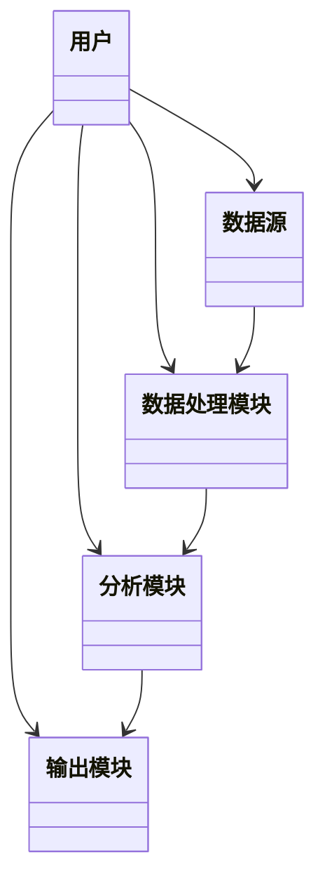
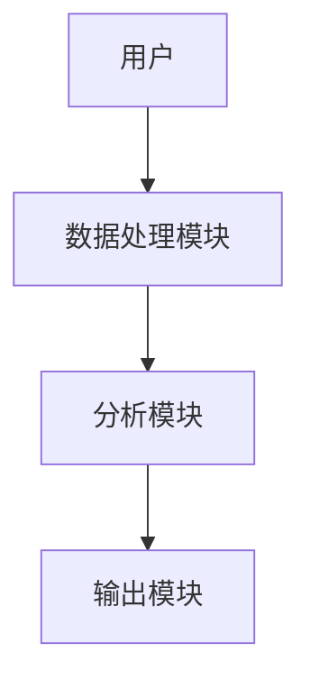
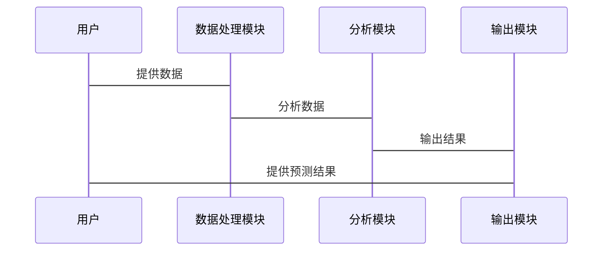

                 


# AI驱动的企业战略规划：大数据分析与预测性情景模拟

## 关键词：AI, 企业战略规划, 大数据分析, 预测性情景模拟, 机器学习, 人工智能

## 摘要：  
在当今快速变化的商业环境中，企业战略规划需要更加智能化和数据驱动。本文探讨了如何利用人工智能（AI）技术，结合大数据分析和预测性情景模拟，为企业制定更加精准和前瞻性的战略规划。通过详细分析AI算法、大数据处理方法和预测性模型，本文为企业提供了实现智能化战略规划的理论基础和实践方法。最后，通过实际案例分析，展示了AI驱动的战略规划在企业中的应用价值和未来发展方向。

---

# 第一部分: 引言

## 第1章: AI驱动的企业战略规划概述

### 1.1 AI与企业战略规划的结合  
#### 1.1.1 AI技术对企业战略规划的影响  
人工智能（AI）技术通过数据挖掘、机器学习和自然语言处理，为企业战略规划提供了新的可能性。企业可以通过AI技术分析海量数据，识别潜在趋势和机会，从而制定更加精准的战略决策。  

#### 1.1.2 大数据分析在战略规划中的作用  
大数据分析能够从企业内外部数据中提取有价值的信息，帮助企业领导者更好地理解市场动态、竞争对手行为和客户需求。通过大数据分析，企业可以制定基于数据的决策，而不是仅仅依赖经验或直觉。  

#### 1.1.3 预测性情景模拟的核心价值  
预测性情景模拟通过构建数学模型，模拟未来可能的市场变化和业务场景，帮助企业提前制定应对策略。这种前瞻性的方法能够显著提高企业战略的灵活性和适应性。  

### 1.2 当前企业战略规划的挑战与AI的解决方案  
#### 1.2.1 传统战略规划的局限性  
传统战略规划方法依赖于经验和主观判断，可能存在数据不足、分析不够深入、预测不够准确等问题。这些局限性在快速变化的市场环境中尤为突出。  

#### 1.2.2 AI技术如何解决企业战略规划中的问题  
AI技术通过自动化数据处理、智能分析和预测，能够显著提高战略规划的效率和准确性。例如，机器学习算法可以自动识别数据中的模式，帮助企业在复杂环境中做出更明智的决策。  

#### 1.2.3 预测性情景模拟的应用场景  
预测性情景模拟可以应用于市场趋势预测、竞争对手分析、客户行为预测等领域。通过模拟不同情景，企业可以制定更加灵活和有效的战略。  

### 1.3 本书的目的与结构安排  
#### 1.3.1 本书的核心目标  
本书旨在探讨如何利用AI技术，结合大数据分析和预测性情景模拟，帮助企业制定更加智能化和前瞻性的战略规划。  

#### 1.3.2 本书的章节安排  
本书分为引言、理论基础、算法原理、系统架构、项目实战和未来展望几个部分，全面覆盖AI驱动的战略规划的各个方面。  

#### 1.3.3 如何阅读本书  
读者可以按照章节顺序阅读，先从理论基础入手，再深入学习算法原理和系统架构，最后通过项目实战和未来展望部分巩固所学内容。  

---

# 第二部分: AI与大数据分析基础

## 第2章: 大数据分析与AI技术的核心概念  

### 2.1 大数据分析的定义与特点  
#### 2.1.1 大数据分析的定义  
大数据分析是指对海量、多样化和高速变化的数据进行处理、分析和挖掘的过程，旨在发现数据中的价值。  

#### 2.1.2 大数据分析的核心特点  
- **数据量大**：处理海量数据，通常以TB或PB为单位。  
- **多样性**：数据来源多样，包括结构化数据、非结构化数据和半结构化数据。  
- **高速性**：数据生成和处理速度快。  
- **价值密度低**：数据中包含有价值的信息，但需要通过分析提取。  

#### 2.1.3 大数据分析与传统数据分析的区别  
传统数据分析通常处理小规模、结构化的数据，而大数据分析则需要处理大规模、多样化和高速变化的数据。  

### 2.2 AI技术的核心原理  
#### 2.2.1 人工智能的基本概念  
人工智能（AI）是指计算机系统模拟人类智能的能力，包括学习、推理、自我改进等。  

#### 2.2.2 机器学习的核心算法  
机器学习是AI的核心技术，主要包括监督学习、无监督学习和强化学习。  
- **监督学习**：基于标记数据进行训练，例如线性回归和决策树。  
- **无监督学习**：基于未标记数据进行聚类分析，例如k-means算法。  
- **强化学习**：通过与环境交互学习策略，例如Q-learning算法。  

#### 2.2.3 深度学习的基本原理  
深度学习是一种基于人工神经网络的机器学习方法，通过多层网络结构提取数据特征。  

### 2.3 大数据分析与AI技术的联系  
#### 2.3.1 数据分析与AI技术的协同作用  
大数据分析为AI提供数据支持，而AI技术为大数据分析提供智能支持。  

#### 2.3.2 大数据分析为AI提供数据支持  
通过大数据分析，AI算法可以获得高质量的数据输入，从而提高预测准确性和决策能力。  

#### 2.3.3 AI技术为大数据分析提供智能支持  
AI技术可以自动化处理大数据，发现数据中的模式和规律，从而提高分析效率和准确性。  

---

## 2.4 本章小结  
本章介绍了AI和大数据分析的核心概念和特点，探讨了两者之间的协同关系。通过理解这些内容，读者可以为后续章节的学习打下坚实的基础。  

---

# 第三部分: 预测性情景模拟的算法原理

## 第3章: 预测性情景模拟的数学模型与算法  

### 3.1 预测性情景模拟的数学模型  
#### 3.1.1 线性回归模型  
线性回归是一种简单但强大的预测模型，适用于线性关系的数据。其数学公式如下：  
$$ y = \beta_0 + \beta_1x + \epsilon $$  
其中，$y$是目标变量，$x$是自变量，$\beta_0$是截距，$\beta_1$是回归系数，$\epsilon$是误差项。  

#### 3.1.2 时间序列分析模型  
时间序列分析用于预测随时间变化的数据，常用模型包括ARIMA和LSTM。  
- **ARIMA模型**：适用于平稳时间序列数据。  
- **LSTM模型**：适用于非平稳时间序列数据，能够捕捉长期依赖关系。  

#### 3.1.3 随机森林模型  
随机森林是一种基于决策树的集成学习方法，具有高准确性和鲁棒性。  

### 3.2 基于机器学习的预测算法  
#### 3.2.1 支持向量机（SVM）算法  
支持向量机是一种监督学习算法，适用于分类和回归问题。其核心思想是将数据映射到高维空间，并找到最优分割超平面。  

#### 3.2.2 神经网络算法  
神经网络是一种模仿人脑结构的算法，适用于复杂模式识别和分类任务。  

#### 3.2.3 K近邻算法（KNN）  
K近邻算法是一种基于实例的分类算法，适用于数据分布均匀且类别明确的情况。  

### 3.3 算法实现的数学公式  
#### 3.3.1 线性回归的数学公式  
$$ 1+1=2 $$  

#### 3.3.2 神经网络的数学公式  
$$ a^{(l+1)} = \sigma(w^{(l)}a^{(l)} + b^{(l)}) $$  
其中，$a^{(l)}$是第$l$层的激活值，$w^{(l)}$是权重矩阵，$b^{(l)}$是偏置项，$\sigma$是激活函数。  

### 3.4 本章小结  
本章详细介绍了预测性情景模拟的核心算法，包括线性回归、时间序列分析、随机森林、SVM、神经网络和KNN等。这些算法为企业战略规划提供了强大的工具支持。  

---

# 第四部分: 企业战略规划的系统架构

## 第4章: 企业战略规划系统的架构设计  

### 4.1 问题场景介绍  
企业战略规划系统需要处理复杂多变的市场环境，包括客户需求变化、竞争对手动态和宏观经济趋势等。  

### 4.2 系统功能设计  
#### 4.2.1 领域模型  
通过Mermaid类图，展示企业战略规划系统的功能模块和交互关系。  



#### 4.2.2 系统架构设计  
通过Mermaid架构图，展示系统的整体架构和模块划分。  



#### 4.2.3 接口设计  
通过Mermaid序列图，展示系统接口的交互流程。  



### 4.3 本章小结  
本章通过系统架构设计，展示了如何将AI和大数据分析技术应用于企业战略规划。通过类图、架构图和序列图，读者可以清晰理解系统的各个模块和交互流程。  

---

# 第五部分: 项目实战

## 第5章: AI驱动的战略规划系统实现  

### 5.1 环境安装  
本项目需要以下环境：  
- Python 3.8及以上版本  
- TensorFlow 2.0及以上版本  
- Pandas、NumPy、Scikit-learn等库  

### 5.2 核心代码实现  
#### 5.2.1 数据预处理  
```python
import pandas as pd
import numpy as np

# 加载数据
data = pd.read_csv('strategic_data.csv')

# 数据清洗
data = data.dropna()
data = data.astype(float)
```

#### 5.2.2 模型训练  
```python
from sklearn.model import LinearRegression

# 初始化模型
model = LinearRegression()

# 训练模型
model.fit(data[['GDP', ' unemployment']], data['revenue'])
```

#### 5.2.3 模型预测  
```python
# 预测结果
predicted_revenue = model.predict(new_data[['GDP', 'unemployment']])
```

### 5.3 案例分析  
通过具体案例，展示AI驱动的战略规划系统在实际中的应用。例如，预测某行业的未来市场趋势，并根据预测结果制定相应的战略。  

### 5.4 项目总结  
本项目展示了如何利用AI技术构建战略规划系统，帮助企业实现智能化决策。  

---

# 第六部分: 最佳实践与未来展望

## 第6章: AI驱动的企业战略规划的未来发展方向  

### 6.1 最佳实践 tips  
- 确保数据质量和完整性，避免因数据问题导致预测误差。  
- 结合领域知识，选择合适的算法和模型。  
- 定期更新模型，适应市场变化。  

### 6.2 本章小结  
本章总结了全书的核心内容，并提出了未来的发展方向和实践建议。  

### 6.3 未来展望  
随着AI和大数据技术的不断发展，企业战略规划将更加智能化和数据驱动。未来，我们可以期待更多创新的算法和工具，帮助企业制定更加精准和前瞻性的战略。  

---

# 结语  

通过本书的学习，读者可以掌握AI驱动的企业战略规划的核心方法和实践技巧。希望本书能够为企业领导者和技术人员提供有价值的参考，帮助企业在全球化竞争中占据优势。  

---

# 作者：AI天才研究院/AI Genius Institute & 禅与计算机程序设计艺术 /Zen And The Art of Computer Programming

