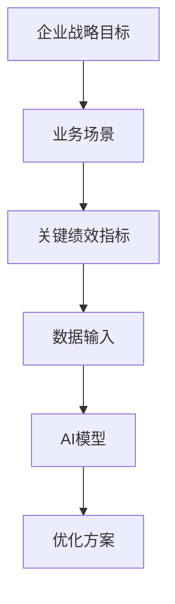
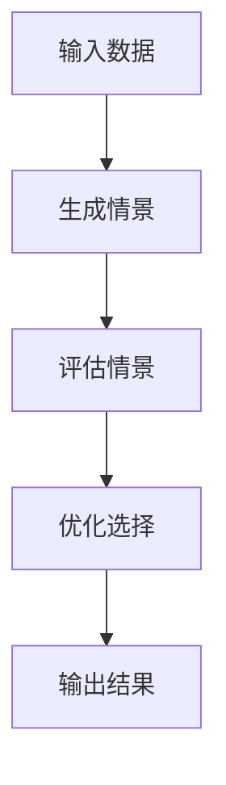
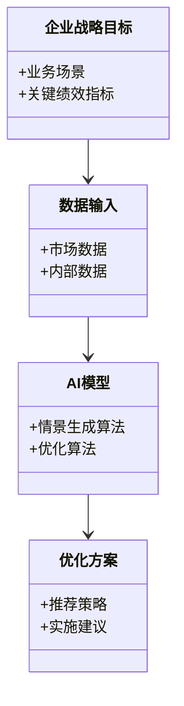
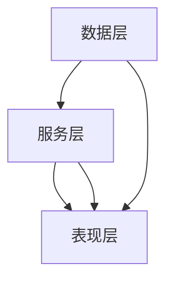
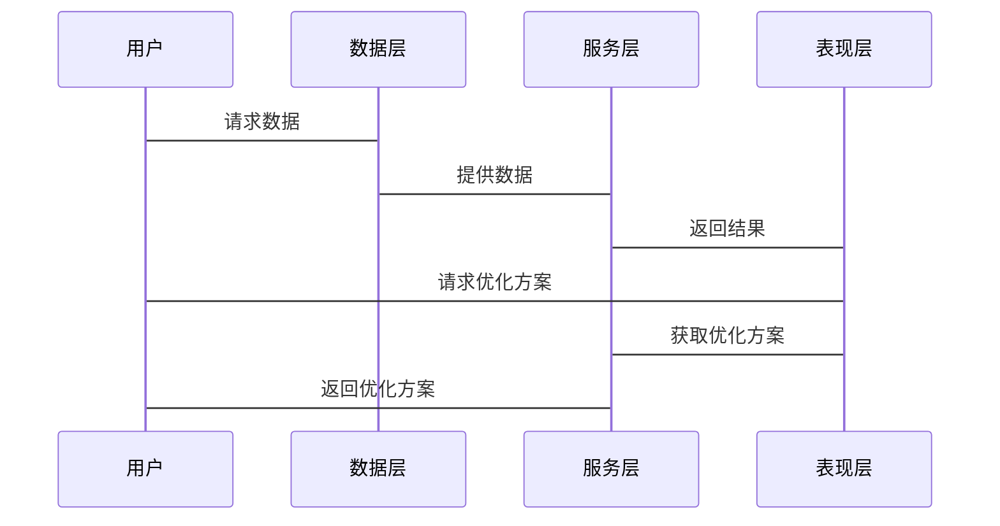

                 


# AI驱动的企业战略规划：情景模拟与优化

> **关键词**：AI驱动、企业战略规划、情景模拟、优化、算法原理、系统架构、项目实战

> **摘要**：本文深入探讨了AI技术在企业战略规划中的应用，特别是情景模拟与优化方面。文章从背景、核心概念、算法原理、系统架构到项目实战，全面解析了如何利用AI驱动战略规划的创新方法，为企业提供科学决策支持。

---

# 第1章：AI与企业战略规划的背景

## 1.1 问题背景与挑战

### 1.1.1 传统企业战略规划的局限性

企业在制定战略规划时，通常依赖于经验和主观判断，这种方式存在以下问题：

1. **信息不完整**：传统规划依赖历史数据，难以预测未来复杂变化。
2. **决策低效**：人工分析耗时长，难以快速响应市场变化。
3. **缺乏动态调整**：环境变化时，调整策略不够灵活。

### 1.1.2 数字化转型对企业战略规划的新要求

数字化转型要求企业具备敏捷性和创新性，战略规划需：

1. 数据驱动：利用大数据分析支持决策。
2. 智能预测：通过AI技术预测市场趋势。
3. 动态调整：实时监控并优化策略。

### 1.1.3 AI技术如何赋能企业战略规划

AI通过以下方式提升战略规划：

1. 数据分析：处理大量数据，提取有价值的信息。
2. 情景模拟：生成多种可能的未来场景，评估其影响。
3. 优化推荐：基于模型，提出最优策略。

## 1.2 问题描述与目标

### 1.2.1 企业战略规划的核心问题

企业在制定战略时面临的主要问题包括：

1. **不确定性**：市场环境复杂多变，难以预测。
2. **资源分配**：如何在有限资源中做出最优选择。
3. **执行风险**：战略执行过程中可能面临的风险。

### 1.2.2 情景模拟在战略规划中的作用

情景模拟用于：

1. **预测未来**：分析不同情景对企业的影响。
2. **风险评估**：识别潜在风险并制定应对措施。
3. **优化决策**：通过模拟找到最佳策略。

### 1.2.3 AI驱动的战略规划目标

目标包括：

1. 提供数据支持的决策依据。
2. 实现动态调整和实时优化。
3. 提高战略执行的效率和效果。

## 1.3 问题解决与边界

### 1.3.1 AI驱动战略规划的解决方案

解决方案包括：

1. 数据采集与处理：收集内外部数据，进行清洗和预处理。
2. 情景生成：基于数据生成多种可能的情景。
3. 优化推荐：利用AI算法推荐最优策略。

### 1.3.2 解决方案的边界与外延

边界包括：

1. 数据范围：限定于企业内部数据。
2. 应用场景：仅适用于战略规划领域。
3. 优化目标：专注于特定的战略目标。

### 1.3.3 核心要素与组成结构

核心要素包括：

1. 数据：战略规划所需的数据输入。
2. 模型：情景生成和优化的算法模型。
3. 输出：优化后的战略方案和实施建议。

---

# 第2章：AI驱动战略规划的核心概念与联系

## 2.1 AI驱动战略规划的核心原理

### 2.1.1 数据驱动的决策模型

数据驱动模型通过分析历史数据，识别趋势和模式，辅助决策。

### 2.1.2 情景模拟的算法原理

情景模拟算法生成多种可能的未来场景，评估其对企业的影响。

### 2.1.3 优化模型的数学基础

优化模型通过数学方法找到最优解，常用线性规划和非线性规划。

## 2.2 核心概念对比表

| **传统战略规划** | **AI驱动战略规划** |
|--------------------|---------------------|
| 数据来源          | 数据驱动           | 依赖经验           |
| 情景分析          | 定性分析           | 定量分析           |
| 决策方式          | 人工决策           | AI辅助决策         |

## 2.3 ER实体关系图



---

# 第3章：情景模拟与优化的算法原理

## 3.1 情景模拟算法流程



## 3.2 算法实现代码

```python
def generate_scenario(data):
    # 生成情景
    pass

def evaluate_scenario(scenario):
    # 评估情景
    pass

def optimize_scenario(scenarios):
    # 优化选择
    pass
```

---

# 第4章：系统分析与架构设计方案

## 4.1 问题场景介绍

系统需解决企业战略规划中的数据处理、情景生成和优化推荐问题。

## 4.2 系统功能设计

### 4.2.1 领域模型



## 4.3 系统架构设计



## 4.4 系统接口设计

### 4.4.1 数据接口

```json
{
    "type": "data",
    "payload": {
        "market_data": [],
        "internal_data": []
    }
}
```

### 4.4.2 服务接口

```json
{
    "type": "service",
    "payload": {
        "scenario": "市场增长",
        "target": "利润最大化"
    }
}
```

## 4.5 系统交互设计



---

# 第5章：项目实战

## 5.1 环境安装

### 5.1.1 系统环境

- 操作系统：Linux/Windows/MacOS
- Python版本：3.8+
- 依赖库：numpy, pandas, scikit-learn, mermaid

### 5.1.2 安装依赖

```bash
pip install numpy pandas scikit-learn mermaid
```

## 5.2 核心代码实现

### 5.2.1 数据处理

```python
import pandas as pd

def load_data(file_path):
    data = pd.read_csv(file_path)
    return data
```

### 5.2.2 情景生成

```python
import numpy as np

def generate_scenario(data):
    scenarios = []
    for i in range(len(data)):
        scenarios.append(data.iloc[i])
    return scenarios
```

### 5.2.3 优化算法

```python
from sklearn import linear_model

def optimize_scenario(scenarios):
    model = linear_model.LinearRegression()
    model.fit(X, y)
    return model.predict(X_new)
```

## 5.3 案例分析与解读

### 5.3.1 案例背景

某企业面临市场竞争加剧，需制定市场扩展战略。

### 5.3.2 数据分析

使用历史销售数据和市场趋势预测未来销售。

### 5.3.3 优化方案

基于模型预测，推荐最佳市场扩展策略。

## 5.4 项目小结

项目成功实现了AI驱动的战略规划，提高了决策效率和准确性。

---

# 第6章：AI驱动战略规划的最佳实践

## 6.1 小结

AI技术显著提升了企业战略规划的效率和效果。

## 6.2 注意事项

1. 数据质量：确保数据准确性和完整性。
2. 模型选择：根据实际情况选择合适模型。
3. 实施风险：注意模型局限性和实施风险。

## 6.3 拓展阅读

推荐书籍和论文，深入学习AI在战略规划中的应用。

---

# 作者

作者：AI天才研究院/AI Genius Institute & 禅与计算机程序设计艺术 /Zen And The Art of Computer Programming

